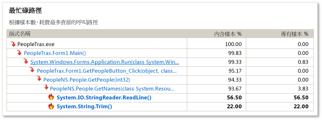
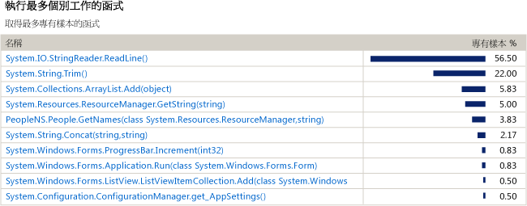

# CPU 取樣的初級開發人員指南
您可以使用 Visual Studio 程式碼剖析工具來分析應用程式中的效能問題。 此程序示範如何使用 [取樣] 資料。

> [!NOTE]
>  建議您使用 [診斷工具] 視窗中的 [CPU 使用量](../profiling/beginners-guide-to-performance-profiling.md)工具，而不是傳統的 CPU 取樣工具，除非您需要特殊的功能，例如檢測支援。
  
 [取樣] 是統計的分析方法，顯示應用程式中會執行大部分使用者模式工作的功能。 取樣是開始尋找可加速應用程式之區域的最佳做法。  
  
 依指定的間隔，[取樣] 方法會收集在應用程式中執行函式的詳細資訊。 在您完成執行程式碼剖析後，程式碼剖析資料的 [摘要] 檢閱會顯示最常使用的函式呼叫樹狀圖，稱為 [最忙碌路徑]，其中在應用程式中的大部分工作都已執行。 此檢視也列出正在執行最多個別工作的函式，並提供讓您用來專注於取樣工作階段特定區段的時間軸圖形。  
  
 如果 [取樣] 沒有提供您所需的資料，則其他程式碼剖析工具集合方法可提供不同種類的資訊，這可能會很有幫助。 如需這類其他方法的詳細資訊，請參閱[如何：選擇收集方法](../profiling/how-to-choose-collection-methods.md)。  
  
> [!TIP]
>  如果您剖析呼叫 Windows 函式的程式碼，您應該要確定您有最新的 .pdb 檔案。 如果沒有這些檔案，您的報告檢視會列出隱晦且難以了解的 Windows 函式名稱。 如需如何確認您擁有所需檔案的詳細資訊，請參閱[如何：參考 Windows 符號資訊](../profiling/how-to-reference-windows-symbol-information.md)。  
  
##  建立和執行效能工作階段  
 若要取得您要分析的資料，您必須先建立效能工作階段，然後再執行工作階段。 [效能精靈] 可讓您進行這兩項工作。  
  
 如果您不是在對 Windows 傳統型應用程式或 ASP.NET 應用程式進行程式碼剖析，您必須使用其他的程式碼剖析工具。 請參閱[程式碼剖析工具](../profiling/profiling-tools.md)。  
  
#### 建立和執行效能工作階段  
  
1.  在 Visual Studio 中開啟方案。 設定要發行的組態 (在工具列上尋找 [方案組態] 方塊，其已依預設設定為 [偵錯]。 請將它變更為 [發行]。)  
  
    > [!IMPORTANT]
    >  如果您不是所使用之電腦的系統管理員，則在使用分析工具時應該以系統管理員身分執行 Visual Studio。 (以滑鼠右鍵按一下 Visual Studio 應用程式圖示，然後按一下 [以系統管理員身分執行]。  
  
2.  在 [偵錯] 功能表上選擇 [效能分析工具] 。  
  
3.  核取 [效能精靈] 選項，然後按一下 [開始]。  
  
4.  核取 [CPU 取樣 (建議使用)] 選項，然後按一下 [完成]。  
  
5.  您的應用程式隨即啟動，且分析工具會開始收集資料。  
  
6.  執行此功能，其中可能包含效能問題。  
  
7.  一如往常，請關閉應用程式。  
  
     在您完成執行應用程式後，程式碼剖析資料的 [摘要] 檢視會顯示在 Visual Studio 主視窗中，且新工作階段的圖示會出現在 [效能總管] 視窗中。  
  
##   步驟 2：分析取樣資料  
 完成執行效能工作階段之後，分析報告的 [摘要] 檢視會出現在 Visual Studio 主視窗中。  
  
 建議您先檢查 [最忙碌路徑]，接著檢查執行最多工作之函式的清單，最後使用 [摘要時間表] 來專注於其他函式以開始分析資料。 您也可以在 [錯誤清單] 視窗中檢視分析建議和警告。  
  
 請注意此取樣方法可能無法提供您所需的資訊。 例如，只有在應用程式執行使用者模式程式碼時才會收集樣本。 因此，取樣不會擷取某些功能，例如輸入和輸出作業。 [程式碼剖析工具] 提供讓您專注於重要資料的數個收集方法。 如需這類其他方法的詳細資訊，請參閱[如何：選擇收集方法](../profiling/how-to-choose-collection-methods.md)。  
  
 圖中的每個編號區域與程序中的步驟相關。  
  
   
  
#### 分析取樣資料  
  
1.  在 [摘要] 檢閱中，[最忙碌路徑] 會顯示應用程式呼叫樹狀圖中具有最多內含樣本的分支。 這是在收集資料時最活躍的執行路徑。 最高內含值指出產生呼叫樹狀圖的演算法可以最佳化。 在程式碼中尋找位於路徑中該值最低的函式。 請注意，此路徑也會包含系統函式或外部模組中的函式。  
  
       
  
    1.  [內含樣本] 表示函式及其呼叫的任何函式已完成多少工作。 最高內含計數指向整體耗費最多資源的函式。  
  
    2.  [專有樣本] 表示函式主體中的程式碼已完成多少工作，但會排除其呼叫的函式所完成的工作。 最高專有計數表示函式本身的效能瓶頸。  
  
2.  按一下函式名稱來顯示程式碼剖析資料的 [函式詳細資料] 檢視。 [函式詳細資料] 檢視會呈現所選取函式之程式碼剖析資料的圖形檢視，並顯示呼叫該函式的所有函式以及所選取函式呼叫的所有函式。  
  
    -   呼叫和被呼叫函式的區塊大小表示函式呼叫或被呼叫的相對頻率。  
  
    -   您可以按一下呼叫或被呼叫函式的名稱，讓它成為 [函式詳細資料] 檢視中選取的函式。  
  
    -   [函式詳細資料] 視窗的下方窗格會顯示函式程式碼本身。 如果您檢查程式碼並找到最佳化其效能的機會，請按一下原始程式檔名稱，在 Visual Studio 編輯器中開啟檔案。  
  
3.  若要繼續分析，請從 [檢視] 下拉式清單中選取 [摘要] 返回 [摘要] 檢視。 然後檢查 [執行最多個別工作的函式] 中的函式。 此清單顯示含有最多專有樣本的函式。 這些函式的函式主體中的程式碼執行相當多的工作，您或許可以對它最佳化。 若要進一步分析特定函式，請按一下函式名稱，將它顯示在 [函式詳細資料] 檢視中。  
  
       
  
     若要繼續調查程式碼剖析執行，可以使用 [摘要] 檢視中的時間表，從選取的區段顯示 [最忙碌路徑] 和 [執行最多個別工作的函式]，重新分析程式碼剖析資料的某個區段。 例如，專注於時間表的較小尖峰，可能會顯示整個程式碼剖析執行分析中未顯示的高度耗費資源之呼叫樹狀圖和函式。  
  
     若要重新分析某個區段，請在 [摘要時間表] 方塊內部選取區段，然後按一下 [依選取範圍篩選]。  
  
       
  
4.  分析工具也會使用一組規則來建議改善分析回合的方式，並且識別可能的效能問題。 如果找到問題，就會在 [錯誤清單] 視窗中顯示警告。 若要開啟 [錯誤清單] 視窗，請在 [檢視] 功能表上，按一下 [錯誤清單]。  
  
    -   若要查看引發警告的函式，請在 [函式詳細資料] 檢視中，按兩下該警告。  
  
    -   若要檢視有關警告的詳細資訊，請以滑鼠右鍵按一下錯誤，然後按一下 [顯示錯誤說明]。  
  
##  步驟 3：修訂程式碼並重新執行工作階段  
 在找到並最佳化一個或多個函式之後，您可以重複執行程式碼剖析並且比較資料，識別對應用程式效能的變更所帶來的差異。  
  
#### 修訂程式碼並重新執行分析工具  
  
1.  變更程式碼。  
  
2.  若要開啟 [效能總管] ，在[偵錯] 功能表上按一下 [程式碼剖析工具]、[效能總管]，然後按一下 [顯示效能總管]。  
  
3.  以滑鼠右鍵按一下 [效能總管] 中要重新執行的工作階段，然後按一下 [啟動並啟用程式碼剖析]。  
  
4.  在重新執行工作階段之後，會將另一個資料檔案加入 [效能總管] 中此工作階段的 [報告] 資料夾。 選取原始和新的程式碼剖析資料，以滑鼠右鍵按一下選取範圍，然後按一下 [比較效能報告]。  
  
     新視窗隨即開啟並顯示比較結果。 如需如何使用比較檢視的詳細資訊，請參閱[如何：比較程式碼剖析工具資料檔案](../profiling/how-to-compare-performance-data-files.md)。  
  
## 另請參閱  
 [效能總管](../profiling/performance-explorer.md)   
 [快速入門](../profiling/getting-started-with-performance-tools.md)   
 [概觀](../profiling/overviews-performance-tools.md)

<!--HONumber=Feb17_HO4-->

