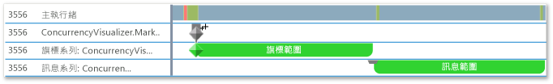
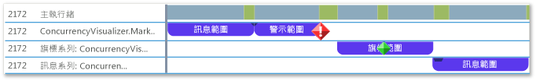

# <a name="how-to-use-the-concurrency-visualizer-markers-sdk"></a>如何：使用並行視覺化檢視標記 SDK
本主題說明如何使用並行視覺化檢視 SDK 建立範圍和寫入旗標、訊息和警示。  
  
### <a name="to-use-c"></a>使用 C++  
  
1.  在應用程式中加入並行視覺化檢視 SDK 支援。 如需詳細資訊，請參閱[視覺化檢視 SDK](../profiling/concurrency-visualizer-sdk.md)。  
  
2.  加入 SDK 的 `include` 陳述式和 `using` 陳述式。  
  
    ```C++  
  
    #include <cvmarkersobj.h>  
    using namespace Concurrency::diagnostic;  
  
    ```  
  
3.  加入在預設標記系列中建立三個範圍的程式碼，並在每個範圍各寫入一個旗標、訊息和警示。 寫入旗標、訊息和警示的方法是 [marker_series](../profiling/marker-series-class.md) 類別的成員。 [span](../profiling/span-class.md) 類別的建構函式需要 `marker_series` 物件，使每個範圍與特定的標記系列相關聯。 `span` 一經刪除就會結束。  
  
    ```C++  
  
    marker_series series;  
    span *flagSpan = new span(series, 1, _T("flag span"));  
    series.write_flag(_T("Here is the flag."));  
    delete flagSpan;  
  
    span *messageSpan = new span(series, 2, _T("message span"));  
    series.write_flag(_T("Here is the message."));  
    delete messageSpan;  
  
    span *alertSpan = new span(series, 3, _T("alert span"));  
    series.write_flag(_T("Here is the alert."));  
    delete alertSpan;  
  
    ```  
  
4.  在功能表列上選擇 [分析]、[並行視覺化檢視]、[從目前專案開始]，以執行應用程式並顯示 [並行視覺化檢視]。 下圖顯示 [並行視覺化檢視] 中的三個範圍和三個標記。  
  
     ![包含 3 個標記和警示的 [並行視覺化檢視]](~/docs/profiling/media/cvmarkersnative.png "CvMarkersNative")  
  
5.  透過呼叫 `marker_series`的建構函式以加入建立其他自訂標記系列的程式碼，而該建構函式接受標記系列的字串名稱。  
  
    ```C++  
  
    marker_series flagSeries(_T("flag series"));  
    span *flagSeriesSpan = new span(flagSeries, 1, _T("flag span"));  
    flagSeries.write_flag(1, _T("flag"));  
    // Sleep to even out the display in the Concurrency Visualizer.  
    Sleep(50);  
    delete flagSeriesSpan;  
  
    marker_series messageSeries(_T("message series"));  
    span *messageSeriesSpan = new span(messageSeries, 1, _T("message span"));  
    messageSeries.write_message(1, _T("message"));  
    // Sleep to even out the display in the Concurrency Visualizer.  
    Sleep(50);  
    delete messageSeriesSpan;  
  
    ```  
  
6.  啟動目前的專案以顯示 [並行視覺化檢視]。 兩個標記序列會出現在 [執行緒] 檢視中其所屬的行。 下圖顯示兩個新範圍。  
  
       
  
### <a name="to-use-visual-basic-or-c"></a>使用 Visual Basic 或 C# #
  
1.  在應用程式中加入並行視覺化檢視 SDK 支援。 如需詳細資訊，請參閱[視覺化檢視 SDK](../profiling/concurrency-visualizer-sdk.md)。  
  
2.  加入 SDK 的 `using` 或 `Imports` 陳述式。  
  
    ```VB  
    Imports Microsoft.ConcurrencyVisualizer.Instrumentation  
  
    ```  
  
    ```CSharp  
    using Microsoft.ConcurrencyVisualizer.Instrumentation;  
    ```  
  
3.  加入在預設標記系列中建立三個範圍的程式碼，並在每個範圍各寫入一個旗標、訊息和警示。 透過呼叫靜態的 [EnterSpan](assetId:///EnterSpan?qualifyHint=False&autoUpgrade=True) 方法來建立 <xref:Microsoft.ConcurrencyVisualizer.Instrumentation.Span> 物件。 若要寫入預設系列，您可以使用 <xref:Microsoft.ConcurrencyVisualizer.Instrumentation.Markers> 類別的靜態寫入方法。  
  
    ```VB  
  
    Dim flagSpan As Span = Markers.EnterSpan("flag span")  
    Markers.WriteFlag("Here is the flag.")  
    flagSpan.Leave()  
  
    Dim messageSpan As Span = Markers.EnterSpan("message span")  
    ' Sleep for a millisecond to even out the display in the Concurrency Visualizer.  
    System.Threading.Thread.Sleep(1)  
    Markers.WriteMessage("Here is a message")  
    messageSpan.Leave()  
  
    Dim alertSpan As Span = Markers.EnterSpan("alert span")  
    ' Sleep for a millisecond to even out the display in the Concurrency Visualizer.  
    System.Threading.Thread.Sleep(1)  
    Markers.WriteAlert("Here is an alert")  
    alertSpan.Leave()  
  
    ```  
  
    ```CSharp  
  
    Span flagSpan = Markers.EnterSpan("flag span");  
    Markers.WriteFlag("Here is the flag.");  
    flagSpan.Leave();  
  
    Span messageSpan = Markers.EnterSpan("message span");  
    // Sleep for a millisecond to even out the display in the Concurrency Visualizer.  
    System.Threading.Thread.Sleep(1);  
    Markers.WriteMessage("Here is a message");  
    messageSpan.Leave();  
  
    Span alertSpan = Markers.EnterSpan("alert span");  
    // Sleep for a millisecond to even out the display in the Concurrency Visualizer.  
    System.Threading.Thread.Sleep(1);  
    Markers.WriteAlert("Here is an alert");  
    alertSpan.Leave();  
    ```  
  
4.  在功能表列上選擇 [分析]、[並行視覺化檢視]、[從目前專案開始]，以執行應用程式並顯示 [並行視覺化檢視]。 下圖顯示 [並行視覺化檢視] 的 [執行緒] 檢視中的三個範圍和三個標記。  
  
     ![包含標記和警示的 [並行視覺化檢視]](../profiling/media/cvmarkersmanaged.png "CvMarkersManaged")  
  
5.  透過使用靜態的 <xref:Microsoft.ConcurrencyVisualizer.Instrumentation.Markers.CreateMarkerSeries%2A> 方法，加入程式碼以建立客戶標記系列。 <xref:Microsoft.ConcurrencyVisualizer.Instrumentation.MarkerSeries> 類別包含建立範圍和寫入旗標、訊息和警示的方法。  
  
    ```VB  
  
    Dim flagSeries As MarkerSeries = Markers.DefaultWriter.CreateMarkerSeries("flag series")  
    Dim flagSeriesSpan As Span = flagSeries.EnterSpan("flag span")  
    System.Threading.Thread.Sleep(1)  
    flagSeries.WriteFlag(1, "flag")  
    System.Threading.Thread.Sleep(1)  
    flagSeriesSpan.Leave()  
  
    Dim messageSeries As MarkerSeries = Markers.DefaultWriter.CreateMarkerSeries("message series")  
    Dim messageSeriesSpan As Span = messageSeries.EnterSpan("message span")  
    messageSeries.WriteMessage("message")  
    System.Threading.Thread.Sleep(1)  
    messageSeriesSpan.Leave()  
    ```  
  
    ```CSharp  
  
    MarkerSeries flagSeries = Markers.DefaultWriter.CreateMarkerSeries("flag series");  
    Span flagSeriesSpan = flagSeries.EnterSpan("flag span");  
    System.Threading.Thread.Sleep(1);  
    flagSeries.WriteFlag(1, "flag");  
    System.Threading.Thread.Sleep(1);  
    flagSeriesSpan.Leave();  
  
    MarkerSeries messageSeries = Markers.DefaultWriter.CreateMarkerSeries("message series");  
    Span messageSeriesSpan = messageSeries.EnterSpan("message span");  
    messageSeries.WriteMessage("message");  
    System.Threading.Thread.Sleep(1);  
    messageSeriesSpan.Leave();  
    ```  
  
6.  啟動目前的專案以顯示 [並行視覺化檢視]。 三個標記序列會出現在 [執行緒] 檢視中其所屬的行。 下圖顯示三個新範圍。  
  
       
  
## <a name="see-also"></a>另請參閱  
 [並行視覺化檢視 SDK](../profiling/concurrency-visualizer-sdk.md)


<!--HONumber=Feb17_HO4-->


