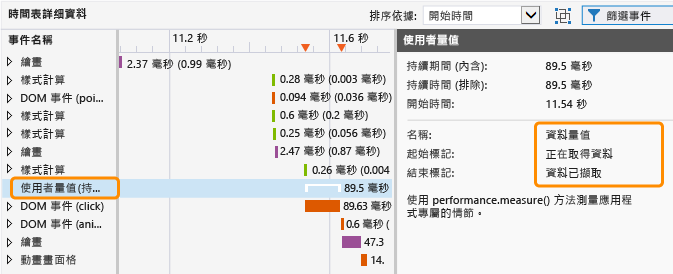
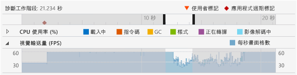
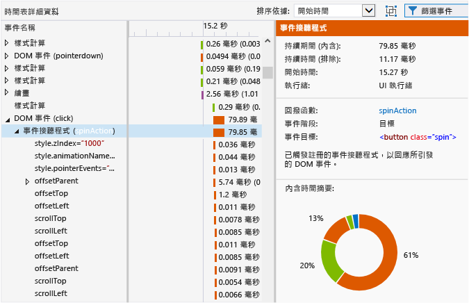
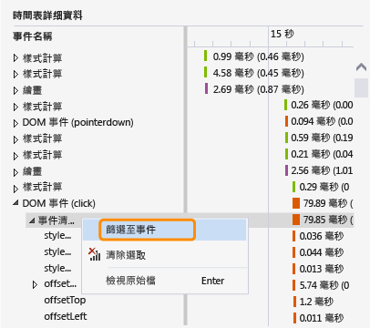
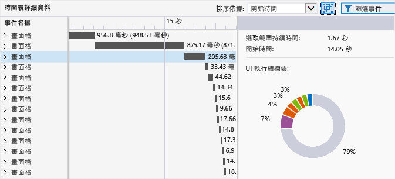

# <a name="analyze-html-ui-responsiveness-in-universal-windows-apps"></a>分析通用 Windows App 中 HTML UI 的回應性
本主題描述如何使用 UI 回應性分析工具隔離應用程式中的效能問題。該效能工具可供通用 Windows App 使用。  
  
 UI 回應性分析工具可協助您隔離問題，如 UI 回應性問題，或者平台的副作用，發生時通常伴有下列徵兆：  
  
-   缺少 UI 回應性。 如果 UI 執行緒遭封鎖，應用程式回應可能會變慢。 可能封鎖 UI 執行緒的某些作業，包含過多的同步 JavaScript 程式碼、過度 CSS 配置或 CSS 計算工作、同步 XHR 要求、記憶體回收、過度繪製時間或處理器密集的 JavaScript 程式碼。  
  
-   載入應用程式或頁面時非常緩慢。 這通常是花了過多的時間載入資源所造成。  
  
-   視覺效果更新比預期較不頻繁。 如果 UI 執行緒太忙碌而無法保持順暢的畫面播放速率，就會發生這種情況。 例如，如果 UI 執行緒忙碌，畫面格可能會被捨棄。 某些非 UI 執行緒工作也可能會限制如網路要求、影像解碼和繪製的視覺效果更新頻率 (並非所有繪製都是在 UI 執行緒上執行)。  
  
##  <a name="RunningProfiler"></a> 執行 HTML UI 回應性工具  
 當您在 Visual Studio 中有開啟的運作中 Windows 通用或 Windows 市集應用程式，或在執行 Windows 8 或更新版本的電腦上安裝這些應用程式時，便可以使用 HTML UI 回應性工具。  
  
1.  如果您是從 Visual Studio 執行應用程式，請在 [ **標準** ] 工具列上的 [ **開始偵錯** ] 清單中選擇部署目標，例如其中一個 Windows Phone 模擬器、[ **本機電腦**]、[ **模擬器**] 或 [ **遠端電腦**]。  
  
2.  在 [偵錯]  功能表上選擇 [效能分析工具...] 。  
  
     如果您要變更分析工具的分析目標，請選擇 [變更目標]。  
  
       
  
     下列選項適用於分析目標：  
  
    -   **啟始專案**： 選擇這個選項即可分析目前的啟始專案。 如果您是在遠端電腦或裝置上執行應用程式，必須使用這項設定 (預設值)。  
  
    -   **執行中的應用程式**： 選擇這個選項，即可從執行中的應用程式清單選取 Windows 市集應用程式。 如果您是在遠端電腦或裝置上執行應用程式，便無法使用這個選項。  
  
         當您無法存取原始程式碼時，可以使用這個選項分析在電腦上執行之應用程式的效能。  
  
    -   **已安裝的應用程式**： 選擇這個選項即可選取已安裝且您要分析的應用程式。 如果您是在遠端電腦或裝置上執行應用程式，便無法使用這個選項。  
  
         當您無法存取原始程式碼時，可以使用這個選項分析安裝在電腦上之應用程式的效能。 如果這不是您開發的應用程式，但是您又希望分析應用程式的效能，這個選項就很有用。  
  
3.  從 [ **可用的工具**] 中，選取 [ **HTML UI 回應性**]，然後選擇 [ **開始**]。  
  
4.  當您啟動 UI 回應性分析工具時，使用者帳戶控制視窗可能會要求您提供執行 Visual Studio ETW Collector.exe 的權限。 選擇 [ **是**]。  
  
     與應用程式互動，以測試相關的效能案例。 如需詳細的工作流程，請參閱[隔絕 UI 回應性問題](#Workflow)和[隔絕視覺輸送量問題](#IsolateVisualThroughput)。  
  
5.  按 Alt+Tab 切換至 Visual Studio。  
  
6.  若要停止分析應用程式並檢視分析工具蒐集的資料，請選擇 [ **停止收集**]。  
  
##  <a name="IsolateAnIssue"></a> 隔絕問題  
 下列章節提供可協助您找出效能問題的建議。 如需如何利用範例效能測試應用程式來找出效能問題並加以修正的逐步說明，請參閱[逐步解說：改善 UI 回應性 (HTML)](../profiling/walkthrough-improving-ui-responsiveness-html.md)。  
  
###  <a name="Workflow"></a> 隔絕 UI 回應性問題  
 下列步驟提供的建議工作流程，有助於您更有效地使用 UI 回應性分析工具：  
  
1.  在 Visual Studio 中開啟應用程式。  
  
2.  測試您的應用程式是否存在 UI 回應性問題 (按 Ctrl+F5 即可啟動您的應用程式而不偵錯)。  
  
     如果您發現問題，請繼續測試以嘗試縮小發生問題的時間範圍，或者嘗試找出造成行為的觸發程序。  
  
3.  切換至 Visual Studio (按 Alt+Tab)，然後停止您的應用程式 (Shift+F5)。  
  
4.  您也可以選擇使用[可供分析的標記程式碼](#ProfileMark)，在程式碼中新增使用者標記。  
  
    > [!TIP]
    >  當您檢視分析工具資料時，使用者標記可以協助您識別回應性問題。 例如，您可以在造成回應性問題的程式碼區段的開頭和結尾加入使用者標記。  
  
5.  請依照上一節中的指示執行 UI 回應性分析工具。  
  
6.  讓應用程式進入產生 UI 回應性問題的狀態。  
  
7.  切換至 Visual Studio (按 Alt+Tab)，並選擇 UI 回應性分析工具的 [分析工具] 索引標籤上的 [ **停止收集** ]。  
  
8.  如果您加入了使用者標記，標記會出現在分析工具的 [檢視診斷工作階段時間軸](#Ruler) 中。 下圖顯示用來在程式碼中指定特定作業的單一使用者標記。  
  
       
  
9. 利用使用者標記、應用程式週期事件或圖表中看得到的資料，來識別時間軸中的關切區域及分析工具圖表。 下面是一些可協助您分析及使用圖表資料的指導方針：  
  
    -   使用 [檢視診斷工作階段時間軸](#Ruler) 來檢視 [標記程式碼以供分析](#ProfileMark)、應用程式週期事件，以及這些事件的相關聯時間軸與其他圖表資料的時間軸。  
  
    -   使用 [CPU utilization graph](#CPUutilization) 可檢視在特定時段中，CPU 活動及其處理之工作類型的一般資訊。 過多的 CPU 活動很可能會造成回應性問題及畫面格減少。  
  
    -   如果您要開發遊戲或多媒體應用程式，請使用 [檢視視覺輸送量 (FPS)](#VisualThroughput) 以找出畫面播放速率下降的時段。  
  
10. 按一下其中一個圖表的一部分，並且拖曳指標確定選取範圍 (或者使用 Tab 鍵和方向鍵)，可以選取圖表中感興趣的區域。 藉由確定選取範圍選取時段，分析工具下方窗格的時間軸詳細資料圖形會變成只顯示選取的時段。  
  
     下圖顯示具有反白顯示之感興趣的區域的 CPU 使用率圖表。  
  
       
  
11. 使用 [檢視時間軸詳細資料](#TimelineDetails) 以取得有關執行頻率太高或花費太多時間完成之事件的詳細資訊。 例如，請查看下列項目：  
  
    -   事件接聽程式、計時器和動畫畫面格回呼。 視特定事件而定，所提供的資料可能包含已修改之 DOM 元素的 ID、已修改之 CSS 屬性的名稱、來源位置連結，以及相關聯事件或回呼函式的名稱。  
  
    -   造成轉譯項目的配置或指令碼事件，例如 `window.getComputedStyles`的呼叫。 會一併提供事件的相關聯 DOM 元素。  
  
    -   應用程式載入的頁面或 URL 資源，例如 HTML 剖析中事件的指令碼評估。 所提供的檔案名稱或資源。  
  
    -   下列項目中指定的其他事件： [Profiler event reference](#ProfilerEvents).  
  
    > [!TIP]
    >  分析工具中大部分的有用資訊都會出現在時間軸詳細資料圖表中。  
  
12. 在 CPU 使用率或視覺輸送量 (FPS) 圖表中選取區域後，選擇 [ **放大** ] (按鈕或內容功能表) 以取得詳細資訊。 圖形的時間軸會變成只顯示選取的時段。  
  
13. 放大時，請選取 CPU 使用率或視覺輸送量圖形的一部分。 確定選取範圍時，分析工具下方窗格的時間軸詳細資料圖形會變成只顯示選取的時段。  
  
###  <a name="IsolateVisualThroughput"></a> 隔絕視覺輸送量問題  
 CPU 使用率超量期間可能會導致畫面播放速率降低或不一致。 如果您開發多媒體應用程式和遊戲，視覺輸送量圖表可能會比 CPU 使用率圖表提供更重要的資料。  
  
 若要找出視覺輸送量問題，請依照上一節中所述的步驟執行，但是使用視覺輸送量圖表做為其中一個關鍵資料點。  
  
###  <a name="ProfileMark"></a> 可供分析的標記程式碼  
 為有助於釐清與圖形中出現的資料相關聯之應用程式碼區段，您可以在應用程式中加入函式呼叫，指示分析工具在執行函式時，於時間軸上插入使用者標記 (倒三角形)。 您加入的任何使用者標記，都會出現在 CPU 使用率圖表、視覺輸送量圖表和時間軸詳細資料圖表的時間軸中。  
  
 若要加入使用者標記，請將下列程式碼加入至應用程式。 這個範例會使用 "getting data" 做為事件的描述。  
  
```javascript  
if (performance && performance.mark) {  
    performance.mark("getting data");  
}  
  
```  
  
 當您將滑鼠指標停留在使用者標記上時，事件的描述會顯示為工具提示。 您可以視需要加入任意數目的使用者標記。  
  
> [!NOTE]
>  `console.timeStamp` (Chrome 命令) 也會顯示成使用者標記。  
  
 下圖顯示具有單一使用者標記和其工具提示的診斷尺規。  
  
   
  
 您也可以在時間軸詳細資料檢視中，建立工具所產生的事件，以顯示兩個使用者標記之間經歷的時間。 下列程式碼會加入第二個使用者標記，以及執行兩個使用者標記之間所經歷的測量時間 (上一個程式碼會顯示第一個使用者標記)。  
  
```javascript  
if (performance.mark && performance.measure) {  
    performance.mark("data retrieved");  
    performance.measure("data measure", "getting data", "data retrieved");  
}  
```  
  
 如果沒有指定第二個使用者標記， `performance.measure` 就會使用時間戳記做為第二個使用者標記。 第一個使用者標記是必要項目。  
  
 在時間軸詳細資料檢視中，持續時間測量會顯示成 [使用者測量]  事件，選取時會顯示詳細資訊。  
  
   
  
##  <a name="AnalyzeData"></a> 分析資料  
 下列章節提供有助於解譯出現在分析工具的資料相關資訊。  
  
###  <a name="Ruler"></a> 檢視診斷工作階段時間軸  
 分析工具上方的尺規顯示相關分析資訊的時間軸。 這個時間軸適用於 CPU 使用率圖表和視覺輸送量圖表。  
  
 下圖顯示會針對數個應用程式週期事件顯示工具提示的範例診斷工作階段時間軸：  
  
   
  
 時間軸顯示應用程式週期事件 (如啟用事件) 發生的時間，而且顯示可加入至程式碼的使用者標記 (使用者標記三角形)。 您可以選取事件，以顯示含有詳細資訊的工具提示。 如需使用者標記的詳細資訊，請參閱本主題中的 [標記程式碼以供分析](#ProfileMark) 。  
  
 應用程式週期事件會顯示為菱形符號。 這些是 DOM 事件，包括下列：  
  
-   `DOMContentLoaded` 和 `Load` 事件，通常會發生在程式碼中已啟動的事件處理常式。 事件的工具提示會顯示特定事件和 URL。  
  
-   巡覽事件，當巡覽至其他頁面時發生。 事件的工具提示會顯示目的頁面 URL。  
  
###  <a name="CPUUtilization"></a> 檢視 CPU 使用率  
 CPU 使用率圖表可讓您識別有過多 CPU 活動的時段。 其中提供應用程式在一段時間的平均 CPU 消耗資訊。 資訊會以色彩標示，代表下列特定分類：[ **正在載入**]、[ **正在處理指令碼**]、記憶體回收 ([**GC**])、[ **樣式**]、[ **正在轉譯**] 和 [ **影像解碼中**]。 如需這些分類的詳細資訊，請參閱本主題稍後的 [Profiler event reference](#ProfilerEvents) 。  
  
 CPU 使用率圖形顯示花在所有應用程式執行緒的時間，將一個或多個 CPU 的 CPU 使用率值合併為單一的百分比值。 當多個 CPU 正在使用中時，CPU 使用率值可能會超過 100%。  
  
> [!NOTE]
>  圖表中並不會顯示 GPU 使用率。  
  
 這個範例顯示 CPU 使用率圖形的外觀：  
  
   
  
 使用這個圖形：  
  
-   識別一般關切的區域。  
  
-   選擇要在時間軸詳細資料圖形中顯示的特定時段。 若要選擇特定時段，請選取圖形的一部分，並且拖曳指標確定選取範圍。  
  
-   選擇 [ **放大** ] 按鈕，取得所選時段的更詳細檢視。  
  
 如需使用圖形的相關資訊，請參閱本主題中的 [Isolate a UI responsiveness problem](#Workflow) 。  
  
###  <a name="VisualThroughput"></a> 檢視視覺輸送量 (FPS)  
 視覺輸送量圖表可讓您識別畫面播放速率下降的時段。 它會顯示應用程式的每秒畫面格數 (FPS)。 此圖形對於遊戲和多媒體應用程式的開發是最有用的。  
  
 顯示的 FPS 值可能與實際畫面播放速率不同。 在此圖形中檢查資料時，請記住下列資訊：  
  
-   圖形顯示應用程式在任何特定時間可以達到的 FPS。 當應用程式處於閒置狀態時，FPS 與監視器重新整理的頻率相同。  
  
-   如果應用程式正在執行需要視覺效果更新的工作，圖形會顯示實際 FPS。  
  
-   如果正在捨棄畫面格，圖形會顯示零值。  
  
 這個範例顯示視覺輸送量圖形的外觀：  
  
   
  
 使用視覺輸送量圖形：  
  
-   識別一般關切的區域。  
  
-   選擇要在時間軸詳細資料圖形中顯示的特定時段。 若要選擇特定時段，請選取圖形的一部分，並且拖曳指標確定選取範圍。  
  
-   選擇 [ **放大** ] 按鈕，取得所選時段的更詳細檢視。  
  
###  <a name="TimelineDetails"></a> 檢視時間軸詳細資料  
 時間軸詳細資料圖表會出現在 UI 回應性分析工具的下方窗格。 它提供有關在選取的時段內，使用最多 CPU 時間的事件循序和階層資訊。 這個圖表可以協助您判斷觸發特定事件的原因，以及某些事件對應到原始程式碼的方式。 這個圖表也有助於判斷在螢幕上繪製視覺效果更新所需的時間。  
  
 此圖表顯示 UI 執行緒工作以及可能造成慢速視覺效果更新的背景執行緒工作。 圖形不會顯示 JavaScript JIT 工作、非同步 GPU 工作、在主機處理序之外執行的工作 (例如 RuntimeBroker.exe 和 dwm.exe 工作)，或未針對分析進行檢測之 Windows 執行階段區域的工作 (例如磁碟 I/O)。  
  
> [!TIP]
>  在背景執行緒發生事件時，事件名稱旁會顯示以括號括住的執行緒 ID。  
  
 這個範例顯示當選取 DOM Click 事件的事件接聽程式時，時間軸詳細資料圖形的外觀：  
  
   
  
 在上圖中，如果選取 [ **事件名稱** ] 一欄中的 [ **spinAction** ] 事件處理常式連結，就會帶領您前往原始程式碼中這個事件處理常式的所在位置。 在右窗格中，[ **回呼函式** ] 屬性可提供原始程式碼的相同連結。 其他屬性也會提供關於事件的資訊，例如相關的 DOM 項目。  
  
 如果您選取 CPU 使用率和視覺輸送量 (FPS) 圖表中時間軸的一部分，時間軸詳細資料圖表中會顯示所選時段的詳細資訊。  
  
 時間軸詳細資料圖形的事件會以色彩標示，表示 CPU 使用率圖形中顯示的相同工作分類。 如需事件分類及特定事件的相關資訊，請參閱本主題中的 [Profiler event reference](#ProfilerEvents) 。  
  
 使用時間軸詳細資料圖形：  
  
-   檢視時間軸和資料格檢視中事件大約的開始時間、持續時間和結束時間。 在資料格檢視中，時間軸詳細資料圖形可以顯示範圍從 30 毫秒到 30 秒的期間，視縮放狀態而定。 對於持續時間值：  
  
    -   內含時間代表包含事件子系的事件持續時間。 在資料格檢視中，這個值最先出現。  
  
    -   專有時間代表不含事件子系的事件持續時間。 在資料格檢視中，這個值出現在括號中。  
  
-   在階層架構中展開事件，可檢視事件的子系。 事件子系是由父事件所引發的其他事件。 例如，DOM 事件可能有顯示為子系的事件接聽程式。 事件接聽程式可能有因其所導致的其他事件，例如配置事件。  
  
-   依開始時間 (預設值) 或持續時間來排序事件。 使用 [ **排序依據** ] 清單選取排序方法。  
  
-   在詳細資料窗格 (右窗格)，檢視每個事件的詳細資料。 屬性會根據特定事件而變更，如下列範例所示：  
  
    -   對於計時器、事件接聽程式 (DOM 事件) 和動畫畫面格回呼，[ **回呼函式** ] 屬性可提供原始程式碼位置連結以及事件處理常式或回呼函式的名稱。  
  
    -   對於計時器、事件接聽程式 (DOM 事件)、配置事件和動畫畫面格回呼，[ **內含時間摘要** ] 區段 (色彩標示環) 中會顯示所選事件及其所有子系的色彩標示摘要。 影像的每個色彩標示切割表示一個事件型別。 工具提示提供事件型別名稱。  
  
    > [!TIP]
    >  時間軸詳細資料圖形和 [ **內含時間摘要** ] 可協助您識別要最佳化的區域。 如果這些檢視中有出現大量的小型工作，表示這個事件可能就是要最佳化的事件。 例如，應用程式可能會經常重新整理 DOM 項目，因此產生大量的配置和 HTML 剖析事件。 您可以批次處理這項工作以最佳化效能。  
  
###  <a name="FilterTimelineDetails"></a> 篩選時間軸詳細資料  
 您可以從特定事件的內容功能表中選取 [ **篩選事件** ]，在時間軸詳細資料中篩選並檢視特定事件。 選擇這個選項時，就會將時間軸和資料格檢視的範圍設定為選取的事件。 [CPU 使用率 (%)] 圖表中的選取範圍也會設定為特定事件。  
  
   
  
###  <a name="FilterEvents"></a> 篩選事件  
 您可以從時間軸詳細資料圖表篩選掉一些事件以精煉資料，或是排除對效能方案而言不必要的資料。 您可以依事件名稱或事件持續時間進行篩選，或是依此處所說明的特定篩選條件進行篩選。  
  
 若要篩選掉影像解碼、理論式下載和 GC 事件，請從下方窗格中的篩選圖示取消選取 [背景活動]  選項。 由於這些事件幾乎都不必採取動作，因此預設並不會顯示。  
  
   
  
 若要篩選掉 HTTP 要求事件，請從下方窗格中的篩選圖示取消選取 [網路流量]  選項。 這些事件預設會在時間軸詳細資料圖表中顯示。  
  
 若要篩選掉 UI 執行緒活動，請取消選取 [UI 活動]  選項。  
  
> [!TIP]
>  清除此選項並選取 [網路流量] 選項，以調查與網路延遲相關的問題。  
  
 若要篩選掉使用者測量，請清除 [使用者測量]  選項。 使用者測量是最上層事件，不含子系。  
  
###  <a name="GroupFrames"></a> 依畫面格分組事件  
 您可以將出現在時間軸詳細資料檢視中的事件，分組成個別畫面格。 這些畫面格事件是工具產生的事件，代表繪畫事件之間所發生之所有 UI 執行緒工作最上層的事件容器。 若要啟用此檢視，請選取 [依畫面格分組最上層事件] 。  
  
   
  
 當您依畫面格分組事件時，時間軸詳細資料檢視中的每個最上層事件，各代表一個畫面格。  
  
   
  
##  <a name="SaveSession"></a> 儲存診斷工作階段  
 在 Visual Studio 中，當您關閉與診斷工作階段相關聯的索引標籤時，可以儲存診斷工作階段。 已儲存的工作階段可以在稍後重新開啟。  
  
##  <a name="ProfilerEvents"></a> 分析工具參考  
 在 UI 回應性分析工具中，分析工具事件已分類和色彩標示。 這些是事件分類：  
  
-   **載入。** 指出當應用程式第一次載入時，花在擷取應用程式資源和剖析 HTML 和 CSS 的時間。 這可能包括網路要求。  
  
-   **指令碼處理。** 指出花在剖析及執行 JavaScript 的時間。 這包括 DOM 事件、計時器、指令碼評估和動畫畫面格工作。 它包含使用者程式碼和程式庫程式碼。  
  
-   **GC。** 指出花在記憶體回收的時間。  
  
-   **設定樣式。** 指出花在剖析 CSS 以及計算項目展示和配置的時間。  
  
-   **轉譯。** 指出花在繪製螢幕的時間。  
  
-   **影像解碼。** 指出花在解壓縮及解碼影像的時間。  
  
 對於指令碼和樣式分類，UI 回應性分析工具可能會在時間軸詳細資料圖形中提供您可採取動作的資料。 如果您將指令碼問題識別為問題，可以搭配 UI 回應性分析工具來執行 CPU 取樣分析工具。 或者，您也可以使用 Visual Studio 函式分析工具取得詳細資料。 如需詳細資訊，請參閱 [JavaScript 記憶體](../profiling/javascript-memory.md)。  
  
 對於其他事件分類，您可以識別因在應用程式加入功能所導致的平台副作用，但是在這種情況下無法使用 UI 回應性分析工具來解決特定效能問題。  
  
 下表顯示事件及其描述：  
  
|事件|事件分類|發生於|  
|-----------|--------------------|-----------------|  
|CSS 剖析中|正在載入|遇到新的 CSS 內容，而且嘗試剖析 CSS 內容。|  
|HTML 剖析中|正在載入|遇到新的 HTML 內容，而且嘗試將內容剖析成節點和將內容插入至 DOM 樹狀目錄。|  
|HTTP 要求|正在載入|在 DOM 中找到遠端資源，或因建立 XMLHttpRequest 而產生 HTTP 要求。|  
|理論式下載|正在載入|在頁面的 HTML 內容中搜尋所需的資源，以便資源的後續 HTTP 要求可以迅速排程。|  
|動畫畫面格回呼函式|正在處理指令碼|瀏覽器即將要呈現另一個畫面格，因此觸發應用程式提供的回呼函式。|  
|DOM 事件|正在處理指令碼|已發生且執行 DOM 事件。<br /><br /> DOM 事件 (例如 `context` 或  `DOMContentLoaded` ) 的 `click`屬性顯示在括號中。|  
|事件接聽程式|正在處理指令碼|已呼叫且執行事件接聽程式。|  
|媒體查詢接聽程式|正在處理指令碼|已註冊的媒體查詢失效，因而會執行其相關聯的接聽程式。|  
|變動觀察者|正在處理指令碼|一或多個受觀察的 DOM 元素已修改，因而會執行 MutationObserver 的關聯回呼。|  
|指令碼評估|正在處理指令碼|在 DOM 中找到新的 SCRIPT 項目，而且嘗試剖析和執行指令碼。|  
|計時器|正在處理指令碼|排程計時器已過，這會導致執行其關聯的回呼函式。|  
|Windows 執行階段非同步回呼函式|正在處理指令碼|觸發 `Promise` 回呼函式的非同步作業，已經由 Windows 執行階段物件完成。|  
|Windows 執行階段錯誤|正在處理指令碼|在 Windows 執行階段物件中發生的事件，觸發已註冊的接聽程式。|  
|記憶體回收|GC|花費時間收集不再使用之物件的記憶體。|  
|CSS 計算|樣式|對 DOM 進行變更，導致必須重新計算所有受影響項目的樣式屬性。|  
|配置|樣式|對 DOM 進行變更，導致必須重新計算所有受影響項目的大小和 (或) 位置。|  
|繪畫|正在轉譯|對 DOM 進行視覺變更，並嘗試重新轉譯頁面上受影響的部分。|  
|轉譯圖層|正在轉譯|對 DOM 的獨立轉譯片段 (稱為圖層) 進行視覺變更，導致必須轉譯頁面上受影響的部分。|  
|影像解碼中|影像解碼中|DOM 中包含影像，並嘗試將影像從其原始格式解壓縮及解碼成點陣圖。|  
|Frame|N/A|對 DOM 所進行的視覺效果變更，會需要重新繪製該頁面上所有受影響的部分。 這是工具產生的事件，可用來分組。|  
|使用者測量|N/A|已使用 `performance.measure` 方法來測量應用程式專屬的案例。 這是工具產生的事件，可用來分析程式碼。|  
  
##  <a name="Tips"></a> 其他資訊  
  
-   請觀賞 Build 2013 大會中關於 UI 回應性分析工具的 [影片](http://channel9.msdn.com/Events/Build/2013/3-316) 。  
  
-   讀取有關使用 JavaScript 針對 Windows 建置的 Windows 市集應用程式的效能提示。 如需詳細資訊，請參閱 [使用 JavaScript 的 Windows 市集應用程式的效能最佳做法](http://msdn.microsoft.com/library/windows/apps/hh465194.aspx)。  
  
-   如需單執行緒程式碼執行模型和效能的相關資訊，請參閱 [執行程式碼](http://msdn.microsoft.com/library/windows/apps/hh781217.aspx)。  
  
## <a name="see-also"></a>另請參閱  
 [分析工具](../profiling/profiling-tools.md)
