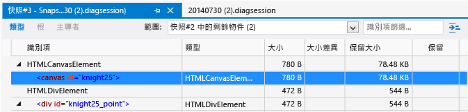
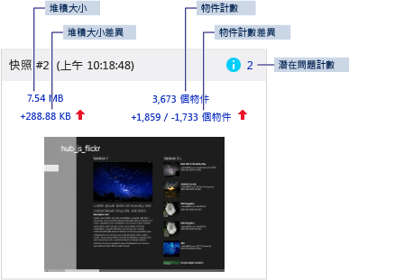
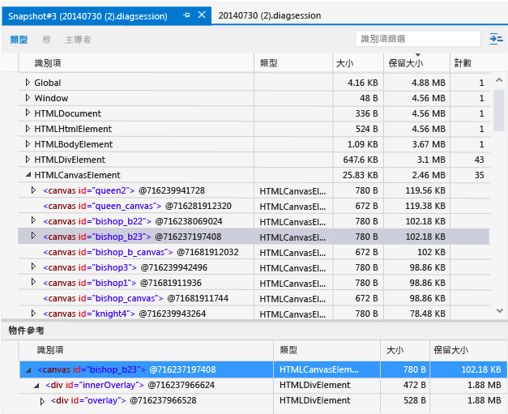

# <a name="javascript-memory"></a>JavaScript 記憶體
您可以使用 Visual Studio 中提供的 JavaScript 記憶體分析器，在使用 JavaScript 針對 Windows 建置的市集應用程式中了解記憶體使用量並找出記憶體流失的問題。 支援的應用程式包括 Windows Phone 市集和 Windows 市集的應用程式。  
  
 JavaScript 記憶體分析器可以執行下列項目：  
  
-   突顯關聯性最高的資料，協助您快速尋找應用程式中的記憶體使用量問題。  
  
     您可以從顯示出兩個快照間差異的快照摘要取得這份資料，其中還提供更詳細的檢視連結。  
  
-   提供主導者、類型和根檢視，協助隔離問題。  
  
-   減少 JavaScript 堆積資料中屬於不可執行動作的資訊。  
  
     不是直接由應用程式程式碼建立的物件都將被自動篩選掉。 您也可以根據物件名稱來篩選資料。  
  
 如需能協助您找出運作中應用程式發生記憶體流失問題的教學課程，請參閱[逐步解說：找出記憶體流失 (JavaScript)](../profiling/walkthrough-find-a-memory-leak-javascript.md)。  
  
 本主題內容：  
  
 [執行 JavaScript 記憶體分析器](#Run)   
 [檢查記憶體使用量](#Check)   
 [找出記憶體流失](#Isolate)   
 [檢視即時記憶體使用量摘要](#LiveMemory)   
 [檢視快照摘要](#SnapshotSummary)   
 [檢視快照詳細資料](#SnapshotDetails)   
 [檢視快照差異](#SnapshotDiff)   
 [依主導者檢視物件](#FoldObjects)   
 [根據識別項來篩選資料](#Filter)   
 [在物件樹狀結構中尋找物件](#ShowInRootsView)   
 [檢視共用物件參考](#References)   
 [顯示內建物件](#BuiltInValues)   
 [儲存診斷工作階段檔案](#Save)   
 [建立原始程式碼與記憶體使用量資料之間的關聯](#JSConsoleCommands)   
 [識別記憶體問題的提示](#Tips)  
  
##  <a name="a-nameruna-run-the-javascript-memory-analyzer"></a><a name="Run"></a>執行 JavaScript 記憶體分析器  
 當您在 Visual Studio 中開啟執行中的 Windows 市集應用程式或在執行 [!INCLUDE[win8](../debugger/includes/win8_md.md)] 或更新版本的電腦上安裝這些應用程式時，可以使用記憶體分析器。  
  
#### <a name="to-run-the-memory-analyzer"></a>若要執行記憶體分析器  
  
1.  開啟 Visual Studio。  
  
2.  如果您是從 Visual Studio 執行應用程式，請在 [標準]  工具列上的 [開始偵錯]  清單中選擇專案的部署目標：Windows Phone 模擬器或是 (針對 Windows 市集應用程式) [本機電腦] 、[模擬器] 或 [遠端電腦] 。  
  
     如需這些選項的詳細資訊，請參閱[從 Visual Studio 執行應用程式](../debugger/run-store-apps-from-visual-studio.md)。  
  
3.  在功能表列上，依序選擇 [偵錯] 和 [效能分析工具]。  
  
     根據預設，Visual Studio 隨即開始分析啟始專案。 如果要變更分析目標，請選擇 [ **變更目標**]。  
  
       
  
     下列選項適用於分析目標：  
  
    -   **啟始專案**： 分析目前的啟始專案。 如果您是在遠端電腦執行應用程式，必須選擇這個選項 (預設值)。  
  
    -   **執行中的應用程式**： 讓您從執行中的應用程式清單選取 Windows 市集應用程式。 如果您是在遠端電腦執行應用程式，便無法使用這個選項。  
  
         當您無法存取原始程式碼時，可以使用這個選項分析在電腦上執行之應用程式的記憶體使用量。  
  
    -   **已安裝的應用程式**： 可讓您選取已安裝且要分析的 Windows 市集應用程式。 如果您是在遠端電腦執行應用程式，便無法使用這個選項。  
  
         當您無法存取原始程式碼時，可以使用這個選項分析安裝在電腦上之應用程式的記憶體使用量。 如果這不是您開發的應用程式，但是您又希望分析應用程式的記憶體使用量，這個選項就很有用。  
  
4.  從 [ **可用的工具**] 選取 [ **JavaScript 記憶體** ] 核取方塊，然後選擇 [ **啟動**]。  
  
5.  啟動記憶體分析器時，[使用者帳戶控制] 視窗可能會要求您提供執行 Visual Studio ETW Collector.exe 的權限。 選擇 [ **是**]。  
  
     如下列章節中的討論內容所述，與應用程式互動以測試相關記憶體使用量狀況並檢視記憶體圖表。  
  
6.  按 Alt+Tab 切換至 Visual Studio。  
  
7.  若要檢視記憶體分析器收集的資料，請選擇 [ **擷取堆積快照**]。 請參閱本主題稍後的 [View a snapshot summary](#SnapshotSummary) 。  
  
##  <a name="a-namechecka-check-memory-usage"></a><a name="Check"></a>檢查記憶體使用量  
 您可以使用 JavaScript 記憶體分析器的不同檢視，嘗試識別記憶體流失。 如果您已經懷疑應用程式正在流失記憶體，請參閱 [Isolate a memory leak](#Isolate) 以了解建議的工作流程。  
  
 請使用下列檢視協助識別應用程式中的記憶體流失：  
  
-   [檢視即時記憶體使用量摘要](#LiveMemory). 使用記憶體使用量圖表可以查看記憶體使用量是否突然增加，或者是否因特定動作而持續增加。 使用即時記憶體使用量摘要檢視可以取得堆積的快照。 快照會在記憶體使用量圖表下方顯示為集合。  
  
    > [!TIP]
    >  當您擷取快照時，記憶體使用量中就會顯示增量。 請使用快照摘要找出記憶體增加的精確位置。  
  
-   [View a snapshot summary](#SnapshotSummary). 您可以檢視在記憶體分析工作階段期間或之後檢視快照摘要資訊。 使用快照摘要可以連結快照詳細資料和快照差異檢視。  
  
    > [!TIP]
    >  一般來說，快照差異檢視會提供有關記憶體流失最有用的資訊。  
  
-   [檢視快照詳細資料](#SnapshotDetails). 顯示單一快照的詳細記憶體使用量資料。  
  
-   [檢視快照差異](#SnapshotDiff). 顯示快照之間的差異值。 這些檢視會顯示物件大小和物件計數的差異。  
  
##  <a name="a-nameisolatea-isolate-a-memory-leak"></a><a name="Isolate"></a>找出記憶體流失  
 下列步驟提供的工作流程，有助於您更有效地使用 JavaScript 記憶體分析器。 如果您懷疑應用程式有記憶體流失，這些步驟可能會很有用。 如需能協助您找出運作中應用程式發生記憶體流失問題的教學課程，請參閱[逐步解說：找出記憶體流失 (JavaScript)](../profiling/walkthrough-find-a-memory-leak-javascript.md)。  
  
1.  在 Visual Studio 中開啟應用程式。  
  
2.  執行 JavaScript 記憶體分析器。 如需詳細資訊，請參閱 [執行 JavaScript 記憶體分析器](#Run)。  
  
3.  在您要測試的案例中執行您的應用程式。 例如，當特定頁面載入或應用程式啟動的時候，此案例可能涉及大型 DOM 變動。  
  
4.  額外重複此案例 1 至 4 次。  
  
    > [!TIP]
    >  藉由重複測試案例數次，有助於確定可從結果篩選掉的初始化工作。  
  
5.  切換至 Visual Studio (按 Alt+Tab)。  
  
6.  選擇 [ **擷取堆積快照**] 接受基準堆積快照。  
  
     下圖顯示範例基準快照。  
  
       
  
    > [!TIP]
    >  若要更精確地控制快照時機，可以在程式碼中使用 [Associate source code with memory usage data](#JSConsoleCommands) 命令。  
  
7.  切換至您的應用程式，並重複您要測試的案例 (僅重複一次)。  
  
8.  切換至 Visual Studio，然後擷取第二張快照。  
  
9. 切換至您的應用程式，並重複您要測試的案例 (僅重複一次)。  
  
10. 切換至 Visual Studio，然後擷取第三張快照。  
  
     下圖顯示第二及第三張範例快照。  
  
       
  
     您可以在這個工作流程中擷取基準、第二及第三張快照，藉此更輕鬆地篩選掉與記憶體流失無關聯的變更。 例如，可能會有如更新頁首和頁尾等預期的變更，這將會對記憶體使用量產生一些變更，但可能與記憶體流失無關。  
  
11. 從第三張快照中，選擇其中一個差異檢視的連結：  
  
    -   差異堆積大小 (在堆積大小下方的左邊連結)。 此連結文字會顯示目前快照與上一個快照之間的堆積大小差異。  
  
    -   差異物件計數 (在物件計數下方的右邊連結)。 此連結文字會顯示兩個值 (例如，+1858 / -1765)：第一個值是自上一個快照以來加入新物件的數目，而第二個值是自上一個快照以來移除的物件數目。  
  
     這些連結會開啟堆積中類型的差異快照詳細資料檢視，並依保留大小或物件計數排序 (視您開啟哪一個連結而定)。  
  
12. 選擇下列其中一個 [範圍]  篩選選項以幫助識別記憶體使用量問題：  
  
    -   **快照 #2 中剩餘的物件**  
  
    -   **在快照 #2 與快照 #3 之間加入的物件**  
  
    > [!TIP]
    >  使用已篩選之上一個快照中剩餘物件的檢視，調查記憶體流失。 例如，差異物件計數是 +205 / -195，則此檢視將顯示 10 個剩餘的物件，這些物件是記憶體流失的可能候選者。  
  
     下圖顯示快照 #2 中剩餘物件的差異檢視。  
  
       
  
     在上圖中，可以發現上一個快照剩餘了兩個物件。 請調查這是否為特定應用程式的預期行為。 如果不是，則可能表示記憶體流失。  
  
13. 若要查看差異檢視中物件的根項目是否為全域物件，以避免進行記憶體回收，請開啟物件的捷徑功能表，然後選擇 [在根檢視中顯示] 。 大量的物件可能被保留在記憶體中，因為它們是由根項目為全域物件的單一物件 (或幾個物件) 所參考。  
  
14. 如果剩餘物件的檢視中有過多物件，請嘗試進一步找出發生記憶體流失的時段，然後重新擷取第三張快照。 若要進一步找出記憶體流失的問題，請使用 [Associate source code with memory usage data](#JSConsoleCommands)、[模擬器] [Associate source code with memory usage data](#JSConsoleCommands)、[模擬器] and other memory usage data available in the memory analyzer.  
  
##  <a name="a-namelivememorya-view-live-memory-usage-summary"></a><a name="LiveMemory"></a>檢視即時記憶體使用量摘要  
 即時記憶體使用量摘要檢視可為執行中的應用程式提供記憶體使用量圖表，並提供所有快照摘要磚的集合。 在這個檢視中，您可以執行像是擷取快照、分析摘要資訊以及巡覽至其他檢視等基本工作。 停止收集資料時，記憶體圖表會隨即消失，您只會看到 [View a snapshot summary](#SnapshotSummary) 檢視。  
  
 記憶體圖表可讓您即時檢視應用程式的處理序記憶體，包括私用位元組、原生記憶體和 JavaScript 堆積。 記憶體圖表可讓您以捲動方式檢視處理序記憶體。 看起來如下：  
  
   
  
 如果您已將使用者標記加入應用程式程式碼 (請參閱 [Associate source code with memory usage data](#JSConsoleCommands))，記憶體使用量圖表中會出現倒三角形，表示到達該程式碼區段的時間。  
  
 記憶體圖表中顯示的某些記憶體是由 JavaScript 執行階段所配置。 您無法在應用程式中控制此記憶體使用量。 圖表中顯示的記憶體使用量會在您初次擷取快照時增加，之後每當您擷取一次快照，記憶體使用量會以最小幅度再增加一些。  
  
##  <a name="a-namesnapshotsummarya-view-a-snapshot-summary"></a><a name="SnapshotSummary"></a>檢視快照摘要  
 若要擷取應用程式目前記憶體使用量狀態的快照，請選擇記憶體圖表中的 [ **擷取堆積快照** ]。 快照摘要磚會顯示在即時記憶體使用量摘要 (於應用程式執行期間顯示) 和快照摘要 (於應用程式停止時顯示) 中，可提供 JavaScript 堆積相關資訊以及詳細資料連結。 如果您擷取兩個以上的快照，則在任何相鄰的兩個快照中，後者會額外提供相較於前者的差異資料。  
  
> [!NOTE]
>  在每次擷取快照之前，JavaScript 記憶體分析器都會強制執行記憶體回收。 這有助於確保每次擷取快照的結果都更為一致。  
  
 以下是擷取多個快照時的快照摘要範例。  
  
   
  
 快照摘要包含：  
  
-   快照標題和時間戳記。  
  
-   可能的問題計數 (以藍色資訊圖示標記)。 如果出現這個數字，您就能找出潛在的記憶體問題 (例如未附加到 DOM 的節點)。 這個計數會連結至快照的類型檢視，此檢視是依照問題類型排序以突顯潛在問題。 工具提示會顯示問題描述。  
  
-   堆積大小。 這個數目包括 JavaScript 執行階段引擎加入至 JavaScript 堆積的 DOM 項目和物件。 堆積大小可以連結到快照的類型檢視。  
  
-   差異堆積大小。 這個值表示目前快照與上一個快照的堆積大小差異。 如果記憶體增加，這個值後面就會顯示紅色向上箭頭；反之如果記憶體減少，就會顯示綠色向下箭頭。 如果兩個快照之間的堆疊大小沒有變更，您就會看到 [ **沒有變更** ] 這個文字而非數字。 如果是第一個快照，您會看到 [ **基準**] 這個文字。 差異堆積大小會連結到快照差異的 [類型] 檢視。  
  
-   物件計數。 這個計數只代表在應用程式中建立的物件，其中也已經篩選掉了 JavaScript 執行階段建立的內建物件。 這個物件計數可以連結到快照詳細資料的 [型別] 檢視。  
  
-   差異物件計數。 這會顯示兩個值：第一個值是從上一個快照以來加入新物件的數目，而第二個值是從上一個快照以來移除的物件數目。 例如，上圖顯示與快照 #1 相比，已加入了 1,859 個物件而且移除了 1,733 物件。 如果物件總計數增加，這項資訊後面就會顯示紅色向上箭頭，反之如果物件總計數減少，就會顯示綠色向下箭頭。 如果物件計數沒有變更，您就會看到 [ **沒有變更** ] 這個文字而非數字。 如果是第一個快照，您會看到 [ **基準**] 這個文字。 差異物件計數可以連結到快照差異的 [型別] 檢視。  
  
-   在擷取快照當時的螢幕擷取畫面。  
  
##  <a name="a-namesnapshotdetailsa-view-snapshot-details"></a><a name="SnapshotDetails"></a>檢視快照詳細資料  
 您可以在快照詳細資料檢視中，查看每個快照的記憶體使用量詳細資訊。  
  
 請從快照摘要檢視中選擇連結以查看快照詳細資料。 例如，堆積大小連結會開啟快照詳細資料，且其中預設會開啟類型檢視。  
  
 下圖顯示快照詳細資料中的 [類型] 檢視，其中的記憶體使用量資料會依保留大小排序。  
  
   
  
 在快照詳細資料檢視中，您可以從工具列選擇類型、根或主導者，根據這些選項來檢閱記憶體使用量資料：  
  
-   **型別**： 依照物件類型，分組顯示堆積中物件的執行個體計數和總大小 (預設依照執行個體計數排序)。  
  
    > [!TIP]
    >  一般來說，物件堆積中類型的差異檢視是識別記憶體流失最有用的檢視；這些檢視提供 [範圍]  篩選條件來幫助識別剩餘的物件。  
  
-   **根**： 從根物件到子參考，顯示整個物件階層架構檢視。 根據預設，子節點是依照 [保留大小] 一欄來排序，值最大的在頂端。  
  
-   **主導者**： 顯示一份物件清單，列出擁有其他物件之獨佔參考的物件。 [主導者] 中的資訊是依保留大小排序。  
  
    > [!TIP]
    >  當您從記憶體中移除主導者時，表示要回收該物件擁有的所有記憶體。 對於少數應用程式，主導者檢視可能有助於釐清保留的記憶體大小，因為您可以調查完整的物件參考鏈結。  
  
 上述三種檢視都會顯示類似的實值類型，其中包括：  
  
-   **識別項**： 最能用來識別物件的名稱。 例如，快照詳細資料會顯示 ID 屬性值 (如果有使用的話) 來表示 HTML 項目。  
  
-   **型別**： 物件類型 (例如是 HTML 連結項目還是 div 項目)。  
  
-   **大小**： 物件大小，但不包括任何參考之物件的大小。  
  
-   **保留大小**： 物件大小加上沒有其他父代之所有子物件的大小。 這實際上是物件保留的記憶體數量，因此如果您刪除物件，就會回復指定的記憶體數量。  
  
-   **計數**： 物件執行個體數目。 這個值只會出現在 [型別] 檢視中。  
  
##  <a name="a-namesnapshotdiffa-view-a-snapshot-diff"></a><a name="SnapshotDiff"></a> 檢視快照差異  
 在 JavaScript 記憶體分析器中，您可以透過快照差異檢視來比較相鄰兩個快照。  
  
 在快照摘要檢視中，在擷取兩個以上的快照之後，您可以選擇差異堆積大小或差異物件計數連結來檢視差異快照詳細資料。  
  
 您可以檢視有關類型、根和主導者的差異資訊。 快照差異可顯示像是兩個快照之間的堆積中加入的物件的資訊。  
  
 下圖顯示快照差異中的 [型別] 檢視。  
  
   
  
 在快照差異視窗中，[主導者]、[類型] 和 [根] 檢視與 [檢視快照詳細資料](#SnapshotDetails) 視窗中的相同。 快照差異與快照詳細資料都會顯示相同資料，但是前者還包含下列額外的值：  
  
-   **大小差異**： 目前快照和上一個快照中的物件大小差異，其中不包括任何參考之物件的大小。  
  
-   **保留大小差異**： 目前快照和上一個快照中的物件保留大小差異。 保留大小包含物件大小加上該物件沒有其他父代之所有子物件的大小。 這個保留大小實際上是物件保留的記憶體數量，因此如果您刪除物件，就會回復指定的記憶體數量。  
  
 如果要篩選快照之間的差異資訊，請選擇位於差異檢視頂端的其中一個 [範圍]  篩選條件。  
  
-   **快照 #\<number> 中剩餘的物件**。 此篩選條件會顯示加入至堆積和從堆積移除的物件，與基準快照和上一個快照比較的差異。 例如，如果快照摘要顯示物件計數為 +205 / -195，則此篩選條件將顯示十個已加入而未移除的物件。  
  
    > [!TIP]
    >  若要顯示此篩選條件中最有用的資訊，請進行以下所述步驟： [Isolate a memory leak](#Isolate).  
  
-   **在快照 #\<number> 與 #\<number> 之間加入的物件**。 此篩選條件會顯示從上一個快照加入至堆積的所有物件。  
  
-   **快照 #\<number> 中的所有物件**。 此篩選條件設定不會篩選掉堆積中的任何物件。  
  
 若要顯示不符合目前 [範圍] 篩選條件的物件參考，請在窗格右上角設定清單  中選取 [顯示不相符的參考]。 如果您啟用此設定，則不相符的參考會以灰色文字顯示。  
  
> [!TIP]
>  建議您進行 [Isolate a memory leak](#Isolate) 中的步驟，然後使用剩餘的物件 [範圍]  篩選條件，協助您找出流失記憶體的物件。  
  
##  <a name="a-namefoldobjectsa-view-objects-by-dominator"></a><a name="FoldObjects"></a>依主導者檢視物件  
 在 [類型] 和 [主導者] 檢視中，可以選擇是否要檢視摺疊在其主導者中的物件 (此為 [主導者] 索引標籤中的預設檢視)。 選取此檢視時，只有主導者會顯示在物件的最上層檢視中 (在最上層檢視中，會隱藏非全域物件的子物件)。對於某些應用程式而言，如此可減少不必要的資料，以釐清是哪些物件造成記憶體流失。  
  
 若要依主導者切換物件的檢視，請選擇 [依主導者摺疊在物件中]  按鈕。   
  
 如需主導者的詳細資訊，請參閱 [檢視快照詳細資料](#SnapshotDetails).  
  
##  <a name="a-namefiltera-filter-data-by-identifier"></a><a name="Filter"></a>根據識別項來篩選資料  
 在 [主導者] 和 [類型] 檢視中，您可以搜尋特定識別項來篩選資料。 若要搜尋識別項，請在右上角的 [ **識別項篩選** ] 文字方塊中輸入識別項名稱。 當您開始輸入時，不包含所輸入字元的識別項會被篩選掉。  
  
 每個檢視都有自己的篩選條件，所以當您切換至其他檢視時，篩選條件並不會保留下來。  
  
##  <a name="a-nameshowinrootsviewa-find-an-object-in-the-object-tree"></a><a name="ShowInRootsView"></a>在物件樹狀結構中尋找物件  
 在類型和主導者檢視中，您可以查看特定物件與 `Global` 物件的關聯性。 將不會對根項目為 `Global` 物件的物件進行記憶體回收。 您可以在 [根] 檢視中輕鬆找到已知物件，而不必搜尋整個 `Global` 物件樹狀結構。 若要這麼做，請在 [主導者] 或 [類型] 檢視中開啟物件的捷徑功能表，然後選擇 [ **在根檢視中顯示**]。  
  
##  <a name="a-namereferencesa-view-shared-object-references"></a><a name="References"></a>檢視共用物件參考  
 類型和主導者檢視中的下方窗格包含顯示共用參考的物件參考清單。 當您在上方窗格中選擇物件，[物件] 參考清單隨即顯示指向該物件的所有物件。  
  
> [!NOTE]
>  循環參考會顯示星號 (*) 以及參考用工具提示，而且不能展開。 否則，循環參考會讓您無法向上查看參考樹狀結構，以及找出持有記憶體的物件。  
  
 如果您需要找出對等物件的其他說明，可以在上方窗格右上角的設定清單  中，選擇 [顯示物件 ID]。 這個選項可以讓 [ **識別項** ] 清單中的物件名稱旁都顯示物件 ID (這些 ID 會顯示在所有檢視中，而非只有 [物件] 參考清單)。 具有相同 ID 的物件都是共用參考。  
  
 下圖顯示已選取項目的 [物件] 參考清單，其中顯示物件的 ID。  
  
   
  
##  <a name="a-namebuiltinvaluesa-show-built-in-objects"></a><a name="BuiltInValues"></a> 顯示內建物件  
 根據預設，[主導者] 和 [類型] 檢視只會顯示應用程式中建立的物件。 這有助於篩選掉不需要的資訊並隔離應用程式相關的問題。 不過，當您要檢視 JavaScript 執行階段為應用程式產生的所有物件時，這就相當實用。  
  
 若要顯示這些物件，請在窗格右上角的設定清單  中，選擇 [顯示內建]。  
  
##  <a name="a-namesavea-save-diagnostic-session-files"></a><a name="Save"></a> 儲存診斷工作階段檔案  
 診斷快照摘要及其關聯的詳細資料檢視會儲存為 .diagsession 檔案。 [**方案總管** ] 會在 [診斷工作階段] 資料夾中顯示之前的診斷工作階段。 在 [ **方案總管**] 中，您可以開啟先前的工作階段，或者刪除或重新命名這些檔案。  
  
##  <a name="a-namejsconsolecommandsa-associate-source-code-with-memory-usage-data"></a><a name="JSConsoleCommands"></a> 建立原始程式碼與記憶體使用量資料之間的關聯  
 若要協助隔離發生記憶體問題的程式碼區段，請使用下列方法：  
  
-   在詳細資料和差異檢視中尋找 DOM 項目的類別名稱和 ID。  
  
-   在詳細資料和差異檢視中，尋找可能與原始程式碼有關聯的字串值。  
  
-   使用 [在物件樹狀結構中尋找物件](#ShowInRootsView) 命令，可向上查看物件樹狀結構。 這有助於識別相關聯的原始程式碼。  
  
-   將記憶體分析器命令加入至原始程式碼。  
  
 您可以在原始程式碼中使用下列命令：  
  
-   `console.takeHeapSnapshot` 可用來擷取在 JavaScript 記憶體分析器中顯示的堆積快照。 這個命令是其中一個 [JavaScript 主控台命令](../debugger/javascript-console-commands.md)。  
  
-   `performance.mark` 可用來設定使用者標記 (反轉三角形)，在應用程式執行期間，這個標記會顯示在摘要檢視中記憶體圖表的時間軸內。 這個命令會使用一個代表描述事件的字串引數，而且在記憶體圖表中以工具提示的方式呈現。 這段描述不能超過 100 個字元。  
  
> [!TIP]
>  當重複記憶體使用量情節時，請使用 `console.takeHeapSnapshot` 加快分析速度。  
  
 如果您將這些命令加入至應用程式，然後在 JavaScript 記憶體分析器以外執行應用程式，這些命令會擲回例外狀況。 不過，您可以在使用之前先測試命令是否存在  (在工作階段早期的啟動階段，這些命令都還不存在)。若要確認您是否能安全呼叫 `takeHeapSnapshot`，請使用下列程式碼：  
  
```javascript  
if (console && console.takeHeapSnapshot) {  
    console.takeHeapSnapshot();  
}  
```  
  
 若要確認您是否能安全呼叫 `performance.mark`，請使用下列程式碼：  
  
```javascript  
if (performance && performance.mark) {  
    performance.mark("message_string");  
}  
  
```  
  
 以下記憶體圖表包含數個使用者標記，其中顯示目前所選取使用者標記的工具提示，而這個使用者標記的 `performance.mark` 字串引數是設定為 "data generated"：  
  
   
  
##  <a name="a-nametipsa-tips-for-identifying-memory-issues"></a><a name="Tips"></a> 識別記憶體問題的提示  
  
-   請依照[找出記憶體流失](#Isolate)中所述的工作流程以及使用差異檢視中 [快照 #\<number> 剩餘的物件] 篩選條件，找出可能出現記憶體流失之處。  
  
-   當重複記憶體使用量情節時，請使用 [在物件樹狀結構中尋找物件](#ShowInRootsView) 可查看記憶體階層中參考物件的位置。 根檢視會顯示物件的根項目如何為全域物件，而這可避免對其進行記憶體回收。  
  
-   如果難以識別造成記憶體問題的原因，請使用各種檢視 (例如主導者和類型) 尋找其共同特徵，特別是幫助識別一個 (或幾個) 物件，且這些物件可能包含顯示在檢視中許多其他物件的參考。  
  
-   尋找使用者巡覽至新頁面之後在記憶體中不慎保留的物件，這些物件是造成記憶體問題的常見原因。 例如：  
  
    -   使用 [URL.CreateObjectUrl](http://msdn.microsoft.com/library/windows/apps/hh453196.aspx) 函式不正確，可能會造成此問題。  
  
    -   部分物件可能會提供 `dispose` 方法和建議以供使用。 例如，當您呼叫清單的 `dispose` 方法時，應在 [WinJS.Binding.List](http://msdn.microsoft.com/library/windows/apps/Hh700774.aspx) 上呼叫 `createFiltered` ，然後離開頁面。  
  
    -   您可能需要移除一個或多個事件接聽程式。 如需詳細資訊，請參閱[檢視 DOM 事件接聽程式](../debugger/view-dom-event-listeners.md)。  
  
-   請觀賞 Build 2013 大會中關於 JavaScript 記憶體分析器的 [影片](http://channel9.msdn.com/Events/Build/2013/3-316) 。  
  
-   閱讀 [管理 Windows 市集應用程式中的記憶體](http://msdn.microsoft.com/magazine/jj651575.aspx)(機器譯文)。  
  
-   考慮暫時修改程式碼來隔離問題。 例如，您可能要：  
  
    -   使用記憶體分析器的 `console.takeSnapshot` 和 `performance.mark`命令 (請參閱 [Associate source code with memory usage data](#JSConsoleCommands))。  
  
         您可以使用上述命令，協助隔離無法藉由擷取堆積快照來隔離的問題。  
  
    -   建立測試物件並在 JavaScript 記憶體分析器的檢視 (例如類型檢視) 中追蹤此物件。 例如，您可以將大型物件附加至其他物件，查看特定物件或項目是否已進行記憶體回收。  
  
## <a name="see-also"></a>另請參閱  
 [逐步解說：尋找記憶體流失 (JavaScript)](../profiling/walkthrough-find-a-memory-leak-javascript.md)
