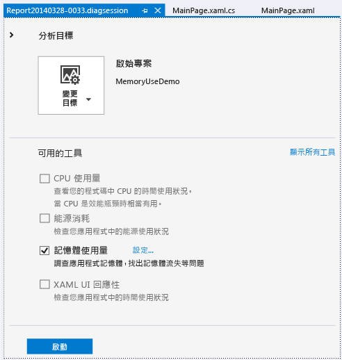
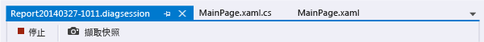
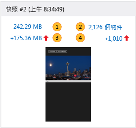
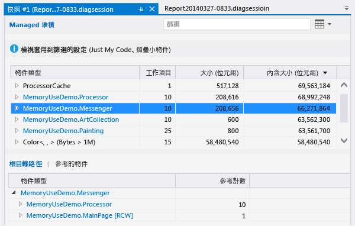
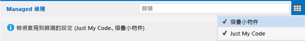
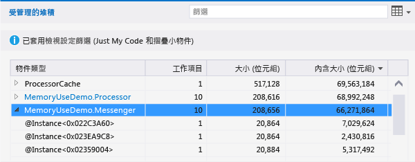
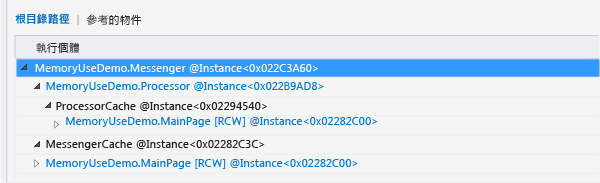
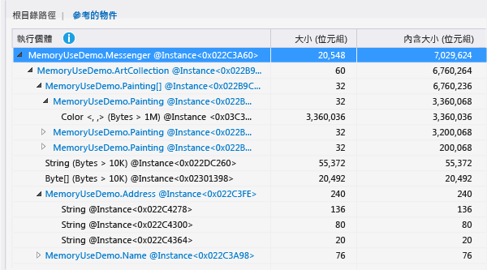
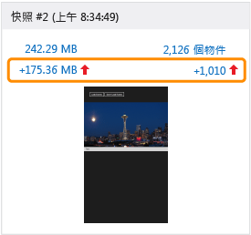

# 記憶體使用量 (不使用偵錯工具)
您可以使用「記憶體使用量」工具 (不偵錯) 來執行下列動作  
  
-   在開發案例時，就在 Visual Studio 中監控應用程式的記憶體使用量。  
  
-   建立應用程式記憶體狀態的詳細快照。  
  
-   比較快照，以找出記憶體問題的根本原因。  
  
 本主題說明如何使用記憶體使用量工具，分析 Windows 通用 XAML 應用程式。 如果您想要對使用 JavaScript 和 HTML 的 Windows 通用應用程式分析記憶體使用情況，請參閱[分析記憶體使用量 (JavaScript)](http://msdn.microsoft.com/library/windows/apps/jj819176.aspx)。  
  
##  啟動記憶體使用量診斷工作階段  
  
1.  在 Visual Studio 中開啟 C# 通用 Windows 專案。  
  
2.  在功能表列上，依序選擇 [偵錯] / [效能分析工具...]。  
  
3.  選取 [記憶體使用量]，然後選擇頁面底部的 [啟動] 按鈕。  
  
       
  
##  監控記憶體使用量  
 您可以使用 [記憶體使用量] 工具產生詳細報表，用來尋找和修正問題，也可以用來研究您正在積極開發之案例的即時記憶體效果。  
  
 當您開始診斷工作階段時，您的應用程式會啟動，且 [診斷工具] 視窗會顯示應用程式記憶體使用量的時間軸圖形。  
  
   
  
 時間軸圖形會顯示應用程式在執行時，在記憶體內的波動情況。 圖形中的高峰通常表示一些程式碼正在收集或建立資料，然後在處理完成時將它捨棄。 大型的高峰表示您可能可以最佳化的區域。 更值得關注的是未傳回的記憶體耗用提高，因為它可能表示記憶體使用效率低落，或甚至是記憶體流失。  
  
###  關閉監控工作階段  
   
  
 若要停止監控工作階段而不建立報表，只需關閉診斷視窗。 若要在擷取記憶體快照時產生報表，請選擇 [停止]。  
  
##  擷取應用程式記憶體狀態的快照  
 如果您發現想要調查的記憶體問題，可以在診斷工作階段期間擷取快照，在特定時刻擷取記憶體內的物件。 由於應用程式使用大量且許多類型的物件，您可能會想專注分析單一案例。 在記憶體問題出現之前先取得基準快照、第一次出現問題之後擷取另一張快照，並且如果您能重複案例便再額外擷取一或多張快照，也是不錯的做法。  
  
 若要收集快照，請開始新的診斷工作階段。 想要擷取記憶體資料時，選擇 [擷取快照]。 若要產生報表，請選擇 [停止]。  
  
##  記憶體使用量概觀頁面  
 停止資料收集之後，[記憶體使用量] 工具會停止應用程式，並顯示概觀報表。  
  
   
  
###  記憶體使用量快照檢視  
 使用快照檢視可以在新的 Visual Studio 視窗中開啟詳細報表。 有兩種快照檢視：  
  
-   [快照詳細資料報表](../profiling/memory-usage-without-debugging2.md#BKMK_Snapshot_details_reports)會顯示一張快照中的類型和執行個體。  
  
-   [快照差異 (diff) 報表](../profiling/memory-usage-without-debugging2.md#BKMK_Snapshot_difference__diff__reports)會比較兩張快照中的類型和執行個體。  
  
   
  
 在快照檢視的圖片中，有編號的項目是開啟 [記憶體使用量] 報表檢視的連結。  
  
|||  
|-|-|  
||連結文字顯示在擷取快照時，記憶體中的總位元組數。   選擇這個連結可以顯示快照詳細資料報表，此報表依類型執行個體的大小總計進行排序。|  
||連結文字顯示擷取快照時記憶體中的總物件數。   選擇這個連結可以顯示快照詳細資料報表，此報表依類型執行個體的計數進行排序。|  
||連結文字顯示此快照時的記憶體中物件大小總計與上一個快照大小總計之間的差異。   此快照的記憶體大小大於與上一個快照時，連結文字是正數，大小較小時則為負數。 連結文字 [基準] 表示這個是診斷工作階段中的第一個快照。[無差異] 表示差異是零。   選擇這個連結可以顯示快照差異報表，此報表依類型執行個體的大小總計差異進行排序。|  
||連結文字顯示此快照中的記憶體物件總數與上一個快照物件數之間的差異。   選擇這個連結可以顯示快照差異報表，此報表依類型執行個體的總計數差異進行排序。|  
  
##  快照報表  
   
  
###  快照報表樹狀目錄  
  
####  Managed 堆積  
 Managed 堆積樹狀目錄 [Managed 堆積樹狀目錄 (快照詳細資料)](../profiling/memory-usage-without-debugging2.md#BKMK_Managed_Heap_tree__Snapshot_details_) 和 [Managed 堆積樹狀目錄 (快照差異)](../profiling/memory-usage-without-debugging2.md#BKMK_Managed_Heap_tree__Snapshot_diff_) 會在報表中顯示類型和執行個體。 選取類型或執行個體會顯示選取項目的 [根的路徑] 和 [參考的物件] 樹狀目錄。  
  
####  根的路徑  
 [根的路徑樹狀目錄 (快照詳細資料)](../profiling/memory-usage-without-debugging2.md#BKMK_Paths_to_Root_tree__Snapshot_details_) 和[根的路徑樹狀目錄 (快照差異)](../profiling/memory-usage-without-debugging2.md#BKMK_Paths_to_Root_tree__Snapshot_diff_) 會顯示參考類型或執行個體的物件鏈結。 .NET Framework 記憶體回收行程只會在對物件的所有參考都已釋放時才清除物件的記憶體。  
  
####  參考的物件  
 [參考的物件樹狀目錄 (快照詳細資料)](../profiling/memory-usage-without-debugging2.md#BKMK_Referenced_Objects_tree__Snapshot_details_) 和[參考的物件樹狀目錄 (快照差異)](../profiling/memory-usage-without-debugging2.md#BKMK_Referenced_Objects_tree__Snapshot_diff_) 會顯示選取類型或執行個體所參考的物件。  
  
###  物件類型和執行個體欄位  
 當 [物件類型] 項目有子項目時，您可以選擇箭頭圖示來顯示它們。 如果 [物件類型] 文字的顏色是藍色，則可加以選擇，巡覽到其原始程式碼檔案中的物件。 原始程式檔會在個別的視窗中開啟。  
  
 執行個體名稱是由 [記憶體使用量] 工作所產生的唯一識別碼。  
  
 如果您注意到有不容易識別的類型，或您不知道該類型和您的程式碼有何關聯，其可能是 [記憶體使用量] 工具所顯示來自 .NET Framework、作業系統或編譯器的物件，因為它與您物件的所有權鏈結有關。  
  
###  報表樹狀目錄篩選條件  
 大多數應用程式包含的類型數量大得驚人，應用程式開發人員對其中大部分都沒什麼興趣。 [記憶體使用量] 工具定義兩個篩選條件，您可以用來隱藏 [Managed 堆積] 和 [根的路徑] 樹狀目錄中的大部分類型。 您也可以根據類型名稱來篩選樹狀目錄。  
  
   
  
####  篩選條件  
 在 [篩選條件] 方塊中輸入字串，將樹狀目錄顯示限制在包含指定文字的類型。 篩選條件不會區分大小寫，且它會辨識類型名稱任何部分中的指定字串。  
  
####  摺疊小物件  
 套用此篩選條件時，[大小 (位元組)] 小於快照記憶體大小總計 0.5% 的類型，會在 [Managed 堆積] 清單中隱藏。  
  
####   Just My Code  
 [Just My Code] 篩選條件會隱藏由外部程式碼所產生的大多數執行個體。 外部類型是由作業系統或 Framework 元件所擁有，或者由編輯器產生。  
  
##  快照詳細資料報表  
 您可以使用快照詳細資料報表，專注在診斷工作階段的一張快照。 若要開啟詳細資料報表，請選擇快照檢視中的其中一個連結，如下圖所示。 這兩個連結都會開啟相同報表。唯一的差別在於報表中 [Managed 堆積] 樹狀目錄的起始排序次序。 在兩種情況下，您都能在報表開啟之後變更排序順序。  
  
   
  
-   [MB] 連結會依據 [內含大小 (位元組)] 欄來排序報表。  
  
-   [物件] 連結會依據 [計數] 欄來排序報表。  
  
###  Managed 堆積樹狀目錄 (快照詳細資料)  
 [Managed 堆積] 樹狀目錄會列出保留在記憶體中的物件類型。 您可以展開類型名稱，檢視依大小排序的前十大類型執行個體。 選取類型或執行個體會顯示選取項目的 [根的路徑] 和 [參考的物件] 樹狀目錄。  
  
   
  
|||  
|-|-|  
|**物件類型**|類型或物件執行個體的名稱。|  
|**計數**|類型的物件執行個體數目。 一個執行個體的數目一律為 1。|  
|**大小 (位元組)**|對於類型，此為記憶體快照中，類型的所有執行個體大小，但排除執行個體中包含的物件大小。   對於執行個體、類型，此為物件的大小，但排除執行個體中包含的物件大小。 執行個體。|  
|**內含大小 (位元組)**|類型執行個體的大小，或是單一執行個體的大小，且包括所包含物件的大小。|  
  
###  根的路徑樹狀目錄 (快照詳細資料)  
 [根的路徑] 樹狀目錄顯示參考類型或執行個體的物件鏈結。 .NET Framework 記憶體回收行程只會在對物件的所有參考都已釋放時才清除物件的記憶體。  
  
   
  
 當您在 [根的路徑] 樹狀目錄檢閱類型時，會在 [參考計數] 欄顯示保有該類型參考的類型物件數目。 當您分析執行個體時不會顯示該欄。  
  
###  參考的物件樹狀目錄 (快照詳細資料)  
 [參考的物件] 樹狀目錄顯示所選取類型或執行個體參考的物件。  
  
   
  
|||  
|-|-|  
|**物件類型 / 執行個體**|類型或物件執行個體的名稱。|  
|**大小 (位元組)**|對於類型，此為類型的所有執行個體大小，但排除類型中包含的物件大小。   對於執行個體，此為物件的大小，但排除物件中包含的物件大小。|  
|**內含大小 (位元組)**|類型執行個體的大小總計，或是執行個體的大小，且包括所包含物件的大小。|  
  
##  快照差異 (diff) 報表  
 快照差異 (diff) 報表會顯示主要快照與在它之間立即擷取的快照之間的變更。 若要開啟差異報表，請選擇快照檢視中的其中一個連結，如下圖所示。 這兩個連結都會開啟相同報表。唯一的差別在於報表中 [Managed 堆積] 樹狀目錄的起始排序次序。 您可以在報表開啟之後變更排序順序。  
  
   
  
-   [MB] 連結會依據 [內含大小 (位元組)] 欄來排序報表。  
  
-   [物件] 連結會依據 [計數] 欄來排序報表。  
  
###  Managed 堆積樹狀目錄 (快照差異)  
 [Managed 堆積] 樹狀目錄會列出保留在記憶體中的物件類型。 您可以展開類型名稱，檢視依大小排序的前十大類型執行個體。 選取類型或執行個體會顯示選取項目的 [根的路徑] 和 [參考的物件] 樹狀目錄。  
  
   
  
 請注意，圖片中已摺疊 [計數]、[大小 (位元組)] 和 [內含大小 (位元組)] 欄。  
  
|||  
|-|-|  
|**物件類型**|類型或物件執行個體的名稱。|  
|**計數**|主要快照中類型的執行個體數目。 一個執行個體的 [計數] 一律為 1。|  
|**計數差異**|對於類型，此為主要快照和上一個快照中的類型執行個體數目差異。 執行個體的欄位空白。|  
|**大小 (位元組)**|主要快照中的物件大小，但排除物件中包含的物件大小。 對於類型，[大小 (位元組)] 和 [內含大小 (位元組)] 是類型執行個體的大小總計。|  
|**總大小差異 (位元組)**|對於類型，此為主要快照與上一個快照之間，類型的執行個體大小總計，但排除執行個體中包含的物件大小。 執行個體的欄位空白。|  
|**內含大小 (位元組)**|主要快照中的物件大小，包括物件中包含的物件大小。|  
|**內含大小差異 (位元組)**|對於類型，此為主要快照與上一個快照之間，類型的所有執行個體大小差異，包括物件中包含的物件大小。 執行個體的欄位空白。|  
  
###  根的路徑樹狀目錄 (快照差異)  
 [根的路徑] 樹狀目錄顯示參考類型或執行個體的物件鏈結。 .NET Framework 記憶體回收行程只會在對物件的所有參考都已釋放時才清除物件的記憶體。  
  
   
  
###  參考的物件樹狀目錄 (快照差異)  
 [參考的物件] 樹狀目錄顯示主要類型或執行個體參考的物件。  
  
   
  
|||  
|-|-|  
|**物件類型 / 執行個體**|類型或物件執行個體的名稱。|  
|**大小 (位元組)**|對於執行個體，此為主要快照中的物件大小，但排除執行個體中包含的物件大小。   對於類型，此為主要快照中，類型的執行個體大小總計，但排除執行個體中包含的物件大小。|  
|**內含大小 (位元組)**|主要快照中的物件大小，包括物件中包含的物件大小。|  
  
## 另請參閱  
 [JavaScript 記憶體](../profiling/javascript-memory.md)
 [程式碼剖析工具](../profiling/profiling-tools.md)
 [使用 C++、C# 及 Visual Basic 的 Windows 市集應用程式的效能最佳做法](http://msdn.microsoft.com/library/windows/apps/hh750313.aspx)   
 [使用 Visual Studio 中的新記憶體使用量工具來診斷記憶體問題](http://go.microsoft.com/fwlink/p/?LinkId=394706)
