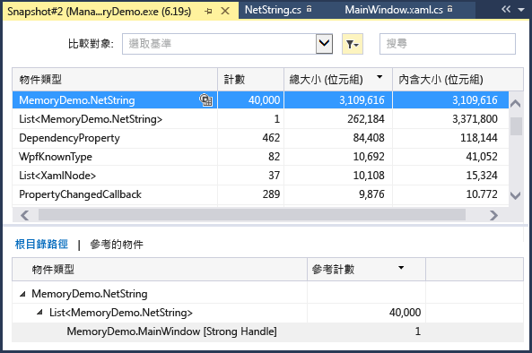
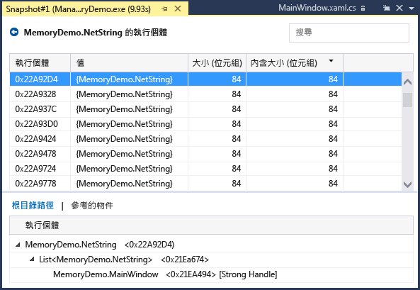
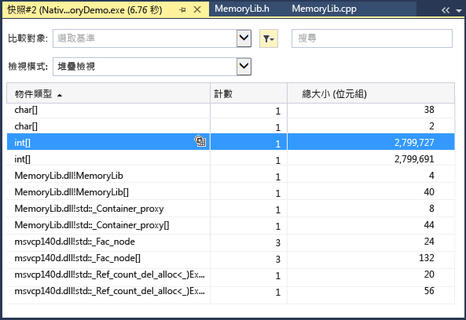
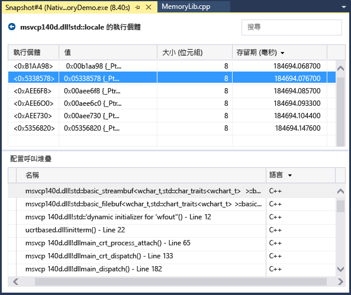
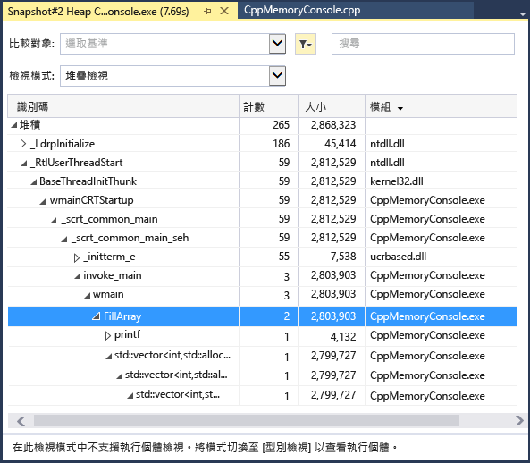

# 分析記憶體使用量
當您進行偵錯時，您可以使用與偵錯工具整合的 [記憶體使用量] 診斷工具，來找出記憶體遺漏和記憶體使用沒有效率等問題。 記憶體使用量工具可讓您擷取 Managed 和原生記憶體堆積的一個或多個 *「快照」* (Snapshot)。 您可以收集 .NET、原生或混合模式 (.NET 和原生) 應用程式的快照。  
  
-   您可以分析一份快照，了解物件類型對於記憶體使用的相對影響，並找出應用程式中無效率使用記憶體的程式碼。  
  
-   您也可以比較 (差異比對) 應用程式的兩個快照，找出造成記憶體使用量隨著時間逐漸增加的程式碼部分。  
  
 下圖顯示 [診斷工具] 視窗 (於 Visual Studio 2015 Update 1 及更新版本中提供)：  
  
   
  
 除了可以在 **記憶體使用量** 工具中收集任何時間的記憶體快照之外，您還可以使用 Visual Studio 偵錯工具，來控制調查效能問題時要如何執行應用程式。 設定中斷點、逐步偵錯、全部中斷和其他偵錯工具動作，都可以協助您將效能調查工作集中在最相關的程式碼路徑上。 在應用程式執行時進行那些動作，可排除您不感興趣之程式碼的干擾，並可大幅縮短診斷問題所需的時間。  
  
 您也可以在偵錯工具外部使用記憶體工具。 請參閱 [Memory Usage without Debugging](../profiling/memory-usage-without-debugging2.md)。  
  
> [!NOTE]
>  **自訂配置器支援** 原生記憶體分析工具的運作方式是收集在執行階段所發出的配置 [ETW](https://msdn.microsoft.com/en-us/library/windows/desktop/bb968803\(v=vs.85\).aspx) 事件資料。  在來源層級已註釋 CRT 和 Windows SDK 中的配置器，以便擷取其配置資料。  如果您正在撰寫自己的配置器，則針對任何將指標傳回最新配置之堆積記憶體的函式，都可以使用 [__declspec](/cpp/cpp/declspec)(allocator) 來裝飾，如本範例中針對 myMalloc 所示：  
>   
>  `__declspec(allocator) void* myMalloc(size_t size)` 

## 收集記憶體使用量資料

1.  開啟您想要在 Visual Studio 中偵錯的專案，並於應用程式中要開始檢查記憶體使用量的位置設定中斷點。

    如果您懷疑某個區域具有記憶體問題，請在記憶體問題發生之前設定第一個中斷點。

    > [!TIP]
    >  由於當應用程式頻繁地配置和解除配置記憶體時，擷取您感興趣之作業的記憶體設定檔可能會是項挑戰，因此請在作業開始和結束處 (或是逐項順著作業) 設定中斷點，以找出記憶體變更的實際點。 

2.  在您想要分析的函式或程式碼區域結尾 (或是在可能的記憶體問題發生之後) 設定第二個中斷點。
  
3.  [偵錯工具]  視窗會自動出現，除非您將其關閉。 如需再次顯示視窗，請按一下 [偵錯] / [視窗] / [顯示診斷工具]。

4.  以工具列上的 [選取工具] 設定選擇 [記憶體使用量]。

     

5.  按一下 [偵錯/開始偵錯]\(或工具列上的 [開始] 或 **F5**)。

     當應用程式完成載入時，會出現 [Diagnostics Tools (診斷工具)] 的 [Summary (摘要)] 檢視。

     

     > [!NOTE]
     >  由於收集記憶體資料可能會影響原生或混合模式應用程式的偵錯效能，因此預設會停用記憶體快照。 若要在原生或混合模式應用程式中啟用快照，請啟動偵錯工作階段 (快速鍵：**F5**)。 在顯示 [診斷工具] 視窗時，選擇 [記憶體使用量] 索引標籤，然後選擇 [堆積程式碼剖析]。  
     >   
     >    
     >   
     >  停止 (快速鍵： **Shift + F5**) 並重新啟動偵錯。  

6.  若要在偵錯工作階段開始時擷取快照，請選擇 [記憶體使用量] 摘要工具列上的 [擷取快照]。 (在此設定中斷點也可能會有幫助)。

     
     
     > [!TIP]
     >  若要建立記憶體的比較基準，請考慮擷取偵錯工作階段開始時的快照。  

6.  執行會叫用您的第一個中斷點的案例。

7.  當偵錯工具於第一個中斷點暫停時，選擇 [記憶體使用量] 摘要工具列上的 [擷取快照]。  

8.  按 F5 使應用程式執行至第二個中斷點。

9.  現在請擷取另一個快照。

     此時，您可以開始分析資料。    
  
## 分析記憶體使用量資料
[記憶體使用量] 摘要表的資料列會列出您在偵錯工作階段期間擷取的快照，並提供更詳細檢視的連結。

 每個資料行的名稱則取決於您在專案屬性中選擇的偵錯模式：.NET、原生或混合 (.NET 和原生)。  
  
-   [物件 (差異)] 和 [配置數 (差異)] 資料行顯示擷取快照時 .NET 和原生記憶體中的物件數目。  
  
-   [堆積大小 (差異)] 資料行顯示 .NET 和原生堆積中的位元組數目 

當您擷取多個快照之後，摘要表的資料格會包含資料列快照與上一個快照之間的值變更。  

若要分析記憶體使用量，請按一下其中一個可以開啟記憶體使用量詳細報表的連結：  

-   若要檢視目前快照與先前快照之間差異的詳細資料，請選擇箭號左側的變更連結 ()。 紅色箭號表示記憶體使用量增加，綠色箭號表示減少。

    > [!TIP]
    >  為了協助使用者更快速地識別記憶體問題，差異報表會以整體數目增加最多 (按一下 [物件 (差異)] 資料行中的變更連結)，或整體堆積大小增加最多 (按一下 [堆積大小 (差異)] 資料行中的變更連結) 的物件類型來分類。

-   若只要檢視所選快照的詳細資料，請按一下未變更連結。 
  
 報表會在個別的視窗中顯示。   
  
### Managed 類型報表  
 選擇 [記憶體使用量] 摘要表中 [物件 (差異)] 或 [配置數 (差異)] 資料格的目前連結。  
  
   
  
 上方窗格顯示快照中所有類型的計數和大小，包括類型參考之所有物件的大小 ([內含大小])。  
  
 下方窗格中的 [根的路徑]  樹狀結構顯示參考在上方窗格中選取之類型的物件。 您必須釋放參考物件的最後一個類型，.NET Framework 記憶體回收行程才會清除該物件的記憶體。  
  
 [參考的類型]  樹狀結構顯示在上方窗格中選取之類型所持有的參考。  
  
   
  
 若要在上方窗格中顯示所選取類型的執行個體，請選擇  圖示。  
  
   
  
 [執行個體]  檢視顯示在上方窗格的快照中選取之物件的執行個體。 [根的路徑] 和 [參考的物件] 窗格顯示參考所選執行個體的物件，以及所選執行個體參考的類型。 當偵錯工具在擷取快照的位置停止時，您可以將滑鼠停留在 [值] 資料格，以在工具提示中顯示物件的值。  
  
### 原生類型報表  
 在 [診斷工具] 視窗的 [記憶體使用量] 摘要表中，選擇 [配置數 (差異)] 或 [堆積大小 (差異)] 資料格的目前連結。  
  
   
  
 [類型檢視]  顯示快照中所有類型的數目和大小。  
  
-   選擇所選取類型的執行個體圖示 (![[物件類型] 欄中的執行個體圖示](~/profiling/media/dbg_mma_instancesicon.png "DBG_MMA_InstancesIcon"))，以顯示快照中所選取類型的物件相關資訊。  
  
     [執行個體]  檢視顯示所選類型的每個執行個體。 選取執行個體會顯示在 [配置呼叫堆疊]  窗格中建立執行個體時所產生的呼叫堆疊。  
  
       
  
-   在 [檢視模式]  清單中選擇 [堆疊檢視]  ，以查看所選類型的配置堆疊。  
  
       
  
### 變更 (差異比對) 報表  
  
-   在 [診斷工具]  視窗中，選擇 [記憶體使用量]  索引標籤摘要表資料格中的變更連結。  
  
       
  
-   在 Managed 或原生報表的 [比較]  清單中，選擇一個快照。  
  
     ![從 [比較] 清單中選擇快照](~/profiling/media/dbgdiag_mem_choosecompareto.png "DBGDIAG_MEM_ChooseCompareTo")  
  
 變更報表會將顯示基礎快照值與比較快照之間有差異的資料行 (標記為 [(差異比對)] )，加入基礎報表。 以下是原生類型檢視差異比對報表可能的樣子：  
  
   
  
## 部落格和影片  
 [Visual Studio 2015 中的診斷工具偵錯工具視窗](http://blogs.msdn.com/b/visualstudioalm/archive/2015/01/16/diagnostic-tools-debugger-window-in-visual-studio-2015.aspx)  
  
 [部落格：在 Visual Studio 2015 偵錯時的記憶體使用量工具](http://blogs.msdn.com/b/visualstudioalm/archive/2014/11/13/memory-usage-tool-while-debugging-in-visual-studio-2015.aspx)  
  
 [Visual C++ 部落格：VS2015 Preview 中的原生記憶體診斷](http://blogs.msdn.com/b/vcblog/archive/2014/11/21/native-memory-diagnostics-in-vs2015-preview.aspx)  
  
 [Visual C++ 部落格：Visual Studio 2015 CTP 的原生記憶體診斷工具](http://blogs.msdn.com/b/vcblog/archive/2014/06/04/native-memory-diagnostic-tools-for-visual-studio-14-ctp1.aspx)
