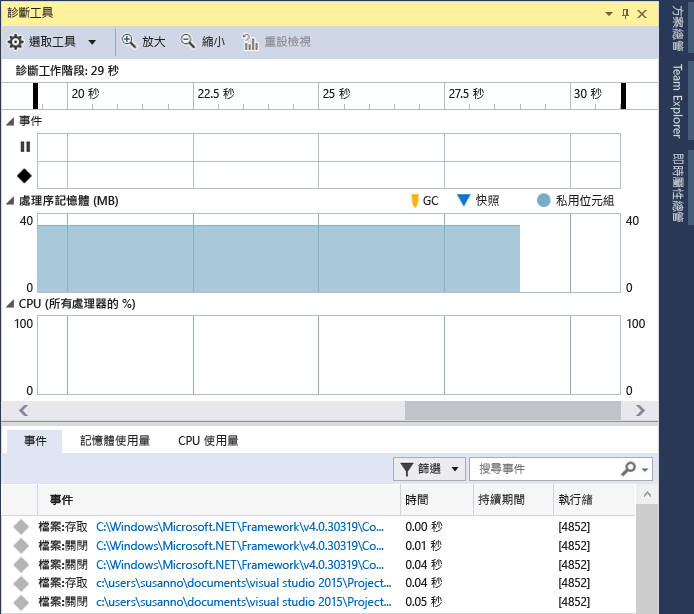

# 使用或不使用偵錯工具來執行程式碼剖析工具
Visual Studio 現在提供各種效能工具選擇，其中有些效能工具無論是否含偵錯工具皆可執行 (例如：[CPU 使用量] 和 [記憶體使用量])。 非偵錯工具效能工具適用於針對「版本」設定執行，而偵錯工具整合工具適用於針對「偵錯」設定執行。  
  
## 不論有無偵錯工具，我都應該執行此工具嗎？  
 偵錯工具整合的效能工具，可讓您執行很多非偵錯工具無法達成的工作，例如設定中斷點和檢查變數值。 非偵錯工具提供更貼近使用者眼中所見的已發行應用程式體驗。  
  
 以下是可協助您決定何種工具最適合您的一些問題：  
  
1.  在開發中或已發行的應用程式中，是否存在問題？  
  
     若在開發期間發現您正在處理的問題，則您可能無須在「版本」組建中執行效能工具。 若在「發行」版本中發現問題，則應使用「版本」設定重新產生問題，然後判斷偵錯工具是否能協助進行深入檢查。  
  
2.  問題是否因 CPU 密集運算處理所致？  
  
     許多問題的根源皆是來自外部效能問題，例如檔案 I/O 或網路回應性，因此無論執行的效能工具是否含偵錯工具，皆不會有太大差異。 若問題是因 CPU 大量密集呼叫所致，則可能需要考量「版本」與「偵錯」設定，而您在使用偵錯工具整合工具前，可能必須檢查「版本」組建是否存在問題  
  
3.  您是否需要精確的量測效能或可接受約略數字？  
  
     偵錯組建缺少「版本」組建提供的某些最佳化功能，例如內嵌函式呼叫和常數、清除未用的程式碼路徑，以及無法採用偵錯工具所用的方式來儲存變數。 偵錯工具本身由於需要執行特定作業進行偵錯 (例如攔截例外和模組載入事件)，因此效能時有差異。 基於以上原因，偵錯工具整合工具的效能數字表現精確度範圍僅為數十毫秒。 具非偵錯工具的「版本」設定其效能數字會更加精確。  
  
##  偵錯時收集程式碼剖析資料  
 下列章節說明本機偵錯。 您可以在稍後的各節裡，了解在裝置上偵錯或遠端偵錯。  
  
1.  開啟您想要偵錯的專案，然後按一下[偵錯/開始偵錯]\ (或工具列上的 [開始]  或 **F5**)。  
  
2.  [偵錯工具]  視窗會自動出現，除非您將其關閉。 如需再次顯示視窗，請按一下 [偵錯] / [視窗] / [顯示診斷工具]。  
  
3.  執行您要收集資料的案例。  
  
     在執行工作階段時，您可以看到事件、程序記憶體和 CPU 使用量的相關資訊。  
  
     下圖顯示 Visual Studio 2015 Update 1 中的 [診斷工具]  視窗：  
  
       
  
4.  您可以透過工具列上的 [選取工具] 設定來選擇要查看 [記憶體使用量] 或 [CPU 使用量] (或兩者)。 若正在執行 Visual Studio Enterprise，您可以在 [工具] / [選項] / [IntelliTrace] 中啟用或停用 IntelliTrace。  
  
5.  在您停止偵錯時，診斷工作階段就會結束。  
  
 在 Visual Studio 2015 Update 1 中，[診斷工具]  視窗可讓您更輕鬆地專注於感興趣的事件。   事件名稱現在會與分類前置詞 (軌跡、程式輸出、中斷點、檔案等等) 一起顯示，讓您能夠快速掃視指定分類的清單，或略過不在意的分類。  
  
 這個視窗現在會有一個搜尋方塊，讓您可以找到事件清單中任何位置的特定字串。 例如，下圖顯示搜尋字串 "install" 的結果，其符合四個事件：  
  
   
  
 您也可以在視窗中篩選事件，來進行檢視或隱藏。 在 [篩選]  下拉式清單中，您可以核取或取消核取特定類別的事件。 類別名稱與前置詞名稱相同。  
  
   
  
 如需詳細資訊，請參閱 [搜尋和篩選診斷工具視窗的事件索引標籤](http://blogs.msdn.com/b/visualstudioalm/archive/2015/11/12/searching-and-filtering-the-events-tab-of-the-diagnostic-tools-window.aspx)。  
  
## 收集程式碼剖析資料但不偵錯  
 某些程式碼剖析工具需要系統管理員權限才能執行。 您可以系統管理員身分啟動 Visual Studio，或是選擇在開始診斷工作階段時，以系統管理員身分執行這些工具。  
  
1.  在 Visual Studio 中開啟專案。  
  
2.  在 [偵錯] 功能表上選擇 [效能分析工具...]\(快速鍵：Alt + F2).  
  
3.  在診斷啟動頁面上，選擇要在工作階段中執行的一項或多項工具。 只有適用於該專案類型、作業系統與程式設計語言的工具才會顯示。 當您選擇一項診斷工具時，將會停用無法在相同診斷工作階段中執行的工具選項。 以下是 C# Windows 通用應用程式中可能會有的選項：  
  
       
  
4.  若要開始診斷工作階段，請按一下 [開始]。  
  
5.  執行您要為其收集資料的情節。  
  
     執行工作階段期間，某些工具在診斷工具啟動頁面上會顯示即時資料圖表。  
  
     ![在 [效能及診斷] 頁面上收集資料](../profiling/media/pdhub_collectdata.png "PDHUB_CollectData")  
  
6.  若要結束診斷工作階段，請按一下 [停止收集]。  
  
 當您停止收集診斷工作階段中的資料時，系統會分析資料並在 [診斷] 頁面中顯示報告。  
  
 此外，您也可以從診斷工具啟動頁面的最近開啟清單中，開啟已儲存的 .diagnostic 工作階段檔案。  
  
   
  
## 程式碼剖析報表  
   
  
|||  
|-|-|  
||時間軸會顯示程式碼剖析工作階段的長度、應用程式週期啟用事件，以及使用者標記。|  
||您可以拖曳藍色巡覽列，選取時間軸的區域，將報告限制在時間軸的一部分。|  
||這項工具會顯示一個或多個主要圖表。 如果您的診斷工作階段是使用多項工具所建立，則會顯示所有主要圖表。|  
||您可以摺疊和展開個別圖表。|  
||當您的資料包含來自多項工具的資訊時，該工具的詳細資料會收集在索引標籤之下。|  
||這項工具可以有一個或多個詳細資料檢視。 檢視會經過特定時間軸區域篩選。|  
  
## 將另一部裝置設定為分析目標  
 除了從 Visual Studio 專案啟動您的應用程式之外，您也可以在替代目標上執行診斷工作階段。 例如，您可能想要在從 Windows 市集安裝的應用程式版本上診斷效能問題。  
  
   
  
 您可以啟動裝置上已安裝的應用程式，也可以將診斷工具附加至已在執行中的某些應用程式。 當您選擇 [執行中的應用程式] 或 [已安裝的應用程式] 時，您可以從指定的部署目標上探索到的應用程式清單中選取應用程式。  
  
   
  
 選擇 [Internet Explorer] 時，您可以指定 URL 以及變更手機部署目標。  
  
   
  
## Remote Debugging  
 在遠端電腦或平板電腦上執行診斷工作階段需要安裝 Visual Studio 遠端工具，並使其於遠端目標上執行。 若為傳統型應用程式，請參閱[遠端偵錯](../debugger/remote-debugging.md)。  若為 Windows 通用應用程式，請參閱[在遠端電腦上執行 Windows 市集應用程式](../debugger/run-windows-store-apps-on-a-remote-machine.md).  
  
## 診斷開發小組的部落格文章和 MSDN 文章  
 [MSDN Magazine：在 Visual Studio 2015 偵錯同時分析效能 (英文)](https://msdn.microsoft.com/en-us/magazine/dn973013.aspx)  
  
 [MSDN Magazine：使用 IntelliTrace 更快速地診斷問題 (英文)](https://msdn.microsoft.com/en-us/magazine/dn973014.aspx)  
  
 [部落格文章：在 Visual Studio 2015 中使用記憶體使用量工具診斷事件處理常式流失 (英文)](http://blogs.msdn.com/b/visualstudioalm/archive/2015/04/29/diagnosing-event-handler-leaks-with-the-memory-usage-tool-in-visual-studio-2015.aspx)  
  
 [影片：Microsoft Visual Studio Ultimate 2015 中的 IntelliTrace 歷程偵錯 (英文)](https://channel9.msdn.com/Events/Ignite/2015/BRK3716)  
  
 [影片：使用 Visual Studio 2015 對效能問題偵錯 (英文)](https://channel9.msdn.com/Events/Build/2015/3-731)  
  
 [效能提示：使用 Visual Studio 偵錯，效能資訊一目了然 (英文)](http://blogs.msdn.com/b/visualstudioalm/archive/2014/08/18/perftips-performance-information-at-a-glance-while-debugging-with-visual-studio.aspx)  
  
 [Visual Studio 2015 中的診斷工具偵錯工具視窗 (英文)](http://blogs.msdn.com/b/visualstudioalm/archive/2015/01/16/diagnostic-tools-debugger-window-in-visual-studio-2015.aspx)  
  
 [Visual Studio Enterprise 2015 中的 IntelliTrace (英文)](http://blogs.msdn.com/b/visualstudioalm/archive/2015/01/16/intellitrace-in-visual-studio-ultimate-2015.aspx)
