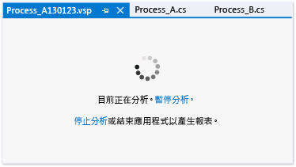

# 設定一般效能工作階段選項
[!INCLUDE[vs2017banner](../code-quality/includes/vs2017banner.md)]

您可以在 [!INCLUDE[vsprvs](../code-quality/includes/vsprvs_md.md)] 程式碼剖析工具效能工作階段之屬性對話方塊的 \[**一般**\] 頁面上，設定效能工作階段的收集方法和程式碼剖析資料命名慣例。  若要從 \[**效能總管**\] 開啟此對話方塊，請以滑鼠右鍵按一下該效能工作階段，然後按一下 \[**屬性**\]。  
  
 **需求**  
  
-   [!INCLUDE[vsUltLong](../code-quality/includes/vsultlong_md.md)], [!INCLUDE[vsPreLong](../code-quality/includes/vsprelong_md.md)], [!INCLUDE[vsPro](../code-quality/includes/vspro_md.md)]  
  
## 選擇資料收集方法  
 您可以在 \[**程式碼剖析集合**\] 下選取其中一個選項來設定基礎收集方法。  下表說明這些選項：  
  
|||  
|-|-|  
|**取樣**：  取樣方法會依照固定的時間間隔收集程式碼剖析資訊。  此方法對於尋找處理器使用率問題很有用，建議於開始調查大部分效能問題時使用。|-   [使用取樣收集效能統計資料](../profiling/collecting-performance-statistics-by-using-sampling.md)|  
|**檢測**：  檢測方法會插入模組程式碼剖析程式碼中，並且記錄執行程式碼剖析期間模組中函式的每一次進入、結束及函式呼叫。  此方法適用於收集程式碼區段的詳細執行時間資訊，以及用於了解輸入及輸出作業對應用程式效能的影響。|-   [使用檢測收集計時詳細資料](../profiling/collecting-detailed-timing-data-by-using-instrumentation.md)|  
|**並行**：  並行方法會收集每一個阻止程式碼執行事件的資料，例如執行緒等待解除鎖定應用程式資源的存取權時。  此方法適用於分析多執行緒應用程式。|-   [收集執行緒和處理序並行資料](../profiling/collecting-thread-and-process-concurrency-data.md)|  
  
 您可以使用取樣或檢測方法收集 .NET 記憶體資料。  在 \[**.NET 記憶體程式碼剖析**\] 下方選取資料型別。  
  
|||  
|-|-|  
|**收集 .NET 物件配置資訊**：  根據預設，資料包括已配置物件的數目和大小。  選取或清除此核取方塊，即可啟用或停用 .NET 記憶體資料收集。   **同時收集 .NET 物件存留期的資訊**：  選取此核取方塊可包含用來還原記憶體物件的記憶體回收世代的相關資料。|-   [收集 .NET 記憶體配置和存留期資料](../profiling/collecting-dotnet-memory-allocation-and-lifetime-data.md)|  
  
 在您開始剖析應用程式會出現程式碼剖析工作階段頁面，您可以在此暫停、重新啟動及停止分析。  
  
   
  
## 設定程式碼剖析資料檔案選項  
  
|||  
|-|-|  
|**報告**：  根據預設，程式碼剖析資料 \(.vsp\) 檔案會以程式碼剖析的應用程式命名，並且位於方案或專案資料夾中。  此外，名稱後面會附加一個日期字串，且名稱重複的資料檔案會加上一個遞增的數字。  您可以變更這些選項。|-   [如何：設定程式碼剖析資料檔案名稱選項](../profiling/how-to-set-performance-data-file-name-options.md)|