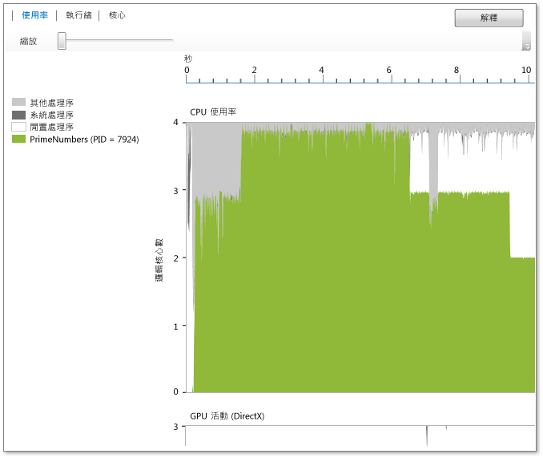

# 使用率檢視
[!INCLUDE[vs2017banner](../code-quality/includes/vs2017banner.md)]

利用**使用率檢視** 顯示目前處理序所使用的 CPU、GPU 和其他系統資源的資訊。  這個檢視會按照分析過的處理序、閒置處理序、系統處理序以及其他在系統上執行的處理序，顯示隨著時間變化的平均核心使用率。  但是無法明確指出任何指定時刻上的特定使用中核心。  例如，如果兩個核心各以 50% 的容量在一段指定的時間內執行，這個檢視則只會顯示一個邏輯核心在使用中。  這個檢視的產生方式是將程式碼剖析時間分成一些較短的時間區段。  圖形會針對每個區段繪製該段期間，在邏輯核心上執行的處理序執行緒平均數目。  
  
   
  
 圖形會顯示目標處理序、閒置處理序或系統處理序所使用的時間 \(X 軸\) 和平均邏輯核心。\(閒置處理序顯示閒置核心。  系統處理序是 Windows 中可以代表其他處理序執行工作的處理序。其餘在系統上執行的處理序則代表任何其餘核心的使用率。  
  
 邏輯核心的數目會顯示在 Y 軸上。  Windows 作業系統會將硬體中的同步多執行緒支援 \(例如，超執行緒\) 視為邏輯核心。  因此，具有四核心處理器而且每個核心可支援兩個硬體執行緒的系統就會在這個圖中顯示成八邏輯核心系統。  這在 \[核心檢視\] 中也是如此   如需詳細資訊，請參閱[核心檢視](../profiling/cores-view.md)。  
  
 GPU 活動圖表經過一段時間後顯示在使用中的 DirectX 引擎數目。若引擎在處理 DMA 封包，代表引擎正在使用中。圖表不會顯示特定 DirectX 引擎 \(例如， 3D 引擎，視訊引擎等\)。  
  
## 用途  
 使用並行視覺化檢視進行效能調查時，一開始建議使用CPU 使用率檢視。  由於提供在應用程式中的並行存取經過一段時間後的分佈程度概觀，您就可以快速地識別要求效能調整或平行處理的區域。  
  
 如果您有意進行效能調整，則可能會嘗試識別與預期不同的行為。  您也可能想要找出邏輯 CPU 核心的低使用率區域以及造成使用率不彰的原因。  您可能也會尋找 CPU 和 GPU 之間使用方式的模式。  
  
 如果您對平行化應用程式感興趣，通常會尋找受限於 CPU 或是沒有使用 CPU 的執行區域。  
  
 受限於 CPU 的區域為綠色。  如果應用程式是序列式執行，圖形會顯示僅使用一個核心。  
  
 沒有使用 CPU 的區域會呈現灰色。  這些區域可能表示應用程式處於閒置狀態或正在執行封鎖 I\/O 的時間點，這些時間點可以透過與其他受限於 CPU 之工作重疊的方式提供進行平行處理的機會。  
  
 當您找到想要的行為時，在該區域選取加以放大。  放大之後，您可以切換至執行緒檢視或核心檢視，以便進行更詳細的分析。  
  
 如果您使用 C\+\+ AMP 或 DirectX來使用 GPU，可能會對識別使用中的GPU 引擎數目或GPU 意外閒置的區域數目有興趣。  
  
## 縮放  
 放大CPU 使用率圖表或GPU活動圖表，請選取一個區段，或使用圖形上方的縮放滑桿工具。  此縮放設定會在您切換成其他檢視時保存。  若要再次縮小，請使用縮放滑桿工具。  您也可以使用 Ctrl\+scroll縮放。  
  
## 請參閱  
 [並行視覺化檢視](../profiling/concurrency-visualizer.md)   
 [核心檢視](../profiling/cores-view.md)