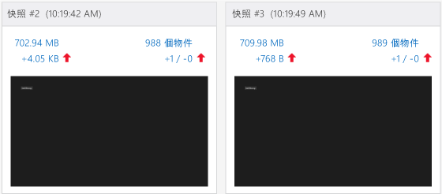
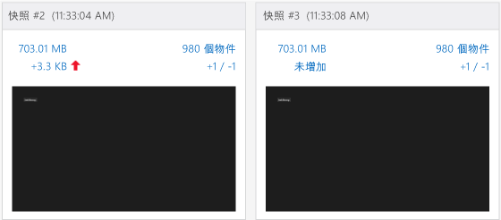

# <a name="walkthrough-find-a-memory-leak-javascript"></a>逐步解說：尋找記憶體流失 (JavaScript)
  
  
 本逐步解說將帶領您使用 JavaScript 記憶體分析器找出並修正簡單的記憶體問題。 您可以在 Visual Studio 中使用 JavaScript 記憶體分析器來分析使用 JavaScript 針對 Windows 建置的 Windows 市集應用程式。 在這個案例中，您建立的應用程式在記憶體內以不正確的方式保留 DOM 項目，而不是以這些項目在建立時的相同速度來處理這些項目。  
  
 雖然此應用程式中記憶體流失的原因非常明確，但此處所示之步驟所示範的工作流程，對於找出流失記憶體的物件一般來說都相當有效。  
  
### <a name="running-the-javascript-memory-analyzer-test-app"></a>執行 JavaScript 記憶體分析器測試應用程式  
  
1.  在 Visual Studio 中，依序選擇 [檔案]、[新增]、[專案]。  
  
2.  選擇左窗格中的 [JavaScript]  ，再選擇 [Windows] 、[Windows 8] ，然後選擇 [通用]  或 [Windows Phone 應用程式] 。  
  
    > [!IMPORTANT]
    >  本主題中的記憶體使用量結果是以 Windows 8 應用程式為測試對象。  
  
3.  在中間窗格選擇 [空白應用程式]  專案範本。  
  
4.  在 [名稱]  方塊中指定名稱 (例如 `JS_Mem_Tester`)，然後選擇 [確定] 。  
  
5.  在 [方案總管] 中開啟 default.html，然後在 \<body> 標記之間貼上下列程式碼：  
  
    ```html  
    <div class="wrapper">  
        <div id="item"></div>  
        <button class="memleak" style="display: block" >Leak Memory</button>  
    </div>  
    ```  
  
    > [!IMPORTANT]
    >  如果您要使用 Windows 8.1 通用應用程式範本，必須更新 .Windows 及 .WindowsPhone 專案中的 HTML 與 CSS 程式碼。  
  
6.  開啟 default.css 並新增下列 CSS 程式碼：  
  
    ```css  
    .memleak {  
        position: absolute; top: 100px; left: 100px;  
    }  
    ```  
  
7.  開啟 default.js 並以下列程式碼取代所有程式碼：  
  
    ```javascript  
    (function () {  
        "use strict";  
  
        var app = WinJS.Application;  
        var activation = Windows.ApplicationModel.Activation;  
  
        var wrapper;  
        var elem;  
  
        app.onactivated = function (args) {  
            if (args.detail.kind === activation.ActivationKind.launch) {  
                if (args.detail.previousExecutionState !== activation.ApplicationExecutionState.terminated) {  
                } else {  
                }  
                args.setPromise(WinJS.UI.processAll());  
  
                elem = document.getElementById("item");  
                wrapper = document.querySelector(".wrapper");  
                var btn = document.querySelector(".memleak");  
                btn.addEventListener("click", btnHandler);  
                run();  
            }  
        };  
  
        app.oncheckpoint = function (args) {  
        };  
  
        app.start();  
  
        function run() {  
            initialize();  
            load();  
        }  
  
        function initialize() {  
  
            if (wrapper != null) {  
                elem.removeNode(true);  
            }  
        }  
  
        function load() {  
  
            var newDiv = document.createElement("div");  
  
            newDiv.style.zIndex = "-1";  
            newDiv.id = "item";  
  
            wrapper.appendChild(newDiv);  
        }  
  
        function btnHandler(args) {  
            run();  
        }  
  
    })();  
    ```  
  
8.  選擇 F5 鍵開始偵錯。 確認 [ **Leak Memory** ] 按鈕是否出現在頁面上。  
  
9. 切換回 Visual Studio (Alt+Tab)，然後選擇 Shift+F5 停止偵錯。  
  
     現在我們已經確認應用程式運作順利，可以檢查記憶體使用量。  
  
### <a name="analyzing-the-memory-usage"></a>分析記憶體使用量  
  
1.  在 [偵錯]  工具列的 [開始偵錯]  清單中，選擇已更新專案的偵錯目標：其中一個 Windows Phone 模擬器或 [模擬器] 。  
  
    > [!TIP]
    >  如果是 Windows 市集應用程式，您也可以選擇此清單內的 [ **本機電腦** ] 或 [ **遠端電腦** ]。 但使用模擬器 (emulator 或 simulator) 的優點是，您可以將其置於 Visual Studio 旁邊，方便在執行中的應用程式與 JavaScript 記憶體分析器之間切換。 如需詳細資訊，請參閱[從 Visual Studio 執行應用程式](../debugger/run-store-apps-from-visual-studio.md)及[在遠端電腦上執行 Windows 市集應用程式](../debugger/run-windows-store-apps-on-a-remote-machine.md)。  
  
2.  在 [偵錯]  功能表上選擇 [效能分析工具...] 。  
  
3.  在 [ **可用的工具**] 中選擇 [ **JavaScript 記憶體**]，然後選擇 [ **開始**]。  
  
     在本教學課程中，我們會將記憶體分析器附加至啟始專案。 如需其他選項 (例如將記憶體分析器連結至已安裝的 App) 的詳細資訊，請參閱 [JavaScript 記憶體](../profiling/javascript-memory.md)。  
  
     當您啟動記憶體分析器時，可能會出現 [使用者帳戶控制] 要求您提供執行 VsEtwCollector.exe 的權限。 選擇 [ **是**]。  
  
4.  連續選擇 [ **Leak Memory** ] 按鈕四次。  
  
     當您選擇按鈕時，在 default.js 中運作的事件處理程式碼隨即導致記憶體流失。 我們將利用這個狀況進行診斷。  
  
    > [!TIP]
    >  重複您要測試是否導致記憶體流失的情節，以便更容易篩選掉不必要的資訊 (例如在應用程式初始化或載入頁面期間加入至堆積的物件)。  
  
5.  當應用程式仍在執行時，切換至 Visual Studio (Alt+Tab)。  
  
     JavaScript 記憶體分析器會在 Visual Studio 中開啟新的索引標籤來顯示相關資訊。  
  
     摘要檢視中的記憶體圖表會顯示一段時間後的處理序記憶體使用量。 此檢視也會提供像是 [ **擷取堆積快照**] 這類命令。 快照可提供特定時間的記憶體使用量詳細資訊。 如需詳細資訊，請參閱 [JavaScript 記憶體](../profiling/javascript-memory.md)。  
  
6.  選擇 [ **擷取堆積快照**]。  
  
7.  切換至應用程式並選擇 [ **Leak Memory**]。  
  
8.  切換至 Visual Studio 並再次選擇 [ **擷取堆積快照** ]。  
  
     下圖顯示基準快照 (#1) 和快照 #2。  
  
       
  
    > [!NOTE]
    >  擷取快照時，[Windows Phone 模擬器] 不會顯示應用程式的螢幕擷取畫面。  
  
9. 切換至應用程式並再次選擇 [ **Leak Memory** ]。  
  
10. 切換至 Visual Studio 並再次選擇 [ **擷取堆積快照** ]，這次是第三次。  
  
    > [!TIP]
    >  您可以在這個工作流程中擷取第三張快照，藉此從基準快照到第二張快照中篩選掉與記憶體流失無關聯的變更。 例如，可能會有如更新頁首和頁尾等預期的變更，這將會對記憶體使用量產生一些變更，但可能與記憶體流失無關。  
  
     下圖顯示快照 #2 和快照 #3。  
  
       
  
11. 在 Visual Studio 中，選擇 [ **停止** ] 停止分析。  
  
12. 在 Visual Studio 中，比較這些快照差異。 快照 #2 顯示下列資訊：  
  
    -   與快照 #1 相比，堆積大小 (左邊紅色向上箭號旁顯示的數字) 增加了數 KB。  
  
        > [!IMPORTANT]
        >  堆積大小的記憶體使用量精確值視偵錯目標而定。  
  
    -   與快照 #1 相比，堆積中的物件數目 (右邊紅色向上箭號旁顯示的數字) 也增加了。 增加了一個物件 (+1) 並且未移除任何物件 (-0)。  
  
     快照 #3 顯示下列資訊：  
  
    -   與快照 #2 相比，堆積大小再次增加了數百個位元組。  
  
    -   與快照 #2 相比，堆積中的物件數目也再次增加。 增加了一個物件 (+1) 並且未移除任何物件 (-0)。  
  
13. 在快照 #3 中，選擇右邊的連結文字 (紅色向上箭號旁出現的 +1 / -0 值)。  
  
       
  
     如此將開啟堆積中的物件差異檢視 (稱為 [ **快照 #3 - 快照 #2**])，其中預設顯示 [類型] 檢視。 根據預設，您會看到從快照 #2 到快照 #3，堆積中加入的所有物件。  
  
14. 在 [ **範圍** ] 篩選中，選擇 [ **快照 #2 中剩餘的物件**]。  
  
15. 開啟位於物件樹狀結構頂端的 HTMLDivElement 物件，如下所示。  
  
       
  
     這個檢視會顯示關於記憶體流失的實用資訊，如下所示：  
  
    -   這個檢視會顯示 ID 為 `item`的 DIV 元素，物件所持有的大小為數百個位元組 (實際值不定)。  
  
    -   這個物件是來自快照 #2 的剩餘物件，表示可能發生記憶體流失問題。  
  
     這時如果我們了解此應用程式的內容，就會知道選擇 [ **Leak Memory** ] 按鈕時應該要移除 DIV 元素並加入新元素，因此程式碼一定是哪裡出了問題 (遺失了記憶體)。 下一節會說明如何修正這個問題。  
  
    > [!TIP]
    >  在某些情況下，找出與 `Global` 物件有關的物件可能有助於識別該物件。 若要這麼做，請開啟識別項的捷徑功能表，然後選擇 [ **在根檢視中顯示**]。  
  
##  <a name="a-namefixingmemorya-fixing-the-memory-issue"></a><a name="FixingMemory"></a> 修正記憶體問題  
  
1.  透過分析工具所呈現的資料，您檢查負責移除 ID 為 "item" 之 DOM 元素的程式碼。 這段程式碼是在 `initialize()` 函式中。  
  
    ```javascript  
    function initialize() {  
  
        if (wrapper != null) {  
            elem.removeNode(true);  
        }  
    }  
    ```  
  
     `elem.removeNode(true)` 或許運作不正確。 您檢查程式碼快取 DOM 元素的方式之後，發現問題出在於已快取之元素的參考並未更新。  
  
2.  在 default.js 的 load 函式中，於呼叫 `appendChild`之前加入下列程式碼：  
  
    ```javascript  
    elem = newDiv;  
    ```  
  
     這個程式碼會更新已快取之元素的參考，如此當您選擇 [ **Leak Memory** ] 按鈕時即可確實移除元素。 現在，load 函式的完整程式碼如下所示：  
  
    ```javascript  
    function load() {  
  
        wrapper = document.querySelector(".wrapper");  
  
        var newDiv = document.createElement("div");  
  
        newDiv.style.zIndex = "-1";  
        newDiv.id = "item";  
        elem = newDiv;  
  
        wrapper.appendChild(newDiv);  
    }  
    ```  
  
3.  在 [ **偵錯** ] 功能表上選擇 [ **效能及診斷**]。  
  
4.  在 [ **可用的工具**] 中選擇 [ **JavaScript 記憶體**]，然後選擇 [ **開始**]。  
  
5.  遵循相同的程序，擷取三個快照。 這些步驟摘要說明如下：  
  
    1.  在應用程式中，連續選擇 [ **Leak Memory** ] 按鈕四次。  
  
    2.  切換至 Visual Studio 並選擇 [ **擷取堆積快照** ] 擷取基準快照。  
  
    3.  在應用程式中，選擇 [ **Leak Memory** ] 按鈕。  
  
    4.  切換至 Visual Studio 並選擇 [ **擷取堆積快照** ] 擷取第二個快照。  
  
    5.  在應用程式中，選擇 [ **Leak Memory** ] 按鈕。  
  
    6.  切換至 Visual Studio 並選擇 [ **擷取堆積快照** ] 擷取第三個快照。  
  
     與快照 #2 相比，現在快照 #3 的堆積大小顯示 [ **未增加** ]，並且物件計數顯示 +1 / -1，表示已加入一個物件且移除了一個物件。 這就是我們所要的結果。  
  
     下圖顯示快照 #2 和快照 #3。  
  
       
  
## <a name="see-also"></a>另請參閱  
 [JavaScript 記憶體](../profiling/javascript-memory.md)


<!--HONumber=Feb17_HO4-->


