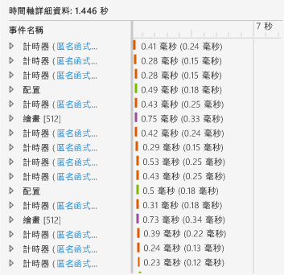
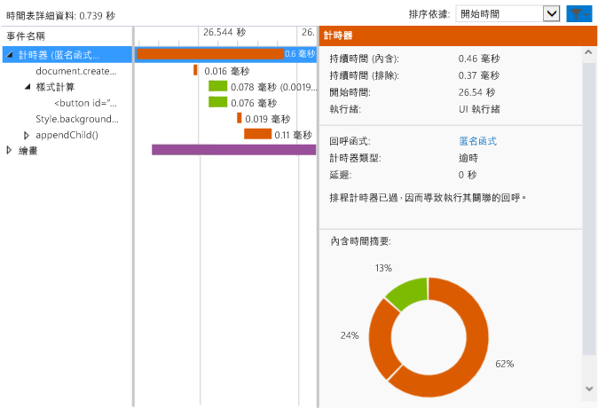

# <a name="walkthrough-improving-ui-responsiveness-html"></a>逐步解說：改善 UI 回應性 (HTML)
本逐步解說將帶領您使用 [HTML UI 回應性分析工具](../profiling/html-ui-responsiveness.md)找出並修正效能問題。 您可以在 Visual Studio 中使用此分析工具來分析使用 JavaScript 建置的 Windows 通用應用程式及 Windows 市集應用程式。 在這個案例中，您將建立極常更新 DOM 項目的效能測試應用程式，並且使用分析工具找出並修正問題。  
  
### <a name="creating-and-running-the-performance-test-app"></a>建立及執行效能測試應用程式  
  
1.  在 Visual Studio 中，建立新的 Windows 通用 JavaScript 專案。 (選取 [檔案] / [新增] / [專案]。) 選擇左窗格中的 [JavaScript]，然後選擇 [Windows]，[Windows 10]，然後選擇 [通用] 或 [Windows Phone]。  
  
2.  > [!IMPORTANT]
    >  本主題中所顯示的診斷結果均以 Windows 8 App 為測試對象。  
  
3.  在中間窗格內選擇其中一個空白的專案範本，例如 [空白應用程式]。  
  
4.  在 [名稱]  方塊中指定名稱 (例如 `JS_Perf_Tester`)，然後選擇 [確定] 。  
  
5.  在 [方案總管] 中開啟 default.html，然後在 \<body> 標記之間貼上下列程式碼：  
  
    ```html  
    <div class="wrapper">  
        <button id="content">Waiting for values</button>  
    </div>  
    ```  
  
6.  開啟 default.css 並新增下列 CSS 程式碼：  
  
    ```css  
    #content {  
        margin-left: 100px;  
        margin-top: 100px;  
    }  
    ```  
  
7.  開啟 default.js 並以下列程式碼取代所有程式碼：  
  
    ```javascript  
    (function () {  
        "use strict";  
  
        var app = WinJS.Application;  
        var activation = Windows.ApplicationModel.Activation;  
  
        var content;  
        var wrapper;  
  
        app.onactivated = function (args) {  
            if (args.detail.kind === activation.ActivationKind.launch) {  
                if (args.detail.previousExecutionState !== activation.ApplicationExecutionState.terminated) {  
  
                    content = document.getElementById("content");  
                    wrapper = document.querySelector(".wrapper");  
  
                    content.addEventListener("click", handler);  
  
                } else {  
                }  
  
                args.setPromise(WinJS.UI.processAll());  
            }  
        };  
  
        app.oncheckpoint = function (args) {  
        };  
  
        app.start();  
  
        var idx = 0;  
        var count = 0;  
        var max = 5000;  
        var text = ["what", "is", "the", "Matrix?"];  
        var color = ["red", "crimson", "maroon", "purple"];  
  
        function increment() {  
  
            setTimeout(function () {  
  
                idx++;  
                count++;  
  
                if (idx > 3) { idx = 0; }  
                if (count < max) { increment(); }  
  
            }, 1000);  
        }  
  
        function setValues() {  
  
            content = document.getElementById("content");  
            content.removeNode(true);  
  
            var newNode = document.createElement("button");  
            newNode.id = "content";  
            newNode.textContent = text[idx];  
            //newNode.textContent = getData();  
            newNode.style.backgroundColor = color[idx];  
            //newNode.style.animationName = "move";  
            //count++;  
  
            wrapper.appendChild(newNode);  
  
        }  
  
        function update() {  
  
            setTimeout(function () {  
  
                setValues();  
                if (count < max) { update(); }  
            });  
        }  
  
        function handler(args) {  
  
            content.textContent = "eenie";  
            increment();  
            update();  
        }  
  
    })();  
  
    ```  
  
8.  選擇 F5 鍵開始偵錯。 確認 [等待值] 按鈕已出現在頁面上。  
  
9. 選擇 [等待值] 並確認按鈕文字與色彩大約每秒更新一次。 這是依設計的結果。  
  
10. 切換回 Visual Studio (Alt+Tab)，然後選擇 Shift+F5 停止偵錯。  
  
     現在我們已經確認應用程式運作順利，可以使用分析工具來檢查效能。  
  
### <a name="analyzing-performance-data"></a>分析效能資料  
  
1.  在 [偵錯] 工具列的 [開始偵錯] 清單中，選擇其中一個 Windows Phone 模擬器。  
  
2.  在 [ **偵錯** ] 功能表上選擇 [ **效能及診斷**]。  
  
3.  在 [可用的工具] 中，選擇 [HTML UI 回應性]，然後選擇 [開始]。  
  
     在本教學課程中，我們會將分析工具附加至啟始專案。 如需其他選項 (例如將分析工具附加至已安裝的 App) 的詳細資訊，請參閱 [HTML UI 回應性](../profiling/html-ui-responsiveness.md)。  
  
     當您啟動分析工具時，可能會出現 [使用者帳戶控制] 要求您提供執行 VsEtwCollector.exe 的權限。 選擇 [ **是**]。  
  
4.  在執行的 App 中，選擇 [等待值] 並等待約 10 秒。 確認按鈕文字和色彩是否大約每秒更新一次。  
  
5.  當應用程式仍在執行時，切換至 Visual Studio (Alt+Tab)。  
  
6.  選擇 [停止收集]。  
  
     分析工具會在 Visual Studio 中開啟新的索引標籤來顯示相關資訊。 當您查看 CPU 使用率和視覺輸送量 (FPS) 資料時，很容易就能了解一些趨勢：  
  
    -   CPU 使用率在大約 3 秒後 (當您按下 [等待值] 按鈕時) 大幅增加，且會從這時開始清楚地顯示事件模式 (處理指令碼、處理樣式及呈現等事件一致地混合在一起)。  
  
    -   視覺輸送量並未受到影響，FPS (每秒畫面格數) 的值保持在 60 (也就是說，畫面並未減少)。  
  
     讓我們來看看 CPU 使用率圖表的一部分區段，了解應用程式在這段大量活動期間做什麼。  
  
7.  在 CPU 使用率圖表中選取一到兩秒的部分 (您可以按一下並拖曳或使用 Tab 和方向鍵來選取)。 下圖顯示在選取範圍之後的 CPU 使用率圖表。 非陰影區域是選取範圍。  
  
       
  
8.  選擇 [放大]。  
  
     圖表隨即變更，更詳細地顯示所選取的期間。 下圖顯示經過放大之後的 CPU 使用率圖表。 (特定資料可能有所差異，但是一般模式則很明顯。)  
  
       
  
     下方窗格中的 [時間軸詳細資料] 會顯示所選取期間的詳細資料範例。  
  
       
  
     透過 [時間表詳細資料] 中的事件，我們可以確定 CPU 使用率圖表中的趨勢：在短期間內發生了很多事件。 [時間表詳細資料] 檢視顯示這些事件都是 `Timer`、`Layout` 和 `Paint` 事件。  
  
9. 使用操作功能表 (或是以滑鼠右鍵按一下) 下方窗格內的其中一個 `Timer` 事件，然後選擇 [篩選事件]。 下圖顯示此測試應用程式之其中一個 `Timer` 事件的典型詳細資料範例。  
  
       
  
     我們可以從這份資料中收集到各種細節。 例如：  
  
    -   每個 `Timer` 事件 (會以色彩標示指出它是 [正在處理指令碼] 事件) 都包括 `document.createElement` 的呼叫，後面緊接著樣式計算以及 `style.backgroundColor` 和 `appendChild()` 的呼叫。  
  
    -   在選取的短期間 (大約一或兩秒) 秒，有大量的 `Timer`、`Layout` 和 `Paint` 事件發生。 在您執行 App 並選擇 [等待值] 按鈕之後，`Timer` 事件的發生頻率遠高於您肉眼所見按鈕內容每秒更新一次的頻率。  
  
10. 若要調查，請選擇左下方窗格中任一個 `Timer` 事件的匿名函式連結。 下列函式隨即在 default.js 中開啟：  
  
    ```javascript  
    function update() {  
  
        setTimeout(function () {  
  
            setValues();  
            if (count < max) { update(); }  
        });  
    }  
    ```  
  
     這個遞迴函式中設定了 `setValues()` 函式呼叫迴圈，而每次呼叫函式就會更新 UI 中的按鈕。 藉由檢查剖析工具中的不同計時器事件，您發現大多數或所有的計時器事件起因於這個程式碼，其執行頻率太高，因此問題很可能就是源自於此。  
  
### <a name="fixing-the-performance-issue"></a>修正效能問題  
  
1.  以下列程式碼取代 `update()` 函式：  
  
    ```javascript  
    function update() {  
  
        setTimeout(function () {  
  
            setValues();  
            if (count < max) { update(); }  
        }, 1000 );  
    }  
    ```  
  
     這個程式碼修正版本中加入了 1000 毫秒的延遲值，舊版程式碼中省略了這部分，因此導致程式碼使用預設的延遲值。 從分析資料來看預設值是零毫秒，因此導致 `setValues()` 函式的執行頻率太高。  
  
2.  再次執行 HTML UI 回應性分析工具並檢查 CPU 使用率圖表。 您會發現這次並沒有發生過多的事件，而且 CPU 使用率也下降接近到零， 表示問題修復了。  
  
## <a name="see-also"></a>另請參閱  
 [HTML UI 回應性](../profiling/html-ui-responsiveness.md)


<!--HONumber=Feb17_HO4-->


