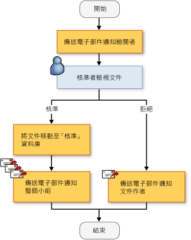
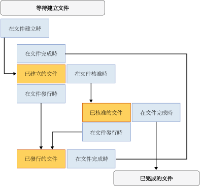

# 建立 SharePoint 工作流程方案
  [!INCLUDE[vsprvs](../sharepoint/includes/vsprvs-md.md)] 提供工具，協助您建立在 SharePoint 網站中管理文件和清單項目之生命週期的自訂工作流程。  提供的項目包括設計工具、一組活動控制項，以及必要的組件參考。  [!INCLUDE[vsprvs](../sharepoint/includes/vsprvs-md.md)] 還包括 \[**SharePoint 自訂精靈**\]，可協助建立和設定工作流程。  
  
 如需在 [!INCLUDE[vsprvs](../sharepoint/includes/vsprvs-md.md)] 中建立 SharePoint 專案的必要條件清單，請參閱[開發 SharePoint 方案的要求](../sharepoint/requirements-for-developing-sharepoint-solutions.md)。  如需 SharePoint 的詳細資訊，請參閱 [Microsoft SharePoint 產品和技術](http://go.microsoft.com/fwlink/?LinkId=178470)。  
  
## SharePoint 中的工作流程  
 若您將工作流程加入至 SharePoint 程式庫或清單，表示在程式庫或清單中的所有項目上強制執行商務處理流程。  工作流程會描述系統或使用者必須在每一個項目上執行的動作，例如傳送項目進行編輯然後檢視。  這些動作稱為「*活動*」\(Activity\)，為工作流程的建置組塊。  
  
 您可以在 [!INCLUDE[vsprvs](../sharepoint/includes/vsprvs-md.md)] 中建立 SharePoint 工作流程並將它們部署至 SharePoint 網站。  在將工作流程部署至 SharePoint 之後，您可以將它與文件庫或清單相關聯。  它接著可由處理序自動啟動，或者由使用者手動啟動。  如需工作流程作業的詳細資訊，請參閱 [使用工作流程管理程序](http://go.microsoft.com/fwlink/?LinkId=79757)。  
  
## 建立自訂 SharePoint 工作流程  
 [!INCLUDE[vsprvs](../sharepoint/includes/vsprvs-md.md)] 提供兩種 SharePoint 工作流程專案：\[**循序工作流程**\] 和 \[**狀態機器工作流程**\]。  
  
 「*循序工作流程*」\(Sequential Workflow\) 代表一系列的步驟。  這些步驟會逐一執行，直到最後一個活動完成為止。  循序工作流程會嚴格按照順序執行。  由於它們可接收外部事件並包含平行邏輯流程，因此確實的執行順序可能會不同。  下圖顯示循序工作流程的範例。  
  
   
  
 「*狀態機器工作流程*」\(State Machine Workflow\) 代表一組狀態、轉換和動作。  狀態機器工作流程中的步驟會以非同步方式執行。  這表示步驟不一定會逐一執行，而是由動作和狀態觸發。  一個狀態會被指派為開始狀態，然後根據事件，轉換表示為另一個狀態。  狀態機器可有決定工作流程結束的最終狀態。  以下圖表將顯示狀態機器工作流程的範例。  
  
   
  
 如需工作流程類型的詳細資訊，請參閱 [工作流程類型](http://go.microsoft.com/fwlink/?LinkId=178995)。  
  
### 使用精靈  
 當您在 [!INCLUDE[vsprvs](../sharepoint/includes/vsprvs-md.md)] 中建立 SharePoint 工作流程專案時，會先在 \[**SharePoint 自訂精靈**\] 中指定其設定。  精靈會使用這些設定在 \[**方案總管**\] 中建立專案。  這個專案中包含程式碼檔案、數個用來部署工作流程的檔案，以及建立自訂 SharePoint 工作流程所需的組件參考。  
  
 建立工作流程之後，您可以在 \[屬性\] 視窗中修改其屬性。  雖然多數工作流程屬性可以直接在 \[屬性\] 視窗中變更，但部分屬性會需要您按一下省略符號按鈕 \(\) 才能變更其值。  此按鈕會重新啟動 \[**SharePoint 自訂精靈**\]。  變更屬性值之後，選擇 \[**完成**\] 來確認完成。  
  
> [!NOTE]  
>  \[**工作流程類型**\] 屬性是唯讀的，無法變更。  如果您想變更工作流程類型，必須建立另一個工作流程。  
  
## 設計 SharePoint 工作流程  
 在您定義商務流程中的所有步驟之後，請使用 [!INCLUDE[vsprvs](../sharepoint/includes/vsprvs-md.md)] 設計工具設計 SharePoint 工作流程。  若要開啟設計工具中，按兩下 \[**方案總管**\] 中的 Workflow1.cs 或 Workflow1.vb 或開啟兩個檔案其中之一的捷徑功能表，然後選取 \[**開啟**\]。  
  
### 活動  
 若要設計工作流程，請從 \[**工具箱**\] 將活動加入至設計工具上的「*工作流程排程*」\(Workflow Schedule\)。  工作流程排程包含一系列依照應執行順序排列的活動。  
  
 活動有兩種類型：  
  
-   「*簡易活動*」\(Simple Activity\) 執行單一工作單位，例如「延遲 1 天」或「啟動 Web 服務」。  
  
-   「*複合活動*」\(Composite Activity\) 包含其他活動，例如條件式活動可能包含兩個分支。  
  
 這兩種類型的活動都包含在 \[**工具箱**\] 中。  
  
 活動可以擁有屬性、方法和事件。  使用 \[**屬性**\] 視窗即可設定活動的屬性。  
  
 您也可以建立自訂活動。  如需詳細資訊，請參閱[逐步解說：建立自訂站台工作流程活動](../sharepoint/walkthrough-create-a-custom-site-workflow-activity.md)。  
  
 活動會組織到 \[**工具箱**\] 的下列索引標籤中：  
  
-   **SharePoint 工作流程**  
  
-   **Windows Workflow v3.0**  
  
-   **Windows Workflow v3.5**  
  
 並非所有核心工作流程活動都受 SharePoint 支援。  如需詳細資訊，請參閱 [Windows SharePoint Services 的工作流程活動概觀](http://go.microsoft.com/fwlink/?LinkID=156094)。  
  
#### SharePoint 工作流程活動  
 \[**SharePoint 工作流程**\] 索引標籤包含可在 [!INCLUDE[wss_14_long](../sharepoint/includes/wss-14-long-md.md)] 中使用的專屬活動。  這些活動可簡化文件生命週期工作流程的開發工作，並使其更有效率。  如需 \[**SharePoint 工作流程**\] 索引標籤中所列出之活動的詳細資訊，請參閱 [Windows SharePoint Services 工作流程活動概觀](http://go.microsoft.com/fwlink/?LinkID=156094)。  
  
#### Windows 工作流程活動  
 \[**Windows 工作流程**\] 索引標籤包含的活動是由 [!INCLUDE[TLA#tla_workflow](../sharepoint/includes/tlasharptla-workflow-md.md)] 所提供。  您可以使用這些活動為任何類型的 Windows 工作流程應用程式建立工作流程排程。  
  
 如需 \[**Windows 工作流程**\] 索引標籤中所列出之活動的詳細資訊，請參閱 [Windows Workflow Foundation 活動](http://go.microsoft.com/fwlink/?LinkID=156096)。  如需 Windows Workflow Foundation 的詳細資訊，請參閱 [Windows Workflow Foundation 概觀](http://go.microsoft.com/fwlink/?LinkID=128632)。  
  
### 使用設計工具中的活動  
 您的工作流程排程可包含 Windows 工作流程活動和 SharePoint 工作流程活動的組合。  
  
 設計工具會顯示視覺提示，協助您正確定位和設定活動。  當您將活動拖曳或複製至工作流程排程上時，設計工具會顯示綠色的加號 \(\+\) 圖示，表示工作流程中該活動的有效位置。  您無法將活動定位在活動可能無效的位置。  例如，您無法將 Send 活動定位為 Listen 活動分支中的第一個活動。  如需詳細資訊，請參閱 [SharePoint 設計工具開發人員中心](http://go.microsoft.com/fwlink/?LinkId=178476)。  
  
## 在工作流程期間收集資訊  
 您可能想要在工作流程中，於預先定義的時間收集使用者的資訊。  您可以使用表單或項目屬性收集資訊。  
  
### 表單  
 表單與對話方塊類似，其中包含問題且提供讓使用者回答問題的方式。  
  
 工作流程可使用四種類型的表單：  
  
-   關聯  
  
-   初始  
  
-   修改  
  
-   工作  
  
 其中，[!INCLUDE[vsprvs](../sharepoint/includes/vsprvs-md.md)] 包含關聯和初始表單的項目範本。  「*關聯表單*」\(Association Form\) 的範例是可讓安裝工作流程的系統管理員輸入與工作流程相關之參數 \(例如費用工作流程的開支限制\) 的表單。  *初始表單 \(Initiation Form\)* 的範例是可讓費用工作流程的使用者輸入他們在工作流程中花費量的表單。  如需這些表單類型的詳細資訊，請參閱 [SharePoint 專案與專案項目範本](../sharepoint/sharepoint-project-and-project-item-templates.md)。  
  
### 項目屬性  
 您還可以使用 SharePoint 程式庫或清單中項目的屬性，收集使用者的資訊。  主要的程式碼檔案 \(Workflow1.cs 或 Workflow1.vb\) 會宣告 Microsoft.SharePoint.Workflow.SPWorkflowActivationProperties.WorkflowProperties 類別的執行個體，名為 `workflowProperties`。  請使用 `workflowProperties` 物件在程式碼中存取程式庫或清單的屬性。  如需範例，請參閱 [逐步解說：建立並偵錯 SharePoint 工作流程方案](../sharepoint/walkthrough-creating-and-debugging-a-sharepoint-workflow-solution.md)。  
  
## 偵錯 SharePoint 工作流程範本  
 您可以偵錯 SharePoint 工作流程專案，就像您偵錯其他 [!INCLUDE[vsprvs](../sharepoint/includes/vsprvs-md.md)] Web 專案一般。  當您啟動 [!INCLUDE[vsprvs](../sharepoint/includes/vsprvs-md.md)] 偵錯工具時，[!INCLUDE[vsprvs](../sharepoint/includes/vsprvs-md.md)] 會使用您在 \[**SharePoint 自訂精靈**\] 中指定的設定來開啟適當的 SharePoint 網站，並自動產生工作流程範本與適當的文件庫或清單之間的關聯。  [!INCLUDE[vsprvs](../sharepoint/includes/vsprvs-md.md)] 還會將 [!INCLUDE[vsprvs](../sharepoint/includes/vsprvs-md.md)] 偵錯工具附加至名為 w3wp.exe 的 [!INCLUDE[wss_14_long](../sharepoint/includes/wss-14-long-md.md)] 處理序。  
  
 若要測試工作流程，您必須手動將它啟動。  如需詳細資訊，請參閱[對 SharePoint 方案進行偵錯](../sharepoint/debugging-sharepoint-solutions.md)中的＜對工作流程進行偵錯＞一節。  如需 [!INCLUDE[vsprvs](../sharepoint/includes/vsprvs-md.md)] Web 應用程式偵錯的詳細資訊，請參閱[偵錯 Web 應用程式和指令碼](../debugger/debugging-web-applications-and-script.md)。  
  
## 部署 SharePoint 工作流程範本  
 [!INCLUDE[vsprvs](../sharepoint/includes/vsprvs-md.md)] SharePoint 工作流程專案的部署方式與其他 [!INCLUDE[vsprvs](../sharepoint/includes/vsprvs-md.md)] SharePoint 專案一樣。  如需詳細資訊，請參閱[封裝和部署 SharePoint 方案](../sharepoint/packaging-and-deploying-sharepoint-solutions.md)。  
  
## 匯入可全域重複使用的工作流程  
 除了建立可重複使用的網站特有工作流程以外，SharePoint Designer 還可讓您建立「*可全域重複使用的工作流程*」\(Globally Reusable Workflow\)；這是可供任何 SharePoint 網站使用的工作流程。  [!INCLUDE[vsprvs](../sharepoint/includes/vsprvs-md.md)] 中的 \[匯入可重複使用的工作流程\] 專案目前尚無法匯入可全域重複使用的工作流程。  但您可以使用 SharePoint Designer，將可全域重複使用的工作流程轉換成可重複使用的工作流程，或將工作流程匯入為未轉換的宣告式工作流程。  如需詳細資訊，請參閱[從現有的 SharePoint 網站匯入項目](../sharepoint/importing-items-from-an-existing-sharepoint-site.md)。  
  
## 相關主題  
  
|標題|說明|  
|--------|--------|  
|[逐步解說：建立並偵錯 SharePoint 工作流程方案](../sharepoint/walkthrough-creating-and-debugging-a-sharepoint-workflow-solution.md)|引導您逐步建立和偵錯簡單的 [!INCLUDE[vsprvs](../sharepoint/includes/vsprvs-md.md)] 工作流程。|  
|[逐步解說：使用關聯與初始化表單建立工作流程](../sharepoint/walkthrough-creating-a-workflow-with-association-and-initiation-forms.md)|引導您逐步建立包含關聯和初始表單的完整功能 [!INCLUDE[vsprvs](../sharepoint/includes/vsprvs-md.md)] 工作流程。|  
|[逐步解說：將應用程式頁面新增到工作流程](../sharepoint/walkthrough-add-an-application-page-to-a-workflow.md)|以[逐步解說：使用關聯與初始化表單建立工作流程](../sharepoint/walkthrough-creating-a-workflow-with-association-and-initiation-forms.md)主題為基礎，加入可報告輸入工作流程之資料的額外 .aspx 應用程式頁面。|  
|[逐步解說：建立自訂站台工作流程活動](../sharepoint/walkthrough-create-a-custom-site-workflow-activity.md)|示範如何執行兩項重要工作：建立網站層級工作流程以及建立自訂工作流程活動。|  
|[逐步解說：將 SharePoint Designer 可重複使用的工作流程匯入 Visual Studio](../sharepoint/walkthrough-import-a-sharepoint-designer-reusable-workflow-into-visual-studio.md)|示範如何將 SharePoint Designer 2010 中建立的可重複使用的宣告式工作流程匯入 [!INCLUDE[vsprvs](../sharepoint/includes/vsprvs-md.md)] SharePoint 專案。|  
  
## 請參閱  
 [Developing SharePoint Solutions](../sharepoint/developing-sharepoint-solutions.md)   
 [建置和偵錯 SharePoint 方案](../sharepoint/building-and-debugging-sharepoint-solutions.md)   
 [建立 SharePoint 的應用程式頁面](../sharepoint/creating-application-pages-for-sharepoint.md)  
  
  