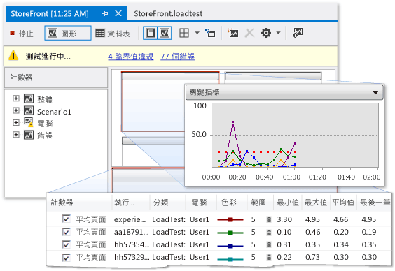

# 剖析 SharePoint 應用程式的效能
  如果 SharePoint 應用程式執行緩慢或無效率，您可以使用 Visual Studio 中的程式碼剖析功能識別有問題的程式碼及其他項目。  使用負載測試功能可以決定 SharePoint 應用程式在壓力下的執行方式，例如當許多使用者同時存取該應用程式時。  您可以執行 Web 效能測試以測量應用程式的 Web 執行效能。  透過使用自動程式碼 UI 測試，您可以確認整個 SharePoint 應用程式 \(包括其使用者介面\) 是否正確運作。  當您一起使用這些測試時，可以在部署您的應用程式之前，協助您找出效能問題。  
  
## 程式碼剖析工具概觀  
 程式碼剖析指的是觀察和記錄應用程式執行時的效能行為的流程。  透過剖析應用程式，您可以發現問題 \(例如瓶頸、沒有效率的程式碼，以及會導致應用程式執行速度緩慢或佔用過多記憶體的記憶體配置問題\)。  例如，您可以使用程式碼剖析識別程式碼中的作用點，這些作用點是經常呼叫的程式碼區段，且可能會降低應用程式的整體效能。  在您識別作用區之後，您通常可以最佳化或刪除它們。  
  
 您可以在整合式開發環境 \(IDE\) 中使用數種程式碼剖析工具，識別並找出這些類型的效能問題。  這些工具在 SharePoint 專案中的運作方式和在其他 Visual Studio 專案類型一樣。  程式碼剖析工具效能精靈會引導您建立使用您指定之測試的效能工作階段。  效能工作階段是一組用於收集應用程式效能資訊和一個或多個程式碼剖析執行結果的組態資料。  效能工作階段儲存在專案資料夾中，您可以使用 \[**效能總管**\] 來檢視。  如需詳細資訊，請參閱[認識程式碼剖析方法](../profiling/understanding-performance-collection-methods.md)。  
  
 在您建立應用程式並在其中執行設定檔分析後，報告會提供關於其效能的詳細資料。  此報表可能包含項目，例如一段時間的 CPU 使用率圖表、階層式函式呼叫堆疊或呼叫樹狀圖。  報表的確切內容可能依您執行的測試類型 \(例如，取樣或檢測\) 而有所不同。  如需詳細資訊，請參閱[程式碼剖析工具報告概觀](http://go.microsoft.com/fwlink/?LinkId=224689)。  
  
## 效能工作階段流程  
 若要剖析應用程式，從使用程式碼剖析工具的效能精靈建立效能工作階段開始。  在功能表列上選擇 \[**分析**\] , \[**啟動效能精靈**\]。  當您完成精靈時，您要輸入效能工作階段所需的資訊，例如您想要的剖析方法和要剖析的應用程式。  如需詳細資訊，請參閱 [如何：使用效能精靈對網站或 Web 應用程式進行程式碼剖析](http://go.microsoft.com/fwlink/?LinkId=224692)。  或者，您可以使用命令列選項設定和執行效能工作階段。  如需詳細資訊，請參閱[從命令列使用程式碼剖析工具](http://go.microsoft.com/fwlink/?LinkId=224703) \(機器譯文\)。  如果您想要手動設定效能工作階段的各個層面，請參閱 [如何：使用程式碼剖析工具手動建立效能工作階段](http://go.microsoft.com/fwlink/?LinkId=224691)。  您也可以從單元測試中建立效能工作階段，方法是在 \[**測試結果**\] 視窗中，開啟單元測試的捷徑功能表，然後選擇 \[**建立效能工作階段**\]。  
  
 在您設定效能工作階段之後，會儲存該工作階段組態，並設定伺服器提供程式碼剖析資料，讓應用程式可以執行。  當您使用應用程式時，會將效能資料寫入記錄檔。  效能工作階段是在 \[**效能總管**\] 的 \[**目標**\] 資料夾底下列出。  在效能工作階段完成後，它的報表出現在 \[**效能總管**\] 中的 \[**報告**\] 資料夾。  若要顯示報表，請在 \[**效能總管**\] 中開啟它。  若要檢視或設定效能工作階段的屬性，請在 \[**效能總管**\] 中開啟其捷徑功能表，然後選擇 \[**屬性**\]。  如需效能工作階段之特定屬性的詳細資訊，請參閱[設定程式碼剖析工具的效能工作階段](http://go.microsoft.com/fwlink/?LinkId=224694)。  如需如何解譯效能工作階段之結果的詳細資訊，請參閱[分析程式碼剖析工具資料](http://go.microsoft.com/fwlink/?LinkId=224704)。  
  
## 壓力測試  
 您可以在 Visual Studio Ultimate 中建立負載測試和 Web 效能測試，分析應用程式的壓力效能。  當您在 Visual Studio 中建立負載測試時，您指定因素的組合 \(稱為情節\) 以測試您的應用程式。  這些因素包含負載模式、測試混合模型、測試混合、網路混合和 Web 瀏覽器混合。  負載測試情節可以包含單元測試和 Web 效能測試兩者。  
  
 圖 1：負載測試結果範例  
  
   
  
 Web 效能測試會模擬使用者與 SharePoint 應用程式的互動。  您可以使用 \[**Web 效能測試錄製器**\]，在瀏覽器工作階段中錄製 HTTP 要求，藉以建立 Web 效能測試。  當瀏覽器工作階段完成時，Web 要求會出現在 \[**Web 效能測試編輯器**\] 中。  您接著就可以在 \[**Web 效能測試結果檢視器**\] 中偵錯結果。  您也可以使用 \[**Web 效能測試編輯器**\] 手動建置 Web 效能測試。  
  
## 測試使用者介面  
 自動程式碼 UI 測試會透過其使用者介面自動驅動您的 SharePoint 應用程式。  這些測試涵蓋 UI 控制項，例如按鈕和功能表，驗證它們是否能正確運作。  如果驗證或其他邏輯在 UI 中執行，例如網頁，這種測試特別有用。  您也可以使用自動程式碼 UI 測試，自動化手動測試。  為 SharePoint 應用程式建立自動程式碼 UI 測試的方式，與為其他類型的應用程式建立測試的方式相同。  如需詳細資訊，請參閱[使用自動程式碼 UI 測試來測試 SharePoint 2010 應用程式](../test/testing-sharepoint-2010-applications-with-coded-ui-tests.md)。  
  
## 相關主題  
  
|標題|描述|  
|--------|--------|  
|[Walkthrough: Profiling a SharePoint Application](../sharepoint/walkthrough-profiling-a-sharepoint-application.md)|示範如何在 SharePoint 應用程式上執行取樣分析。|  
|[Create and run a load test](http://msdn.microsoft.com/zh-tw/7041cbcf-9ab1-4579-98ff-8f296aeaded4)|描述如何建立負載測試，可協助您進行 SharePoint 應用程式的壓力測試。|  
|[Creating and Editing Web Performance Tests](http://msdn.microsoft.com/zh-tw/8bf5f2a7-c693-47d6-9282-5946480151dc)|描述如何建立 Web 效能測試，幫助您模擬使用者在 Web 上與 SharePoint 網站互動的方式。|  
|[對程式碼進行單元測試](../test/unit-test-your-code.md)|描述如何使用單元測試尋找程式碼中的邏輯錯誤。|  
|[使用自動程式碼 UI 測試來測試 SharePoint 2010 應用程式](../test/testing-sharepoint-2010-applications-with-coded-ui-tests.md)|描述如何測試 SharePoint 應用程式的使用者介面。|  
  
## 請參閱  
 [建置和偵錯 SharePoint 方案](../sharepoint/building-and-debugging-sharepoint-solutions.md)   
 [測試應用程式](http://msdn.microsoft.com/library/796b7d6d-ad45-4772-9719-55eaf5490dac)   
 [改善程式碼品質](../test/improve-code-quality.md)  
  
  