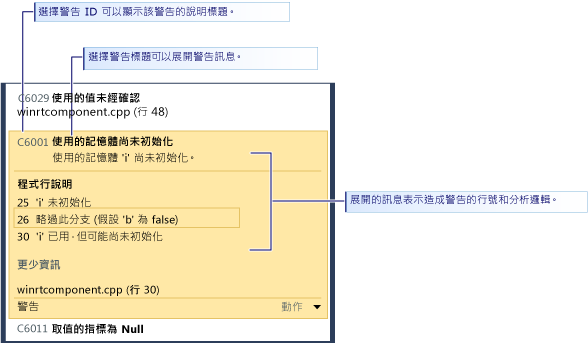

# 使用 Visual Studio 靜態程式碼分析，分析市集應用程式的 C++ 程式碼品質
  
  
 Visual Studio Express Edition 中的程式碼分析工具會檢查您的程式碼是否有常見的問題，以及是否違反良好的程式設計作法。 程式碼分析警告與編譯器錯誤和警告不同，因為程式碼分析會搜尋有效的特定程式碼模式，但仍然可以為您或使用您程式碼的其他人建立問題。 程式碼分析也可以尋找難以透過測試發現的程式碼缺失。 在開發過程中定期執行程式碼分析工具，可以提升已完成應用程式的品質。  
  
> [!NOTE]
>  在 Visual Studio Ultimate、Visual Studio Premium 及 Visual Studio Professional 中，您可以使用程式碼分析工具的完整功能。 請參閱 MSDN Library 中的[使用程式碼分析工具進行應用程式品質分析](http://msdn.microsoft.com/library/dd264897.aspx)。  
  
## 本主題內容  
 您將學習到關於下列事項：  
  
 [執行程式碼分析](../test/analyze-cpp-code-quality-of-store-apps-using-visual-studio-static-code-analysis.md#BKMK_Run)  
  
 [分析和解決程式碼分析警告](../test/analyze-cpp-code-quality-of-store-apps-using-visual-studio-static-code-analysis.md#BKMK_Analyze)  
  
 [隱藏程式碼分析警告](../test/analyze-cpp-code-quality-of-store-apps-using-visual-studio-static-code-analysis.md#BKMK_Suppress)  
  
 [搜尋和篩選程式碼分析結果](../test/analyze-cpp-code-quality-of-store-apps-using-visual-studio-static-code-analysis.md#BKMK_Search)  
  
 [C++ 程式碼分析警告](../test/analyze-cpp-code-quality-of-store-apps-using-visual-studio-static-code-analysis.md#Warnings)  
  
##   執行程式碼分析  
 在您的 Visual Studio 方案中執行程式碼分析：  
  
-   在 [建置] 功能表上，選擇 [針對方案執行程式碼分析]。  
  
 在您每次建立專案時自動執行程式碼分析：  
  
1.  在 [方案總管] 中選擇專案名稱，然後選擇 [屬性]。  
  
2.  在專案屬性頁面中，選擇 [程式碼分析]，然後選擇 [建置時啟用 C/C++ 的程式碼分析]。  
  
 方案已編譯並且執行程式碼分析。 結果隨即顯示在 [程式碼分析] 視窗中。  
  
 ![[程式碼分析] 視窗](../test/media/ca_cpp_collapsed.png "CA_CPP_Collapsed")  
  
##   分析和解決程式碼分析警告  
 若要分析特定警告，請在 [程式碼分析] 視窗中選擇警告的標題。 展開警告以顯示問題的詳細資訊。 如果情況允許，程式碼分析會顯示導致發出警告的行號和分析邏輯。  
  
   
  
 當您展開警告時，會在 Visual Studio 程式碼編輯器中反白顯示造成警告的程式碼行。  
  
   
  
 在您了解問題之後，就可以在程式碼中解決問題。 然後重新執行程式碼分析來確定 [程式碼分析] 視窗中不會再次出現警告，且您的修正尚未引發新的警告。  
  
> [!TIP]
>  您可以從 [程式碼分析] 視窗重新執行程式碼分析。 選擇 [分析] 按鈕，然後選擇要分析的範圍。 您可以在整個方案或選取的專案上重新執行分析。  
  
##   隱藏程式碼分析警告  
 有時候您可能決定不修正程式碼分析警告。 您可能會判斷解決這項警告需要太多重新編碼，而在任何實際實作程式碼時會有問題發生的可能性。 或是，您可能會認為警告中使用的分析對於特定內容是不適當的。 您可以隱藏個別的警告，使之不再出現於 [程式碼分析] 視窗中。  
  
 隱藏警告：  
  
1.  如果未顯示詳細資訊，請展開警告的標題。  
  
2.  選擇警告下方的 [動作] 連結。  
  
3.  選擇 [隱藏訊息]，然後選擇 [在原始程式檔中]。  
  
 隱藏訊息時會插入可隱藏該程式碼行警告的 `#pragma(warning:`*WarningId*`)`。  
  
##   搜尋和篩選程式碼分析結果  
 您可以在多專案方案中搜尋警告訊息的詳細清單，以及篩選警告。  
  
   
  
##   C++ 程式碼分析警告  
 程式碼分析引發下列 C++ 程式碼警告：  
  
|規則|說明|  
|----------|-----------------|  
|[C6001](../code-quality/c6001.md)|使用尚未初始化的記憶體|  
|[C6011](../code-quality/c6011.md)|取值的指標為 NULL|  
|[C6029](../code-quality/c6029.md)|未經確認值的使用|  
|[C6053](../code-quality/c6053.md)|呼叫中的零結尾|  
|[C6059](../code-quality/c6059.md)|不正確的串連|  
|[C6063](../code-quality/c6063.md)|遺漏格式函式的字串引數|  
|[C6064](../code-quality/c6064.md)|遺漏格式函式的整數引數|  
|[C6066](../code-quality/c6066.md)|遺漏格式函式的指標引數|  
|[C6067](../code-quality/c6067.md)|遺漏格式函式的字串指標引數|  
|[C6101](../code-quality/c6101.md)|傳回未初始化的記憶體|  
|[C6200](../code-quality/c6200.md)|索引超出緩衝區上限|  
|[C6201](../code-quality/c6201.md)|索引超出堆疊緩衝區上限|  
|[C6270](../code-quality/c6270.md)|遺漏格式函式的浮點引數|  
|[C6271](../code-quality/c6271.md)|格式函式的多餘引數|  
|[C6272](../code-quality/c6272.md)|格式函式的非浮點引數|  
|[C6273](../code-quality/c6273.md)|格式函式的非整數引數|  
|[C6274](../code-quality/c6274.md)|格式函式的非字元引數|  
|[C6276](../code-quality/c6276.md)|無效的字串轉型|  
|[C6277](../code-quality/c6277.md)|無效的 CreateProcess 呼叫|  
|[C6284](../code-quality/c6284.md)|格式函式的物件引數無效|  
|[C6290](../code-quality/c6290.md)|邏輯 NOT 位元 AND 優先順序|  
|[C6291](../code-quality/c6291.md)|邏輯 NOT 位元 OR 優先順序|  
|[C6302](../code-quality/c6302.md)|格式函式的字元字串引數無效|  
|[C6303](../code-quality/c6303.md)|格式函式的寬字元字串引數無效|  
|[C6305](../code-quality/c6305.md)|大小和計數用法不符|  
|[C6306](../code-quality/c6306.md)|不正確的變數引數函式呼叫|  
|[C6328](../code-quality/c6328.md)|引數類型可能不符|  
|[C6385](../code-quality/c6385.md)|讀取滿溢|  
|[C6386](../code-quality/c6386.md)|寫入滿溢|  
|[C6387](../code-quality/c6387.md)|無效的參數值|  
|[C6500](../code-quality/c6500.md)|無效的屬性 (Attribute) 屬性 (Property)|  
|[C6501](../code-quality/c6501.md)|衝突的屬性 (Attribute) 屬性 (Property) 值|  
|[C6503](../code-quality/c6503.md)|參考不能是 Null|  
|[C6504](../code-quality/c6504.md)|非指標上的 Null|  
|[C6505](../code-quality/c6505.md)|Void 上的 MustCheck|  
|[C6506](../code-quality/c6506.md)|非指標或陣列上的緩衝區大小|  
|[C6507](http://msdn.microsoft.com/en-us/18f88cd1-d035-4403-a6a4-12dd0affcf21)|取值零時的 Null 不符|  
|[C6508](../code-quality/c6508.md)|寫入存取常數|  
|[C6509](../code-quality/c6509.md)|先前的條件所用的 Return|  
|[C6510](../code-quality/c6510.md)|非指標上的 Null Terminated|  
|[C6511](../code-quality/c6511.md)|MustCheck 必須為 Yes 或 No|  
|[C6513](../code-quality/c6513.md)|不含緩衝區大小的元素大小|  
|[C6514](../code-quality/c6514.md)|緩衝區大小超過陣列大小|  
|[C6515](../code-quality/c6515.md)|非指標上的緩衝區大小|  
|[C6516](../code-quality/c6516.md)|屬性 (Attribute) 上沒有屬性 (Property)|  
|[C6517](../code-quality/c6517.md)|不能讀取的緩衝區上的有效大小|  
|[C6518](../code-quality/c6518.md)|不能寫入的緩衝區上的可寫入大小|  
|[C6519](http://msdn.microsoft.com/en-us/2b6326b0-0539-4d26-8fb1-720114933232)|無效的註釋：'NeedsRelease' 屬性的值必須為 Yes 或 No|  
|[C6521](http://msdn.microsoft.com/en-us/e98d0ae3-6f13-47b2-9a15-15d4055af9ef)|無效的大小字串取值|  
|[C6522](../code-quality/c6522.md)|無效的大小字串類型|  
|[C6523](http://msdn.microsoft.com/en-us/11397a31-b224-46b0-afb7-d49ca576a3bb)|無效的大小字串參數|  
|[C6525](../code-quality/c6525.md)|無效的大小字串不可能執行到的位置|  
|[C6526](http://msdn.microsoft.com/en-us/59c590c7-0098-4166-a1ac-87f324596002)|無效的大小字串緩衝區類型|  
|[C6527](../code-quality/c6527.md)|無效的註釋：'NeedsRelease' 屬性不能用於 void 類型的值|  
|[C6530](../code-quality/c6530.md)|無法辨認的格式字串樣式|  
|[C6540](../code-quality/c6540.md)|在這個函式上使用屬性註釋會使其所有現有的 __declspec 註釋無效。|  
|[C6551](../code-quality/c6551.md)|無效的大小規格: 無法剖析運算式|  
|[C6552](../code-quality/c6552.md)|無效的 Deref= 或 Notref=: 無法剖析運算式|  
|[C6701](../code-quality/c6701.md)|值不是有效的 Yes/No/Maybe 值|  
|[C6702](../code-quality/c6702.md)|值不是字串值|  
|[C6703](../code-quality/c6703.md)|值不是數字|  
|[C6704](../code-quality/c6704.md)|未預期的註釋運算式錯誤|  
|[C6705](../code-quality/c6705.md)|註釋的預期引數數目不符合註釋的實際引數數目|  
|[C6706](../code-quality/c6706.md)|註釋發生未預期的註釋錯誤|  
|[C28021](../code-quality/c28021.md)|所標註的參數必須是指標|  
|[C28182](../code-quality/c28182.md)|取值的指標為 NULL。 指標所包含的 NULL 值與另一個指標相同。|  
|[C28202](../code-quality/c28202.md)|非靜態成員的參考不合法|  
|[C28203](../code-quality/c28203.md)|類別成員的參考模稜兩可。|  
|[C28205](../code-quality/c28205.md)|在不合法的內容中使用了 _Success\_ 或 _On_failure\_|  
|[C28206](../code-quality/c28206.md)|左運算元指向結構，請使用 '->'|  
|[C28207](../code-quality/c28207.md)|左運算元是結構，請使用 '.'|  
|[C28210](../code-quality/c28210.md)|_On_failure_ 內容的註釋不能在明確 pre context 中|  
|[C28211](../code-quality/c28211.md)|SAL_context 需要靜態內容名稱|  
|[C28212](../code-quality/c28212.md)|註釋需要指標運算式|  
|[C28213](../code-quality/c28213.md)|_Use_decl_annotations\_ 註釋必須不需修改就能用來參考預先宣告。|  
|[C28214](../code-quality/c28214.md)|屬性參數名稱必須是 p1...p9|  
|[C28215](../code-quality/c28215.md)|typefix 不能套用到已經有 typefix 的參數|  
|[C28216](../code-quality/c28216.md)|checkReturn 註釋只適用於特定函式參數的後置條件。|  
|[C28217](../code-quality/c28217.md)|對於函式，註釋的參數數目不符合檔案中找到的參數數目|  
|[C28218](../code-quality/c28218.md)|對於函式參數，註釋的參數不符合檔案中找到的參數|  
|[C28219](../code-quality/c28219.md)|註釋中標註的參數需要列舉的成員|  
|[C28220](../code-quality/c28220.md)|註釋中標註的參數需要整數運算式|  
|[C28221](../code-quality/c28221.md)|註釋中的參數需要字串運算式|  
|[C28222](../code-quality/c28222.md)|註釋需要 __yes、\__no 或 \__maybe|  
|[C28223](../code-quality/c28223.md)|找不到註釋參數需要的語彙基元/識別項|  
|[C28224](../code-quality/c28224.md)|註釋需要參數|  
|[C28225](../code-quality/c28225.md)|找不到註釋中必要參數的正確數目|  
|[C28226](../code-quality/c28226.md)|註釋不能也是 PrimOp (在目前宣告中)|  
|[C28227](../code-quality/c28227.md)|註釋不能也是 PrimOp (參閱之前的宣告)|  
|[C28228](../code-quality/c28228.md)|註釋參數: 不能在註釋中使用類型|  
|[C28229](../code-quality/c28229.md)|註釋不支援參數|  
|[C28230](../code-quality/c28230.md)|參數的類型沒有成員。|  
|[C28231](../code-quality/c28231.md)|註釋只在陣列上有效|  
|[C28232](../code-quality/c28232.md)|pre、post 或 deref 未套用至任何註釋|  
|[C28233](../code-quality/c28233.md)|pre、post 或 deref 已套用至區塊|  
|[C28234](../code-quality/c28234.md)|__at 運算式未套用到目前函式|  
|[C28235](../code-quality/c28235.md)|函式不能獨立成為註釋|  
|[C28236](../code-quality/c28236.md)|註釋不能用在運算式中|  
|[C28237](../code-quality/c28237.md)|不再支援參數上的註釋|  
|[C28238](../code-quality/c28238.md)|參數上的註釋具有一個以上的值：stringValue 和 longValue。 請使用 paramn=xxx|  
|[C28239](../code-quality/c28239.md)|參數上的註釋具有兩個值，stringValue 或 longValue 以及 paramn=xxx。 請只使用 paramn=xxx|  
|[C28240](../code-quality/c28240.md)|參數上的註釋有 param2 但沒有 param1|  
|[C28241](../code-quality/c28241.md)|無法辨認參數上的函式之註釋|  
|[C28243](../code-quality/c28243.md)|參數上的函式之註釋需要執行的取值比實際標註之類型允許的還多|  
|[C28245](../code-quality/c28245.md)|函式的註釋會在非成員函式上標註 'this'|  
|[C28246](../code-quality/c28246.md)|函式的參數註釋不符合參數的類型|  
|[C28250](../code-quality/c28250.md)|函式的註釋不一致：之前的執行個體有錯誤。|  
|[C28251](../code-quality/c28251.md)|函式的註釋不一致：這個執行個體有錯誤。|  
|[C28252](../code-quality/c28252.md)|函式的註釋不一致：參數有這個執行個體的另一個註釋。|  
|[C28253](../code-quality/c28253.md)|函式的註釋不一致：參數有這個執行個體的另一個註釋。|  
|[C28254](../code-quality/c28254.md)|註釋中不支援 dynamic_cast<>()|  
|[C28262](../code-quality/c28262.md)|在函式 (隸屬於註釋) 中找到註釋的語法錯誤|  
|[C28263](../code-quality/c28263.md)|找到內建註釋的條件式註釋語法錯誤|  
|[C28264](http://msdn.microsoft.com/en-us/bf6ea983-a06e-4752-a042-747a7dbf338c)|結果清單值必須是常數。|  
|[C28267](../code-quality/c28267.md)|在函式 (隸屬於註釋) 中找到註釋的語法錯誤。|  
|[C28272](../code-quality/c28272.md)|函式參數的註釋在檢查時，與函式宣告不一致|  
|[C28273](../code-quality/c28273.md)|對於函式，線索與函式宣告不一致|  
|[C28275](../code-quality/c28275.md)|_Macro_value\_ 的參數為 Null|  
|[C28279](../code-quality/c28279.md)|找到符號的 'begin'，但沒有相符的 'end'|  
|[C28280](../code-quality/c28280.md)|找到符號的 'end'，但沒有相符的 'begin'|  
|[C28282](../code-quality/c28282.md)|格式字串必須在前置條件中|  
|[C28285](../code-quality/c28285.md)|對於函式，參數中有語法錯誤|  
|[C28286](../code-quality/c28286.md)|對於函式，結尾附近發生語法錯誤|  
|[C28287](../code-quality/c28287.md)|函式的 _At\_() 註釋中有語法錯誤 (無法辨認的參數名稱)|  
|[C28288](../code-quality/c28288.md)|函式的 _At\_() 註釋中有語法錯誤 (無效的參數名稱)|  
|[C28289](../code-quality/c28289.md)|對於函式：ReadableTo 或 WritableTo 沒有有限的規格做為參數|  
|[C28290](../code-quality/c28290.md)|函式的註釋包含比實際參數數目還多的外部|  
|[C28291](../code-quality/c28291.md)|位於 deref 層級 0 的 post null/notnull 對函式是無意義的。|  
|[C28300](../code-quality/c28300.md)|運算子的運算式運算元類型不相容|  
|[C28301](../code-quality/c28301.md)|函式的第一個宣告沒有註釋。|  
|[C28302](../code-quality/c28302.md)|在註釋中發現額外的 _Deref\_ 運算子。|  
|[C28303](../code-quality/c28303.md)|在註釋發現模擬兩可的 _Deref\_ 運算子。|  
|[C28304](../code-quality/c28304.md)|發現有位置不正確的 _Notref\_ 運算子套用到語彙基元。|  
|[C28305](../code-quality/c28305.md)|剖析語彙基元時發現錯誤。|  
|[C28350](../code-quality/c28350.md)|註釋描述了條件不適用的狀況。|  
|[C28351](../code-quality/c28351.md)|註釋描述條件中不可以使用動態值 (變數)。|

