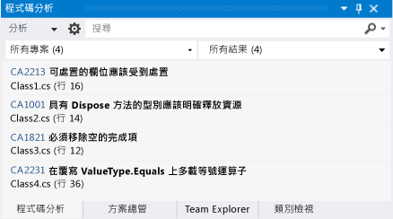
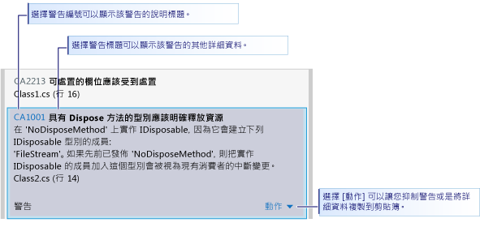
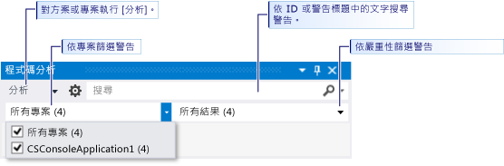

# 使用 Visual Studio 靜態程式碼分析，分析市集應用程式中的 Visual Basic 和 C# 程式碼品質
[!INCLUDE[vs2017banner](../code-quality/includes/vs2017banner.md)]

  
  
 Visual Studio Express 中的程式碼分析工具會檢查您的程式碼是否有常見缺失，以及是否違反良好的程式設計作法。  程式碼分析警告與編譯器錯誤和警告不同，因為程式碼分析工具會搜尋有效的特定程式碼模式，但仍然可以為您或使用您程式碼的其他人建立問題。  程式碼分析也可以尋找難以透過測試發現的程式碼缺失。  在開發過程中定期執行程式碼分析工具，可以提升已完成應用程式的品質。  
  
> [!NOTE]
>  在 Visual Studio Ultimate、Visual Studio Premium 及 Visual Studio Professional 中，您可以使用程式碼分析的完整功能。  請參閱 MSDN Library 中的[使用程式碼分析工具進行應用程式品質分析](http://msdn.microsoft.com/library/dd264897.aspx) \(機器翻譯\)。  
  
## 本主題內容  
 您將學習到關於下列事項：  
  
 [執行程式碼分析](../test/analyze-visual-basic-and-csharp-code-quality-in-store-apps-using-visual-studio-static-code-analysis.md#BKMK_Run)  
  
 [分析和解決程式碼分析警告](../test/analyze-visual-basic-and-csharp-code-quality-in-store-apps-using-visual-studio-static-code-analysis.md#BKMK_Analyze)  
  
 [隱藏程式碼分析警告](../test/analyze-visual-basic-and-csharp-code-quality-in-store-apps-using-visual-studio-static-code-analysis.md#BKMK_Suppress)  
  
 [搜尋和篩選程式碼分析結果](../test/analyze-visual-basic-and-csharp-code-quality-in-store-apps-using-visual-studio-static-code-analysis.md#BKMK_Search)  
  
 [Visual Basic 和 C# 程式碼分析警告](../test/analyze-visual-basic-and-csharp-code-quality-in-store-apps-using-visual-studio-static-code-analysis.md#BKMK_Warnings)  
  
##   執行程式碼分析  
 在您的 Visual Studio 方案中執行程式碼分析：  
  
-   在 \[**建置**\] 功能表上，選擇 \[**針對方案執行程式碼分析**\]。  
  
 在您每次建立專案時自動執行程式碼分析：  
  
1.  在 \[方案總管\] 中，以滑鼠右鍵按一下專案名稱，然後選擇 \[**屬性**\]。  
  
2.  在專案屬性頁面中，選擇 \[**程式碼分析**\]，然後選擇 \[**建置時啟用程式碼分析 \(定義 CODEANALYSIS 常數\)**\]。  
  
 方案已編譯並且執行程式碼分析。  結果隨即顯示在 \[程式碼分析\] 視窗中。  
  
   
  
##   分析和解決程式碼分析警告  
 若要分析特定警告，請在 \[程式碼分析\] 視窗中按一下警告的標題。  展開警告以顯示問題的詳細資訊。  
  
   
  
 當您展開警告時，會在 Visual Studio 程式碼編輯器中反白顯示造成警告的程式碼行數。  
  
   
  
 在您了解問題之後，您就可以在程式碼中解決。  然後重新執行程式碼分析，以確定 \[程式碼分析\] 視窗中不會再出現警告，而且您的修正尚未引發新的警告。  
  
> [!TIP]
>  您可以從 \[程式碼分析\] 視窗重新執行程式碼分析。  按一下 \[**分析**\] 按鈕，然後選擇要分析的範圍。  您可以在整個方案或選取的專案上重新執行分析。  
  
##   隱藏程式碼分析警告  
 有時候您可能決定不修正程式碼分析警告。  您可能會判斷解決這項警告需要太多重新編碼，而在任何實際實作程式碼時會有問題發生的可能性。  或是，您可能會認為警告中使用的分析對於特定內容是不適當的。  您可以隱藏個別的警告，使之不再出現於 \[程式碼分析\] 視窗中。  
  
 隱藏警告：  
  
1.  如果未顯示詳細資訊，則按一下警告的標題以展開警告。  
  
2.  選擇警告下方的 \[**動作**\] 連結。  
  
3.  指向 \[**隱藏訊息**\]，然後選擇 \[**在原始程式檔中**\] 或 \[**在隱藏項目檔中**\]。  
  
    -   \[**在原始程式檔中**\] 會在產生警告的方法上方的原始程式檔中，插入 `SuppressMessage` 屬性。  這可讓隱藏項目更方便搜尋。  
  
    -   \[**在隱藏項目檔中**\] 將 `SuppressMessage` 屬性加入至專案的 **GlobalSuppressions.cs** 檔案。  這可讓隱藏項目的管理更加容易。  請注意，加入至 `SuppressMessage` 的 **GlobalSuppression.cs** 屬性也以產生警告的方法為目標。  它不會全域隱藏警告。  
  
     您對於在原始程式檔或在隱藏項目檔中隱藏警告的決策，取決於您的程式碼樣式和需求。  
  
##   搜尋和篩選程式碼分析結果  
 您可以在多專案方案中搜尋警告訊息的詳細清單，以及篩選警告。  
  
   
  
 在 [!INCLUDE[vs_dev11_expwin_long](../misc/includes/vs_dev11_expwin_long_md.md)]，所有程式碼分析警告具有警告的嚴重性層級。  
  
##   Visual Basic 和 C\# 程式碼分析警告  
 程式碼分析引發下列警告：  
  
 [CA1001：具有可處置欄位的類型應該是可處置的](http://msdn.microsoft.com/library/ms182172.aspx)  
  
 [CA1821：移除空的完成項](http://msdn.microsoft.com/library/bb264476.aspx)  
  
 [CA2213：應該處置可處置的欄位](http://msdn.microsoft.com/library/ms182328.aspx)  
  
 [CA2229：實作序列化建構函式](http://msdn.microsoft.com/library/ms182343.aspx)  
  
 [CA2231：覆寫 ValueType.Equals 時的多載運算子相等](http://msdn.microsoft.com/library/ms182359.aspx)