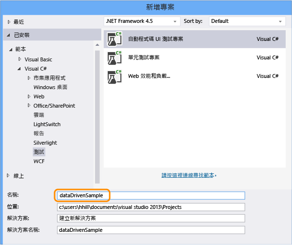
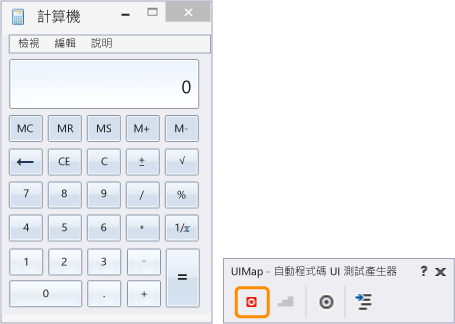
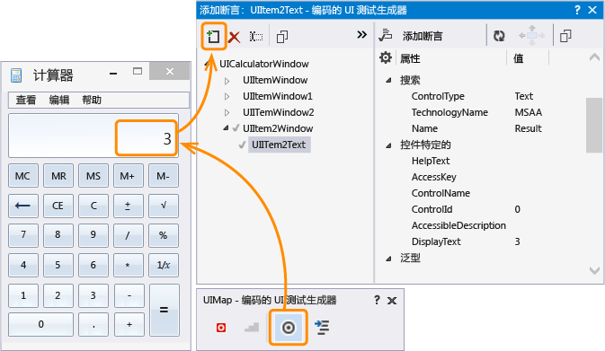
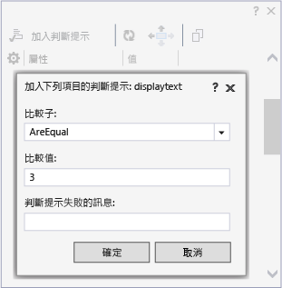
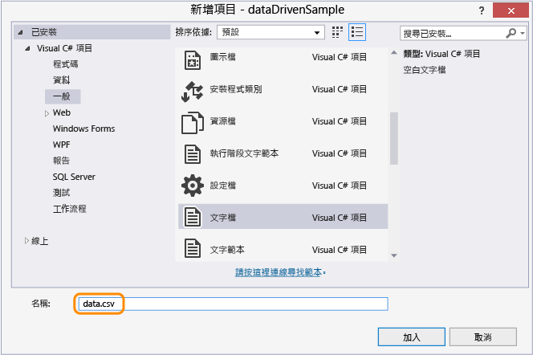
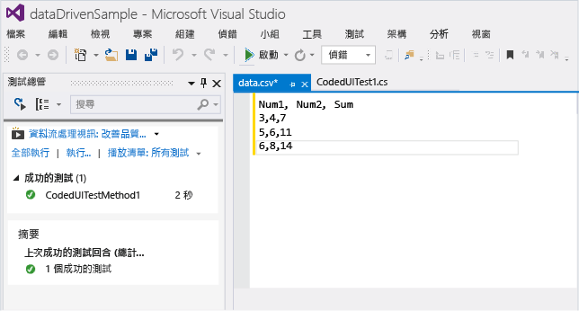
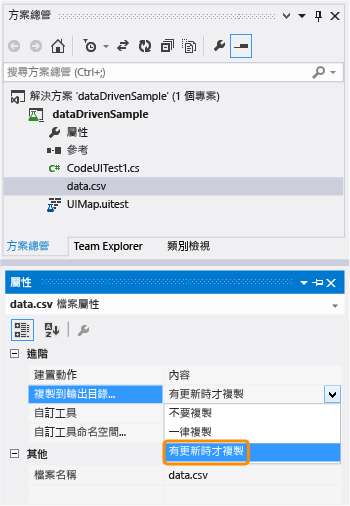
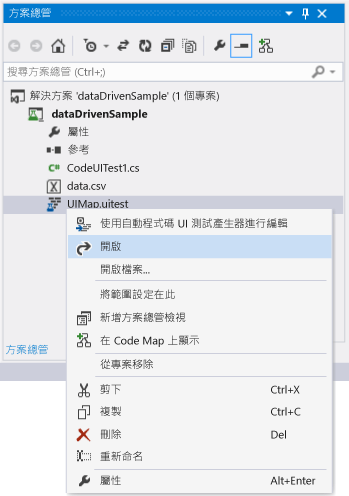
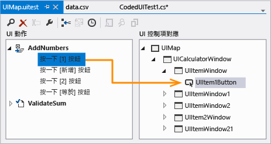
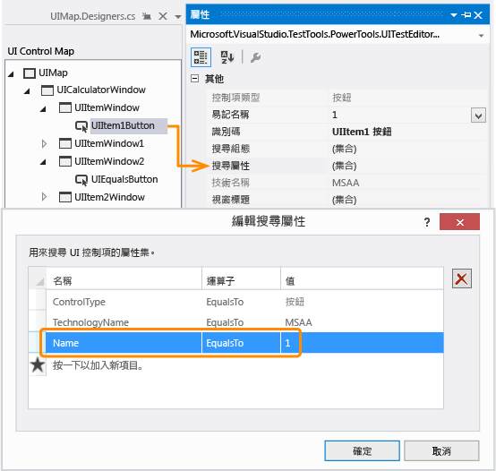

# <a name="creating-a-data-driven-coded-ui-test"></a>建立資料驅動自動程式化 UI 測試
若要測試不同的情況，您可以使用不同的參數值，多次執行您的測試。 資料驅動自動程式碼 UI 測試是方便進行這項作業的方法。 您可以在資料來源中定義參數值，而且資料來源中的每個資料列都是自動程式碼 UI 測試的反覆項目。 整體測試結果將會根據所有反覆項目的結果。 例如，如果其中一個測試反覆項目失敗，則整體測試結果就是失敗。  
  
 **Requirements**  
  
-   Visual Studio 企業版  
  
## <a name="create-a-data-driven-coded-ui-test"></a>建立資料驅動自動程式碼 UI 測試  
 這個範例會建立在 Windows 計算機應用程式上執行的自動程式碼 UI 測試。 它將兩個數字相加，並使用判斷提示來驗證總和是否正確。 接下來，會編碼兩個數字的判斷提示和參數值使其成為資料驅動並儲存在逗號分隔值 (.csv) 檔案中。  
  
#### <a name="step-1---create-a-coded-ui-test"></a>步驟 1 - 建立自動程式碼 UI 測試  
  
1.  建立專案。  
  
       
  
2.  選擇錄製動作。  
  
       
  
3.  開啟計算機應用程式，並開始錄製測試。  
  
       
  
4.  加入 1 加 2，並暫停錄製器，然後產生測試方法。 稍後，我們會將此使用者輸入的值取代為資料檔中的值。  
  
       
  
     關閉測試產生器。 此方法會加入至測試：  
  
    ```c#  
    [TestMethod]  
    public void CodedUITestMethod1()  
    {  
        // To generate code for this test, select "Generate Code for Coded UI Test" from the shortcut menu and select one of the menu items.  
        this.UIMap.AddNumbers();  
  
    }  
    ```  
  
5.  使用 `AddNumbers()` 方法，確認執行測試。 將游標放在上面顯示的測試方法中，開啟操作功能表，然後選擇 [執行測試]。 (快速鍵：Ctrl + R、T)。  
  
     [測試總管] 視窗中會顯示測試結果，而測試結果顯示測試成功還是失敗。 若要開啟 [測試總管] 視窗，請從 [測試] 功能表中選擇 [視窗]，然後選擇 [測試總管]。  
  
6.  因為資料來源也可以用於判斷提示參數值 (測試用來確認預期的值)；讓我們加入判斷提示來驗證兩個數字的總和是否正確。 將游標放在上面顯示的測試方法中，開啟操作功能表，然後依序選擇 [產生自動程式化 UI 測試的程式碼] 和 [使用自動程式化 UI 測試產生器]。  
  
     對應計算機中顯示總和的文字控制項。  
  
       
  
7.  加入判斷提示，以驗證總和的值是否正確。 選擇值為 **3** 的 [顯示文字] 屬性，然後選擇 [加入判斷提示]。 使用 **AreEqual** 比較子，並確認比較值為 **3**。  
  
       
  
8.  設定判斷提示之後，請重新從建立器產生程式碼。 這會建立新的方法來進行驗證。  
  
       
  
     因為 `ValidateSum` 方法會驗證 `AddNumbers` 方法的結果，所以請將它移至程式碼區塊底端。  
  
    ```c#  
    public void CodedUITestMethod1()  
    {  
  
        // To generate code for this test, select "Generate Code for Coded UI Test" from the shortcut menu and select one of the menu items.  
        this.UIMap.AddNumbers();  
        this.UIMap.ValidateSum();  
  
    }  
    ```  
  
9. 使用 `ValidateSum()` 方法，確認測試執行。 將游標放在上面顯示的測試方法中，開啟操作功能表，然後選擇 [執行測試]。 (快速鍵：Ctrl + R、T)。  
  
     目前，所有參數值在其方法中都會定義為常數。 接下來，讓我們建立資料集，以將測試設為資料驅動。  
  
#### <a name="step-2---create-a-data-set"></a>步驟 2 - 建立資料集  
  
1.  將文字檔加入至名稱為 `data.csv` 的 dataDrivenSample 專案。  
  
       
  
2.  將下列資料填入.csv 檔案：  
  
    |Num1|Num2|Sum|  
    |----------|----------|---------|  
    |3|4|7|  
    |5|6|11|  
    |6|8|14|  
  
     加入資料之後，該檔案應該會顯示如下：  
  
       
  
3.  務必使用正確的編碼來儲存 .csv 檔案。 在 [檔案] 功能表上，選擇 [進階儲存選項]，然後選擇 [Unicode (UTF-8 無簽章) - 字碼頁 65001] 做為編碼。  
  
4.  .csv 檔案必須複製至輸出目錄，否則無法執行測試。 使用 [屬性] 視窗來複製它。  
  
       
  
     現在，我們已經建立了資料集，讓我們將資料繫結至測試。  
  
#### <a name="step-3--add-data-source-binding"></a>步驟 3 - 加入資料來源繫結  
  
1.  若要繫結資料來源，請在測試方法正上方的現有 `DataSource` 屬性內加入 `[TestMethod]` 屬性。  
  
    ```  
    [DataSource("Microsoft.VisualStudio.TestTools.DataSource.CSV", "|DataDirectory|\\data.csv", "data#csv", DataAccessMethod.Sequential), DeploymentItem("data.csv"), TestMethod]  
    public void CodedUITestMethod1()  
    {  
  
        // To generate code for this test, select "Generate Code for Coded UI Test" from the shortcut menu and select one of the menu items.  
        this.UIMap.AddNumbers();  
        this.UIMap.ValidateSum();  
  
    }  
  
    ```  
  
     現在，您可以在這個測試方法中使用此資料來源。  
  
    > [!TIP]
    >  如需使用其他資料來源類型 (例如 XML、SQL Express 和 Excel) 的範例，請參閱＜問與答＞小節中的[資料來源屬性範例](#CreateDataDrivenCUIT_QA_DataSourceAttributes)。  
  
2.  執行測試。  
  
     請注意，測試是透過三個反覆項目來執行。 原因是所繫結的資料來源包含三個資料列。 不過，您也會發現測試仍在使用常數參數值，而且每次會加入 1 + 2 (總和為 3)。  
  
     接下來，我們會將測試設定成使用資料來源檔案中的值。  
  
#### <a name="step-4--use-the-data-in-the-coded-ui-test"></a>步驟 4 - 使用自動程式碼 UI 測試中的資料  
  
1.  將 `using Microsoft.VisualStudio.TestTools.UITesting.WinControls` 加入至 CodedUITest.cs 檔案的頂端：  
  
    ```  
    using System;  
    using System.Collections.Generic;  
    using System.Text.RegularExpressions;  
    using System.Windows.Input;  
    using System.Windows.Forms;  
    using System.Drawing;  
    using Microsoft.VisualStudio.TestTools.UITesting;  
    using Microsoft.VisualStudio.TestTools.UnitTesting;  
    using Microsoft.VisualStudio.TestTools.UITest.Extension;  
    using Keyboard = Microsoft.VisualStudio.TestTools.UITesting.Keyboard;  
    using Microsoft.VisualStudio.TestTools.UITesting.WinControls;  
    ```  
  
2.  在將套用資料來源中值的 `TestContext.DataRow[]` 方法中，加入 `CodedUITestMethod1()`。 資料來源值會使用控制項 `SearchProperties` 來覆寫指派給 UIMap 控制項的常數：  
  
    ```  
    public void CodedUITestMethod1()  
    {  
  
        // To generate code for this test, select "Generate Code for Coded UI Test" from the shortcut menu and select one of the menu items.  
        this.UIMap.UICalculatorWindow.UIItemWindow.UIItem1Button.SearchProperties[WinButton.PropertyNames.Name] = TestContext.DataRow["Num1"].ToString();this.UIMap.UICalculatorWindow.UIItemWindow21.UIItem2Button.SearchProperties[WinButton.PropertyNames.Name] = TestContext.DataRow["Num2"].ToString();  
        this.UIMap.AddNumbers();  
        this.UIMap.ValidateSumExpectedValues.UIItem2TextDisplayText = TestContext.DataRow["Sum"].ToString();  
        this.UIMap.ValidateSum();  
  
    }  
    ```  
  
     若要了解要將資料編寫至其中的搜尋屬性，請使用 [自動程式碼 UI 測試編輯器]。  
  
    -   開啟 UIMap.uitest 檔案。  
  
           
  
    -   選擇 UI 動作，並觀察對應的 UI 控制項對應。 請注意，對應如何對應至程式碼 (例如，`this.UIMap.UICalculatorWindow.UIItemWindow.UIItem1Button`)。  
  
           
  
    -   在 [屬性] 視窗中，開啟 [搜尋屬性]。 搜尋屬性 **Name** 值是程式碼中使用資料來源所操作的值。 例如，會將每個資料列的第一欄中的值指派給 `SearchProperties`：`UIItem1Button.SearchProperties[WinButton.PropertyNames.Name] = TestContext.DataRow["Num1"].ToString();`。 對於三個反覆項目，這項測試會依序將搜尋屬性的 **Name** 值變更為 3、5 和 6。  
  
           
  
3.  儲存組態。  
  
#### <a name="step-5--run-the-data-driven-test"></a>步驟 5 - 執行資料驅動測試  
  
1.  重新執行測試，確認測試現在是資料驅動。  
  
     您應該會看到使用 .csv 檔案中的值透過三個反覆項目的測試回合。 驗證也應該會運作，而且測試在 [測試總管] 中應該顯示為通過。  
  
 **指引**  
  
 如需詳細資訊，請參閱[使用 Visual Studio 2012 測試持續傳遞 – 第 2 章：單元測試：內部測試 (英文)](http://go.microsoft.com/fwlink/?LinkID=255188) 和[使用 Visual Studio 2012 測試持續傳遞 – 第 5 章：自動化系統測試 (英文)](http://go.microsoft.com/fwlink/?LinkID=255196)  
  
## <a name="q--a"></a>問與答  
  
###  <a name="a-namecreatedatadrivencuitqadatasourceattributesa-what-are-the-data-source-attributes-for-other-data-source-types-such-as-sql-express-or-xml"></a><a name="CreateDataDrivenCUIT_QA_DataSourceAttributes"></a> 其他資料來源類型 (例如 SQL Express 或 XML) 的資料來源屬性為何？  
 您可以使用下表中的範例資料來源字串，方法是將它們複製至您的程式碼，並進行必要的自訂。  
  
 **資料來源類型和屬性**  
  
-   CSV  
  
     `[DataSource("Microsoft.VisualStudio.TestTools.DataSource.CSV", "|DataDirectory|\\data.csv", "data#csv", DataAccessMethod.Sequential), DeploymentItem("data.csv"), TestMethod]`  
  
-   Excel  
  
     `DataSource("System.Data.Odbc", "Dsn=ExcelFiles;Driver={Microsoft Excel Driver (*.xls)};dbq=|DataDirectory|\\Data.xls;defaultdir=.;driverid=790;maxbuffersize=2048;pagetimeout=5;readonly=true", "Sheet1$", DataAccessMethod.Sequential), DeploymentItem("Sheet1.xls"), TestMethod]`  
  
-   Team Foundation Server 中的測試案例  
  
     `[DataSource("Microsoft.VisualStudio.TestTools.DataSource.TestCase", "http://vlm13261329:8080/tfs/DefaultCollection;Agile", "30", DataAccessMethod.Sequential), TestMethod]`  
  
-   XML  
  
     `[DataSource("Microsoft.VisualStudio.TestTools.DataSource.XML", "|DataDirectory|\\data.xml", "Iterations", DataAccessMethod.Sequential), DeploymentItem("data.xml"), TestMethod]`  
  
-   SQL Express  
  
     `[DataSource("System.Data.SqlClient", "Data Source=.\\sqlexpress;Initial Catalog=tempdb;Integrated Security=True", "Data", DataAccessMethod.Sequential), TestMethod]`  
  
### <a name="q-can-i-use-data-driven-tests-on-my-windows-phone-app"></a>問：我是否可以在 Windows Phone 應用程式上使用資料驅動型測試？  
 **答：** 可以。 Windows Phone 的資料驅動型自動程式碼 UI 測試是透過測試方法上的 DataRow 屬性來定義。 在下列範例中，x 和 y 針對測試的第一個反覆項目使用值 1 和 2，並針對第二個反覆項目使用 -1 和 -2。  
  
```  
[DataRow(1, 2, DisplayName = "Add positive numbers")]  
[DataRow(-1, -2, DisplayName = "Add negative numbers")]  
[TestMethod]  
public void DataDrivingDemo_MyTestMethod(int x, int y)  
  
```  
  
 如需詳細資訊，請參閱[在 Windows Phone 應用程式上使用資料驅動型自動程式化 UI 測試](../test/test-windows-phone-8-1-apps-with-coded-ui-tests.md#TestingPhoneAppsCodedUI_DataDriven)。  
  
### <a name="q-why-cant-i-modify-the-code-in-the-uimapdesigner-file"></a>問：為什麼無法修改 UIMap.Designer 檔案中的程式碼？  
 **答**：每次您使用 [UIMap - 自動程式化 UI 測試產生器] 產生程式碼時，對 UIMapDesigner.cs 檔案中的程式碼所做的變更都會被覆寫。 在這個範例中，而且在大多數的情況下，可以對測試的原始程式碼檔案 (即 CodedUITest1.cs) 進行讓測試使用資料來源所需的程式碼變更。  
  
 如果您需要修改錄製的方法，必須將它複製到 UIMap.cs 檔案並重新命名。 UIMap.cs 檔案可用來覆寫 UIMapDesigner.cs 檔案中的方法和屬性。 您必須移除 Coded UITest.cs 檔案中原始方法的參考，並將它取代為重新命名的方法名稱。  
  
## <a name="see-also"></a>另請參閱  
 <xref:Microsoft.VisualStudio.TestTools.UITest.Common.UIMap.UIMap>   
 <xref:Microsoft.VisualStudio.TestTools.UnitTesting.Assert>   
 [使用使用者介面自動化來測試您的程式碼](../test/use-ui-automation-to-test-your-code.md)   
 [建立自動程式化 UI 測試](../test/use-ui-automation-to-test-your-code.md#VerifyingCodeUsingCUITCreate)   
 [自動程式化 UI 測試的最佳做法](../test/best-practices-for-coded-ui-tests.md)   
 [自動程式化 UI 測試和動作記錄的支援組態和平台](../test/supported-configurations-and-platforms-for-coded-ui-tests-and-action-recordings.md)


<!--HONumber=Feb17_HO4-->


