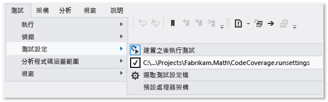
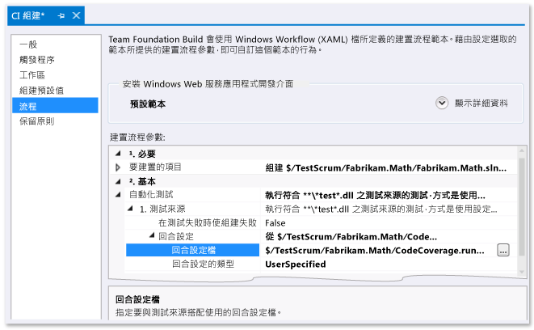

# 自訂程式碼涵蓋範圍分析
[!INCLUDE[vs2017banner](../code-quality/includes/vs2017banner.md)]

根據預設，Visual Studio 程式碼涵蓋範圍工具會分析在單元測試期間載入的所有方案組件 \(.exe\/.dll\)。  我們建議您保持此預設值，因為大部分時間都可以運作良好。  如需詳細資訊，請參閱[使用程式碼涵蓋範圍來決定所測試的程式碼數量](../test/using-code-coverage-to-determine-how-much-code-is-being-tested.md)。  
  
 在自訂程式碼涵蓋範圍行為之前，請考慮某些替代作法：  
  
-   *我想要從程式碼涵蓋範圍結果中排除測試程式碼，並只包含應用程式程式碼。*  
  
     在測試類別中加入 `ExcludeFromCodeCoverage Attribute`。  
  
-   *我想要包含不屬於我方案的組件。*  
  
     取得這些組件的 .pdb 檔案，並將這些檔案複製到組件 .dll 檔案所在的資料夾。  
  
 若要自訂程式碼涵蓋範圍行為，請複製[本主題結尾處的範例](#sample)，然後使用副檔名 .runsettings 將範例加入到方案中。  根據您的需求編輯範例，然後在 \[**測試**\] 功能表中依序選擇 \[**測試設定**\]、\[**選取測試設定**\] 檔案。  本主題的其餘部分將深入說明此程序。  
  
## .runsettings 檔案  
 .runsettings 檔案中會指定進階的程式碼涵蓋範圍設定。  這是單元測試工具所使用的組態檔。  我們建議您複製本主題結尾處的[範例](#sample)，然後根據您自己的需求進行編輯。  
  
-   *我在 Visual Studio 2010 中使用的 .testsettings 檔案有何問題？*  
  
     Visual Studio 2010 中的 .testsettings 檔案只適用於 MSTest 架構的單元測試。  在 Visual Studio 2012 中，測試工具不僅適用於 MSTest，也適用於 NUnit 和 xUnit 之類的其他架構。  net。  .testsettings 檔案不適用於這些架構。  .runsettings 檔案的作用是以能夠適用於所有測試架構的方式自訂測試工具。  
  
 若要自訂程式碼涵蓋範圍，您必須在方案中加入 .runsettings 檔案：  
  
1.  加入 .xml 檔案，做為副檔名是 `.runsettings` 的方案項目：  
  
     在 \[方案總管\] 中，選擇方案捷徑功能表上的 \[**加入**\]、\[**新增項目**\]，然後選取 \[**XML 檔**\]。  儲存檔案，檔案名稱結尾的格式必須是 `CodeCoverage.runsettings`  
  
2.  加入本主題結尾處範例中的內容，然後依照下列各節的說明並根據您自己的需求進行自訂。  
  
3.  在 \[**測試**\] 功能表上，選擇 \[**測試設定**\]、\[**選取測試設定檔**\] 並選取檔案。  
  
4.  現在，當您執行 \[**分析程式碼涵蓋範圍**\] 時，這個 \[`.runsettings`\] 檔案就會控制其行為。  不要忘記您必須再次執行程式碼涵蓋範圍：當您執行測試或更新程式碼時，並不會自動隱藏之前的涵蓋範圍結果及程式碼著色。  
  
5.  要開啟及關閉自訂設定，請取消選取或選取 \[**測試**\]、\[**測試設定**\] 功能表中的檔案。  
  
   
  
 您可以在同一個 .runsettings 檔案中設定單元測試的其他設定。  如需詳細資訊，請參閱[對程式碼進行單元測試](../test/unit-test-your-code.md)。  
  
### 指定符號搜尋路徑  
 程式碼涵蓋範圍要求必須要有組件的符號 \(.pdb 檔案\)。  在您的方案所建置的組件中，符號檔案通常會和二進位檔一起出現，而且程式碼涵蓋範圍會自動運作。  但是在某些情況下，您可以在程式碼涵蓋範圍分析中加入參考的組件。  在此類情況下，.pdb 檔案不可以和二進位檔同時出現，不過您可以在 .runsettings 檔案中指定符號搜尋路徑。  
  
```xml  
<SymbolSearchPaths>                
      <Path>\\mybuildshare\builds\ProjectX</Path>  
      <!--More paths if required-->  
</SymbolSearchPaths>  
  
```  
  
> [!WARNING]
>  符號解析可能需要一些時間，特別是在使用具有大量組件的遠端檔案位置時。  因此，請考慮將遠端 .pdb 檔案複製到二進位 \(.dll 和 .exe\) 檔案在本機中的位置。  
  
### 排除和包含  
 您可以在程式碼涵蓋範圍分析中排除指定的組件。  例如：  
  
```minterastlib  
<ModulePaths>  
  <Exclude>  
   <ModulePath>Fabrikam.Math.UnitTest.dll</ModulePath>  
   <!-- Add more ModulePath nodes here. -->  
  </Exclude>  
</ModulePaths>  
```  
  
 或者，您可以指定應包含的組件。  這種方法的缺點是，當您將其他組件加入至方案時，必須記得將它們加入至清單：  
  
```minterastlib  
<ModulePaths>  
  <Include>  
   <ModulePath>Fabrikam.Math.dll</ModulePath>  
   <!-- Add more ModulePath nodes here. -->  
  </Include>  
</ModulePaths>  
```  
  
 如果 `<Include>` 是空的，則程式碼涵蓋範圍處理會包括所有以載入的組件 \(.dll 和 .exe 檔\)，以及所有可以找到的 **.pdb** 檔案 \(與 `<Exclude>` 清單的子句相符的項目除外\)。  
  
 在`Include` 的處理順序在 `Exclude` 之前。  
  
### 規則運算式  
 包含和排除節點使用規則運算式。  如需詳細資訊，請參閱[在 Visual Studio 中使用規則運算式](../ide/using-regular-expressions-in-visual-studio.md)。  規則運算式和萬用字元不同。  特別之處在於：  
  
1.  **.\*** 會比對任何字元的字串  
  
2.  **\\.** 會比對點「.」  
  
3.  **\\\(   \\\)** 會比對括號「\(  \)」  
  
4.  **\\ \\** 會比對檔案路徑分隔符號「\\」。  
  
5.  **^** 會比對字串的開頭  
  
6.  **$** 會比對字串的結尾  
  
 所有相符項目皆不區分大小寫。  
  
 例如：  
  
```xml  
<ModulePaths>  
  <Include>  
    <!-- Include all loaded .dll assemblies (but not .exe assemblies): -->  
    <ModulePath>.*\.dll$</ModulePath>  
  </Include>  
  <Exclude>  
    <!-- But exclude some assemblies: -->  
    <ModulePath>.*\\Fabrikam\.MyTests1\.dll$</ModulePath>  
    <!-- Exclude all file paths that contain "Temp": -->  
    <ModulePath>.*Temp.*</ModulePath>   
  </Exclude>  
</ModulePaths>  
  
```  
  
> [!WARNING]
>  如果規則運算式出現錯誤，例如未逸出和無對應的括號，則程式碼涵蓋範圍分析不會執行。  
  
### 包含或排除項目的其他方法  
 如需範例，請參閱本主題結尾處的[範例](#sample)。  
  
-   `ModulePath` – 組件檔案路徑指定的組件。  
  
-   `CompanyName` – 會依 Company 屬性比對組件。  
  
-   `PublicKeyToken` – 會依公開金鑰語彙基元比對已簽署的組件。  舉例來說，若要比對所有 Visual Studio 元件和副檔名，請使用 `<PublicKeyToken>^B03F5F7F11D50A3A$</PublicKeyToken>`。  
  
-   `Source` – 依原始檔案路徑名稱的定義方式比對項目。  
  
-   `Attribute` – 比對附加特定屬性的項目。  指定屬性的完整名稱，包括名稱結尾的「屬性」。  
  
-   `Function` – 依完整名稱比對程序、函式或方法。  
  
 **比對函式名稱**  
  
 您的規則運算式必須比對函式的完整名稱，包括命名空間、類別名稱、方法名稱和參數清單。  例如：  
  
-   C\# 或 Visual Basic：`Fabrikam.Math.LocalMath.SquareRoot(double)`  
  
-   C\+\+：`Fabrikam::Math::LocalMath::SquareRoot(double)`  
  
```xml  
<Functions>  
  <Include>  
    <!-- Include methods in the Fabrikam namespace: -->  
    <Function>^Fabrikam\..*</Function>  
    <!-- Include all methods named EqualTo: -->  
    <Function>.*\.EqualTo\(.*</Function>  
  </Include>  
  <Exclude>  
    <!-- Exclude methods in a class or namespace named UnitTest: -->  
    <Function>.*\.UnitTest\..*</Function>  
  </Exclude>  
</Functions>  
  
```  
  
## 執行測試時如何指定 .runsettings 檔案  
  
### 在 Visual Studio 測試中執行 runsettings  
 選擇 \[**測試**\]、\[**測試設定**\]、\[**選取測試設定檔**\]，然後選取 .runsettings 檔案。  該檔案隨即出現在 \[測試設定 \]功能表中，您可以加以選取或取消。  選取該檔案時，無論何時只要使用 \[**分析程式碼涵蓋範圍**\] 就會套用您的 runsettings 檔案。  
  
### 自訂命令列測試中的回合設定  
 若要從命令列執行測試，請使用 vstest.console.exe。  設定檔案是此公用程式的參數。  如需詳細資訊，請參閱 [從命令列使用 VSTest.console](/devops-test-docs/test/using-vstest-console-from-the-command-line)。  
  
1.  啟動 Visual Studio Developer 命令提示字元：  
  
     在 Windows 的 \[**開始**\] 中，依序選擇 \[**所有程式**\]、\[**Microsoft Visual Studio**\]、\[**Visual Studio Tools**\]、\[**開發人員命令提示字元**\]。  
  
2.  執行：  
  
     `vstest.console.exe MyTestAssembly.dll /EnableCodeCoverage /Settings:CodeCoverage.runsettings`  
  
### 在組建定義中自訂回合設定  
 您可以從 Team Build 取得程式碼涵蓋範圍資料。  
  
   
  
1.  請務必簽入您的 .runsettings 檔案。  
  
2.  在 Team Explorer 中開啟 \[**組建**\]，然後加入或編輯組建定義。  
  
3.  在 \[**流程**\] 頁面上，展開 \[**自動化測試**\]、\[**測試來源**\]、\[**回合設定**\]。  選取您的 **.runsettings** 檔案。  
  
    -   *但是會出現 \[**測試組件**\] 而非 \[**測試來源**\]。  當我嘗試設定 \[**回合設定**\] 欄位時，我只能選取 .testsettings 檔案。*  
  
         在 \[**自動化測試**\] 下選取 \[**測試組件**\]，然後選擇該行結尾的 **\[...\]**。  在 \[**加入\/編輯測試回合**\] 對話方塊中，將 \[**測試執行器**\] 設為 \[**Visual Studio 測試執行器**\]。  
  
 結果會顯示在組建報告的摘要區段。  
  
##  <a name="sample"></a> 範例 .runsettings 檔案  
 複製此程式碼並根據您自己的需求進行編輯。  這是預設的 .runsettings 檔案。  
  
 \(如需了解 .runsettings 檔案的其他用途，請參閱[使用 .runsettings 檔案設定單元測試](../test/configure-unit-tests-by-using-a-dot-runsettings-file.md)。\)  
  
```xml  
<?xml version="1.0" encoding="utf-8"?>  
<!-- File name extension must be .runsettings -->  
<RunSettings>  
  <DataCollectionRunSettings>  
    <DataCollectors>  
      <DataCollector friendlyName="Code Coverage" uri="datacollector://Microsoft/CodeCoverage/2.0" assemblyQualifiedName="Microsoft.VisualStudio.Coverage.DynamicCoverageDataCollector, Microsoft.VisualStudio.TraceCollector, Version=11.0.0.0, Culture=neutral, PublicKeyToken=b03f5f7f11d50a3a">  
        <Configuration>  
          <CodeCoverage>  
<!--  
Additional paths to search for .pdb (symbol) files. Symbols must be found for modules to be instrumented.  
If .pdb files are in the same folder as the .dll or .exe files, they are automatically found. Otherwise, specify them here.  
Note that searching for symbols increases code coverage runtime. So keep this small and local.  
-->   
<!--             
            <SymbolSearchPaths>                
                   <Path>C:\Users\User\Documents\Visual Studio 2012\Projects\ProjectX\bin\Debug</Path>  
                   <Path>\\mybuildshare\builds\ProjectX</Path>  
            </SymbolSearchPaths>  
-->  
  
<!--  
About include/exclude lists:  
Empty "Include" clauses imply all; empty "Exclude" clauses imply none.  
Each element in the list is a regular expression (ECMAScript syntax). See http://msdn.microsoft.com/library/2k3te2cs.aspx.  
An item must first match at least one entry in the include list to be included.  
Included items must then not match any entries in the exclude list to remain included.  
-->  
  
            <!-- Match assembly file paths: -->  
            <ModulePaths>  
              <Include>  
                <ModulePath>.*\.dll$</ModulePath>  
                <ModulePath>.*\.exe$</ModulePath>  
              </Include>  
              <Exclude>  
                <ModulePath>.*CPPUnitTestFramework.*</ModulePath>  
              </Exclude>  
            </ModulePaths>  
  
            <!-- Match fully qualified names of functions: -->  
            <!-- (Use "\." to delimit namespaces in C# or Visual Basic, "::" in C++.)  -->  
            <Functions>  
              <Exclude>  
                <Function>^Fabrikam\.UnitTest\..*</Function>           
                <Function>^std::.*</Function>  
                <Function>^ATL::.*</Function>  
                <Function>.*::__GetTestMethodInfo.*</Function>  
                <Function>^Microsoft::VisualStudio::CppCodeCoverageFramework::.*</Function>  
                <Function>^Microsoft::VisualStudio::CppUnitTestFramework::.*</Function>  
              </Exclude>  
            </Functions>  
  
            <!-- Match attributes on any code element: -->  
            <Attributes>  
              <Exclude>  
                <!—Don't forget "Attribute" at the end of the name -->  
                <Attribute>^System\.Diagnostics\.DebuggerHiddenAttribute$</Attribute>  
                <Attribute>^System\.Diagnostics\.DebuggerNonUserCodeAttribute$</Attribute>  
                <Attribute>^System\.Runtime\.CompilerServices.CompilerGeneratedAttribute$</Attribute>  
                <Attribute>^System\.CodeDom\.Compiler.GeneratedCodeAttribute$</Attribute>  
                <Attribute>^System\.Diagnostics\.CodeAnalysis.ExcludeFromCodeCoverageAttribute$</Attribute>  
              </Exclude>  
            </Attributes>  
  
            <!-- Match the path of the source files in which each method is defined: -->  
            <Sources>  
              <Exclude>  
                <Source>.*\\atlmfc\\.*</Source>  
                <Source>.*\\vctools\\.*</Source>  
                <Source>.*\\public\\sdk\\.*</Source>  
                <Source>.*\\microsoft sdks\\.*</Source>  
                <Source>.*\\vc\\include\\.*</Source>  
              </Exclude>  
            </Sources>  
  
            <!-- Match the company name property in the assembly: -->  
            <CompanyNames>  
              <Exclude>  
                <CompanyName>.*microsoft.*</CompanyName>  
              </Exclude>  
            </CompanyNames>  
  
            <!-- Match the public key token of a signed assembly: -->  
            <PublicKeyTokens>  
              <!-- Exclude Visual Studio extensions: -->  
              <Exclude>  
                <PublicKeyToken>^B77A5C561934E089$</PublicKeyToken>  
                <PublicKeyToken>^B03F5F7F11D50A3A$</PublicKeyToken>  
                <PublicKeyToken>^31BF3856AD364E35$</PublicKeyToken>  
                <PublicKeyToken>^89845DCD8080CC91$</PublicKeyToken>  
                <PublicKeyToken>^71E9BCE111E9429C$</PublicKeyToken>  
                <PublicKeyToken>^8F50407C4E9E73B6$</PublicKeyToken>  
                <PublicKeyToken>^E361AF139669C375$</PublicKeyToken>  
              </Exclude>  
            </PublicKeyTokens>  
  
            <!-- We recommend you do not change the following values: -->  
            <UseVerifiableInstrumentation>True</UseVerifiableInstrumentation>  
            <AllowLowIntegrityProcesses>True</AllowLowIntegrityProcesses>  
            <CollectFromChildProcesses>True</CollectFromChildProcesses>  
            <CollectAspDotNet>False</CollectAspDotNet>  
  
          </CodeCoverage>  
        </Configuration>  
      </DataCollector>  
    </DataCollectors>  
  </DataCollectionRunSettings>  
</RunSettings>  
  
```  
  
## 請參閱  
 [使用程式碼涵蓋範圍來決定所測試的程式碼數量](../test/using-code-coverage-to-determine-how-much-code-is-being-tested.md)   
 [對程式碼進行單元測試](../test/unit-test-your-code.md)