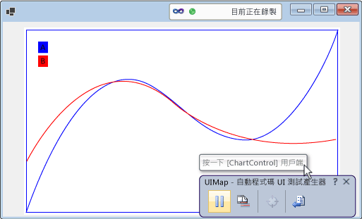
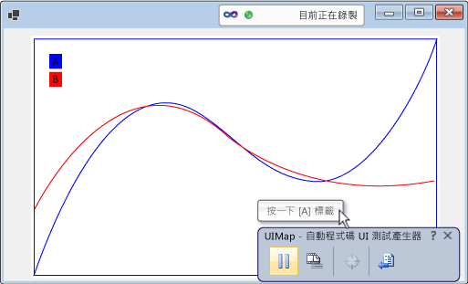

# 啟用控制項的自動程式碼 UI 測試功能
[!INCLUDE[vs2017banner](../code-quality/includes/vs2017banner.md)]

如果您實作支援自動程式碼 UI 測試架構，您的控制項可以更容易的被測試。  您可以新增支援來增加層級。  您可以從支援錄製、播放和屬性驗證開始。  您可以建置在允許自動程式碼 UI 測試產生器來辨認您控制項的自訂屬性，並提供自訂類別從已產生的程式碼存取這些屬性。  您也可以用較接近正在錄製動作目的方式幫助自動程式碼 UI 測試產生器擷取動作。  
  
 **本主題內容：**  
  
1.  [藉由實作協助工具來支援錄製、播放和屬性驗證。](../test/enable-coded-ui-testing-of-your-controls.md#recordandplayback)  
  
2.  [藉由實作屬性提供者來支援自訂屬性驗證。](../test/enable-coded-ui-testing-of-your-controls.md#customproprties)  
  
3.  [透過實作類別存取自訂屬性以支援程式碼產生](../test/enable-coded-ui-testing-of-your-controls.md#codegeneration)  
  
4.  [藉由實作動作篩選條件來支援意圖感知動作](../test/enable-coded-ui-testing-of-your-controls.md#intentawareactions)  
  
   
  
##  <a name="recordandplayback"></a> 藉由實作協助工具來支援錄製、播放和屬性驗證。  
 自動程式碼 UI 測試產生器會擷取在記錄期間控制項遇到並產生程式碼來重新執行該工作階段的相關資訊。  如果控制項不支援協助工具，則自動程式碼 UI 測試產生器會利用螢幕座標擷取動作 \(例如按一下滑鼠\) 。  當測試播放中，產生的程式碼會在相同螢幕座標中執行滑鼠的點擊 。  當測試進行中時，如果控制項出現在螢幕上的不同位置，產生的程式碼不會對控制項執行該動作。  如果測試在不同螢幕設定、不同環境或UI設定後曾有過變更時播放，都可能導致執行失敗。  
  
   
  
 如果您實作協助工具，因此，自動程式碼 UI 測試產生器會在錄製測試並產生程式碼時，使用協助工具來取得控制項的資訊。  然後，當您執行測試時，產生的程式碼可針對您的控制向重新執行事件物件，即使在使用者介面有其他測試在執行。  測試作者同時也可以使用控制項的基底屬性建立判斷提示。  
  
   
  
### 支援的錄製和播放、屬性驗證和巡覽 Windows Form 控制項  
 以下程式為如何實作控制項的協助工具，詳細說明則在 <xref:System.Windows.Forms.AccessibleObject>。  
  
   
  
1.  實作從 <xref:System.Windows.Forms.Control.ControlAccessibleObject>衍生的類別，並覆寫 <xref:System.Windows.Forms.Control.AccessibilityObject%2A> 屬性傳回類別的物件。  
  
    ```c#  
    public partial class ChartControl : UserControl  
    {  
        // Overridden to return the custom AccessibleObject for the control.  
        protected override AccessibleObject CreateAccessibilityInstance()  
        {  
            return new ChartControlAccessibleObject(this);  
        }  
  
        // Inner class ChartControlAccessibleObject represents accessible information  
        // associated with the ChartControl and is used when recording tests.  
        public class ChartControlAccessibleObject : ControlAccessibleObject  
        {  
            ChartControl myControl;  
            public ChartControlAccessibleObject(ChartControl ctrl)  
                : base(ctrl)  
            {  
                myControl = ctrl;  
            }  
        }  
    }  
    ```  
  
2.  覆寫可存取物件的 <xref:System.Windows.Forms.AccessibleObject.Role%2A>、 <xref:System.Windows.Forms.AccessibleObject.State%2A>、 <xref:System.Windows.Forms.AccessibleObject.GetChild%2A> 和 <xref:System.Windows.Forms.AccessibleObject.GetChildCount%2A> 屬性和方法。  
  
3.  為子控制項實作另一個協助工具物件，並覆寫子控制項的 <xref:System.Windows.Forms.Control.AccessibilityObject%2A> 屬性以傳回該協助工具物件。  
  
4.  覆寫子控制項的存取範圍物件的 <xref:System.Windows.Forms.AccessibleObject.Bounds%2A><xref:System.Windows.Forms.AccessibleObject.Name%2A><xref:System.Windows.Forms.AccessibleObject.Parent%2A>、、、、、 <xref:System.Windows.Forms.AccessibleObject.Role%2A><xref:System.Windows.Forms.AccessibleObject.State%2A><xref:System.Windows.Forms.AccessibleObject.Navigate%2A>和 <xref:System.Windows.Forms.AccessibleObject.Select%2A> 屬性和方法。  
  
> [!NOTE]
>  這個主題由下列程式範例開始 <xref:System.Windows.Forms.AccessibleObject> ，然後在其餘的程序中建置。  如果您想要建立協助工具範例的可用版本，請建立主控台應用程式，接著用範例程式碼取代 Program.cs 的程式碼。  您將需要加入協助工具、System.Drawing 和 System.Windows.Forms 的參考。  您應該變更協助工具的 \[**內嵌 Interop 型別**\] 至錯誤排除建置警告。  您可以從主控台應用程式到 Windows 應用程式變更專案的輸出類型，讓主控台視窗不會在您執行應用程式出現。  
  
##  <a name="customproprties"></a> 藉由實作屬性提供者來支援自訂屬性驗證。  
 當您實作基本支援記錄、播放和屬性驗證，您可以透過實作進行 <xref:Microsoft.VisualStudio.TestTools.UITesting.UITestPropertyProvider> 插入控制項的自訂屬性至自動程式碼 UI 測試。  例如，下列程序建立屬性提供者以允許自動程式碼 UI 測試來存取圖表控制項中 CurveLegend 子控制項的狀態屬性。  
  
   
  
### 支援自訂屬性驗證。  
   
  
1.  請覆寫曲線圖例可存取物件的 <xref:System.Windows.Forms.AccessibleObject.Description%2A> 屬性來傳遞描述字串中的屬性值，並且使用分號\(;\)從主要描述\(和其他，如果您時做多重屬性\)中分離出來。  
  
    ```c#  
    public class CurveLegendAccessibleObject : AccessibleObject  
    {  
        // add the state property value to the description  
        public override string Description  
        {  
            get  
            {  
                // Add “;” and the state value to the end  
                // of the curve legend’s description  
                return "CurveLegend; " + State.ToString();  
            }  
        }  
    }  
    ```  
  
2.  透過建立類別庫專案以建立您控制項的 UI 測試擴充功能套件並將對協助工具、Microsoft.VisualStudio.TestTools.UITesting、Microsoft.VisualStudio.TestTools.UITest.Common 和 Microsoft.VisualStudio.TestTools.Extension 的參考。  變更存取範圍的 \[**內嵌 Interop 型別**\] 設為 false。  
  
3.  新增從 <xref:Microsoft.VisualStudio.TestTools.UITesting.UITestPropertyProvider>衍生的屬性提供者類別。  
  
    ```c#  
    using System;  
    using System.Collections.Generic;  
    using Accessibility;  
    using Microsoft.VisualStudio.TestTools.UITesting;  
    using Microsoft.VisualStudio.TestTools.UITest.Extension;  
    using Microsoft.VisualStudio.TestTools.UITesting.WinControls;  
    using Microsoft.VisualStudio.TestTools.UITest.Common;  
  
    namespace ChartControlExtensionPackage  
    {  
        public class ChartControlPropertyProvider : UITestPropertyProvider  
        {  
        }  
    }  
    ```  
  
4.  藉由將屬性名稱和屬性描述項設置在 <xref:System.Collections.Generic.Dictionary%602>以實作屬性提供者。  
  
<CodeContentPlaceHolder>3</CodeContentPlaceHolder>  
5.  覆寫 <xref:Microsoft.VisualStudio.TestTools.UITesting.UITestPropertyProvider.GetControlSupportLevel%2A?displayProperty=fullName> 來指出您的組件會提供給您的控制項及其子控制項的特定支援。  
  
<CodeContentPlaceHolder>4</CodeContentPlaceHolder>  
6.  覆寫 <xref:Microsoft.VisualStudio.TestTools.UITesting.UITestPropertyProvider?displayProperty=fullName>的剩餘抽象方法。  
  
<CodeContentPlaceHolder>5</CodeContentPlaceHolder>  
7.  新增從 <xref:Microsoft.VisualStudio.TestTools.UITest.Extension.UITestExtensionPackage>衍生的擴充功能套件類別。  
  
<CodeContentPlaceHolder>6</CodeContentPlaceHolder>  
8.  定義組件的 `UITestExtensionPackage` 屬性。  
  
<CodeContentPlaceHolder>7</CodeContentPlaceHolder>  
9. 當屬性提供者要求時，在擴充功能套件類別中，覆寫 <xref:Microsoft.VisualStudio.TestTools.UITest.Extension.UITestExtensionPackage.GetService%2A?displayProperty=fullName> 以傳回屬性提供者類別。  
  
<CodeContentPlaceHolder>8</CodeContentPlaceHolder>  
10. 覆寫剩餘的抽象方法和 <xref:Microsoft.VisualStudio.TestTools.UITest.Extension.UITestExtensionPackage>屬性。  
  
<CodeContentPlaceHolder>9</CodeContentPlaceHolder>  
11. 建置二進位檔並將其複製到 **%ProgramFiles%\\ Common \\ Microsoft Shared \\ VSTT \\ 10.0 \\ UITestExtensionPackages**。  
  
> [!NOTE]
>  這個擴充功能封裝會套用至型別為「Text」的所有控制項。  如果您正在測試相同型別的多個控制項，當您正在錄製測試時，必須個別測試並且管理所部署的擴充功能套件。  
  
##  <a name="codegeneration"></a> 透過實作類別存取自訂屬性以支援程式碼產生  
 當自動程式碼 UI 測試產生器從工作階段記錄中產生程式碼時，它會使用 <xref:Microsoft.VisualStudio.TestTools.UITesting.UITestControl> 類別存取您的控制項。  
  
<CodeContentPlaceHolder>10</CodeContentPlaceHolder>  
 如果您實作屬性提供者來提供控制項自訂屬性的存取，您可以新增用來存取這些屬性的特定類別，以簡化產生的程式碼。  
  
<CodeContentPlaceHolder>11</CodeContentPlaceHolder>  
### 新增特定類別來存取您的控制項。  
   
  
1.  實作從 <xref:Microsoft.VisualStudio.TestTools.UITesting.WinControls.WinControl> 衍生的類別並將此控制項型別加入至建構函式的搜尋屬性集合。  
  
<CodeContentPlaceHolder>12</CodeContentPlaceHolder>  
2.  實作控制項的自訂屬性為類別的屬性。  
  
<CodeContentPlaceHolder>13</CodeContentPlaceHolder>  
3.  覆寫您對屬性提供者的 <xref:Microsoft.VisualStudio.TestTools.UITesting.UITestPropertyProvider.GetSpecializedClass%2A?displayProperty=fullName> 方法以傳回新類別的型別的給曲線圖例子控制項。  
  
<CodeContentPlaceHolder>14</CodeContentPlaceHolder>  
4.  覆寫您對屬性提供者的 <xref:Microsoft.VisualStudio.TestTools.UITesting.UITestPropertyProvider.GetPropertyNamesClassType%2A> 方法以傳回新類別中 PropertyNames 方法的型別。  
  
<CodeContentPlaceHolder>15</CodeContentPlaceHolder>  
##  <a name="intentawareactions"></a> 藉由實作動作篩選條件來支援意圖感知動作  
 當 Visual Studio 錄製測試時，會擷取每個滑鼠和鍵盤事件。  不過，在某些情況下，一連串的滑鼠和鍵盤事件中動作的目的可能會遺失。  例如，如果控制項支援自動完成，當測試在不同環境下撥放時，同一組滑鼠和鍵盤事件可能會產生不同的值。  您可以新增動作篩選條件的外掛程式用單一動作來取道一系列的鍵盤和滑鼠事件。  如此一來，您就可以取代用設定值的單一動作取代用選取項目值的一系列的滑鼠和鍵盤事件。  這樣做會保護自動程式碼 UI 測試不受到從一個環境部署到另一個環境的自動完成中所產生的差異。  
  
### 支援意圖感知動作  
   
  
1.  實作從 <xref:Microsoft.VisualStudio.TestTools.UITest.Common.UITestActionFilter>衍生的篩選條件類別，覆寫屬性 <xref:Microsoft.VisualStudio.TestTools.UITest.Common.UITestActionFilter.ApplyTimeout%2A><xref:Microsoft.VisualStudio.TestTools.UITest.Common.UITestActionFilter.Category%2A><xref:Microsoft.VisualStudio.TestTools.UITest.Common.UITestActionFilter.Enabled%2A><xref:Microsoft.VisualStudio.TestTools.UITest.Common.UITestActionFilter.FilterType%2A><xref:Microsoft.VisualStudio.TestTools.UITest.Common.UITestActionFilter.Group%2A> 和<xref:Microsoft.VisualStudio.TestTools.UITest.Common.UITestActionFilter.Name%2A>。  
  
<CodeContentPlaceHolder>16</CodeContentPlaceHolder>  
2.  覆寫 <xref:Microsoft.VisualStudio.TestTools.UITest.Common.UITestActionFilter.ProcessRule%2A>。  在此範例中，用單一點擊動作取代按兩下的動作。  
  
<CodeContentPlaceHolder>17</CodeContentPlaceHolder>  
3.  將動作篩選條件加入至您的擴充功能封裝的 <xref:Microsoft.VisualStudio.TestTools.UITest.Extension.UITestExtensionPackage.GetService%2A> 方法中。  
  
<CodeContentPlaceHolder>18</CodeContentPlaceHolder>  
4.  建置二進位檔並將其複製到\\ %ProgramFiles%Common Files \\ Microsoft Shared \\ VSTT \\ 10.0 \\ UITestExtensionPackages。  
  
> [!NOTE]
>  動作篩選條件不依賴協助工具實作或屬性提供者。  
  
## 偵錯您的屬性提供者或動作篩選條件  
 您的屬性提供者和動作篩選條件會在您應用程式所分離出來的處理序中，由自動程式碼 UI 測試產生器載入和執行的擴充功能封裝中實作。  
  
#### 若要偵錯您的屬性提供者或動作篩選條件  
  
1.  建立您的擴充功能套件複製到偵錯版本 .dll 和 .pdb 檔 %ProgramFiles%\\ Common Files \\ Microsoft Shared \\ VSTT \\ 10.0 \\ UITestExtensionPackages。  
  
2.  執行您的應用程式 \(不是在偵錯工具\)。  
  
3.  執行自動程式碼 UI 測試建置器  
  
     `codedUITestBuilder.exe  /standalone`  
  
4.  將偵錯工具附加至自動程式碼UI測試建置器的處理序中。  
  
5.  在您的程式碼中設定中斷點。  
  
6.  在自動程式碼 UI 測試產生器，建立判斷來執行屬性提供者並且使記錄動作執行動作篩選條件。  
  
## 外部資源  
  
### 指引  
 [使用 Visual Studio 2012 測試持續傳遞 – 第 2 章：單元測試：測試內部](http://go.microsoft.com/fwlink/?LinkID=255188) \(英文\)  
  
## 請參閱  
 <xref:System.Windows.Forms.AccessibleObject>   
 [使用 UI 自動化來測試您的程式碼](../test/use-ui-automation-to-test-your-code.md)