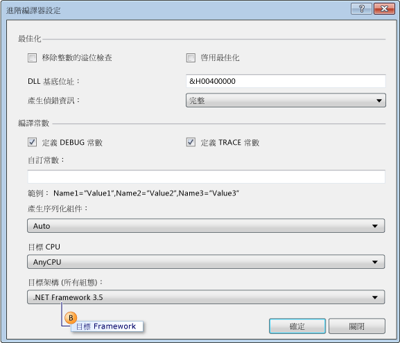
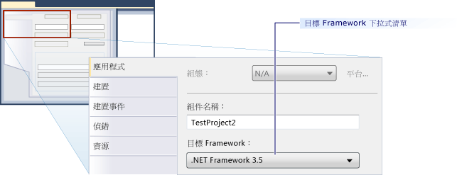

# 如何：設定以舊版 .NET Framework 為目標的單元測試
[!INCLUDE[vs2017banner](../code-quality/includes/vs2017banner.md)]

當您創造 Microsoft Visual Studio 中的測試專案時， .NET Framework 的最新版本預設為目標。  此外，如果您從舊版 Visual Studio 升級測試專案，這些專案會升級以 .NET Framework 的最新版本。  藉由編輯專案屬性，將專案明確重設為以 .NET Framework 較早版本為目標。  
  
 您可以建立目標為 .NET Framework 的特定版本的單元測試專案。  目標版本必須 3.5 \(含\) 以後版本，且不能是用戶端版本。  Visual Studio為以特定版本為目標的單元測試提供下列基本支援：  
  
-   您可以建立單元測試專案，將專案設定為以特定版本的.NET Framework 為目標。  
  
-   您可以在本機電腦的 Visual Studio 中，執行以特定版本的 .NET Framework 為目標的單元測試。  
  
-   您可以在命令提示字元中使用 MSTest.exe，執行以特並版本的.NET Framework為目標的單元測試。  
  
-   您可以在組建代理程式上執行單元測試做為組建一部分。  
  
 **測試 SharePoint 應用程式**  
  
 上列功能也讓您使用 Visual Studio 撰寫 SharePoint 應用程式的單元測試和整合測試。  [!INCLUDE[crabout](../test/includes/crabout_md.md)] 如何使用 Visual Studio 開發 SharePoint 應用程式，請參閱 [建立 SharePoint 方案](/office-dev/office-dev/create-sharepoint-solutions)、[建置和偵錯 SharePoint 方案](/office-dev/office-dev/building-and-debugging-sharepoint-solutions) 和[驗證及偵錯 SharePoint 程式碼](/office-dev/office-dev/verifying-and-debugging-sharepoint-code)。  
  
 **使用限制**  
  
 當您將測試專案重設為以較早版本的 .NET Framework 為目標時，適用下列限制：  
  
-   在 .NET Framework 3.5 中，針對只包含單元測試的測試專案才支援多目標。  .NET Framework 3.5 不支援任何其他測試類型，例如自動程式碼 UI 或負載測試。  針對非單元測試的測試類型則會禁止重設目標。  
  
-   會針對舊版 .NET Framework 測試執行在預設主機介面卡才支援。   ASP.NET 主機介面卡不支援執行這類測試。  必須在 ASP.NET 程式開發伺服器內容中執行的 ASP.NET 應用程式，必須與目前版本的 .NET Framework 相容。  
  
-   當您執行支援 .NET Framework 3.5 多目標的測試時，會停用資料收集支援。  您可以使用 Visual Studio 命令列工具執行程式碼涵蓋範圍。  
  
-   使用 .NET Framework 3.5 的單元測試無法在遠端電腦上執行。  
  
-   您不能以為目標的單元測試加入至這個框架的舊版用戶端版本。  
  
### 將 Visual Basic 單元測試專案重設為以特定版本的 .NET Framework為目標  
  
1.  建立新的 Visual Basic 單元測試專案。  選擇 \[**檔案**\] 功能表上的 \[**新增**\]，然後選擇 \[**專案**\]。  
  
     \[**新增專案**\] 對話方塊隨即出現。  
  
2.  展開 \[**已安裝的範本**\] 底下的 \[**Visual Basic**\]。  選取 \[**測試**\]，然後選取 \[**測試專案**\] 範本。  
  
3.  在 \[**名稱**\] 文字方塊中輸入 Visual Basic 測試專案的名稱，然後選取 \[**確定**\]。  
  
4.  在 \[方案總管\] 中的新Visual Basic test project捷徑功能表上按一下 \[**屬性**\]。  
  
     Visual Basic 測試專案的屬性隨即顯示。  
  
5.  如下圖所示，在 \[**編譯**\] 索引標籤選取 \[**進階編譯選項**\] 。  
  
       
  
6.  使用 \[**目標 Framework \(所有組態\)**\] 下拉式清單，將目標 Framework 變更為 \[**.NET Framework 3.5**\] 或是較晚的版本，如下圖中的圖說文字 B 所示。  您不應該指定這個用戶端版本。  
  
       
  
### 重新為 Visual C\# 單元測試專案將目標設定為特定 .NET Framework 版本。  
  
1.  建立新的 Visual C\# 單元測試專案。  選擇 \[**檔案**\] 功能表上的 \[**新增**\]，然後選擇 \[**專案**\]。  
  
     \[**新增專案**\] 對話方塊隨即出現。  
  
2.  展開 \[**已安裝的範本**\] 底下的 \[**Visual C\#**\]。  選取 \[**測試**\]，然後選取 \[**測試專案**\] 範本。  
  
3.  在 \[**名稱**\] 文字方塊中輸入 Visual C\# 測試專案的名稱，然後選取\[**確定**\]。  
  
4.  在方案總管中，從新Visual C\#測試專案的捷徑功能表中選取**屬性**  
  
     Visual C\# 測試專案的屬性隨即顯示。  
  
5.  選取 \[**應用程式**\] 索引標籤，然後使用 \[**目標 Framework**\] ，下拉式清單將目標 Framework 變更為 \[**.NET Framework 3.5**\] 或較新版本，如下圖所示。  您不應該指定這個用戶端版本。  
  
       
  
### 將 C\+\+\/CLI 單元測試專案的目標重定為特定版本的 .NET Framework  
  
1.  建立新的 C\+\+ 單元測試專案。  選取 \[**檔案**\] 功能表上的 \[**新增**\]，然後按一下 \[**專案**\]。  
  
     \[**新增專案**\] 對話方塊隨即出現。  
  
    > [!WARNING]
    >  若要建立 .NET Framework 的舊版的 C\+\+\/CLI 單元測試 Visual C\+\+ 中，您必須使用 Visual Studio 版本。  例如， .NET Framework 3.5 為目標，您必須安裝 [!INCLUDE[vs_orcas_long](../debugger/includes/vs_orcas_long_md.md)] 和 [!INCLUDE[vs_orcas_long](../debugger/includes/vs_orcas_long_md.md)] Service Pack 1。  
  
2.  展開 \[**已安裝的範本**\] 底下的 \[**Visual C\+\+**\]。  選取 \[**測試**\]，然後選取 \[**測試專案**\] 範本。  
  
3.  在 \[**名稱**\] 文字方塊中輸入 Visual C\+\+ 測試專案的名稱，然後按一下 \[**確定**\]。  
  
4.  在 \[方案總管\] 中，從新Visual C\+\+測試專案中選取 \[**卸載專案**\]。  
  
5.  在 \[方案總管\] 中，以滑鼠右鍵選取卸載的 Visual C\+\+ 測試專案，然後選取 \[**編輯 \<專案名稱\>.vcxproj**\]。  
  
     .vcxproj 檔案隨即在編輯器中開啟。  
  
6.  設定 `TargetFrameworkVersion` 至 3.5 版或在 `PropertyGroup` 的較新版本已標記為 `"Globals"`。  您不應該指定客戶端版本。  
  
    ```  
    <PropertyGroup Label="Globals">  
        <TargetName>DefaultTest</TargetName>  
        <ProjectTypes>{3AC096D0-A1C2-E12C-1390-A8335801FDAB};{8BC9CEB8-8B4A-11D0-8D11-00A0C91BC942}</ProjectTypes>  
        <ProjectGUID>{CE16D77A-E364-4ACD-948B-1EB6218B0EA3}</ProjectGUID>  
        <TargetFrameworkVersion>3.5</TargetFrameworkVersion>  
        <Keyword>ManagedCProj</Keyword>  
        <RootNamespace>CPP_Test</RootNamespace>  
      </PropertyGroup>  
  
    ```  
  
7.  儲存並關閉 .vcxproj 檔案。  
  
8.  在 \[方案總管\] 中，從您的新 Visual C\+\+ 測試專案的捷徑功能表中選擇\[**重新載入專案**\] 。  
  
## 請參閱  
 [Creating and Running Unit Tests for Existing Code](http://msdn.microsoft.com/zh-tw/e8370b93-085b-41c9-8dec-655bd886f173)   
 [建立 SharePoint 方案](/office-dev/office-dev/create-sharepoint-solutions)   
 [建置和偵錯 SharePoint 方案](/office-dev/office-dev/building-and-debugging-sharepoint-solutions)   
 [進階編譯器設定對話方塊 \(Visual Basic\)](../ide/reference/advanced-compiler-settings-dialog-box-visual-basic.md)