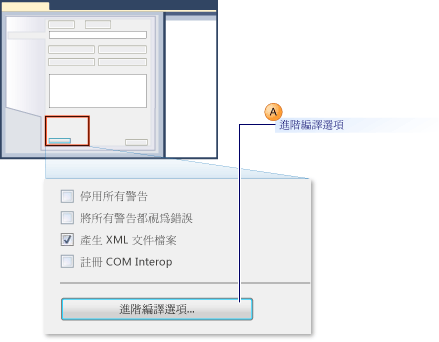

# <a name="how-to-configure-unit-tests-to-target-an-earlier-version-of-the-net-framework"></a>如何：設定以舊版 .NET Framework 為目標的單元測試
當您在 Microsoft Visual Studio 中建立測試專案時，預設會將目標設為最新版本的 .NET Framework。 此外，如果您升級舊版的 Visual Studio 測試專案，它們也會升級成以最新版本的 .NET Framework 為目標。 藉由編輯專案屬性，您可以明確地將專案目標重定為舊版的 .NET Framework。  
  
 您可以建立以特定版本 .NET Framework 為目標的單元測試專案。 目標版本必須為 3.5 或更新版本，而且不能是用戶端版本。 Visual Studio 可針對以特定版本為目標的單元測試提供下列基本支援：  
  
-   您可以建立單元測試專案，並將其目標設定為特定版本 .NET Framework。  
  
-   您可以在本機電腦上的 Visual Studio 執行以特定版本 .NET Framework 為目標的單元測試。  
  
-   您可以從命令提示字元使用 MSTest.exe 執行以特定版本 .NET Framework 為目標的單元測試。  
  
-   您可以於建置過程中在組建代理程式上執行單元測試。  
  
 **測試 SharePoint 應用程式**  
  
 以上所列的功能同樣也能夠讓您使用 Visual Studio 撰寫 SharePoint 應用程式的單元測試和整合測試。 [!INCLUDE[crabout](../test/includes/crabout_md.md)] 若要了解如何使用 Visual Studio 開發 SharePoint 應用程式，請參閱[建立 SharePoint 方案](/office-dev/office-dev/create-sharepoint-solutions)、[建置和偵錯 SharePoint 方案](/office-dev/office-dev/building-and-debugging-sharepoint-solutions)及[驗證及偵錯 SharePoint 程式碼](/office-dev/office-dev/verifying-and-debugging-sharepoint-code)。  
  
 **限制**  
  
 當您將測試專案目標重定為舊版 .NET Framework 時，將會套用以下限制：  
  
-   在 .NET Framework 3.5 中，只有包含單元測試的測試專案才支援多目標。 .NET Framework 3.5 不支援任何其他測試類型，例如自動程式化 UI 或負載測試。 針對非單元測試的測試類型則會禁止重設目標。  
  
-   只有在預設的主機介面卡中才支援執行以舊版 .NET Framework 為目標的測試。 ASP.NET 主機介面卡不支援執行這類測試。 必須在 ASP.NET 程式開發伺服器內容中執行的 ASP.NET 應用程式，必須與 .NET Framework 的目前版本相容。  
  
-   當您執行支援 .NET Framework 3.5 多目標的測試時，會停用資料收集支援。 您可以使用 Visual Studio 命令列工具執行程式碼涵蓋範圍。  
  
-   使用 .NET Framework 3.5 的單元測試無法在遠端電腦上執行。  
  
-   您不能將單元測試的目標設定為架構的舊版用戶端版本。  
  
### <a name="re-targeting-to-a-specific-version-of-the-net-framework-for-visual-basic-unit-test-projects"></a>將 Visual Basic 單元測試專案的目標重定為特定版本的 .NET Framework  
  
1.  建立新的 Visual Basic 單元測試專案。 在 [檔案] 功能表上，選擇 [新增] 然後選擇 [專案]。  
  
     [新增專案] 對話方塊隨即出現。  
  
2.  在 [已安裝範本] 底下，展開 [Visual Basic]。 選取 [測試]，然後選取 [測試專案] 範本。  
  
3.  在 [名稱] 文字方塊中，輸入 Visual Basic 測試專案的名稱，然後選擇 [確定]。  
  
4.  在 [方案總管] 中，從新的 Visual Basic 測試專案的捷徑功能表選擇 [屬性]。  
  
     隨即會顯示您的 Visual Basic 測試專案屬性。  
  
5.  在 [編譯] 索引標籤上選擇 [進階編譯選項]，如下圖所示。  
  
       
  
6.  使用 [目標 Framework (所有組態)] 下拉式清單將目標架構變更為 [.NET Framework 3.5] 或是更新版本，如下圖的圖說文字 B 所示。 您不應指定用戶端版本。  
  
     ![[目標 Framework] 下拉式清單](../test/media/howtoconfigureunitest35frameworkstepb.png "HowToConfigureUniTest35FrameworkStepB")  
  
### <a name="re-targeting-to-a-specific-version-of-the-net-framework-for-visual-c-unit-test-projects"></a>將 Visual C# 單元測試專案的目標重定為特定版本的 .NET Framework  
  
1.  建立新的 Visual C# 單元測試專案。 在 [檔案] 功能表上，選擇 [新增] 然後選擇 [專案]。  
  
     [新增專案] 對話方塊隨即出現。  
  
2.  在 [已安裝範本] 底下，展開 [Visual C#]。 選取 [測試]，然後選取 [測試專案] 範本。  
  
3.  在 [名稱] 文字方塊中，輸入 Visual C# 測試專案的名稱，然後選擇 [確定]。  
  
4.  在 [方案總管] 中，從新的 Visual C# 測試專案的捷徑功能表選擇 [屬性]。  
  
     隨即會顯示您的 Visual C# 測試專案屬性。  
  
5.  在 [應用程式] 索引標籤上，選擇 [目標 Framework]，然後從下拉式清單選擇 [.NET Framework 3.5] 或是更新版本來變更目標 Framework，如下圖所示。 您不應指定用戶端版本。  
  
     ![[目標 Framework] 下拉式清單](../test/media/howtoconfigureunittest35frameworkcsharp.png "HowToConfigureUnitTest35FrameworkCSharp")  
  
### <a name="re-targeting-to-a-specific-version-of-the-net-framework-for-ccli-unit-test-projects"></a>將 C++/CLI 單元測試專案的目標重定為特定版本的 .NET Framework  
  
1.  建立新的 C++ 單元測試專案。 在 [檔案] 功能表上，依序按一下 [新增] 和 [專案]。  
  
     [新增專案] 對話方塊隨即出現。  
  
    > [!WARNING]
    >  若要針對 Visual C++ 建置舊版 .NET Framework 的 C++/CLI 單元測試，您必須使用對應版本的 Visual Studio。 例如，若要以 .NET Framework 3.5 為目標，您必須安裝 [!INCLUDE[vs_orcas_long](../debugger/includes/vs_orcas_long_md.md)] 和 [!INCLUDE[vs_orcas_long](../debugger/includes/vs_orcas_long_md.md)] Service Pack 1。  
  
2.  在 [已安裝範本] 底下，展開 [Visual C++]。 選取 [測試]，然後選取 [測試專案] 範本。  
  
3.  在 [名稱] 文字方塊中，輸入 Visual C++ 測試專案的名稱，然後按一下 [確定]。  
  
4.  在 [方案總管] 中，從新的 Visual C++ 測試專案選擇 [卸載專案]。  
  
5.  在 [方案總管] 中，選擇卸載的 Visual C++ 測試專案，然後選擇 [編輯] \< 專案名稱 > [.vcxproj]。  
  
     .vcxproj 檔案會在編輯器中開啟。  
  
6.  將標籤為 `"Globals"` 的 `PropertyGroup` 中的 `TargetFrameworkVersion` 設定為版本 3.5 或更新版本。 您不應指定用戶端版本：  
  
    ```  
    <PropertyGroup Label="Globals">  
        <TargetName>DefaultTest</TargetName>  
        <ProjectTypes>{3AC096D0-A1C2-E12C-1390-A8335801FDAB};{8BC9CEB8-8B4A-11D0-8D11-00A0C91BC942}</ProjectTypes>  
        <ProjectGUID>{CE16D77A-E364-4ACD-948B-1EB6218B0EA3}</ProjectGUID>  
        <TargetFrameworkVersion>3.5</TargetFrameworkVersion>  
        <Keyword>ManagedCProj</Keyword>  
        <RootNamespace>CPP_Test</RootNamespace>  
      </PropertyGroup>  
  
    ```  
  
7.  儲存並關閉 .vcxproj 檔案。  
  
8.  在 [方案總管] 中，從新的 Visual C++ 測試專案的捷徑功能表選取 [重新載入專案]。  
  
## <a name="see-also"></a>另請參閱  
 [針對現有的程式碼建立和執行單元測試](http://msdn.microsoft.com/en-us/e8370b93-085b-41c9-8dec-655bd886f173)   
 [建立 SharePoint 方案](/office-dev/office-dev/create-sharepoint-solutions)   
 [建置和偵錯 SharePoint 方案](/office-dev/office-dev/building-and-debugging-sharepoint-solutions)   
 [進階編譯器設定對話方塊 (Visual Basic)](../ide/reference/advanced-compiler-settings-dialog-box-visual-basic.md)

