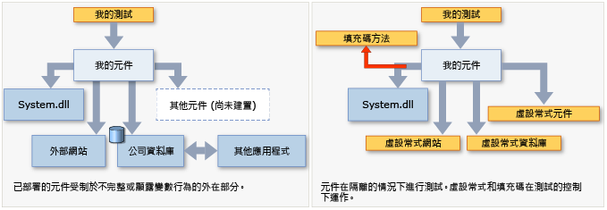

# 使用 Microsoft Fakes 在測試期間隔離程式碼
[!INCLUDE[vs2017banner](../code-quality/includes/vs2017banner.md)]

Microsoft Fakes 會以「*虛設常式*」\(Stub\) 或「*填充碼*」\(Shim\) 取代應用程式的其他部分，協助您隔離要測試的程式碼。  這些是受測試所控制的一些程式碼片段。  藉由隔離待測的程式碼，您可以在正確的位置尋找測試失敗的原因。  即使應用程式的其他部分還無法運作，您也可以利用虛設常式和填充碼。  
  
 Fakes 分為兩種類別：  
  
-   [Stub](#stubs) 會以一小段實作相同介面的類別取代類別。  若要使用虛設常式，您所設計的應用程式必須讓每個元件只相依於介面，而不相依於其他元件。  \(「元件」表示一起設計及更新的類別或類別群組，通常會包含在組件中\)。  
  
-   [填充碼](#shims)會在執行階段修改應用程式的編譯程式碼，以便執行您的測試所提供的填充碼，而不是進行指定的方法呼叫。  您可以使用填充碼取代您無法修改的組件 \(例如 .NET 組件\) 的呼叫。  
  
   
  
 **需求**  
  
-   Visual Studio 企業版  
  
## 在虛設常式和填充碼類型之間選擇  
 由於您會同時開發及更新這些類別，因此您通常會將 Visual Studio 專案視為元件。  您可以考慮針對專案對方案中其他專案或專案所參考之其他組件的呼叫使用虛設常式和填充碼。  
  
 一般方針是，對 Visual Studio 方案中的呼叫使用虛設常式，而對其他參考組件的呼叫則使用填充碼。  這是因為在您自己的方案中，依虛設常式需要的方式定義介面以分隔元件是很好的作法。  但是，個別介面定義通常未隨附外部組件 \(例如 System.dll\)，因此，您必須使用填充碼。  
  
 其他考量為：  
  
 **效能。** 由於填充碼會在執行階段重寫程式碼，因此執行得比較慢。  虛設常式類型沒有這樣的效能負荷，執行速度與虛擬方法一樣快。  
  
 **靜態方法，密封類型。** 您只能使用虛設常式實作介面。  因此，虛設常式類型不能用於靜態方法、非虛擬方法、密封虛擬方法、密封類型中的方法等等。  
  
 **內部類型。** 虛設常式和填充碼都可以搭配使用組件屬性 <xref:System.Runtime.CompilerServices.InternalsVisibleToAttribute> 存取的內部類型一起使用。  
  
 **私用方法** 如果方法簽章的所有類型都是可見的，填充碼可以取代私用方法呼叫。  虛設常式只能取代可見的方法。  
  
 **介面和抽象方法。** 虛設常式提供可用於測試的介面和抽象方法實作。  填充碼無法檢測介面和抽象方法，因為它們沒有方法主體。  
  
 一般而言，我們建議您使用虛設常式類型與程式碼基底中的相依性隔離。  您可以藉由將元件隱藏在介面後面來達成。  您可以使用填充碼類型隔離不提供可測試之應用程式開發介面的協力廠商元件。  
  
##  <a name="stubs"></a> 開始使用 Stub  
 如需詳細說明，請參閱[使用虛設常式隔離應用程式的各個組件，方便進行單元測試](../test/using-stubs-to-isolate-parts-of-your-application-from-each-other-for-unit-testing.md)。  
  
1.  **插入介面**  
  
     若要使用虛設常式，您所撰寫的測試程式碼不可明確提及應用程式其他元件中的類別。  「元件」是指一併開發及更新的一個或多個類別，通常會包含在一個 Visual Studio 專案中。  應使用介面宣告變數和參數，並應使用 Factory 傳入或建立其他元件的執行個體。  例如，如果 StockFeed 是另一個應用程式元件中的類別，下列作法就不正確：  
  
     `return (new StockFeed()).GetSharePrice("COOO"); // Bad`  
  
     相反地，請定義可由另一個元件或測試虛設常式實作的介面：  
  
    ```c#  
    public int GetContosoPrice(IStockFeed feed)  
    { return feed.GetSharePrice("COOO"); }  
  
    ```  
  
    ```vb#  
    Public Function GetContosoPrice(feed As IStockFeed) As Integer  
     Return feed.GetSharePrice("COOO")  
    End Function  
  
    ```  
  
2.  **加入 Fakes 組件**  
  
    1.  在 \[方案總管\] 中展開測試專案的參考清單。  如果在 Visual Basic 中工作，您必須選擇 \[**顯示所有檔案**\] 才能看到參考清單。  
  
    2.  選取定義介面 \(例如 IStockFeed\) 之組件的參考。  在此參考的捷徑功能表中選擇 \[**加入 Fakes 組件**\]。  
  
    3.  重建方案。  
  
3.  在您的測試中，建構虛設常式的執行個體，並為其方法提供程式碼：  
  
    ```c#  
    [TestClass]  
    class TestStockAnalyzer  
    {  
        [TestMethod]  
        public void TestContosoStockPrice()  
        {  
          // Arrange:  
  
            // Create the fake stockFeed:  
            IStockFeed stockFeed =   
                 new StockAnalysis.Fakes.StubIStockFeed() // Generated by Fakes.  
                     {  
                         // Define each method:  
                         // Name is original name + parameter types:  
                         GetSharePriceString = (company) => { return 1234; }  
                     };  
  
            // In the completed application, stockFeed would be a real one:  
            var componentUnderTest = new StockAnalyzer(stockFeed);  
  
          // Act:  
            int actualValue = componentUnderTest.GetContosoPrice();  
  
          // Assert:  
            Assert.AreEqual(1234, actualValue);  
        }  
        ...  
    }  
    ```  
  
    ```vb#  
    <TestClass()> _  
    Class TestStockAnalyzer  
  
        <TestMethod()> _  
        Public Sub TestContosoStockPrice()  
            ' Arrange:  
            ' Create the fake stockFeed:  
            Dim stockFeed As New StockAnalysis.Fakes.StubIStockFeed  
            With stockFeed  
                .GetSharePriceString = Function(company)  
                                           Return 1234  
                                       End Function  
            End With  
            ' In the completed application, stockFeed would be a real one:  
            Dim componentUnderTest As New StockAnalyzer(stockFeed)  
            ' Act:  
            Dim actualValue As Integer = componentUnderTest.GetContosoPrice  
            ' Assert:  
            Assert.AreEqual(1234, actualValue)  
        End Sub  
    End Class  
  
    ```  
  
     這裡最特別的是 `StubIStockFeed` 類別。  Microsoft Fakes 機制會針對參考組件中的每一個介面產生虛設常式類別。  該虛設常式類別的名稱衍生自介面的名稱，再加上前置詞「`Fakes.Stub`」並附加參數類型名稱。  
  
     另外也會為屬性、事件及泛型方法的 getter 及 setter 產生虛設常式。  如需詳細資訊，請參閱[使用虛設常式隔離應用程式的各個組件，方便進行單元測試](../test/using-stubs-to-isolate-parts-of-your-application-from-each-other-for-unit-testing.md)。  
  
##  <a name="shims"></a> 開始使用填充碼  
 \(如需詳細說明，請參閱[使用填充碼將應用程式與其他組件隔離，方便進行單元測試](../test/using-shims-to-isolate-your-application-from-other-assemblies-for-unit-testing.md)\)。  
  
 假設您的元件包含對 `DateTime.Now` 的呼叫：  
  
```c#  
// Code under test:  
    public int GetTheCurrentYear()  
    {  
       return DateTime.Now.Year;  
    }  
  
```  
  
 在測試期間，您要填充 `Now` 屬性，因為真實版本會在每次呼叫時傳回不同的值，非常不方便。  
  
 若要使用填充碼，就不需要修改應用程式程式碼或以特別方式撰寫程式碼。  
  
1.  **加入 Fakes 組件**  
  
     在 \[方案總管\] 中開啟單元測試專案的參考，並且選取包含要假造之方法的組件參考。  在本範例中，`DateTime` 類別是在 **System.dll** 中。  若要查看 Visual Basic 專案中的參考，請選擇 \[**顯示所有檔案**\]。  
  
     選擇 \[**加入 Fakes 組件**\]。  
  
2.  **在 ShimsContext 中插入填充碼**  
  
    ```c#  
    [TestClass]  
    public class TestClass1  
    {   
            [TestMethod]  
            public void TestCurrentYear()  
            {  
                int fixedYear = 2000;  
  
                // Shims can be used only in a ShimsContext:  
                using (ShimsContext.Create())  
                {  
                  // Arrange:  
                    // Shim DateTime.Now to return a fixed date:  
                    System.Fakes.ShimDateTime.NowGet =   
                    () =>  
                    { return new DateTime(fixedYear, 1, 1); };  
  
                    // Instantiate the component under test:  
                    var componentUnderTest = new MyComponent();  
  
                  // Act:  
                    int year = componentUnderTest.GetTheCurrentYear();  
  
                  // Assert:   
                    // This will always be true if the component is working:  
                    Assert.AreEqual(fixedYear, year);  
                }  
            }  
    }  
  
    ```  
  
    ```vb#  
    <TestClass()> _  
    Public Class TestClass1  
        <TestMethod()> _  
        Public Sub TestCurrentYear()  
            Using s = Microsoft.QualityTools.Testing.Fakes.ShimsContext.Create()  
                Dim fixedYear As Integer = 2000  
                ' Arrange:  
                ' Detour DateTime.Now to return a fixed date:  
                System.Fakes.ShimDateTime.NowGet = _  
                    Function() As DateTime  
                        Return New DateTime(fixedYear, 1, 1)  
                    End Function  
  
                ' Instantiate the component under test:  
                Dim componentUnderTest = New MyComponent()  
                ' Act:  
                Dim year As Integer = componentUnderTest.GetTheCurrentYear  
                ' Assert:   
                ' This will always be true if the component is working:  
                Assert.AreEqual(fixedYear, year)  
            End Using  
        End Sub  
    End Class  
    ```  
  
     填充碼類別名稱是在原始類型名稱前面加上 `Fakes.Shim` 而構成。  方法名稱後面要加上參數名稱。  \(您不必將任何組件參考加入 System.Fakes。\)  
  
 上述範例使用靜態方法的填充碼。  若要使用填充碼做為執行個體方法，請在類型名稱和方法名稱之間撰寫 `AllInstances`：  
  
```  
System.IO.Fakes.ShimFile.AllInstances.ReadToEnd = ...  
```  
  
 \(沒有任何 'System.IO.Fakes' 組件可參考。  此命名空間是填充碼建立處理序所產生的。  但您可以按照一般方式使用 ‘using’ 或 ‘Import’。\)  
  
 您也可以為特定執行個體、建構函式和屬性建立填充碼。  如需詳細資訊，請參閱[使用填充碼將應用程式與其他組件隔離，方便進行單元測試](../test/using-shims-to-isolate-your-application-from-other-assemblies-for-unit-testing.md)。  
  
## 本節內容  
 [使用虛設常式隔離應用程式的各個組件，方便進行單元測試](../test/using-stubs-to-isolate-parts-of-your-application-from-each-other-for-unit-testing.md)  
  
 [使用填充碼將應用程式與其他組件隔離，方便進行單元測試](../test/using-shims-to-isolate-your-application-from-other-assemblies-for-unit-testing.md)  
  
 [Microsoft Fakes 中的程式碼產生、編譯和命名慣例](../test/code-generation-compilation-and-naming-conventions-in-microsoft-fakes.md)