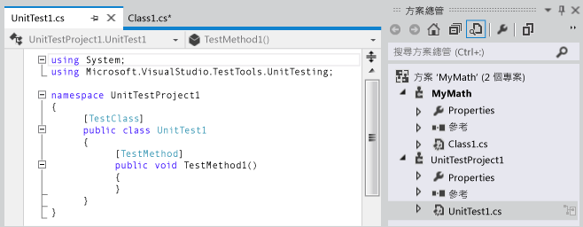

# <a name="quick-start-test-driven-development-with-test-explorer"></a>快速入門：搭配測試總管進行以測試為導向的開發工作
我們建議您建立單元測試，以便讓您的程式碼在經歷許多漸進的開發步驟後仍然能夠正確運作。 有數種架構都可以用來撰寫單元測試，包含由協力廠商所開發的架構。 某些測試架構是專門讓您使用不同的語言或平台來進行測試。 [測試總管] 提供單一介面，讓您使用任一種架構來進行單元測試。 目前已有適用於最常用架構的配接器可供使用，而您也可以自己撰寫適用於其他架構的配接器。  
  
 [測試總管] 取代了舊版 Visual Studio 中的單元測試視窗。 它的優點包括：  
  
-   使用單一介面執行 .NET、Unmanaged、資料庫以及其他種類的測試。  
  
-   使用您選擇的單元測試架構，例如 NUnit 或 MSTest 架構。  
  
-   可在一個視窗中查看需要的所有資訊。  
  
## <a name="using-test-explorer"></a>使用測試總管  
 ![顯示 [全部執行] 按鈕的 [單元測試總管]](../test/media/unittestexplorer-beta-.png "UnitTestExplorer(beta)")  
  
#### <a name="to-run-unit-tests-by-using-test-explorer"></a>若要使用測試總管來執行單元測試  
  
1.  建立使用您選擇的測試架構的單元測試。  
  
     例如，建立使用 MSTest 架構的測試：  
  
    1.  建立測試專案。  
  
         在 [ **新增專案** ] 對話方塊中，展開 [ **Visual Basic**]、[ **Visual C#**] 或 [ **Visual C++**]，然後選擇 [ **測試**]。  
  
         選取 [ **單元測試專案**]。  
  
    2.  將每個單元測試撰寫成方法。 在每個測試方法的前面加上 `[TestMethod]` 屬性。  
  
2.  如果個別測試之間沒有任何相依性，因此可依任意順序執行，請使用工具列上的  切換按鈕，以開啟平行測試的執行。 這可大幅縮短執行所有測試所需的時間。  
  
3.  在功能表列上，選擇 [ **測試**]、[ **執行單元測試**]、[ **所有測試**]。  
  
     接著就會建置方案並執行測試。  
  
     [測試總管] 會開啟並顯示測試結果的摘要。  
  
 **若要查看完整的測試清單：** 請選擇任何分類中的 [ **全部顯示** ]。  
  
 **若要查看測試結果的詳細資料：** 請在 [測試總管] 中選取測試，以便在詳細資料窗格中檢視詳細資料 (例如例外狀況訊息)。  
  
 **若要巡覽至測試的程式碼：** 請在 [測試總管] 中按兩下測試，或在捷徑功能表上選擇 [ **開啟測試** ]。  
  
 **若要偵錯測試：** 請開啟一個或多個測試的捷徑功能表，然後選擇 [ **偵測選取的測試**]。  
  
> [!IMPORTANT]
>  顯示的結果是最近執行的結果。 有顏色的結果列只會顯示已執行的測試結果。 例如，如果您執行許多測試，但是有些失敗了，接著只執行成功的測試，然後結果列就會全部顯示綠色。  
  
> [!NOTE]
>  如果未出現任何測試，請確定已安裝配接器將 [測試總管] 連接至您使用的測試架構。 如需詳細資訊，請參閱 [搭配不同的測試架構來使用測試總管](#frameworks)。  
  
##  <a name="walkthrough"></a> 逐步解說：使用單元測試來開發方法  
 本逐步解說示範如何使用 Microsoft 單元測試架構以 C# 來開發受測方法。 您可以輕鬆地將它改寫成其他語言，並使用其他測試架構 (例如 NUnit)。 如需詳細資訊，請參閱 [使用不同的測試架構](#frameworks)。  
  
#### <a name="creating-the-test-and-method"></a>建立測試和方法  
  
1.  建立一個 Visual C# 類別庫專案。 這個專案會包含所要提供的程式碼。 在此範例中，它的名稱是 `MyMath`。  
  
2.  建立測試專案。  
  
    -   在 [ **新增專案** ] 對話方塊中，選擇 [ **Visual C#**]、[ **測試** ]，然後選擇 [ **單元測試專案**]。  
  
           
  
3.  撰寫基本測試方法。 驗證特定輸入所產生的結果：  
  
    ```c#  
  
    [TestMethod]  
    public void BasicRooterTest()  
    {  
      // Create an instance to test:  
      Rooter rooter = new Rooter();  
      // Define a test input and output value:  
      double expectedResult = 2.0;  
      double input = expectedResult * expectedResult;  
      // Run the method under test:  
      double actualResult = rooter.SquareRoot(input);  
      // Verify the result:  
      Assert.AreEqual(expectedResult, actualResult,  
          delta: expectedResult / 100);  
    }  
    ```  
  
4.  從測試產生方法。  
  
    1.  將游標置於 `Rooter`上，然後在捷徑功能表中選擇 [ **產生**]、[ **新增類型**]。  
  
    2.  在 [ **產生新的類型** ] 對話方塊中，將 [ **專案** ] 設為類別庫專案。 在此範例中，它是 `MyMath`。  
  
    3.  將游標置於 `SquareRoot`上，然後在捷徑功能表中選擇 [ **產生**]、[ **方法 Stub**]。  
  
5.  執行單元測試。  
  
    1.  在 [ **測試** ] 功能表列上，選擇 [ **執行單元測試**]、[ **所有測試**]。  
  
         接著就會建置並執行方案。  
  
         [測試總管] 會開啟並顯示測試結果。  
  
         此測試會出現在 [ **失敗的測試**] 底下。  
  
6.  選取測試的名稱。  
  
     測試的詳細資料會顯示在 [測試總管] 的下半部。  
  
7.  選取 [ **堆疊追蹤** ] 底下的項目，以查看測試失敗的位置。  
  
 ![顯示失敗之測試的 [單元測試總管]。](../test/media/unittestexplorerwalkthrough2.png "UnitTestExplorerWalkthrough2")  
  
 此時，您已建立要修改的測試和 stub，好讓測試能夠成功。  
  
#### <a name="after-every-change-make-all-the-tests-pass"></a>在每次變更後讓所有的測試都成功  
  
1.  在 `MyMath\Rooter.cs`中，改良 `SquareRoot`的程式碼：  
  
    ```c#  
    public double SquareRoot(double input)  
     {  
       return input / 2;  
     }  
    ```  
  
2.  在 [測試總管] 中，選擇 [ **全部執行**]。  
  
     接著就會建置程式碼並執行測試。  
  
     測試就會成功。  
  
     ![顯示成功之測試的 [單元測試總管]。](../test/media/unittestexplorerwalkthrough3.png "UnitTestExplorerWalkthrough3")  
  
#### <a name="add-tests-to-extend-the-range-of-inputs"></a>加入測試以擴充輸入的範圍  
  
1.  若要提高您對於程式碼在任何情況下都能運作的信心，您可以加入嘗試各種輸入值的測試。  
  
    > [!TIP]
    >  避免改變已經成功的現有測試， 而改為加入新的測試。 只有在使用者的需求改變時，才變更現有的測試。 這個原則可協助您確保在擴充程式碼時不會失去現有的功能。  
  
     在您的測試類別中加入下面測試，該測試會嘗試某個範圍的輸入值：  
  
    ```c#  
    [TestMethod]  
    public void RooterValueRange()  
    {  
      // Create an instance to test:  
      Rooter rooter = new Rooter();  
      // Try a range of values:  
      for (double expectedResult = 1e-8;  
          expectedResult < 1e+8;  
          expectedResult = expectedResult * 3.2)  
      {  
        RooterOneValue(rooter, expectedResult);  
      }  
    }  
  
    private void RooterOneValue(Rooter rooter, double expectedResult)  
    {  
      double input = expectedResult * expectedResult;  
      double actualResult = rooter.SquareRoot(input);  
      Assert.AreEqual(expectedResult, actualResult,  
          delta: expectedResult / 1000);  
    }  
    ```  
  
2.  在 [測試總管] 中，選擇 [ **全部執行**]。  
  
     新的測試失敗了，不過，第一個測試仍然成功。  
  
     若要找出失敗點，請選取失敗的測試，然後在 [測試總管] 的下半部選取 [ **堆疊追蹤**] 的最上層項目。  
  
3.  檢查受測方法看看可能是哪裡出錯了。 在 `MyMath.Rooter` 類別中，重寫程式碼：  
  
    ```  
    public double SquareRoot(double input)  
    {  
      double result = input;  
      double previousResult = -input;  
      while (Math.Abs(previousResult - result) > result / 1000)  
      {  
        previousResult = result;  
        result = result - (result * result - input) / (2 * result);  
      }  
      return result;  
    }  
    ```  
  
4.  在 [測試總管] 中，選擇 [ **全部執行**]。  
  
     現在兩個測試都成功了。  
  
#### <a name="add-tests-for-exceptional-cases"></a>加入例外狀況的測試  
  
1.  加入不正確輸入的測試：  
  
    ```c#  
    [TestMethod]  
     public void RooterTestNegativeInputx()  
     {  
         Rooter rooter = new Rooter();  
         try  
         {  
             rooter.SquareRoot(-10);  
         }  
         catch (ArgumentOutOfRangeException e)  
         {  
             return;  
         }  
         Assert.Fail();  
     }  
    ```  
  
2.  在 [測試總管] 中，選擇 [ **全部執行**]。  
  
     受測方法會產生迴圈現象，必須手動取消。  
  
3.  選擇 [ **取消**]。  
  
     測試會在 10 秒之後停止。  
  
4.  修正方法程式碼：  
  
    ```c#  
  
    public double SquareRoot(double input)  
    {  
      if (input <= 0.0)   
      {  
        throw new ArgumentOutOfRangeException();  
      }   
    ...  
    ```  
  
5.  在 [測試總管] 中，選擇 [ **全部執行**]。  
  
     所有測試都成功。  
  
#### <a name="refactor-without-changing-tests"></a>重構但不變更測試  
  
1.  簡化程式碼，但不變更測試。  
  
    > [!TIP]
    >  「 *重構* 」(Refactoring) 是要讓程式碼的效能變得更好或讓程式碼更容易了解而做的變更。 它不是要變更程式碼的行為，因此並不會變更測試。  
    >   
    >  我們建議您分開執行重構步驟與擴充功能的步驟。 讓測試保持不變，您就會有信心沒有在重構時不小心引入了 Bug。  
  
    ```c#  
    public class Rooter  
    {  
      public double SquareRoot(double input)  
      {  
        if (input <= 0.0)   
        {  
          throw new ArgumentOutOfRangeException();  
        }  
        double result = input;  
        double previousResult = -input;  
        while (Math.Abs(previousResult - result) > result / 1000)  
        {  
          previousResult = result;  
          result = (result + input / result) / 2;  
          //was: result = result - (result * result - input) / (2*result);  
        }  
        return result;  
      }  
    }  
    ```  
  
2.  選擇 [ **全部執行**]。  
  
     所有測試仍然成功。  
  
     ![顯示 3 個成功測試的 [單元測試總管]。](../test/media/unittestexplorerwalkthrough4.png "UnitTestExplorerWalkthrough4")

