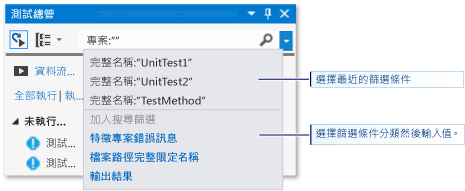

# 在 Visual Studio 中對市集應用程式執行單元測試
本主題說明如何使用 Microsoft Visual Studio 的 [測試總管] 執行單元測試。  
  
> [!NOTE]
>  本節各項主題會說明 Visual Studio Express for Windows 8 的功能。 Visual Studio Community、Enterprise 及 Professional 均提供針對單元測試的額外功能。  
>   
>  -   請使用任何協力廠商或開放原始碼單元測試架構，只要該架構已經為 Microsoft [測試總管] 建立附加配接器即可。 您也可以分析和顯示測試的程式碼涵蓋範圍資訊。  
> -   每次建置後都執行測試。 您也可以使用 Microsoft Fakes，這是一種 Managed 程式碼的隔離架構，會以測試程式碼替代系統和協力廠商功能，以將測試焦點放在自己的程式碼上。  
>   
>  如需詳細資訊，請參閱 MSDN Library 中的[對程式碼進行單元測試](../test/unit-test-your-code.md)。  
  
##  本主題內容  
 [單元測試架構和測試專案](#BKMK_Unit_test_frameworks_and_test_projects)  
  
 [在 [測試總管] 中執行測試](#BKMK_Running_tests_in_Test_Explorer)  
  
-   [執行測試](#BKMK_Running_tests)  
  
 [檢視測試結果](#BKMK_Viewing_test_results)  
  
-   [檢視測試詳細資料](#BKMK_Viewing_test_details)  
  
-   [檢視測試方法的原始程式碼](#BKMK_Viewing_the_source_code_of_a_test_method)  
  
 [組織測試清單](#BKMK_Organizing_the_test_list)  
  
-   [將測試分組](#BKMK_Grouping_tests)  
  
-   [搜尋和篩選測試清單](#BKMK_Searching_and_filtering_the_test_list)  
  
 [偵錯單元測試](#BKMK_Debugging_unit_tests)  
  
##  單元測試架構和測試專案  
 適用於 Windows 市集應用程式的 Visual Studio Express，包括用於 Managed 和原生 C++ 程式碼的 Microsoft 單元測試架構。 [測試總管] 可以從方案中的多個測試專案，以及屬於實際執行程式碼專案的測試類別執行測試。 測試專案可以是 Visual C++ 或 Visual C# 和 Visual Basic 單元測試架構的任意組合。 只要寫好 .NET Framework 的待測程式碼，不論目標程式碼語言為何，就可使用任何 .NET Framework 語言撰寫測試專案。 原生 C/C++ 程式碼專案必須使用 C++ 單元測試架構進行測試。  
  
##  在 [測試總管] 中執行測試  
 在建置測試專案後，這些測試便會出現在 [測試總管] 中。 如果沒有看到 [測試總管]，請選擇 Visual Studio 功能表上的 [測試]  ，接著選擇 [Windows] ，然後選擇 [測試總管] 。  
  
   
  
 當您執行、寫入、重新執行您的測試時，測試總管會顯示 [失敗的測試] 、[通過的測試] 、[略過的測試]  和 [未執行的測試] 預設群組中的結果。 您可以變更測試總管群組測試的方式。  
  
 您可以從 [測試總管] 工具列，執行尋找、組織及執行測試等許多工作的功能。  
  
 ![從 [測試總管] 的工具列執行測試](../test/media/ute_toolbar.png "UTE_ToolBar")  
  
###  執行測試  
 您可以執行方案中的所有測試、群組中的所有測試，或是您選取的一組測試。 執行下列任一步驟：  
  
-   若要執行方案中的所有測試，請選擇 [全部執行] 。  
  
-   若要執行預設群組中的所有測試，請選取 [執行…]  ，然後選取功能表上的群組。  
  
-   選取要執行的個別測試，接著開啟所選測試的捷徑功能表，然後選擇 [執行選取的測試]。  
  
 執行測試時，測試總管視窗頂端會動畫呈現成功/失敗列。 測試回合結束時，如果所有測試皆成功，成功/失敗列會變成綠色；如果有任何一個測試失敗，則會變成紅色。  
  
##  檢視測試結果  
 當您執行、寫入、重新執行您的測試時，測試總管會顯示 [失敗的測試] 、[通過的測試] 、[略過的測試]  和 [未執行的測試] 群組中的結果。 在測試總管底部的詳細資料窗格會顯示測試回合的摘要。  
  
###  檢視測試詳細資料  
 若要檢視個別測試的詳細資料，請選取該測試。  
  
 測試詳細資料窗格會顯示下列資訊：  
  
-   測試方法的原始檔案名稱和行號。  
  
-   測試的狀態。  
  
-   測試方法執行的經過時間。  
  
 如果測試失敗，詳細資料窗格也會顯示：  
  
-   測試的單元測試架構所傳回的訊息。  
  
-   測試失敗時的堆疊追蹤。  
  
###  檢視測試方法的原始程式碼  
 若要在 Visual Studio 編輯器中顯示測試方法的原始程式碼，請選取該測試，然後選擇捷徑功能表上的 [開啟測試] (鍵盤：F12)。  
  
##  組織測試清單  
  
###  將測試分組  
 [測試總管] 預設將測試顯示為子節點：[失敗的測試]、[成功的測試]、[略過的測試] 和 [未執行的測試]。  
  
|||  
|-|-|  
|![[測試總管] 的 [群組] 按鈕](../test/media/ute_groupby_btn.png "UTE_GroupBy_btn")|若要將測試按執行耗用時間分組，請開啟 [群組依據] 清單，然後選擇 [持續時間]。 選擇 [測試結果]，切換到原始群組。|  
  
###  搜尋和篩選測試清單  
 當有大量測試時，您可以在 [測試總管] 的搜尋方塊中輸入指定字串以篩選清單。 您可以先在篩選清單中選擇，限制篩選特定類型的字串，再輸入搜尋字串。  
  
   
  
##  偵錯單元測試  
 您可以使用 [測試總管] 來啟動測試的偵錯工作階段。 使用 Visual Studio 偵錯工具逐步執行程式碼可讓您順暢地在單元測試和受測專案之間來回進行。 啟動偵錯：  
  
1.  在 Visual Studio 編輯器中，於您要偵錯的一個或多個測試方法中設定中斷點。  
  
    > [!NOTE]
    >  由於測試方法可以依照任何順序執行，請在您要偵錯的所有測試方法中設定中斷點。  
  
2.  在 [測試總管] 中，選取測試方法，然後選擇捷徑功能表上的 [偵錯選取的測試]。  
  
 如需偵錯工具的詳細資訊，請參閱 [Visual Studio 偵錯](../debugger/debugging-in-visual-studio.md)。

