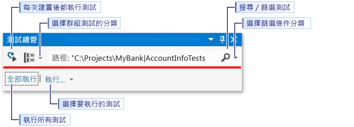
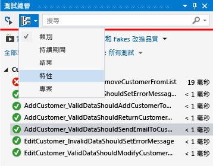
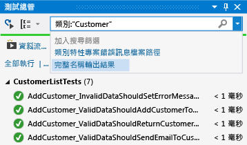
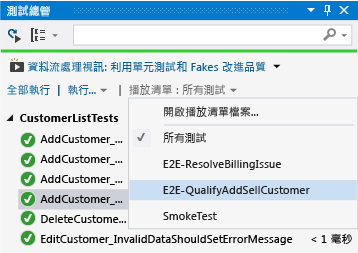

# 使用測試總管執行單元測試
[!INCLUDE[vs2017banner](../code-quality/includes/vs2017banner.md)]

您可使用測試總管，透過 Visual Studio 或協力廠商單元測試專案來執行單元測試、將測試依分類分組、篩選測試清單，以及建立、儲存和執行測試播放清單。 您也可以偵錯測試和分析測試效能和程式碼涵蓋範圍。  
  
##  <a name="BKMK_Contents"></a> 內容  
 [單元測試架構和測試專案](#BKMK_Unit_test_frameworks_and_test_projects)  
  
 [在 [測試總管] 中執行測試](#BKMK_Run_tests_in_Test_Explorer)  
  
 [檢視測試結果](#BKMK_View_test_results)  
  
 [群組和篩選測試清單](#BKMK_Group_and_filter_the_test_list)  
  
 [建立自訂播放清單](#BKMK_Create_custom_playlists)  
  
 [偵錯和分析單元測試](#BKMK_Debug_and_analyze_unit_tests)  
  
 [外部資源](#BKMK_External_resources)  
  
##  <a name="BKMK_Unit_test_frameworks_and_test_projects"></a> 單元測試架構和測試專案  
 Visual Studio 2015 包含 Managed 程式碼和機器碼皆適用的 Microsoft 單元測試架構。 不過，測試總管也可以執行任何已實作測試總管配接器的單元測試架構。 如需安裝協力廠商單元測試架構的詳細資訊，請參閱 [安裝協力廠商單元測試架構](../test/install-third-party-unit-test-frameworks.md)。  
  
 \[測試總管\] 可以從方案中的多個測試專案，以及屬於實際執行程式碼專案的測試類別執行測試。 測試專案可以使用不同的單元測試架構。 當進行測試的程式碼是為 .NET Framework 撰寫時，測試專案可以用任何同樣以 .NET Framework 為目標的語言撰寫，而不管目標程式碼的語言為何。 原生 C\/C\+\+ 程式碼專案必須使用 C\+\+ 單元測試架構進行測試。  
  
  [內容](#BKMK_Contents)  
  
##  <a name="BKMK_Run_tests_in_Test_Explorer"></a> 在 \[測試總管\] 中執行測試  
 [執行測試](#BKMK_Run_tests) **&#124;** [每次建置後執行測試](#BKMK_Run_tests_after_every_build)  
  
 在建置測試專案後，這些測試便會出現在 \[測試總管\] 中。 如果沒有看到 \[測試總管\]，請選擇 Visual Studio 功能表上的 \[測試\]，接著選擇 \[Windows\]，然後選擇 \[測試總管\]。  
  
   
  
 當您執行、寫入、重新執行您的測試時，測試總管會顯示 \[失敗的測試\]、\[通過的測試\]、\[略過的測試\] 和 \[未執行的測試\] 預設群組中的結果。 您可以變更測試總管群組測試的方式。  
  
 您可以從測試總管工具列上執行許多尋找、組織並執行測試工作的功能。  
  
   
  
  [內容](#BKMK_Contents)  
  
###  <a name="BKMK_Run_tests"></a> 執行測試  
 您可以執行方案中的所有測試、群組中的所有測試，或是您選取的一組測試。 執行下列任一步驟：  
  
-   若要執行方案中的所有測試，請選擇 \[全部執行\]。  
  
-   若要執行預設群組中的所有測試，請選取 \[執行…\]，然後選取功能表上的群組。  
  
-   選取您要執行的個別測試，然後開啟所選取之測試的內容功能表並選取 \[執行選取的測試\]。  
  
-   如果個別測試沒有任何會防止它們依任意順序執行的相依性，請使用工具列上的  切換按鈕開啟平行測試執行。 這可大幅縮短執行所有測試所需的時間。  
  
 執行測試時，測試總管視窗頂端會動畫呈現成功\/失敗列。 測試回合結束時，如果所有測試皆成功，成功\/失敗列會變成綠色；如果有任何一個測試失敗，則會變成紅色。  
  
  [內容](#BKMK_Contents)  
  
###  <a name="BKMK_Run_tests_after_every_build"></a> 每次建置後執行測試  
  
> [!WARNING]
>  只有 Visual Studio Enterprise 支援在每次建置後執行單元測試。  
  
|||  
|-|-|  
||若要在每次本機建置之後執行單元測試，請在標準功能表中選擇 \[測試\]，然後選擇測試總管工具列上的 \[建置之後執行測試\]。|  
  
  [內容](#BKMK_Contents)  
  
##  <a name="BKMK_View_test_results"></a> 檢視測試結果  
 [檢視測試詳細資料](#BKMK_View_test_details) **&#124;** [檢視測試方法的原始程式碼](#BKMK_View_the_source_code_of_a_test_method)  
  
 當您執行、寫入、重新執行您的測試時，測試總管會顯示 \[失敗的測試\]、\[通過的測試\]、\[略過的測試\] 和 \[未執行的測試\] 群組中的結果。 在測試總管底部的詳細資料窗格會顯示測試回合的摘要。  
  
###  <a name="BKMK_View_test_details"></a> 檢視測試詳細資料  
 若要檢視個別測試的詳細資料，請選取該測試。  
  
   
  
 測試詳細資料窗格會顯示下列資訊：  
  
-   測試方法的原始檔案名稱和行號。  
  
-   測試的狀態。  
  
-   測試方法執行的經過時間。  
  
 如果測試失敗，詳細資料窗格也會顯示：  
  
-   測試的單元測試架構所傳回的訊息。  
  
-   測試失敗時的堆疊追蹤。  
  
  [內容](#BKMK_Contents)  
  
###  <a name="BKMK_View_the_source_code_of_a_test_method"></a> 檢視測試方法的原始程式碼  
 若要在 Visual Studio 編輯器顯示測試方法的原始程式碼，請選取測試，然後選擇內容功能表上的 \[開啟測試\] \(鍵盤：按 F12\)。  
  
  [內容](#BKMK_Contents)  
  
##  <a name="BKMK_Group_and_filter_the_test_list"></a> 群組和篩選測試清單  
 [分組測試清單](#BKMK_Grouping_the_test_list) **&#124;** [依據特性群組](#BKMK_Group_by_traits) **&#124;** [搜尋和篩選測試清單](#BKMK_Search_and_filter_the_test_list)  
  
 測試總管可讓您將測試分組到預先定義的分類。 在測試總管中執行的大部分單元測試架構可讓您定義自己的分類和分類\/值組來群組您的測試。 您也可以透過比對字串和測試屬性來篩選測試清單。  
  
###  <a name="BKMK_Grouping_the_test_list"></a> 分組測試清單  
 若要變更測試組織的方法，請選取 \[群組依據\] 按鈕  旁邊的向下箭號 ，然後選取新的群組準則。  
  
   
  
### 測試總管群組  
  
|群組|描述|  
|--------|--------|  
|**持續期間**|依據執行時間群組測試：\[快\]、\[中\] 和 \[慢\]。|  
|**結果**|依據執行結果群組測試：\[失敗的測試\]、\[略過的測試\]、\[成功的測試\]。|  
|**特性**|依據您定義的分類\/值組群組測試。 指定特性分類和值的語法是由單元測試架構所定義。|  
|**專案**|依據名稱專案群組測試。|  
  
  [內容](#BKMK_Contents)  
  
###  <a name="BKMK_Group_by_traits"></a> 依據特性群組  
 特性通常是分類名稱\/值組，但也可以是單一分類。 您可將特性指派給方法，其中單元測試架構可將其識別為測試方法。 單元測試架構可以定義特性分類。 您可以將值加入特性分類以定義自己的分類名稱\/值組。 指定特性分類和值的語法是由單元測試架構所定義。  
  
 **Microsoft Managed 程式碼單元測試架構中的特性**  
  
 Microsoft Managed 程式碼單元測試架構中，您可在 <xref:Microsoft.VisualStudio.TestTools.UnitTesting.TestPropertyAttribute> 屬性中定義特性名稱\/值組。 測試架構也包含下列預先定義的特性：  
  
|特性|描述|  
|--------|--------|  
|<xref:Microsoft.VisualStudio.TestTools.UnitTesting.OwnerAttribute>|擁有者分類是由單元測試架構所定義，會要求您提供擁有者的字串值。|  
|<xref:Microsoft.VisualStudio.TestTools.UnitTesting.PriorityAttribute>|優先權分類是由單元測試架構所定義，會要求您提供優先權的整數值。|  
|<xref:Microsoft.VisualStudio.TestTools.UnitTesting.TestCategoryAttribute>|TestCategory 屬性可讓您提供沒有值的分類。 TestCategory 屬性定義的分類也可以是 TestProperty 屬性的分類。|  
|<xref:Microsoft.VisualStudio.TestTools.UnitTesting.TestPropertyAttribute>|TestProperty 屬性可讓您定義特性分類\/值組。|  
  
 **Microsoft C\+\+ 單元測試架構中的特性**  
  
 若要定義特性，請使用 `TEST_METHOD_ATTRIBUTE` 巨集。 例如，若要定義名為 `TEST_MY_TRAIT` 的特性：  
  
```cpp  
#define TEST_MY_TRAIT(traitValue) TEST_METHOD_ATTRIBUTE(L"MyTrait", traitValue)  
```  
  
 若要在單元測試中使用定義的特性：  
  
```  
BEGIN_TEST_METHOD_ATTRIBUTE(Method1)  
    TEST_OWNER(L"OwnerName")  
    TEST_PRIORITY(1)  
    TEST_MY_TRAIT(L"thisTraitValue")  
END_TEST_METHOD_ATTRIBUTE()  
  
TEST_METHOD(Method1)  
{     
    Logger::WriteMessage("In Method1");  
    Assert::AreEqual(0, 0);  
}  
```  
  
### C\+\+ 特性屬性巨集  
  
|巨集|描述|  
|--------|--------|  
|`TEST_METHOD_ATTRIBUTE(attributeName, attributeValue)`|使用 TEST\_METHOD\_ATTRIBUTE 巨集定義特性。|  
|`TEST_OWNER(ownerAlias)`|使用預先定義的擁有者特性，指定測試方法的擁有者。|  
|`TEST_PRIORITY(priority)`|使用預先定義的優先權特性，將相對優先權指派給測試方法。|  
  
  [內容](#BKMK_Contents)  
  
###  <a name="BKMK_Search_and_filter_the_test_list"></a> 搜尋和篩選測試清單  
 您可以使用測試總管篩選條件，以在檢視和執行的專案中限制測試方法。  
  
 當您在測試總管的搜尋方塊輸入字串並選擇 ENTER 時，會將測試清單篩選為只顯示包含該字串之完整名稱的測試。  
  
 若要依據不同準則篩選：  
  
1.  開啟搜尋方塊右邊的下拉式清單。  
  
2.  選擇新的準則。  
  
3.  在引號之間輸入篩選值。  
  
   
  
> [!NOTE]
>  搜尋是區分大小寫且比對指定字串與準則值的任何部分。  
  
|限定詞|描述|  
|---------|--------|  
|**特性**|在特性分類和值中搜尋相符項目。 指定特性分類和值的語法是由單元測試架構所定義。|  
|**專案**|在測試專案名稱中搜尋相符項目。|  
|**錯誤訊息**|在失敗的判斷提示所傳回之使用者定義錯誤訊息中搜尋相符項目。|  
|**檔案路徑**|在測試來源檔的完整檔案名稱中搜尋相符項目。|  
|**完整名稱**|在測試命名空間、類別和方法的完整檔案名稱中搜尋相符項目。|  
|**輸出**|搜尋寫入標準輸出 \(stdout\) 或標準錯誤 \(stderr\) 的使用者定義錯誤訊息。 指定輸出訊息的語法是由單元測試架構所定義。|  
|**結果**|在測試總管分類名稱中搜尋相符項目：\[失敗的測試\]、\[略過的測試\]、\[成功的測試\]。|  
  
 若要排除篩部分選條件的結果，請使用下列語法：  
  
```  
FilterName:"Criteria" -FilterName:"SubsetCriteria"  
```  
  
 例如：  
  
```  
FullName:"MyClass" - FullName:"PerfTest"  
```  
  
 傳回名稱包含「MyClass」的所有測試，但排除名稱中也包含「PerfTest」的那些測試。  
  
  [內容](#BKMK_Contents)  
  
##  <a name="BKMK_Create_custom_playlists"></a> 建立自訂播放清單  
 您可以建立和儲存想要執行或檢視為群組的測試清單。 當您選取播放清單時，即會在 \[測試總管\] 中顯示清單中的測試。 您可以將在測試中加入一個以上的播放清單，當您選擇預設的 \[所有測試\] 播放清單時，就可以使用專案中的所有測試。  
  
   
  
 **若要建立播放清單** ，請在測試總管中選擇一或多項測試。 在內容功能表上，選擇 \[加入至播放清單\]、\[新增播放清單\]。 以您在 \[建立新播放清單\] 對話方塊中指定的名稱和位置儲存檔案。  
  
 **若要將測試加入播放清單**，請在測試總管中選擇一或多項測試。 在內容功能表上，選擇 \[加入至播放清單\]，然後選擇要加入測試的播放清單。  
  
 **若要開啟播放清單**，請選取 Visual Studio 功能表上的 \[測試\]、\[播放清單\]，然後從最近使用過的播放清單的清單中選擇，或選取 \[開啟播放清單\] 指定播放清單的名稱和位置。  
  
 如果個別測試沒有任何會防止它們依任意順序執行的相依性，請使用工具列上的  切換按鈕開啟平行測試執行。 這可大幅縮短執行所有測試所需的時間。  
  
  [內容](#BKMK_Contents)  
  
##  <a name="BKMK_Debug_and_analyze_unit_tests"></a> 偵錯和分析單元測試  
 [偵錯單元測試](#BKMK_Debug_unit_tests) **&#124;** [診斷測試方法效能問題](#BKMK_Diagnose_test_method_performance_issues) **&#124;** [分析單元測試程式碼涵蓋範圍](#BKMK_Analyzeunit_test_code_coverage)  
  
###  <a name="BKMK_Debug_unit_tests"></a> 偵錯單元測試  
 您可以使用 \[測試總管\] 來啟動測試的偵錯工作階段。 使用 Visual Studio 偵錯工具逐步執行程式碼可讓您順暢地在單元測試和受測專案之間來回進行。 啟動偵錯：  
  
1.  在 Visual Studio 編輯器中，於您要偵錯的一個或多個測試方法中設定中斷點。  
  
    > [!NOTE]
    >  由於測試方法可以依照任何順序執行，請在您要偵錯的所有測試方法中設定中斷點。  
  
2.  在測試總管中，選取測試方法，然後選擇內容功能表上的 \[偵測選取的測試\]。  
  
 如需偵錯工具的詳細資訊，請參閱 [Visual Studio 偵錯](../debugger/debugging-in-visual-studio.md)。  
  
  [內容](#BKMK_Contents)  
  
###  <a name="BKMK_Diagnose_test_method_performance_issues"></a> 診斷測試方法效能問題  
 若要診斷測試方法為何花費太多時間，請在測試總管中選取該方法，然後選取操作功能表上的 \[設定檔\]。 請參閱 [使用程式碼剖析工具](../profiling/performance-explorer.md)。  
  
###  <a name="BKMK_Analyzeunit_test_code_coverage"></a> 分析單元測試程式碼涵蓋範圍  
  
> [!NOTE]
>  單元測試之程式碼涵蓋範圍僅適用於 Visual Studio Enterprise。  
  
 您可以使用 Visual Studio 程式碼涵蓋範圍工具來判斷您的單元測試實際測試的產品程式碼數量。 您可以在方案中的所選測試或所有測試上執行程式碼涵蓋範圍。  
  
 若要在方案中執行測試方法的程式碼涵蓋範圍：  
  
1.  選擇 Visual Studio 功能表上的 \[測試\]，然後選擇 \[分析程式碼涵蓋範圍\]。  
  
2.  從子功能表選擇下列其中一個命令：  
  
    -   \[選取的測試\] 會執行您在 \[測試總管\] 中所選取的測試方法。  
  
    -   \[所有測試\] 會執行方案中的所有測試方法。  
  
 \[程式碼涵蓋範圍結果\] 視窗會顯示線條、函式、類別、命名空間及模組所運用的產品程式碼區塊的百分比。  
  
 如需詳細資訊，請參閱[使用程式碼涵蓋範圍來決定所測試的程式碼數量](../test/using-code-coverage-to-determine-how-much-code-is-being-tested.md)。  
  
  [內容](#BKMK_Contents)  
  
##  <a name="BKMK_External_resources"></a> 外部資源  
  
###  <a name="BKMK_Guidance"></a> 指引  
 [使用 Visual Studio 2012 測試持續傳遞 – 第 2 章：單元測試：測試內部](http://go.microsoft.com/fwlink/?LinkID=255188)  
  
## 請參閱  
 [對程式碼進行單元測試](../test/unit-test-your-code.md)   
 [以 64 位元處理序的形式執行單元測試](../test/run-a-unit-test-as-a-64-bit-process.md)