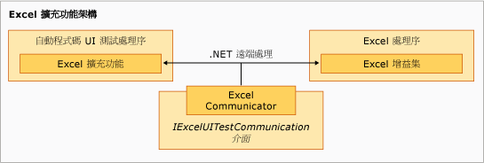

# Excel 的範例自動程式碼 UI 測試擴充功能
[!INCLUDE[vs2017banner](../code-quality/includes/vs2017banner.md)]

範例的擴充元件執行於 [!INCLUDE[vsprvs](../code-quality/includes/vsprvs_md.md)] 自動程式碼 UI 測試處理序，具有一些階層性，並以 `ExtensionPackage` 類別為基底。  `TechnologyManager`、`ActionFilter` 和 `PropertyProvider` 類別在下一個層級，控制項項目在最上層。  
  
   
Excel 擴充架構  
  
## 擴充點  
 這些類別代表範例中啟用 [!INCLUDE[ofprexcel](../test/includes/ofprexcel_md.md)] 自動程式碼 UI 測試所實作的擴充點。  
  
### ExtensionPackage  
 繼承自 <xref:Microsoft.VisualStudio.TestTools.UITest.Extension.UITestExtensionPackage> 類別，這是自動程式碼 UI 測試擴充功能的進入點。  實作這個抽象類別，可允許自動程式碼 UI 測試架構對自訂 UI 測試技術管理員、UI 測試屬性提供者和 UI 測試動作篩選條件的內部存取，以測試新 UI。  如需詳細資訊，請參閱[ExtensionPackage 類別](../test/sample-excel-extension-extensionpackage-class.md)。  
  
### TechnologyManager  
 繼承自 <xref:Microsoft.VisualStudio.TestTools.UITest.Extension.UITechnologyManager> 類別，這個類別提供用於測試錄製及播放的技術管理員。  如需詳細資訊，請參閱[TechnologyManager 類別](../test/sample-excel-extension-technologymanager-class.md)。  
  
### ActionFilter  
 繼承自 <xref:Microsoft.VisualStudio.TestTools.UITest.Common.UITestActionFilter> 類別，這個類別提供用於將類似的測試動作結果彙總至單一測試結果的基底類別。  如需詳細資訊，請參閱[ActionFilter 類別](../test/sample-excel-extension-actionfilter-class.md)。  
  
### 技術項目  
 繼承自 <xref:Microsoft.VisualStudio.TestTools.UITest.Extension.UITechnologyElement> 類別的基底類別，為 UI 測試中可錄製及播放的技術項目提供基礎。  如需詳細資訊，請參閱[Element 類別](../test/sample-excel-extension-element-classes.md)。  
  
### PropertyProvider  
 繼承自 <xref:Microsoft.VisualStudio.TestTools.UITesting.UITestPropertyProvider> 類別，這個類別提供基底類別，以支援用於測試錄製及播放的 UI 項目屬性。  如需詳細資訊，請參閱[PropertyProvider 類別](../test/sample-excel-extension-propertyprovider-class.md)。  
  
## 請參閱  
 <xref:Microsoft.VisualStudio.TestTools.UITesting.UITestPropertyProvider>   
 <xref:Microsoft.VisualStudio.TestTools.UITest.Extension.UITechnologyElement>   
 <xref:Microsoft.VisualStudio.TestTools.UITest.Common.UITestActionFilter>   
 <xref:Microsoft.VisualStudio.TestTools.UITest.Extension.UITestExtensionPackage>   
 [ExtensionPackage 類別](../test/sample-excel-extension-extensionpackage-class.md)   
 [TechnologyManager 類別](../test/sample-excel-extension-technologymanager-class.md)   
 [ActionFilter 類別](../test/sample-excel-extension-actionfilter-class.md)   
 [Element 類別](../test/sample-excel-extension-element-classes.md)   
 [PropertyProvider 類別](../test/sample-excel-extension-propertyprovider-class.md)