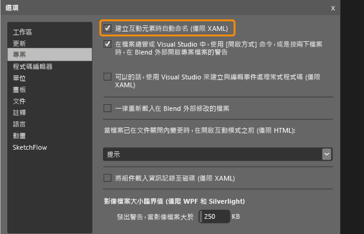

# 為用於測試的 Windows 市集控制項設定唯一自動化屬性
[!INCLUDE[vs2017banner](../code-quality/includes/vs2017banner.md)]

如果您想要對 XAML 架構 Windows 市集應用程式執行自動程式碼 UI 測試，則必須有一個識別每個控制項的唯一自動化屬性。  
  
 您可以根據應用程式中的 XAML 控制項型別來指派唯一的自動化屬性。  這裡說明如何在下列情況下指派這個唯一的自動化屬性：  
  
-   [控制項的靜態 XAML 定義](#UniquePropertyWindowsStoreControlsStaticXAML)  
  
-   [使用 Visual Studio 或 Blend for Visual Studio 指派唯一的自動化屬性。](#UniquePropertyWindowsStoreControlsExpressionBlend)  
  
-   [使用 DataTemplate](#UniquePropertyWindowsStoreControlsDataTemplate)  
  
-   [使用控制項範本](#UniquePropertyWindowsStoreControlsControlTemplate)  
  
-   [動態控制項](#UniquePropertyWindowsStoreControlsDynamicControls)  
  
## 使用方法來指派唯一自動化屬性  
  
###  <a name="UniquePropertyWindowsStoreControlsStaticXAML"></a> 靜態 XAML 定義  
 若要為 XAML 檔案中定義的控制項指定唯一的自動化屬性，您可以隱含或明確設定 AutomationProperties.AutomationId 或 AutomationProperties.Name，如下列範例所示。  設定這些值都會提供控制項可在建立自動程式碼 UI 測試或動作記錄時識別控制項的唯一自動化屬性。  
  
 **隱含設定屬性**  
  
 在 XAML 中使用 Name 屬性將控制項的 AutomationProperties.AutomationId 設定為 ButtonX。  
  
```xaml  
<Button Name="ButtonX" Height="31" HorizontalAlignment="Left" Margin="23,26,0,0"  VerticalAlignment="Top" Width="140" Click="ButtonX_Click" />  
  
```  
  
 在 XAML 中使用 Content 屬性將控制項的 AutomationProperties.Name 設定為 ButtonY。  
  
```xaml  
<Button Content="ButtonY" Height="31" HorizontalAlignment="Left" Margin="23,76,0,0" VerticalAlignment="Top" Width="140" Click="ButtonY_Click" />  
  
```  
  
 **明確設定屬性**  
  
 在 XAML 中明確將控制項的 AutomationProperties.AutomationId 設定為 ButtonX。  
  
```xaml  
<Button AutomationProperties.AutomationId=“ButtonX” Height="31" HorizontalAlignment="Left" Margin="23,26,0,0"  VerticalAlignment="Top" Width="140" Click="ButtonX_Click" />  
  
```  
  
 在 XAML 中明確將控制項的 AutomationProperties.Name 設定為 ButtonY。  
  
```  
<Button AutomationProperties.Name="ButtonY" Height="31" HorizontalAlignment="Left" Margin="23,76,0,0" VerticalAlignment="Top" Width="140" Click="ButtonY_Click" />  
```  
  
###  <a name="UniquePropertyWindowsStoreControlsExpressionBlend"></a> 使用 Visual Studio 或 Blend for Visual Studio 指派唯一的自動化屬性  
 您也可以使用 Visual Studio 或 Blend for Visual Studio，將唯一名稱指派給互動項目，例如按鈕、清單方塊、下拉式方塊和文字方塊。  這會提供控制項唯一的 AutomationProperties.Name 值。  
  
 **Visual Studio：**在 \[ **工具**\] 功能表上，指向 \[**選項**\]，然後依序選擇 \[**文字編輯器**\]、\[**XAML**\] 和最後的 \[**其他**\]。  
  
 選取 **在建立時自動命名互動元素** 然後選擇 **OK**。  
  
   
  
 **Blend for Visual Studio：**從 Blend for Visual Studio 中由下列其中一種方法這麼做。  
  
> [!NOTE]
>  這個方法只能用於透過 XAML 靜態建立的控制項。  
  
 **若要將唯一名稱提供給現有控制項**  
  
 在 \[**工具**\] 功能表上，選擇 \[**互動式項目名稱**\]，如下所示：  
  
   
  
 **若要自動將唯一名稱提供給您建立的控制項**  
  
 在 \[**工具**\] 功能表上，指向 \[**選項**\]，然後選擇 \[**專案**\]。  選取 **在建立時自動命名互動元素** 然後選擇 **OK**，如這裡所示：  
  
   
  
###  <a name="UniquePropertyWindowsStoreControlsDataTemplate"></a> 使用資料範本  
 您可以使用 ItemTemplate 定義簡單範本，透過下列 XAML 將清單方塊中的值繫結至變數。  
  
```xaml  
  
<ListBox Name="listBox1" ItemsSource="{Binding Source={StaticResource employees}}">  
   <ListBox.ItemTemplate>  
      <DataTemplate>  
         <StackPanel Orientation="Horizontal">  
            <TextBlock Text="{Binding EmployeeName}" />  
            <TextBlock Text="{Binding EmployeeID}" />  
         </StackPanel>  
      </DataTemplate>  
   </ListBox.ItemTemplate>  
</ListBox>  
```  
  
 您也可以使用具有 ItemContainerStyle 的範本，透過下列 XAML 將值繫結至變數。  
  
```xaml  
  
      <ListBox Name="listBox1" ItemsSource="{Binding Source={StaticResource employees}}">  
            <ListBox.ItemContainerStyle>  
                <Style TargetType="ListBoxItem">  
                    <Setter Property="Template">  
                        <Setter.Value>  
                            <ControlTemplate TargetType="ListBoxItem">  
                                <Grid>  
                                    <Button Content="{Binding EmployeeName}" AutomationProperties.AutomationId="{Binding EmployeeID}"/>  
                                </Grid>  
                            </ControlTemplate>  
                        </Setter.Value>  
                    </Setter>  
                </Style>  
            </ListBox.ItemContainerStyle>           
        </ListBox>  
  
```  
  
 在這兩個範例中，接著您都必須覆寫 ItemSource 的 ToString\(\) 方法，如下列程式碼範例所示。  此程式碼可確定 AutomationProperties.Name 值已設定而且是唯一的，因為您無法透過繫結設定每個資料繫結清單項目的唯一自動化屬性。  在此案例中設定 AutomationProperties.Name 的唯一值是充足的。  
  
> [!NOTE]
>  使用此作法，清單項目的內部內容也可以透過繫結設定為 Employee 類別中的字串。  如範例所示，每個清單項目內的按鈕控制項都會被指派一個唯一自動化 ID，即員工 ID。  
  
```  
  
Employee[] employees = new Employee[]   
{  
   new Employee("john", "4384"),  
   new Employee("margaret", "7556"),  
   new Employee("richard", "8688"),  
   new Employee("george", "1293")  
};  
  
listBox1.ItemsSource = employees;  
  
public override string ToString()  
{  
    return EmployeeName + EmployeeID; // Unique Identification to be set as the AutomationProperties.Name  
}  
  
```  
  
###  <a name="UniquePropertyWindowsStoreControlsControlTemplate"></a> 使用控制項範本  
 您可以使用控制項範本，讓每個特定型別的執行個體在程式碼中定義時可取得唯一的自動化屬性。  您必須建立範本，使得 AutomationProperty 繫結至控制項執行個體的唯一 ID。  下列 XAML 示範以控制項範本建立此繫結的一個作法。  
  
```xaml  
  
<Style x:Key="MyButton" TargetType="Button">  
<Setter Property="Template">  
   <Setter.Value>  
<ControlTemplate TargetType="Button">  
   <Grid>  
      <CheckBox HorizontalAlignment="Left" AutomationProperties.AutomationId="{TemplateBinding Content}"></CheckBox>  
      <Button Width="90" HorizontalAlignment="Right" Content="{TemplateBinding Content}" AutomationProperties.AutomationId="{TemplateBinding Content}"></Button>  
   </Grid>  
</ControlTemplate>  
   </Setter.Value>  
</Setter>  
</Style>  
  
```  
  
 當您使用這個控制項範本來定義按鈕的兩個執行個體時，自動化 ID 是設定為範本中控制項的唯一內容字串，如下列 XAML 所示。  
  
```xaml  
  
<Button Content=”Button1” Style="{StaticResource MyButton}" Width="140"/>  
<Button Content=”Button2” Style="{StaticResource MyButton}" Width="140"/>  
```  
  
###  <a name="UniquePropertyWindowsStoreControlsDynamicControls"></a> 動態控制項  
 如果您的控制項是從程式碼動態建立，而不是靜態建立或透過 XAML 檔案中的範本建立的，您必須設定控制項的 Content 或 Name 屬性。  這會確保每個動態控制項都有唯一的自動化屬性。  例如，如果核取方塊必須在選取清單項目時顯示，您可以設定這些屬性，如這裡所示：  
  
```c#  
  
private void CreateCheckBox(string txt, StackPanel panel)  
   {  
      CheckBox cb = new CheckBox();  
      cb.Content = txt; // Sets the AutomationProperties.Name  
      cb.Height = 50;  
      cb.Width = 100;  
      cb.Name = "DynamicCheckBoxAid"+ txt; // Sets the AutomationProperties.AutomationId  
      panel.Children.Add(cb);  
    }  
  
```  
  
## 請參閱  
 [使用自動程式碼 UI 測試來測試 Windows 市集 8.1 應用程式](../test/test-windows-store-8-1-apps-with-coded-ui-tests.md)