# 使用自動程式碼 UI 測試，來測試 Windows Phone 8.1 應用程式
[!INCLUDE[vs2017banner](../code-quality/includes/vs2017banner.md)]

使用自動程式碼 UI 測試來測試您的 Windows Phone 應用程式。  
  
## 建立簡單的 Windows Phone 應用程式  
  
1.  使用 Visual C\# 或 Visual Basic 範本，為空白的 Windows Phone 應用程式建立新專案。  
  
     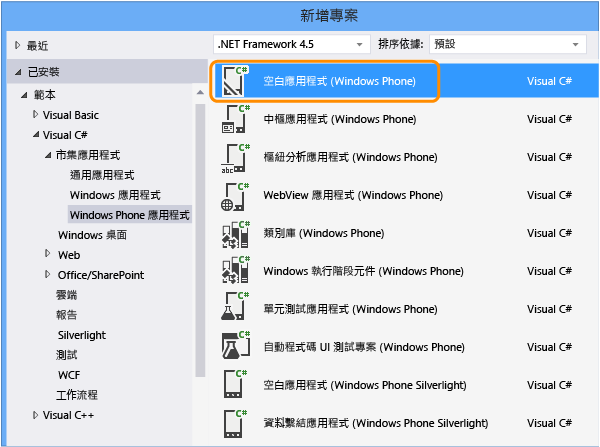  
  
2.  在方案總管中，開啟 MainPage.xaml。 從 \[工具箱\] 中，將按鈕控制項和文字方塊控制項拖曳至設計介面。  
  
       
  
3.  在 \[屬性\] 視窗中，命名按鈕控制項。  
  
     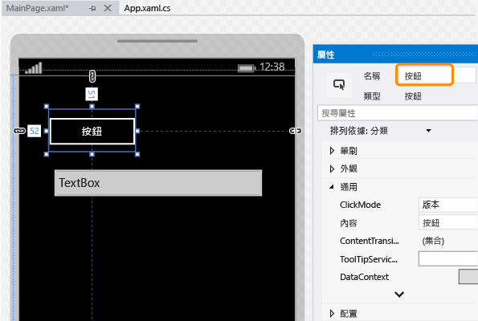  
  
4.  命名文字方塊控制項。  
  
     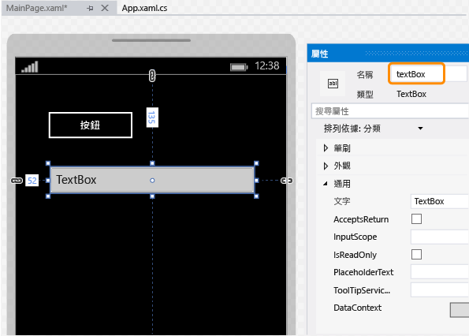  
  
5.  在設計介面上，按兩下按鈕控制項並加入下列程式碼：  
  
    ```c#  
    private void button_Click_1(object sender, RoutedEventArgs e) { this.textBox.Text = this.button.Name; }  
  
    ```  
  
    ```vb#  
    Public NotInheritable Class MainPage Inherits Page Private Sub button_Click(sender As Object, e As RoutedEventArgs) Handles Button.Click Me.textBox.Text = Me.button.Name End Sub End Class  
    ```  
  
6.  按 F5 鍵在模擬器中執行您的 Windows Phone 應用程式，確認運作是否正常。  
  
     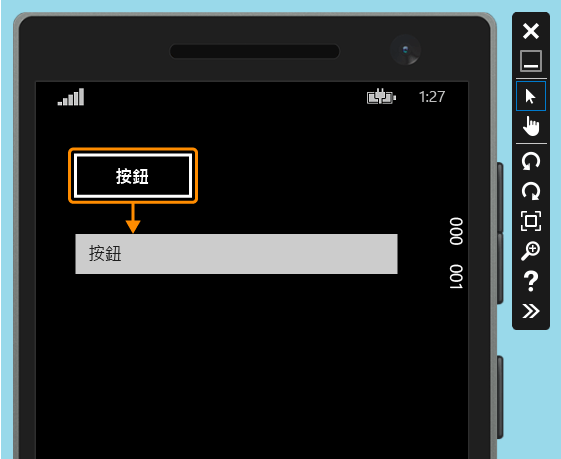  
  
7.  結束模擬器。  
  
## 部署 Windows Phone 應用程式  
  
1.  您必須部署應用程式，自動程式碼 UI 測試才能對應應用程式的控制項。  
  
     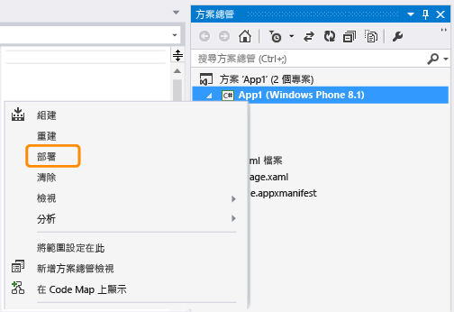  
  
     模擬器啟動。 現在可以使用應用程式進行測試。  
  
     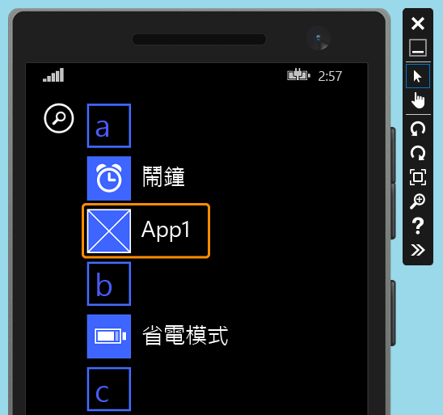  
  
     在您建立自動程式碼 UI 測試期間，繼續執行模擬器。  
  
## 建立 Windows Phone 應用程式的自動程式碼 UI 測試  
  
1.  將新的自動程式碼 UI 測試專案加入使用 Windows Phone 應用程式的方案中。  
  
     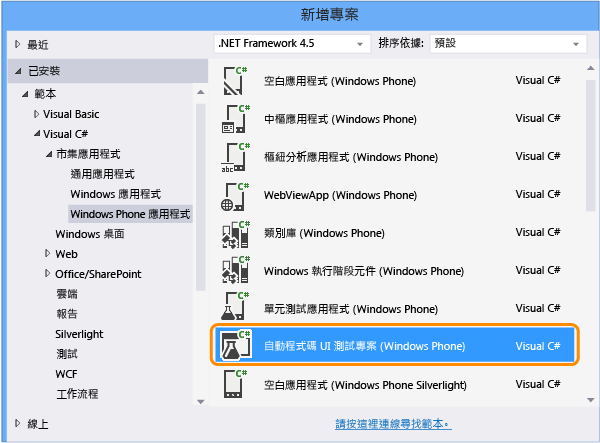  
  
2.  選擇使用交叉線工具編輯 UI 對應。  
  
       
  
3.  使用交叉線工具選取應用程式，然後複製應用程式的 \[AutomationId\] 屬性值，稍後將使用此值啟動測試中的應用程式。  
  
     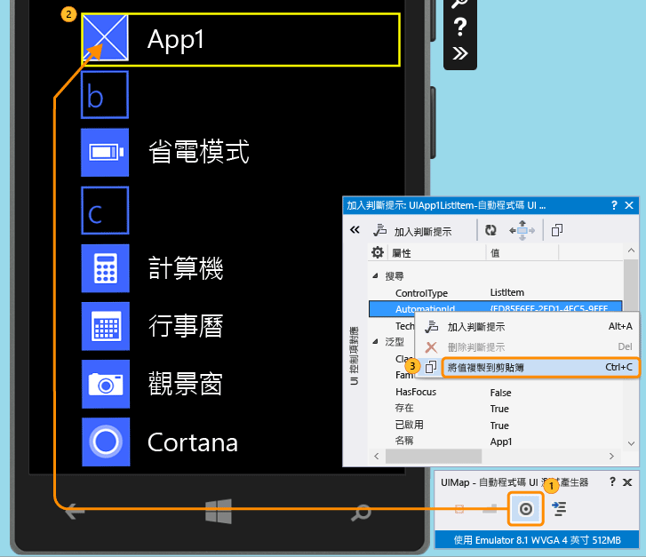  
  
4.  在模擬器中，啟動應用程式並使用交叉線工具選取按鈕控制項。 然後將按鈕控制項加入 UI 控制項對應。  
  
     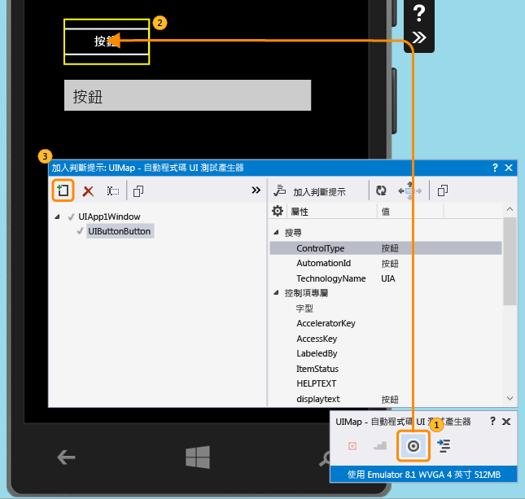  
  
5.  若要將文字方塊控制項加入 UI 控制項對應，請重複上一個步驟。  
  
     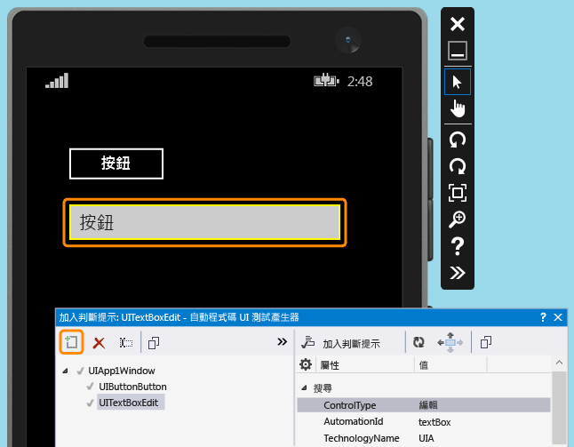  
  
6.  產生程式碼，為 UI 控制項對應的變更建立程式碼。  
  
     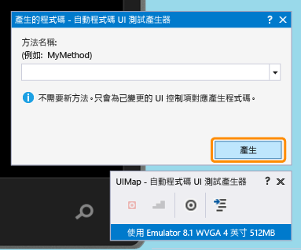  
  
7.  使用交叉線工具選取文字方塊控制項，然後選取 **Text** 屬性。  
  
     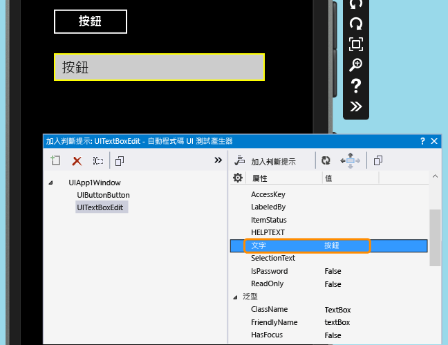  
  
8.  加入判斷提示。 測試將使用此判斷提示來驗證值是否正確。  
  
     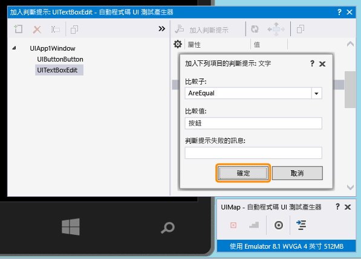  
  
9. 加入及產生 Assert 方法的程式碼。  
  
     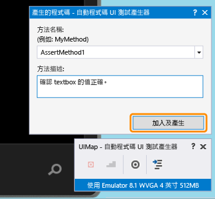  
  
10. **Visual C\#**  
  
     在方案總管中，開啟 UIMap.Designer.cs 檔案，檢視您剛才針對 Assert 方法和控制項加入的程式碼。  
  
     **Visual Basic**  
  
     在方案總管中，開啟 CodedUITest1.vb 檔案。 在 CodedUITestMethod1\(\) 測試方法程式碼中，以滑鼠右鍵按一下自動加入 `Me.UIMap.AssertMethod1()` 之 Assert 方法的呼叫，然後選擇 \[移至定義\]。 這會在程式碼編輯器中開啟 UIMap.Designer.vb 檔案，以便您檢視針對 Assert 方法和控制項加入的程式碼。  
  
    > [!WARNING]
    >  請勿直接修改 UIMap.designer.cs 或 UIMap.Designer.vb 檔案。 如果您這麼做，則每次產生測試時，都會覆寫此檔案的變更。  
  
     **Assert 方法**  
  
    ```c#  
    public void AssertMethod1() { #region Variable Declarations XamlEdit uITextBoxEdit = this.UIApp1Window.UITextBoxEdit; #endregion // Verify that the 'Text' property of 'textBox' text box equals 'button' Assert.AreEqual(this.AssertMethod1ExpectedValues.UITextBoxEditText, uITextBoxEdit.Text); }  
    ```  
  
    ```vb#  
    Public Sub AssertMethod1() Dim uITextBoxEdit As XamlEdit = Me.UIApp1Window.UITextBoxEdit 'Verify that the 'Text' property of 'textBox' text box equals 'button' Assert.AreEqual(Me.AssertMethod1ExpectedValues.UITextBoxEditText, uITextBoxEdit.Text) End Sub  
    ```  
  
     **控制項**  
  
    ```c#  
    #region Properties public virtual AssertMethod1ExpectedValues AssertMethod1ExpectedValues { get { if ((this.mAssertMethod1ExpectedValues == null)) { this.mAssertMethod1ExpectedValues = new AssertMethod1ExpectedValues(); } return this.mAssertMethod1ExpectedValues; } } public UIApp1Window UIApp1Window { get { if ((this.mUIApp1Window == null)) { this.mUIApp1Window = new UIApp1Window(); } return this.mUIApp1Window; } } #endregion #region Fields private AssertMethod1ExpectedValues mAssertMethod1ExpectedValues; private UIApp1Window mUIApp1Window; #endregion  
    ```  
  
    ```vb#  
    #Region "Properties" Public ReadOnly Property UIButtonButton() As XamlButton Get If (Me.mUIButtonButton Is Nothing) Then Me.mUIButtonButton = New XamlButton(Me) Me.mUIButtonButton.SearchProperties(XamlButton.PropertyNames.AutomationId) = "button" End If Return Me.mUIButtonButton End Get End Property Public ReadOnly Property UITextBoxEdit() As XamlEdit Get If (Me.mUITextBoxEdit Is Nothing) Then Me.mUITextBoxEdit = New XamlEdit(Me) Me.mUITextBoxEdit.SearchProperties(XamlEdit.PropertyNames.AutomationId) = "textBox" End If Return Me.mUITextBoxEdit End Get End Property #End Region #Region "Fields" Private mUIButtonButton As XamlButton Private mUITextBoxEdit As XamlEdit #End Region  
    ```  
  
11. 在方案總管中，開啟 CodedUITest1.cs 或 CodedUITest1.vb 檔案。 您現在可以針對執行測試所需的動作，將程式碼加入 CodedUTTestMethod1 方法。 使用加入 UIMap 的控制項來加入程式碼：  
  
    1.  使用您先前複製到 \[剪貼簿\] 的 AutomationId 屬性，啟動 Windows Phone 應用程式：  
  
        ```c#  
        XamlWindow myAppWindow = XamlWindow.Launch("ed85f6ff-2fd1-4ec5-9eef-696026c3fa7b_cyrqexqw8cc7c!App");  
        ```  
  
        ```vb#  
        XamlWindow.Launch("ed85f6ff-2fd1-4ec5-9eef-696026c3fa7b_cyrqexqw8cc7c!App");  
        ```  
  
    2.  加入手勢，以點選按鈕控制項：  
  
        ```c#  
        Gesture.Tap(this.UIMap.UIApp1Window.UIButtonButton);  
        ```  
  
        ```vb#  
        Gesture.Tap(Me.UIMap.UIApp1Window.UIButtonButton)  
        ```  
  
    3.  確認已自動產生的 assert 方法呼叫是在啟動應用程式之後進行，並點選按鈕上的手勢：  
  
        ```c#  
        this.UIMap.AssertMethod1();  
        ```  
  
        ```vb#  
        Me.UIMap.AssertMethod1()  
        ```  
  
     加入程式碼之後，CodedUITestMethod1 測試方法應該如下所示：  
  
    ```c#  
    [TestMethod] public void CodedUITestMethod1() { // To generate code for this test, select "Generate Code for Coded UI Test" from the shortcut menu and select one of the menu items. // Launch the app. XamlWindow myAppWindow = XamlWindow.Launch("ed85f6ff-2fd1-4ec5-9eef-696026c3fa7b_cyrqexqw8cc7c!App"); // Tap the button. Gesture.Tap(this.UIMap.UIApp1Window.UIButtonButton); this.UIMap.AssertMethod1(); }  
    ```  
  
    ```vb#  
    <CodedUITest> Public Class CodedUITest1 <TestMethod()> Public Sub CodedUITestMethod1() ' ' To generate code for this test, select "Generate Code for Coded UI Test" from the shortcut menu and select one of the menu items. ' ' Launch the app. XamlWindow.Launch("ed85f6ff-2fd1-4ec5-9eef-696026c3fa7b_cyrqexqw8cc7c!App") '// Tap the button. Gesture.Tap(Me.UIMap.UIApp1Window.UIButtonButton) Me.UIMap.AssertMethod1() End Sub  
    ```  
  
## 執行自動程式碼 UI 測試  
  
1.  建置您的測試，然後使用測試總管執行測試。  
  
     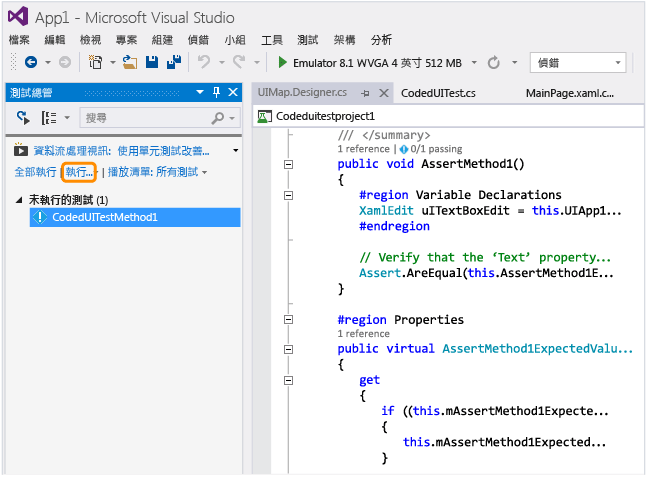  
  
     Windows Phone 應用程式隨即啟動，點選按鈕的動作已完成，並且系統會使用 Assert 方法填入及驗證文字方塊的 Text 屬性。  
  
     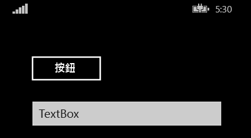  
  
     測試完成之後，測試總管會確認測試成功。  
  
     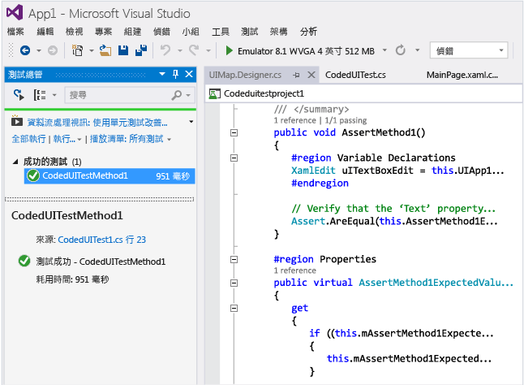  
  
##  <a name="TestingPhoneAppsCodedUI_DataDriven"></a> 在 Windows Phone 應用程式上使用資料驅動型自動程式碼 UI 測試  
 您可以使用不同的資料集多次執行自動程式碼 UI 測試，以測試不同的條件。  
  
 Windows Phone 的資料驅動型自動程式碼 UI 測試是透過測試方法上的 DataRow 屬性來定義。 在下列範例中，x 和 y 針對測試的第一個反覆項目使用值 1 和 2，並針對第二個反覆項目使用 \-1 和 \-2。  
  
```  
[DataRow(1, 2, DisplayName = "Add positive numbers")] [DataRow(-1, -2, DisplayName = "Add negative numbers")] [TestMethod] public void DataDrivingDemo_MyTestMethod(int x, int y)  
  
```  
  
## 問與答  
  
### 問：我必須在模擬器中部署 Windows Phone 應用程式，才能對應 UI 控制項嗎？  
 **答**：是的，自動程式碼 UI 測試產生器需要執行模擬器並在其上部署應用程式。 否則會擲回錯誤訊息，指出找不到執行中的模擬器。  
  
###  <a name="TestingPhoneAppsCodedUI_EmulatorDevice"></a> 問：我只能在模擬器上執行測試，還是也可以使用實體裝置？  
 **答**：上述兩種方法都可以。 您可以變更模擬器類型，或在裝置工具列中選取裝置，來選取要執行測試的目標。 如果選取裝置，需要將 Phone Blue 裝置連接至電腦的其中一個 USB 連接埠。  
  
 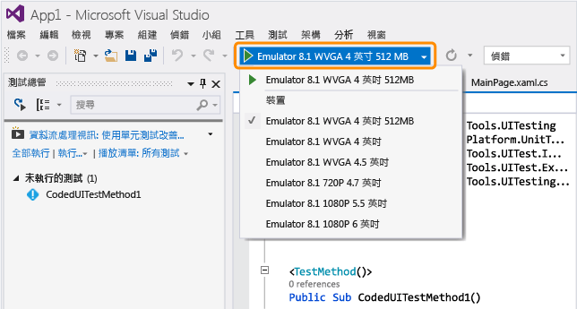  
  
### 問：為什麼在 \[產生自動程式碼 UI 測試的程式碼\] 對話方塊中看不到錄製自動程式碼 UI 測試的選項？  
 **答**：Windows Phone 應用程式不支援錄製選項。  
  
### 問：我可以為以 WinJS、Silverlight 或 HTML5 為基礎的 Windows Phone 應用程式建立自動程式碼 UI 測試嗎？  
 **答**：不可以，目前只支援以 XAML 為基礎的應用程式。  
  
### 問：我可以在未執行 Windows 8.1 或 Windows 10 的系統上，建立 Windows Phone 應用程式的自動程式碼 UI 測試嗎？  
 **答**：不可以，自動程式碼 UI 測試專案範本僅適用於 Windows 8.1 和 Windows 10。 若要建立通用 Windows 平台 \(UWP\) 應用程式的自動化，您需要 Windows 10。  
  
### 問：如何建立通用 Windows 平台 \(UWP\) 應用程式的自動程式碼 UI 測試？  
 **答**：您可以根據要測試 UWP 應用程式的平台，使用下列其中一種方式來建立自動程式碼 UI 測試專案：  
  
-   在本機電腦上執行的 UWP 應用程式將會當做市集應用程式執行。 若要測試這種情況，您必須使用 \[自動程式碼 UI 測試專案 \(Windows\)\] 範本。 若要在建立新專案時找到這個範本，請移至 \[Windows\]、\[通用\] 節點。 或移至 \[Windows\]、\[Windows 8\]、\[Windows\] 節點。  
  
-   在行動裝置或模擬器上執行的 UWP 應用程式將會當做 Phone 應用程式執行。 若要測試這種情況，您必須使用 \[自動程式碼 UI 測試專案 \(Windows Phone\)\] 範本。 若要在建立新專案時找到這個範本，請移至 \[Windows\]、\[通用\] 節點。 或移至 \[Windows\]、\[Windows 8\]、\[Windows Phone\] 節點。  
  
 建立專案之後，撰寫測試的作業會與之前相同。  
  
### 問：我可以選取模擬器外部的控制項嗎？  
 **答**：不可以，產生器偵測不到這些控制項。  
  
### 問：我可以在使用實體電話裝置時，使用自動程式碼 UI 測試產生器對應控制項嗎？  
 **答**：不可以，只有在應用程式已部署至模擬器時，產生器才能對應 UI 項目。  
  
### 問：為什麼無法修改 UIMap.Designer 檔案中的程式碼？  
 **答**：每次您使用 \[UIMap \- 自動程式碼 UI 測試產生器\] 產生程式碼時，對 UIMapDesigner.cs 檔案中的程式碼所做的變更都會被覆寫。 如果您需要修改錄製的方法，必須將它複製到 UIMap.cs 檔案並重新命名。 UIMap.cs 檔案可用來覆寫 UIMapDesigner.cs 檔案中的方法和屬性。 您必須移除 Coded UITest.cs 檔案中原始方法的參考，並將它取代為重新命名的方法名稱。  
  
### 問：我可以在 Windows Phone 應用程式上從命令列執行自動程式碼 UI 測試嗎？  
 **答**：可以，您可以使用 runsettings 檔案指定要執行測試的目標裝置。 例如：  
  
 **vstest.console.exe “pathToYourCodedUITestDll” \/settings:devicetarget.runsettings**  
  
 範例 runsettings 檔案：  
  
```  
<?xml version="1.0" encoding="utf-8"?> <RunSettings> <MSPhoneTest> <!--to specify test execution on device, use a TargetDevice option as follows--> <TargetDevice>Device</TargetDevice> <!--to specify an emulator instead, use a TargetDevice option like below--> <!--<TargetDevice>Emulator 8.1 WVGA 4 inch 512MB</TargetDevice>--> </MSPhoneTest> </RunSettings>  
```  
  
### 問：以 XAML 為基礎之 Windows 市集應用程式的自動程式碼 UI 測試與 Windows Phone 應用程式的自動程式碼 UI 測試有何差異？  
 **答**：以下是其中一些主要差異：  
  
|功能|Windows 市集應用程式|Windows Phone 應用程式|  
|--------|--------------------|------------------------|  
|執行測試的目標|本機或遠端電腦。 當您使用自動化測試案例執行測試時，可指定遠端電腦。 請參閱[在 Microsoft Test Manager 中自動化測試案例](/devops-test-docs/test/automate-a-test-case-in-microsoft-test-manager)。|模擬器或裝置。 請參閱本主題中的[問：我只能在模擬器上執行測試，還是也可以使用實體裝置？](#TestingPhoneAppsCodedUI_EmulatorDevice)|  
|從命令列執行|不需要使用設定檔案來指定目標。|不需要使用 Runsettings 檔案來指定目標。|  
|殼層控制項的特製化類別|<xref:Microsoft.VisualStudio.TestTools.UITesting.DirectUIControls.DirectUIControl>|<xref:Microsoft.VisualStudio.TestTools.UITesting.UITestControl>|  
|XAML 應用程式中的 WebView 控制項|如果使用 Html\* 特製化類別與 HTML 項目互動，則支援。 請參閱 <xref:Microsoft.VisualStudio.TestTools.UITesting.HtmlControls>。|不支援。|  
|從 MTM 執行自動化測試|支援。|不支援。|  
|資料驅動型測試|如需使用外部資料來源及使用測試方法上之 DataSource 屬性的相關資訊，請參閱[資料驅動型測試](../test/creating-a-data-driven-coded-ui-test.md)。|使用測試方法上的 DataRow 屬性以內嵌方式指定資料。 請參閱本主題中的[在 Windows Phone 應用程式上使用資料驅動型自動程式碼 UI 測試](#TestingPhoneAppsCodedUI_DataDriven)。|  
  
 如需 Windows 市集應用程式之自動程式碼 UI 測試的相關資訊，請參閱[使用自動程式碼 UI 測試來測試 Windows 市集 8.1 應用程式](../test/test-windows-store-8-1-apps-with-coded-ui-tests.md)。  
  
## 外部資源  
 Microsoft Visual Studio 應用程式生命週期管理部落格：[使用自動程式碼 UI 來測試以 XAML 為基礎的 Windows Phone 應用程式](http://blogs.msdn.com/b/visualstudioalm/archive/2014/04/05/using-coded-ui-to-test-xaml-based-windows-phone-apps.aspx?PageIndex=2#comments)  
  
## 請參閱  
 [使用 UI 自動化來測試您的程式碼](../test/use-ui-automation-to-test-your-code.md)