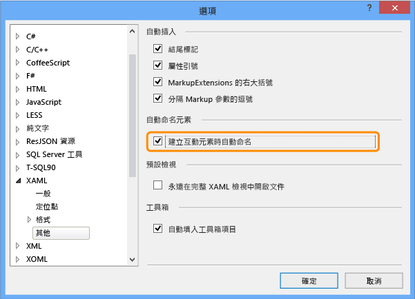
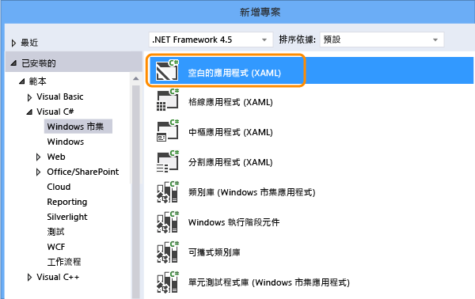
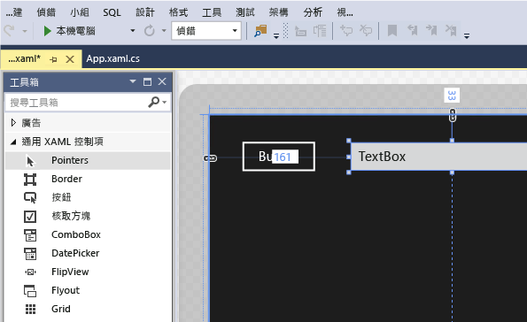
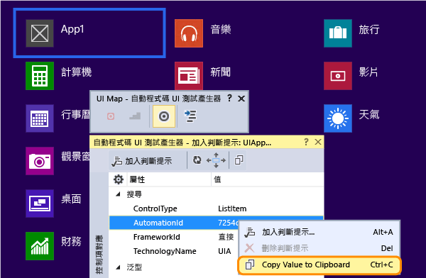
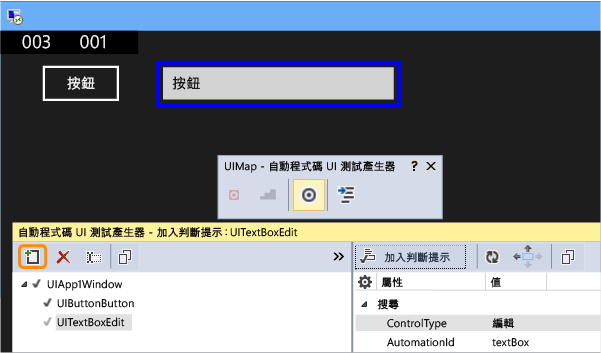
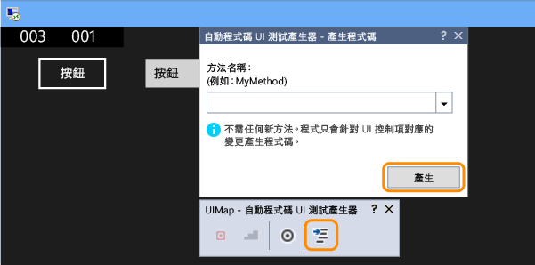
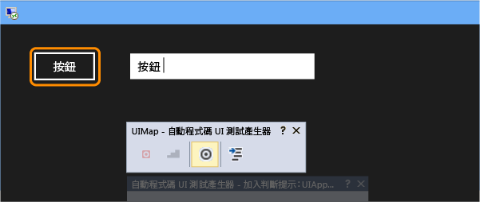
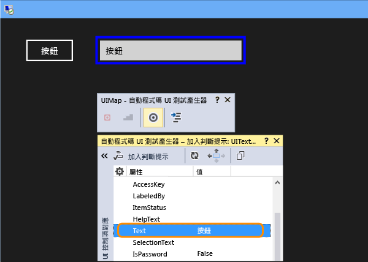
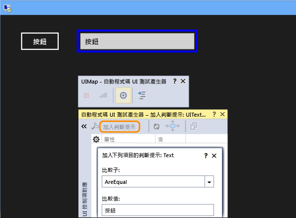
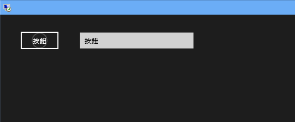

# <a name="test-windows-uwp-and-81-store-apps-with-coded-ui-tests"></a>使用自動程式碼 UI 測試來測試 Windows UWP 和 8.1 市集應用程式

使用此逐步解說建立 UWP 應用程式和 XAML 市集 8.1 應用程式的 UI 測試。 
  
## <a name="create-a-simple-windows-store-app"></a>建立簡單 Windows 市集應用程式  
  
1.  如果您想要執行 XAML Windows 市集應用程式的自動程式化 UI 測試，則必須[設定可識別每個控制項的唯一自動化屬性](../test/set-a-unique-automation-property-for-windows-store-controls-for-testing.md)。  
  
     在 [工具]  功能表上，指向 [選項]  ，然後依序選擇 [文字編輯器] 、[XAML] 和 [其他] 。  
  
     選取此核取方塊，以在建立時自動命名互動項目。  
  
       
  
2.  使用 Visual C# 或 Visual Basic 範本，建立空白 XAML Windows 市集應用程式的新專案。  
  
       
  
3.  在方案總管中，開啟 MainPage.xaml。 從 [工具箱] 中，將按鈕控制項和文字方塊控制項拖曳至設計介面。  
  
       
  
4.  按兩下按鈕控制項，並加入下列程式碼：  
  
    ```c#  
    private void button_Click_1(object sender, RoutedEventArgs e)  
    {  
        this.textBox.Text = this.button.Name;  
    }  
  
    ```  
  
    ```vb#  
    Public NotInheritable Class MainPage  
        Inherits Page  
  
        Private Sub button_Click(sender As Object, e As RoutedEventArgs) Handles Button.Click  
            Me.textBox.Text = Me.button.Name  
        End Sub  
    End Class  
    ```  
  
5.  按 F5 鍵執行 Windows 市集應用程式。  
  
## <a name="create-and-run-a-coded-ui-test-for-the-windows-store-app"></a>為 Windows 市集應用程式建立和執行自動程式碼 UI 測試  

[如何建立通用 Windows 平台 (UWP) 應用程式的自動程式碼 UI 測試？](#uwpapps)
  
1.  為 Windows 市集應用程式建立新的自動程式碼 UI 測試專案。  
  
       
  
2.  選擇使用交叉線工具編輯 UI 對應。  
  
     ![選擇 [編輯 UI 對應或新增判斷提示]](~/docs/test/media/cuit_windowsstoreapp_createproject_gencodedialog.png "CUIT_WindowsStoreApp_CreateProject_GenCodeDialog")  
  
3.  使用自動程式碼 UI 測試產生器中的交叉線工具選取應用程式磚，以滑鼠右鍵按一下 [AutomationId]  ，然後選擇 [將值複製到剪貼簿] 。 剪貼簿中的值稍後將會用來撰寫可啟動應用程式進行測試的動作。  
  
       
  
4.  在執行中 Windows 市集應用程式中，使用交叉線工具選取按鈕控制項和文字方塊控制項。 加入每個控制項之後，請選擇 [自動程式碼 UI 測試產生器] 工具列中的 [將控制項加入至 UI 控制項對應]  按鈕。  
  
       
  
5.  選擇 [自動程式碼 UI 測試產生器] 工具列中的 [產生程式碼]  按鈕，然後選擇 [產生]  建立 UI 控制項對應變更的程式碼。  
  
       
  
6.  選擇此按鈕，以在文字方塊中設定值。  
  
       
  
7.  使用交叉線工具選取文字方塊控制項，然後選取 [文字]  屬性。  
  
       
  
8.  加入判斷提示。 測試將使用此判斷提示來驗證值是否正確。  
  
       
  
9. 加入並產生判斷提示的程式碼。  
  
       
  
10. **Visual C#**  
  
     在方案總管中，開啟 UIMap.Designer.cs 檔案，以檢視針對 assert 方法和控制項所加入的程式碼。  
  
     **Visual Basic**  
  
     在方案總管中，開啟 CodedUITest1.vb 檔案，然後在 CodedUITestMethod1() 測試方法程式碼中，以滑鼠右鍵按一下已自動加入 `Me.UIMap.AssertMethod1()` 的判斷提示方法呼叫，然後選擇 [移至定義] 。 這將會在程式碼編輯器中開啟 UIMap.Designer.vb 檔案，讓您可以檢視針對 assert 方法和控制項所加入的程式碼。  
  
    > [!WARNING]
    >  請勿直接修改 UIMap.designer.cs 或 UIMap.Designer.vb 檔案。 如果您這麼做，則每次產生測試時，都會覆寫此檔案的變更。  
  
     **Assert 方法**  
  
    ```c#  
    public void AssertMethod1()  
    {  
        #region Variable Declarations  
        XamlEdit uITextBoxEdit = this.UIApp1Window.UITextBoxEdit;  
        #endregion  
  
        // Verify that the 'Text' property of 'textBox' text box equals 'button'  
        Assert.AreEqual(this.AssertMethod3ExpectedValues.UITextBoxEditText, uITextBoxEdit.Text);  
    }  
    ```  
  
    ```vb#  
    Public Sub AssertMethod1()  
        Dim uITextBoxEdit As XamlEdit = Me.UIApp2Window.UITextBoxEdit  
  
        'Verify that the 'Text' property of 'textBox' text box equals 'button'  
        Assert.AreEqual(Me.AssertMethod1ExpectedValues.UITextBoxEditText, uITextBoxEdit.Text)  
    End Sub  
    ```  
  
     **控制項**  
  
    ```c#  
    #region Properties  
    public XamlButton UIButtonButton  
    {  
        get  
        {  
            if ((this.mUIButtonButton == null))  
            {  
                this.mUIButtonButton = new XamlButton(this);  
                #region Search Criteria  
                this.mUIButtonButton.SearchProperties[XamlButton.PropertyNames.AutomationId] = "button";  
                this.mUIButtonButton.WindowTitles.Add("App1");  
                #endregion  
            }  
            return this.mUIButtonButton;  
        }  
    }  
  
    public XamlEdit UITextBoxEdit  
    {  
        get  
        {  
            if ((this.mUITextBoxEdit == null))  
            {  
                this.mUITextBoxEdit = new XamlEdit(this);  
                #region Search Criteria  
                this.mUITextBoxEdit.SearchProperties[XamlEdit.PropertyNames.AutomationId] = "textBox";  
                this.mUITextBoxEdit.WindowTitles.Add("App1");  
                #endregion  
            }  
            return this.mUITextBoxEdit;  
        }  
    }  
    #endregion  
  
    #region Fields  
    private XamlButton mUIButtonButton;  
  
    private XamlEdit mUITextBoxEdit;  
    #endregion  
    ```  
  
    ```vb#  
    #Region "Properties"  
    Public ReadOnly Property UIButtonButton() As XamlButton  
        Get  
            If (Me.mUIButtonButton Is Nothing) Then  
                Me.mUIButtonButton = New XamlButton(Me)  
                Me.mUIButtonButton.SearchProperties(XamlButton.PropertyNames.AutomationId) = "button"  
                Me.mUIButtonButton.WindowTitles.Add("App2")  
            End If  
            Return Me.mUIButtonButton  
        End Get  
    End Property  
  
    Public ReadOnly Property UITextBoxEdit() As XamlEdit  
        Get  
            If (Me.mUITextBoxEdit Is Nothing) Then  
                Me.mUITextBoxEdit = New XamlEdit(Me)  
                Me.mUITextBoxEdit.SearchProperties(XamlEdit.PropertyNames.AutomationId) = "textBox"  
                Me.mUITextBoxEdit.WindowTitles.Add("App2")  
            End If  
            Return Me.mUITextBoxEdit  
        End Get  
    End Property  
    #End Region  
  
    #Region "Fields"  
    Private mUIButtonButton As XamlButton  
  
    Private mUITextBoxEdit As XamlEdit  
    #End Region  
    ```  
  
11. 在方案總管中，開啟 CodedUITest1.cs 或 CodedUITest1.vb 檔案。 您現在可以將程式碼加入至 CodedUTTestMethod1 方法，因為動作需要使用已加入至 UIMap 的控制項執行測試：  
  
    1.  使用您先前複製到 [剪貼簿] 的 AutomationId 屬性，啟動 Windows 市集應用程式：  
  
        ```c#  
        XamlWindow.Launch("8ebca7c4-effe-4c86-9998-068daccee452_cyrqexqw8cc7c!App")  
        ```  
  
        ```vb#  
        XamlWindow myAppWindow = XamlWindow.Launch("7254db3e-20a7-424e-8e05-7c4dabf4f28d_cyrqexqw8cc7c!App");  
        ```  
  
    2.  加入手勢，以點選按鈕控制項：  
  
        ```c#  
        Gesture.Tap(this.UIMap.UIApp1Window. UIButtonButton);  
        ```  
  
        ```vb#  
        Gesture.Tap(Me.UIMap.UIApp2Window. UIButtonButton)  
        ```  
  
    3.  確認已自動產生的 assert 方法呼叫是在啟動應用程式之後進行，並點選按鈕上的手勢：  
  
        ```c#  
        this.UIMap.AssertMethod1();  
        ```  
  
        ```vb#  
        Me.UIMap.AssertMethod1()  
        ```  
  
     加入程式碼之後，CodedUITestMethod1 測試方法應該顯示如下：  
  
    ```c#  
    [TestMethod]  
    public void CodedUITestMethod1()  
    {  
        // To generate code for this test, select "Generate Code for Coded UI Test" from the shortcut menu and select one of the menu items.  
  
        // Launch the app.  
        XamlWindow myAppWindow = XamlWindow.Launch("7254db3e-20a7-424e-8e05-7c4dabf4f28d_cyrqexqw8cc7c!App");  
  
        // Tap the button.  
        Gesture.Tap(this.UIMap.UIApp1Window.UIButtonButton);  
  
        this.UIMap.AssertMethod1();  
    }  
    ```  
  
    ```vb#  
    <CodedUITest(CodedUITestType.WindowsStore)>  
    Public Class CodedUITest1  
  
        <TestMethod()>  
        Public Sub CodedUITestMethod1()  
            '              
            ' To generate code for this test, select "Generate Code for Coded UI Test" from the shortcut menu and select one of the menu items.  
            '  
  
            ' Launch the app.  
            XamlWindow.Launch("8ebca7c4-effe-4c86-9998-068daccee452_cyrqexqw8cc7c!App")  
  
            '// Tap the button.  
            Gesture.Tap(Me.UIMap.UIApp2Window.UIButtonButton)  
  
            Me.UIMap.AssertMethod1()  
        End Sub  
    ```  
  
12. 建置您的測試，然後使用測試總管執行測試。  
  
     ![從 [測試總管] 執行自動程式化 UI 測試](../test/media/cuit_windowsstoreapp_runtest.png "CUIT_WindowsStoreApp_RunTest")  
  
     即會啟動 Windows 市集應用程式、完成點選按鈕的動作，以及填入文字方塊的 Text 屬性並使用 assert 方法進行驗證。  
  
       
  
     測試完成之後，測試總管會顯示測試成功。  
  
     ![已通過的測試顯示於 [測試總管] 中](../test/media/cuit_windowsstorapp_passedtest.png "CUIT_WindowsStorApp_PassedTest")  
  
## <a name="q--a"></a>問與答  
  
#### <a name="q-why-dont-i-see-the-option-to-record-my-coded-ui-test-in-the-generate-code-for-a-coded-ui-test-dialog"></a>問：為什麼在 [產生自動程式化 UI 測試的程式碼] 對話方塊中看不到錄製自動程式化 UI 測試的選項？  
  
**答**：Windows 市集應用程式不支援錄製的選項。  
  
#### <a name="q-can-i-create-a-coded-ui-test-for-my-windows-store-apps-based-on-winjs"></a>問：我可以根據 WinJS 建立 Windows 市集應用程式的自動程式碼 UI 測試嗎？**  

**答**：不可以，目前只支援以 XAML 為基礎的應用程式。  
  
#### <a name="q-can-i-create-coded-ui-tests-for-my-windows-store-apps-on-a-system-that-is-not-running-windows-81-or-windows-10"></a>問：我可以在未執行 Windows 8.1 或 Windows 10 的系統上，建立 Windows 市集應用程式的自動程式碼 UI 測試嗎？**  
  
**答**：不可以，自動程式碼 UI 測試專案範本僅適用於 Windows 8.1 和 Windows 10。 若要建立通用 Windows 平台 (UWP) 應用程式的自動化，您需要 Windows 10。  

<a name="uwpapps"></a>  
#### <a name="q-how-do-i-create-coded-ui-tests-for-universal-windows-platform-uwp-apps"></a>問：如何建立通用 Windows 平台 (UWP) 應用程式的自動程式碼 UI 測試？**  
  
**答**：您可以根據要測試 UWP 應用程式的平台，使用下列其中一種方式來建立自動程式碼 UI 測試專案：  
  
- 在本機電腦上執行的 UWP 應用程式將會當做市集應用程式執行。 若要測試這種情況，您必須使用 [自動程式碼 UI 測試專案 (Windows)]  範本。 若要在建立新專案時找到這個範本，請移至 [Windows] 、[通用]  節點。 或移至 [Windows] 、[Windows 8] 、[Windows]  節點。  
  
- 在行動裝置或模擬器上執行的 UWP 應用程式將會當做 Phone 應用程式執行。 若要測試這種情況，您必須使用 [自動程式碼 UI 測試專案 (Windows Phone)]  範本。 若要在建立新專案時找到這個範本，請移至 [Windows] 、[通用]  節點。 或移至 [Windows] 、[Windows 8] 、[Windows Phone]  節點。  
  
建立專案之後，撰寫測試的作業會與之前相同。  
  
#### <a name="q-why-cant-i-modify-the-code-in-the-uimapdesigner-file"></a>問：為什麼無法修改 UIMap.Designer 檔案中的程式碼？**  
  
**答**：每次您使用 [UIMap - 自動程式碼 UI 測試產生器] 產生程式碼時，對 UIMapDesigner.cs 檔案中的程式碼所做的變更都會被覆寫。 如果您需要修改錄製的方法，必須將它複製到 UIMap.cs 檔案並重新命名。 UIMap.cs 檔案可用來覆寫 UIMapDesigner.cs 檔案中的方法和屬性。 您必須移除 Coded UITest.cs 檔案中原始方法的參考，並將它取代為重新命名的方法名稱。  
  
## <a name="see-also"></a>另請參閱  
 [使用使用者介面自動化來測試您的程式碼](../test/use-ui-automation-to-test-your-code.md)   
 [為 Windows 市集控制項設定唯一自動化屬性以進行測試](../test/set-a-unique-automation-property-for-windows-store-controls-for-testing.md)

