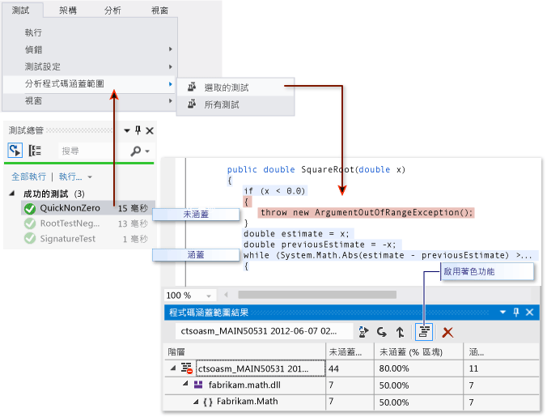

# 針對程式碼涵蓋範圍進行疑難排解
Visual Studio 中的程式碼涵蓋範圍分析工具會收集原生組件和 Managed 組件 (.dll 或 .exe 檔) 的資料。 不過，在某些情況下，[程式碼涵蓋範圍結果] 視窗會顯示類似「產生空白的結果:....」的錯誤。有幾個可能發生這種情況的原因。 本主題有助於解決這些問題。  
  
## 您應該會看見  
 如果您選擇 [測試] 功能表上的 [分析程式碼涵蓋範圍] 命令，而且組建和測試皆順利執行，則您應該會在 [程式碼涵蓋範圍] 視窗中看見結果清單。 您可能必須展開項目才能查看詳細資料。  
  
   
  
 如需詳細資訊，請參閱[使用程式碼涵蓋範圍來決定所測試的程式碼數量](../test/using-code-coverage-to-determine-how-much-code-is-being-tested.md)。  
  
## 看不見任何結果或看見舊結果的可能原因  
  
### 您的 Visual Studio 版本是否正確?  
 您需具備 Visual Studio 企業版。  
  
### 沒有執行過任何測試  
 分析  
 請查看輸出視窗。 在 [顯示輸出來源] 下拉式清單中選擇 [測試]。 檢查是否有記錄任何警告或錯誤。  
  
 說明  
 程式碼涵蓋範圍分析會在執行測試時進行。 這項分析只包括在執行測試時載入記憶體的組件。 如果沒有執行任何測試，程式碼涵蓋範圍就不會產生任何報告。  
  
 解決方法  
 在 [測試總管] 中，選擇 [全部執行]，確認所執行的測試是否成功。 在使用 [分析程式碼涵蓋範圍] 之前修正所有錯誤。  
  
### 您看到的是之前的結果  
 當您修改並重新執行測試時，可能仍會顯示先前的程式碼涵蓋範圍結果，包括在先前執行時著色的程式碼。  
  
1.  執行 [分析程式碼涵蓋範圍]。  
  
2.  請務必在 [程式碼涵蓋範圍] 結果視窗中選取最新的一組結果。  
  
### .pdb (符號) 檔案無法使用  
 分析  
 開啟編譯目標資料夾 (通常是 bin\debug)，然後針對每個組件確認 .dll 或 .exe 檔案所在的目錄中有 .pdb 檔案。  
  
 說明  
 程式碼涵蓋範圍引擎會要求每個組件在測試回合期間都能夠存取其相關聯的 .pdb 檔案。 如果特定組件沒有 .pdb 檔，就不會分析該組件。  
  
 產生 .pdb 檔的組建必須是產生 .dll 或 .exe 檔案的組建。  
  
 解決方式  
 請確定您的組建設定會產生 .pdb 檔。 如果建置專案時沒有更新 .pdb 檔案，請開啟專案屬性，選取 [組建] 頁面，選擇 [進階]，然後檢查 [偵錯資訊]。  
  
 如果 .pdb 和 .dll 或 .exe 檔案在不同的位置，請將 .pdb 檔複製到同一個目錄中。 將程式碼涵蓋範圍引擎設定成搜尋另一個位置的 .pdb 檔也是可行的。 如需詳細資訊，請參閱[自訂程式碼涵蓋範圍分析](../test/customizing-code-coverage-analysis.md)。  
  
### 使用已檢測或最佳化的二進位檔  
 分析  
 判斷該二進位檔是否已完成「特性指引最佳化」等任何形式的進階最佳化，或者是否已完成 vsinstr.exe 或 vsperfmon.exe 等程式碼剖析工具的檢測。  
  
 說明  
 如果組件已完成另一個程式碼剖析工具的檢測或最佳化，程式碼涵蓋範圍分析會略過該組件。  
  
 無法在此類組件執行程式碼涵蓋範圍分析。  
  
 解決方式  
 關閉最佳化並使用新的組建。  
  
### 程式碼不是 Managed (.NET) 或機器碼 (C++)  
 分析  
 確認您在執行 Managed 或 C++ 程式碼的某些測試。  
  
 說明  
 在 Visual Studio 中的程式碼涵蓋範圍分析只適用於 Managed 和機器碼 (C++)。 如果您使用協力廠商工具，部分或所有程式碼可能會在不同平台上執行。  
  
 解決方式  
 無法使用。  
  
### NGen 已安裝組件  
 分析  
 確認該組件不是從原生映像快取載入的。  
  
 說明  
 基於效能考量，不會分析原生映像組件。 如需詳細資訊，請參閱 [Ngen.exe (原生映像產生器)](/dotnet/framework/tools/ngen-exe-native-image-generator)。  
  
 解決方法  
 使用組件的 MSIL 版本。 不可用 NGen 處理。  
  
### 語法不正確的自訂 .runsettings 檔案  
 分析  
 如果您使用的是自訂 .runsettings 檔案，其中可能包含語法錯誤。  
  
 這會導致程式碼涵蓋範圍完全無法執行。 程式碼涵蓋範圍視窗在測試回合結束時未開啟，或是顯示舊的結果。  
  
 說明  
 您可以使用自訂 .runsettings 檔案執行單元測試．以設定程式碼涵蓋範圍選項。 這些選項可讓您包含或排除檔案。 如需詳細資訊，請參閱[自訂程式碼涵蓋範圍分析](../test/customizing-code-coverage-analysis.md)。  
  
 解決方法  
 可能發生兩種類型的錯誤：  
  
-   **XML 錯誤**  
  
     在 Visual Studio XML 編輯器中開啟 .runsettings 檔案。 尋找錯誤。  
  
-   **規則運算式錯誤**  
  
     檔案中的每個字串都是規則運算式。 檢閱每一個錯誤，特別要尋找：  
  
    -   不對稱的括號 (...) 或未逸出的括號 \\(...\\)。 如果要比對搜尋字串中的括號，必須逸出該括號。 例如，比對函式的用法： `.*MyFunction\(double\)`  
  
    -   運算式開頭的星號或加號。 若要比對任何字元字串，請在星號後面加上點：`.*`  
  
### 自訂 .runsettings 檔包含不正確的排除項  
 分析  
 如果您使用自訂 .runsettings 檔，請確定該檔案包含您的組件。  
  
 說明  
 您可以使用自訂 .runsettings 檔案執行單元測試．以設定程式碼涵蓋範圍選項。 這些選項可讓您包含或排除檔案。 如需詳細資訊，請參閱[自訂程式碼涵蓋範圍分析](../test/customizing-code-coverage-analysis.md)。  
  
 解決方法  
 移除 .runsettings 檔中的所有 `Include` 節點，然後移除所有 `Exclude` 節點。 如果這樣可以解決問題，請將它們放回階段。  
  
 確定 DataCollectors 節點有指定 [程式碼涵蓋範圍]。 請將它和[自訂程式碼涵蓋範圍分析](../test/customizing-code-coverage-analysis.md)中的範例比較。  
  
## 某些程式碼一定會顯示為不涵蓋  
  
### 原生 DLL 中的初始化程式碼會在檢測之前執行  
 分析  
 在靜態連結機器碼中，即使程式碼已執行，有時仍會將部分的初始化函式 **DllMain** 及它所呼叫的程式碼顯示為未涵蓋。  
  
 說明  
 程式碼涵蓋範圍工具的運作方式是，在應用程式開始執行之前將測試設備插入組件中。 在這之前載入的任何組件中，**DllMain** 中的初始化程式碼會於組件載入，以及應用程式執行之前時執行。 該程式碼會顯示為未涵蓋。  
  
 通常，這適用於靜態載入的組件。  
  
 解決方式  
 無。  
  
## 另請參閱  
 [使用程式碼涵蓋範圍來決定所測試的程式碼數量](../test/using-code-coverage-to-determine-how-much-code-is-being-tested.md)

