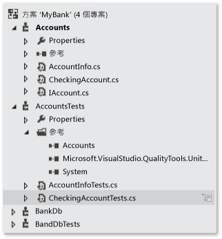
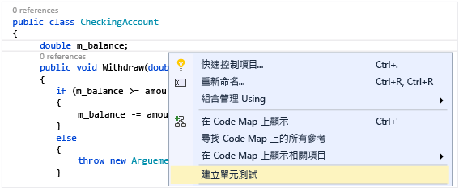
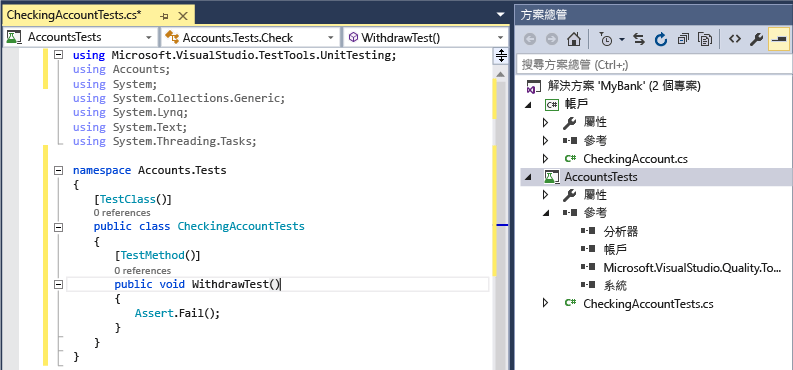
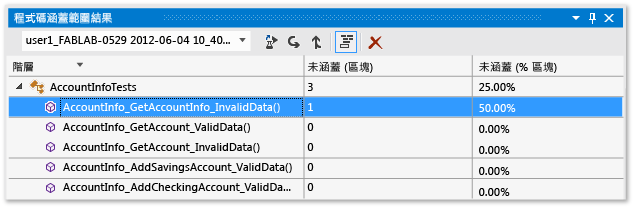

# <a name="unit-test-basics"></a>單元測試基本概念
藉由建立及執行單元測試，檢查您的程式碼是否如預期般執行。 這之所以稱為單元測試，是因為您將程式功能分解成離散的可測試行為，這些行為能作為個別的「單位」加以測試。 Visual Studio [測試總管] 提供富彈性又有效率的方式來執行單元測試，並可在 Visual Studio 中檢視結果。 Visual Studio 會安裝 Managed 程式碼和原生程式碼適用的 Microsoft 單元測試架構。 請使用 *「單元測試架構」* (unit testing framework) 來建立單元測試並加以執行，然後報告這些測試的結果。 當您進行變更來測試程式碼是否仍正常運作時，請重新執行單元測試。 當您使用 Visual Studio Enterprise 版時，可以在每次建置後自動執行測試。  
  
 當單元測試是軟體開發工作流程中不可或缺的一部分時，就能對您的程式碼品質發揮最大的作用。 一旦您撰寫函式或其他應用程式程式碼區塊，就會建立單元測試，以便驗證該程式碼的行為是否對應於輸入資料的標準、界限和不正確情況，並檢查程式碼所做的任何明確或隱含假設。 藉由 *「測試驅動式開發」*(test driven development)，您可在撰寫程式碼之前先建立單元測試，以便將單元測試做為設計文件和功能規格。  
  
 您可以從您的程式碼快速產生測試專案和測試方法，或在您需要的時候以手動方式建立此測試。 當您使用 IntelliTest 來探索 .NET 程式碼時，可以產生測試資料和單元測試套件。 其會為程式碼中的每一個陳述式產生一個用以執行該陳述式的測試輸入。 了解如何 [產生程式碼的單元測試](http://msdn.microsoft.com/library/dn823749.aspx)。  
  
 [測試總管] 也可以執行在其中已實作 [測試總管] 附加元件介面的協力廠商和開放原始碼的單元測試架構。 您可以透過 Visual Studio 擴充功能管理員和 Visual Studio 組件庫加入多個這些架構。 請參閱[安裝協力廠商單元測試架構](../test/install-third-party-unit-test-frameworks.md)。  
  
-   [快速入門](#BKMK_Quick_starts)  
  
-   [MyBank 方案範例](#BKMK_The_MyBank_Solution_example)  
  
-   [建立單元測試專案和測試方法](#BKMK_Creating_the_unit_test_projects)  
  
-   [撰寫您的測試](#BKMK_Writing_your_tests)  
  
-   [在 [測試總管] 中執行測試](#BKMK_Running_tests_in_Test_Explorer)  
  
-   [執行測試並加以檢視](#BKMK_Running_and_viewing_tests_from_the_Test_Explorer_toolbar)  
  
##  <a name="BKMK_Unit_testing_overview"></a> 單元測試概觀  
  
###  <a name="BKMK_Quick_starts"></a> 快速入門  
 如需單元測試的簡介以便直接參考編碼，請參閱下列其中一個主題：  
  
-   [逐步解說：針對 Managed 程式碼建立和執行單元測試](../test/walkthrough-creating-and-running-unit-tests-for-managed-code.md)  
  
-   [快速入門：搭配測試總管進行以測試為導向的開發工作](../test/quick-start-test-driven-development-with-test-explorer.md)  
  
-   [使用測試總管針對機器碼執行單元測試](http://msdn.microsoft.com/en-us/8a09d6d8-3613-49d8-9ffe-11375ac4736c)  
  
##  <a name="BKMK_The_MyBank_Solution_example"></a> MyBank 方案範例  
 在本主題中，我們會使用稱為 `MyBank` 的虛構應用程式開發來做為範例。 您不需要實際程式碼來照著本主題中的說明進行。 測試方法會以 C# 撰寫，並使用 Managed 程式碼適用的 Microsoft 單元測試架構來呈現，不過，這個概念可輕鬆地轉移到其他語言和架構。  
  
   
  
 我們第一次在 `MyBank` 應用程式的設計嘗試包括帳戶元件 (代表個別帳戶及其與銀行的交易)，和資料庫元件 (代表可彙總及管理個別帳戶的功能)。  
  
 我們建立的 `MyBank` 方案包含兩個專案：  
  
-   `Accounts`  
  
-   `BankDb`  
  
 我們第一次在 `Accounts` 專案的設計嘗試包含一個保留帳戶相關基本資訊的類別、一個指定任一種帳戶通用功能 (例如在帳戶的資產中存款和提款) 的介面，以及一個從該介面衍生代表支票帳戶的類別。 一開始我們先在帳戶專案中建立下列原始程式檔：  
  
-   `AccountInfo.cs` 定義帳戶的基本資訊。  
  
-   `IAccount.cs` 定義帳戶的標準 `IAccount` 介面，包括從帳戶資產存款和提款，以及擷取帳戶餘額的方法。  
  
-   `CheckingAccount.cs` 包含的 `CheckingAccount` 類別可實作支票帳戶的 `IAccounts` 介面。  
  
 我們從經驗中知道一件事，那就是從支票帳戶提款必須先確認提取的金額小於帳戶餘額。 因此我們使用一個可檢查此條件的方法來覆寫 `IAccount.Withdaw` 中的 `CheckingAccount` 方法。 此方法可能看起來像這樣：  
  
```c#  
  
public void Withdraw(double amount)  
{  
    if(m_balance >= amount)  
    {  
        m_balance -= amount;  
    }  
    else  
    {  
        throw new ArgumentException(amount, "Withdrawal exceeds balance!")  
    }  
}  
  
```  
  
 現在我們已經有一些程式碼，該開始測試了。  
  
##  <a name="BKMK_Creating_the_unit_test_projects"></a> 建立單元測試專案和測試方法  
 從您的程式碼中產生單元測試專案和單元測試虛設常式通常較快。 或者您可以視您的需求而定，選擇以手動方式建立單元測試專案和測試。  
  
 **產生單元測試專案和單元測試虛設常式**  
  
1.  從程式碼編輯器視窗中，自內容功能表以滑鼠右鍵按一下並選擇 [建立單元測試]  。  
  
       
  
2.  按一下 [確定] 接受預設值來建立單元測試，或變更過去用來建立和命名單元測試專案和單元測試的值。 您可以選取預設加入此單元測試方法的程式碼。  
  
     ![在編輯器中按一下滑鼠右鍵，然後選擇 [建立單元測試]](../test/media/createunittestsdialog.png "CreateUnitTestsDialog")  
  
3.  會針對此類別中的所有方法，在新的單元測試專案中建立單元測試虛設常式。  
  
       
  
4.  現在往前跳至了解如何 [將程式碼加入單元測試方法](#BKMK_Writing_your_tests) ，讓您的單元測試有意義，以及您可能會想加入的任何額外單元測試，藉此徹底測試程式碼。  
  
 **手動建立單元測試專案和單元測試**  
  
 單元測試專案通常會反映單一程式碼專案的結構。 在 MyBank 範例中，您可以將名為 `AccountsTests` 和 `BankDbTests` 的兩個單元測試專案加入 `MyBanks` 方案中。 這些測試專案名稱可隨意命名，不過最好採用標準命名慣例。  
  
 **將單元測試專案加入方案：**  
  
1.  在 [檔案]  功能表上，選擇 [新增]  ，然後選擇 [專案]  (鍵盤 Ctrl + Shift + N)。  
  
2.  在 [新增專案] 對話方塊中，展開 [已安裝]  節點，選擇您想要用於測試專案的語言，然後選擇 [測試] 。  
  
3.  若要使用其中一個 Microsoft 單元測試架構，請從專案範本清單中選擇 [單元測試專案]  。 否則，請選擇您所要使用單元測試架構的專案範本。 若要測試本例的 `Accounts` 專案，請將專案命名為 `AccountsTests`。  
  
    > [!WARNING]
    >  並非所有協力廠商和開放原始碼的單元測試架構都提供 Visual Studio 專案範本。 如需建立專案的相關資訊，請參閱架構文件。  
  
4.  在您的單元測試專案中，可在本例中將受測程式碼專案的參考加入帳戶專案。  
  
     建立程式碼專案的參考：  
  
    1.  在 [方案總管] 中選取專案。  
  
    2.  在 [專案]  功能表上，選擇 [加入參考] 。  
  
    3.  在 [參考管理員] 對話方塊上，開啟 [方案]  節點，然後選擇 [專案] 。 選取程式碼專案名稱，然後關閉對話方塊。  
  
 每個單元測試專案包含的類別都可反映程式碼專案中的類別名稱。 在本例中，`AccountsTests` 專案可能包含下列類別：  
  
-   `AccountInfoTests` 類別包含 `AccountInfo` 專案中 `BankAccount` 類別的單元測試方法。  
  
-   `CheckingAccountTests` 類別包含 `CheckingAccount` 類別的單元測試方法。  
  
##  <a name="BKMK_Writing_your_tests"></a> 撰寫您的測試  
 您使用的單元測試架構和 Visual Studio IntelliSense 會引導您完成撰寫程式碼專案的單元測試程式碼。 若要在 [測試總管] 中執行，大部分的架構都會要求您加入特定屬性，以識別單元測試方法。 這些架構也會提供一個辨別測試方法是否通過或失敗的方式，通常是透過判斷提示陳述式或方法屬性。 其他屬性會識別在類別初始化和每個測試方法之前的選用設定方法，和識別在每個測試方法之後和終結類別之前的清除方法。  
  
 AAA (排列、作用、判斷提示) 模式是為受測方法撰寫單元測試的常見方式。  
  
-   單元測試方法的 [排列]  區段會初始化物件，並為傳遞至受測方法的資料設定值。  
  
-   [作用]  區段會叫用含有所排列參數的受測方法。  
  
-   [判斷提示]  區段會驗證受測方法的動作是否如預期。  
  
 若要測試本例的 `CheckingAccount.Withdraw` 方法，我們可以撰寫兩個測試：一個是驗證方法的標準行為，另一個則是驗證提款金額超過餘額將會失敗。 在 `CheckingAccountTests` 類別中，我們會加入下列方法：  
  
```c#  
[TestMethod]  
public void Withdraw_ValidAmount_ChangesBalance()  
{  
    // arrange  
    double currentBalance = 10.0;  
    double withdrawal = 1.0;  
    double expected = 9.0;  
    var account = new CheckingAccount("JohnDoe", currentBalance);  
    // act  
    account.Withdraw(withdrawal);  
    double actual = account.Balance;  
    // assert  
    Assert.AreEqual(expected, actual);  
}  
  
[TestMethod]  
[ExpectedException(typeof(ArgumentException))]  
public void Withdraw_AmountMoreThanBalance_Throws()  
{  
    // arrange  
    var account = new CheckingAccount("John Doe", 10.0);  
    // act  
    account.Withdraw(20.0);  
    // assert is handled by the ExpectedException  
}  
  
```  
  
 請注意， `Withdraw_ValidAmount_ChangesBalance` 會使用明確的 `Assert` 陳述式來判斷測試方法是否通過或失敗，而 `Withdraw_AmountMoreThanBalance_Throws` 則會使用 `ExpectedException` 屬性來判斷測試方法是否成功。 實際上，單元測試架構會將測試方法包在 try/catch 陳述式中。 在大部分情況下，如果攔截到例外狀況時，測試方法便會失敗，並忽略例外狀況。 如果指定的例外狀況擲回，則 `ExpectedException` 屬性就會導致測試方法通過。  
  
 如需 Microsoft 單元測試架構的詳細資訊，請參閱下列其中一個主題：  
  
-   [使用適用於 Managed 程式碼的 Microsoft 單元測試架構撰寫適用於 .NET Framework 的單元測試](../test/writing-unit-tests-for-the-dotnet-framework-with-the-microsoft-unit-test-framework-for-managed-code.md)  
  
-   [使用適用於 C++ 的 Microsoft 單元測試架構撰寫適用於 C/C++ 的單元測試](../test/writing-unit-tests-for-c-cpp-with-the-microsoft-unit-testing-framework-for-cpp.md)  
  
## <a name="set-timeouts-for-unit-tests"></a>設定單元測試逾時  
 在個別的測試方法上設定逾時：  
  
```c#  
[TestMethod]  
[Timeout(2000)]  // Milliseconds  
public void My_Test()  
{ ...  
}  
```  
  
```vb  
  
```  
  
 設定允許逾時上限：  
  
```c#  
[TestMethod]  
[Timeout(TestTimeout.Infinite)]  // Milliseconds  
public void My_Test ()  
{ ...  
}  
```  
  
##  <a name="BKMK_Running_tests_in_Test_Explorer"></a> 在 [測試總管] 中執行測試  
 在建置測試專案後，這些測試便會出現在 [測試總管] 中。 如果沒有看到 [測試總管]，請選擇 Visual Studio 功能表上的 [測試]  ，接著選擇 [Windows] ，然後選擇 [測試總管] 。  
  
   
  
 隨著您執行、撰寫及重新執行測試，[測試總管] 的預設檢視便會顯示 [失敗的測試] 、[通過的測試] 、[略過的測試]  及 [未執行的測試] 群組中的結果。 您可以選擇群組標題，以開啟顯示該群組中所有這些測試的檢視。  
  
 在搜尋方塊中找出全域層級中相符的文字或選取其中一個預先定義的篩選器，也能在任何檢視中篩選測試。 您可以隨時執行測試的任何選取範圍。 測試回合的結果會立即顯示在 [總管] 視窗上方的通過/失敗列中。 選取測試時，會顯示測試方法結果的詳細資料。  
  
###  <a name="BKMK_Running_and_viewing_tests_from_the_Test_Explorer_toolbar"></a> 執行測試並加以檢視  
 [測試總管] 工具列可協助您探索、組織和執行您有興趣的測試。  
  
 ![從 [測試總管] 的工具列執行測試](../test/media/ute_toolbar.png "UTE_ToolBar")  
  
 您可以選擇 [全部執行]  以執行所有測試，或選擇 [執行]  以選擇要執行的一小組測試。 執行一組測試之後，測試回合的摘要會出現在 [測試總管] 視窗的底部。 在底部窗格中選取某個測試以檢視該測試的詳細資料。 從內容功能表中選擇 [開啟測試]  (鍵盤：F12) 以顯示所選測試的原始程式碼。  
  
 如果個別測試之間沒有任何相依性，因此可依任意順序執行，請使用工具列上的  切換按鈕，以開啟平行測試的執行。 這可大幅縮短執行所有測試所需的時間。  
  
###  <a name="BKMK_Running_tests_after_every_build"></a> 每次建置後執行測試  
  
> [!WARNING]
>  只有 Visual Studio Enterprise 支援在每次建置之後執行單元測試。  
  
|||  
|-|-|  
||若要在每次本機組建之後執行單元測試，請選擇標準功能表上的 [測試]  ，接著在 [測試總管] 工具列上選擇 [建置之後執行測試]  。|  
  
###  <a name="BKMK_Filtering_and_grouping_the_test_list"></a> 篩選與群組測試清單  
 若有大量測試，您可以在 [測試總管] 搜尋方塊中輸入文字以便依指定字串篩選清單。 您可以從篩選清單中選擇以進一步限制篩選事件。  
  
   
  
|||  
|-|-|  
|![[測試總管] 的 [群組] 按鈕](~/docs/test/media/ute_groupby_btn.png "UTE_GroupBy_btn")|若要依分類將測試分組，請選擇 [群組依據]  按鈕。|  
  
 如需詳細資訊，請參閱[使用測試總管執行單元測試](../test/run-unit-tests-with-test-explorer.md)。  
  
## <a name="qa"></a>問與答  
 **問：如何偵錯單元測試？**  
  
 **答：** 您可以使用 [測試總管] 來啟動測試的偵錯工作階段。 使用 Visual Studio 偵錯工具逐步執行程式碼可讓您順暢地在單元測試和受測專案之間來回進行。 啟動偵錯：  
  
1.  在 Visual Studio 編輯器中，於您要偵錯的一個或多個測試方法中設定中斷點。  
  
    > [!NOTE]
    >  由於測試方法可以依照任何順序執行，請在您要偵錯的所有測試方法中設定中斷點。  
  
2.  在 [測試總管] 中選取測試方法，然後從捷徑功能表中選擇 [偵錯所選測試]  。  
  
 進一步了解 [偵錯單元測試](../debugger/debugging-in-visual-studio.md)的詳細資料。  
  
 **問：如果我使用 TDD，要如何從我的測試產生程式碼？**  
  
 **答：** 您可以使用 IntelliSense 在您的專案程式碼中產生類別和方法。 在測試方法中撰寫可呼叫所要產生類別或方法的陳述式，然後開啟該呼叫下的 IntelliSense 功能表。 如果呼叫的是新類別的建構函式，請從功能表中選擇 [產生新的類型]  ，然後遵循精靈以將類別插入程式碼專案中。 如果呼叫的是方法，請從 IntelliSense 功能表中選擇 [產生新的方法]  。  
  
   
  
 **問：是否可以建立採用多個資料集作為輸入來執行測試的單元測試？**  
  
 **答：** 可以。 *「資料驅動型測試方法」* (data-driven test method) 可讓您使用單一單元測試方法測試某個範圍的值。 請使用此測試方法的 `DataSource` 屬性，該屬性會指定包含您要測試之變數值的資料來源和資料表。  在方法主體中，您可使用 `TestContext.DataRow[`*ColumnName*`]` 索引子將資料列值指派給變數。  
  
> [!NOTE]
>  這些程序只適用於透過 Managed 程式碼適用的 Microsoft 單元測試架構所撰寫的測試方法。 如果您使用不同的架構，請參閱架構文件的同等功能。  
  
 例如，假設我們將不需要的方法加入至名為 `CheckingAccount` 的 `AddIntegerHelper` 類別。 `AddIntegerHelper` 會加入兩個整數。  
  
 若要為 `AddIntegerHelper` 方法建立資料驅動型測試，我們會先建立名為 `AccountsTest.accdb` 的 Access 資料庫和名為 `AddIntegerHelperData` 的資料表。 `AddIntegerHelperData` 資料表會定義可指定加法之第一個和第二個運算元的資料行，和可指定預期結果的資料行。 我們在多個資料列中填入適當的值。  
  
```c#  
  
[DataSource(  
    @"Provider=Microsoft.ACE.OLEDB.12.0;Data Source=C:\Projects\MyBank\TestData\AccountsTest.accdb",   
    "AddIntegerHelperData"  
)]  
[TestMethod()]  
public void AddIntegerHelper_DataDrivenValues_AllShouldPass()  
{  
    var target = new CheckingAccount();  
    int x = Convert.ToInt32(TestContext.DataRow["FirstNumber"]);  
    int y = Convert.ToInt32(TestContext.DataRow["SecondNumber"]);   
    int expected = Convert.ToInt32(TestContext.DataRow["Sum"]);  
    int actual = target.AddIntegerHelper(x, y);  
    Assert.AreEqual(expected, actual);  
}  
  
```  
  
 資料表中一個資料列執行一次屬性的方法。 如果任何反覆項目失敗，[測試總管] 會報告該方法的測試失敗。 該方法的測試結果詳細資料窗格會向您顯示每個資料列通過/失敗狀態的方法。  
  
 深入了解 [資料驅動的單元測試](../test/how-to-create-a-data-driven-unit-test.md)。  
  
 **問：是否可以檢視我的單元測試已測試了多少程式碼？**  
  
 **答：** 可以。 您可以使用 Visual Studio 程式碼涵蓋範圍工具來判斷您的單元測試實際測試的程式碼數量。 原生和 Managed 語言，以及可由單元測試架構執行的所有單元測試架構都受支援。  
  
 您可以在方案中的所選測試或所有測試上執行程式碼涵蓋範圍。 [程式碼涵蓋範圍結果] 視窗會顯示線條、函式、類別、命名空間及模組所運用的產品程式碼區塊的百分比。  
  
 若要在方案中執行測試方法的程式碼涵蓋範圍，請選擇 [Visual Studio] 功能表上的 [測試]  ，然後選擇 [分析程式碼涵蓋範圍] 。  
  
 涵蓋範圍結果會出現在 [程式碼涵蓋範圍結果] 視窗中。  
  
   
  
 進一步了解[程式碼涵蓋範圍](../test/using-code-coverage-to-determine-how-much-code-is-being-tested.md)。  
  
 **問：如何在我的程式碼中測試是否具有外部相依性的方法？**  
  
 **答：** 可以。 如果您有 Visual Studio Enterprise，則 Microsoft Fakes 可用於您透過 Managed 程式碼適用的單元測試架構所撰寫的測試方法。  
  
 Microsoft Fakes 會使用兩種方式來建立外部相依性的替代類別：  
  
1.  *「虛設常式」* (stub) 會產生自目標相依性類別的父介面衍生的替代類別。 虛設常式方法可以取代為目標類別的公用虛擬方法。  
  
2.  *「填充碼」* (shim) 會使用執行階段檢測將呼叫轉向至目標方法，以使用填充碼方法來替代非虛擬方法。  
  
 在這兩種方法中，您可以對相依性方法使用呼叫所產生的委派，以指定您要讓測試方法執行的行為。  
  
 深入了解 [使用 Microsoft Fakes 隔離單元測試方法](../test/isolating-code-under-test-with-microsoft-fakes.md)。  
  
 **問：是否可以使用其他單元測試架構搭配 IntelliTest？**  
  
 **答：**可以，請遵循[尋找並安裝其他架構](../test/install-third-party-unit-test-frameworks.md)中的步驟。 重新啟動 Visual Studio 之後，重新開啟方案以建立您的單元測試，然後在這裡選取您已安裝的架構：  
  
   
  
 將會使用所選擇的架構來建立您的單元測試虛設常式。

