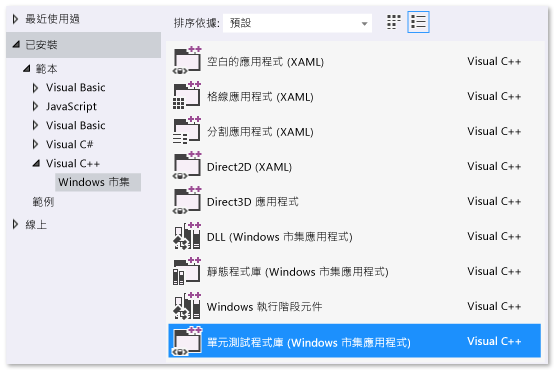
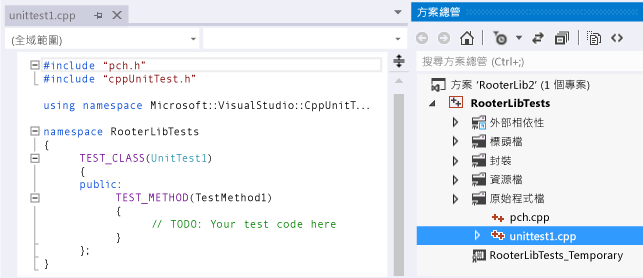
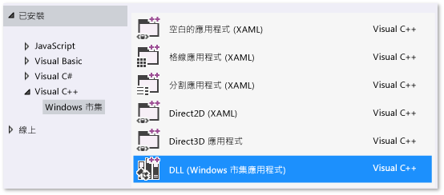
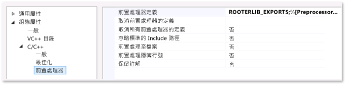

# <a name="unit-testing-a-visual-c-dll-for-store-apps"></a>對市集應用程式的 Visual C++ DLL 進行單元測試
本主題說明如何建立 Windows 市集應用程式的 C++ DLL 單元測試。透過實作概算指定數字的平方根函式，RooterLib DLL 示範了微積分極限理論的模糊記憶。 接著可將這個 DLL 包含在 Windows 市集應用程式中，以向使用者顯示可利用數學完成的有趣運算。  
  
 本主題示範如何使用單元測試做為開發工作的第一步。 採用這種方式時，您會先撰寫測試方法，用來驗證要測試之系統中的特定行為，然後撰寫通過測試的程式碼。 依照下列程序的順序進行變更，您就可以反轉策略，先撰寫要測試的程式碼，再撰寫單元測試。  
  
 本主題還會建立單一 Visual Studio 方案，以及用於單元測試和要測試之 DLL 的個別專案。 您也可以直接在 DLL 專案中包含單元測試，或是針對單元測試和 .DLL 建立個別方案。 如需使用何種結構的秘訣，請參閱[將單元測試新增至現有的 C++ 應用程式](../test/unit-testing-existing-cpp-applications-with-test-explorer.md)。  
  
##  <a name="BKMK_In_this_topic"></a> 本主題內容  
 本主題會引導您完成下列工作：  
  
 [建立方案和單元測試專案](#BKMK_Create_the_solution_and_the_unit_test_project)  
  
 [確認測試在測試總管中執行](#BKMK_Verify_that_the_tests_run_in_Test_Explorer)  
  
 [將 DLL 專案加入方案](#BKMK_Add_the_DLL_project_to_the_solution)  
  
 [將測試專案結合至 DLL 專案](#BKMK_Couple_the_test_project_to_the_dll_project)  
  
 [反覆擴大測試範圍並使其通過](#BKMK_Iteratively_augment_the_tests_and_make_them_pass)  
  
 [對失敗的測試進行偵錯](#BKMK_Debug_a_failing_test)  
  
 [重構程式碼，但不變更測試](#BKMK_Refactor_the_code_without_changing_tests)  
  
##  <a name="BKMK_Create_the_solution_and_the_unit_test_project"></a> 建立方案和單元測試專案  
  
1.  選擇 [檔案] 功能表上的 [新增]，然後選擇 [新專案]。  
  
2.  在 [新增專案] 對話方塊上，展開 [已安裝]，然後展開 [Visual C++]，並選擇 [Windows 市集]。 接著從專案範本清單中選擇 [單元測試程式庫 (Windows 市集應用程式)]。  
  
       
  
3.  將專案命名為 `RooterLibTests`；指定位置；將方案命名為 `RooterLib`；並確定已核取 [為方案建立目錄]。  
  
       
  
4.  在新的專案中，開啟 **unittest1.cpp**。  
  
       
  
     請注意：  
  
    -   每項測試都會使用 `TEST_METHOD(YourTestName){...}` 來定義。  
  
         您不必撰寫傳統的函式簽章。 簽章會由巨集 TEST_METHOD 建立。 該巨集會產生傳回 void 的執行個體函式。 它也會產生靜態函式，以傳回測試方法的相關資訊。 此資訊可讓測試總管找到該方法。  
  
    -   測試方法會使用 `TEST_CLASS(YourClassName){...}`來分類。  
  
         當測試執行時，就會建立每個測試類別的執行個體。 將會以非指定的順序來呼叫測試方法。 您可以定義在每個模組、類別或方法之前和之後叫用的特殊方法。 如需詳細資訊，請參閱 MSDN Library 中的[使用 Microsoft.VisualStudio.TestTools.CppUnitTestFramework](../test/using-microsoft-visualstudio-testtools-cppunittestframework.md)。  
  
##  <a name="BKMK_Verify_that_the_tests_run_in_Test_Explorer"></a> 確認測試在測試總管中執行  
  
1.  插入一些測試程式碼：  
  
    ```cpp  
    TEST_METHOD(TestMethod1)  
    {  
        Assert::AreEqual(1,1);  
    }  
    ```  
  
     請注意， `Assert` 類別提供數個靜態方法，可讓您在測試方法中用來驗證結果。  
  
2.  選擇 [測試] 功能表上的 [執行]，然後選擇 [全部執行]。  
  
     測試專案隨即建置並執行。 [測試總管] 視窗隨即開啟，而且測試會在 [通過的測試] 底下列出。 視窗底部的 [摘要] 窗格會提供有關所選取測試的其他詳細資料。  
  
       
  
##  <a name="BKMK_Add_the_DLL_project_to_the_solution"></a> 將 DLL 專案加入方案  
  
1.  在 [方案總管] 中，選擇方案名稱。 從捷徑功能表選擇 [加入]，然後選擇 [加入新的專案]。  
  
       
  
2.  在 [加入新的專案] 對話方塊中，選擇 [DLL (Windows 市集應用程式)]。  
  
3.  將下列程式碼新增至 **RooterLib.h** 檔案：  
  
    ```cpp  
    // The following ifdef block is the standard way of creating macros which make exporting   
    // from a DLL simpler. All files within this DLL are compiled with the ROOTERLIB_EXPORTS  
    // symbol defined on the command line. This symbol should not be defined on any project  
    // that uses this DLL. This way any other project whose source files include this file see   
    // ROOTERLIB_API functions as being imported from a DLL, whereas this DLL sees symbols  
    // defined with this macro as being exported.  
    #ifdef ROOTERLIB_EXPORTS  
    #define ROOTERLIB_API  __declspec(dllexport)  
    #else  
    #define ROOTERLIB_API __declspec(dllimport)  
    #endif //ROOTERLIB_EXPORTS  
  
    class ROOTERLIB_API CRooterLib {  
    public:  
        CRooterLib(void);  
        double SquareRoot(double v);  
    };  
    ```  
  
     註解說明 ifdef 區塊的對象，除了 dll 開發人員，也包括所有參考其專案中 DLL 的人。 您可以使用 DLL 的專案屬性將 ROOTERLIB_EXPORTS 符號加入命令列。  
  
     `CRooterLib` 類別會宣告建構函式和 `SqareRoot` 評估工具方法。  
  
4.  將 ROOTERLIB_EXPORTS 符號加入命令列。  
  
    1.  在 [方案總管] 中，選擇 [RooterLib] 專案，然後從捷徑功能表選擇 [屬性]。  
  
           
  
    2.  在 [RooterLib 屬性頁] 對話方塊中，依序展開 [組態屬性] 和 [C++]，然後選擇 [前置處理器]。  
  
    3.  從 [前置處理器定義] 清單選擇 [\<編輯...>]，然後在 [前置處理器定義] 對話方塊中加入 `ROOTERLIB_EXPORTS`。  
  
5.  加入已宣告函式的最低限度實作。 開啟 **RooterLib.cpp** 並新增下列程式碼︰  
  
    ```  
    // constructor  
    CRooterLib::CRooterLib()  
    {  
    }  
  
    // Find the square root of a number.  
    double CRooterLib::SquareRoot(double v)  
    {  
        return 0.0;  
    }  
  
    ```  
  
##  <a name="BKMK_Couple_the_test_project_to_the_dll_project"></a> 將測試專案與 DLL 專案結合  
  
1.  將 RooterLib 加入 RooterLibTests 專案。  
  
    1.  在 [方案總管] 中，選擇 [RooterLibTests] 專案，然後在捷徑功能表上選擇 [參考...]。  
  
    2.  在 [RooterLib 專案屬性] 對話方塊中，展開 [通用屬性]，然後選擇 [架構和參考]。  
  
    3.  選擇 [加入新參考....]  
  
    4.  在 [加入參考] 對話方塊中，展開 [方案]，然後選擇 [專案]。 然後選取 [RouterLib] 項目。  
  
2.  在 **unittest1.cpp** 中包含 RooterLib 標頭檔。  
  
    1.  開啟 **unittest1.cpp**。  
  
    2.  將這個程式碼加入 `#include "CppUnitTest.h"` 行的下方：  
  
        ```cpp  
        #include "..\RooterLib\RooterLib.h"  
        ```  
  
3.  加入使用已匯入函式的測試。 將下列程式碼加入至 **unittest1.cpp**：  
  
    ```  
    TEST_METHOD(BasicTest)  
    {  
        CRooterLib rooter;  
        Assert::AreEqual(  
            // Expected value:  
            0.0,   
            // Actual value:  
            rooter.SquareRoot(0.0),   
            // Tolerance:  
            0.01,  
            // Message:  
            L"Basic test failed",  
            // Line number - used if there is no PDB file:  
            LINE_INFO());  
    }  
  
    ```  
  
4.  建置方案。  
  
     新測試會出現在 [測試總管] 的 [未執行的測試] 節點中。  
  
5.  在 [測試總管] 中，選擇 [ **全部執行**]。  
  
       
  
 您已經設定測試和程式碼專案，並確認您可以執行在程式碼專案中執行函式的測試。 現在您可以開始撰寫真正的測試和程式碼。  
  
##  <a name="BKMK_Iteratively_augment_the_tests_and_make_them_pass"></a> 反覆擴大測試範圍並使其通過  
  
1.  加入新的測試：  
  
    ```  
    TEST_METHOD(RangeTest)  
    {  
        CRooterLib rooter;  
        for (double v = 1e-6; v < 1e6; v = v * 3.2)  
        {  
            double expected = v;  
            double actual = rooter.SquareRoot(v*v);  
            double tolerance = expected/1000;  
            Assert::AreEqual(expected, actual, tolerance);  
        }  
    };  
  
    ```  
  
    > [!TIP]
    >  建議您不要變更已通過的測試。 相反地，請加入新的測試，更新程式碼，使測試通過，然後再加入另一個測試，依此類推。  
    >   
    >  當您的使用者變更他們的需求時，請停用已不再正確的測試。 以相同的累加方式，撰寫新的測試，一次使一個測試生效。  
  
2.  在 [測試總管] 中，選擇 [ **全部執行**]。  
  
3.  測試失敗。  
  
       
  
    > [!TIP]
    >  確認每個測試在您撰寫之後立即失敗。 這樣有助於避免撰寫永遠不會失敗的測試這種易犯的錯誤。  
  
4.  透過測試強化程式碼，讓新的測試都成功。 將下列內容加入至 **RooterLib.cpp**：  
  
    ```cpp  
    #include <math.h>  
    ...  
    // Find the square root of a number.  
    double CRooterLib::SquareRoot(double v)  
    {  
        double result = v;  
        double diff = v;  
        while (diff > result/1000)  
        {  
            double oldResult = result;  
            result = result - (result*result - v)/(2*result);  
            diff = abs (oldResult - result);  
        }  
        return result;  
    }  
  
    ```  
  
5.  建置方案，然後在 [測試總管] 中選擇 [全部執行] 。  
  
     這兩個測試都通過。  
  
> [!TIP]
>  開發程式碼時，一次加入一個測試。 確定所有測試在每次反覆之後都通過。  
  
##  <a name="BKMK_Debug_a_failing_test"></a> 對失敗的測試進行偵錯  
  
1.  將另一個測試加入至 **unittest1.cpp**：  
  
    ```  
    // Verify that negative inputs throw an exception.  
     TEST_METHOD(NegativeRangeTest)  
     {  
       wchar_t message[200];  
       CRooterLib rooter;  
       for (double v = -0.1; v > -3.0; v = v - 0.5)  
       {  
         try   
         {  
           // Should raise an exception:  
           double result = rooter.SquareRoot(v);  
  
           swprintf_s(message, L"No exception for input %g", v);  
           Assert::Fail(message, LINE_INFO());  
         }  
         catch (std::out_of_range ex)  
         {  
           continue; // Correct exception.  
         }  
         catch (...)  
         {  
           swprintf_s(message, L"Incorrect exception for %g", v);  
           Assert::Fail(message, LINE_INFO());  
         }  
       }  
    };  
  
    ```  
  
2.  在 [測試總管] 中，選擇 [ **全部執行**]。  
  
     測試失敗。 在 [測試總管] 中選擇測試名稱。 失敗的判斷提示會反白顯示。 [測試總管] 的詳細資料窗格中會顯示失敗的訊息。  
  
       
  
3.  若要查看測試失敗的原因，請逐步執行函式：  
  
    1.  在 `SquareRoot` 函式的開頭設定中斷點。  
  
    2.  在失敗測試的捷徑功能表上，選擇 [偵錯選取的測試] 。  
  
         當在中斷點停止執行時，逐步執行程式碼。  
  
    3.  將程式碼加入至 **RooterLib.cpp** 以攔截例外狀況︰  
  
        ```  
        #include <stdexcept>  
        ...  
        double CRooterLib::SquareRoot(double v)  
        {  
            //Validate the input parameter:  
            if (v < 0.0)   
            {  
              throw std::out_of_range("Can't do square roots of negatives");  
            }  
        ...  
  
        ```  
  
    1.  在 [測試總管] 中，選擇 [全部執行] 測試修正過的方法，並確定並未導入迴歸。  
  
 現在所有測試都通過了。  
  
   
  
##  <a name="BKMK_Refactor_the_code_without_changing_tests"></a> 重構程式碼，但不變更測試  
  
1.  簡化 `SquareRoot` 函式的主要計算：  
  
    ```  
    // old code  
    //result = result - (result*result - v)/(2*result);  
    // new code  
    result = (result + v/result) / 2.0;  
  
    ```  
  
2.  選擇 [全部執行] 測試重構的方法，並確定並未導入迴歸。  
  
    > [!TIP]
    >  一組穩定而良好的單元測試，可確認您並未在變更程式碼時引入錯誤。  
    >   
    >  將重構作業與其他變更分開。

