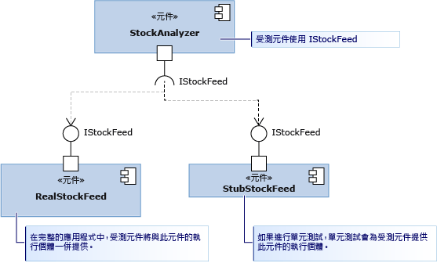

# <a name="using-stubs-to-isolate-parts-of-your-application-from-each-other-for-unit-testing"></a>使用虛設常式隔離應用程式的各個組件，方便進行單元測試
「虛設常式類型」是 Microsoft Fakes 架構提供的兩項技術之一，可讓您輕鬆地隔離測試中的元件與它所呼叫的其他元件。 虛設常式是在測試期間取代另一個元件的一小段程式碼。 使用虛設常式的優點是它會傳回一致的結果，讓測試更容易撰寫。 即使其他元件還無法運作，您仍然可以執行測試。  
  
 如需 Fakes 的概觀和快速入門指南，請參閱[使用 Microsoft Fakes 在測試期間隔離程式碼](../test/isolating-code-under-test-with-microsoft-fakes.md)。  
  
 若要使用虛設常式，您必須撰寫自己的元件，使其只使用介面而不是類別來表示應用程式的其他部分。 這種設計做法可以盡可能保持一致，減少變更，因此是很好的做法。 在測試中，它可讓您以虛設常式取代真正的元件。  
  
 在圖表中，我們要測試的是 StockAnalyzer 元件。 它通常使用另一個元件，也就是 RealStockFeed。 但是，RealStockFeed 每次被呼叫其方法時，會傳回不同的結果，因此很難測試 StockAnalyzer。  在測試期間，我們以不同類別 (StubStockFeed) 取代它。  
  
   
  
 因為您必須能夠利用這種方式建構程式碼才能使用虛設常式，因此通常可以使用虛設常式隔離應用程式中不同的部分。 為了隔離虛設常式與您無法控制的其他組件 (例如 System.dll)，通常會使用填充碼。 請參閱[使用填充碼將應用程式與其他組件隔離，方便進行單元測試](../test/using-shims-to-isolate-your-application-from-other-assemblies-for-unit-testing.md)。  
  
 **Requirements**  
  
-   Visual Studio 企業版  
  
## <a name="in-this-topic"></a>本主題內容  
  
-   [如何使用虛設常式](#how)  
  
    -   [相依性插入的設計](#Dependency)  
  
    -   [產生虛設常式](#GeneratingStubs)  
  
    -   [撰寫含虛設常式的測試](#WriteTest)  
  
    -   [驗證參數值](#mocks)  
  
-   [不同類型成員類型的虛設常式](../test/using-stubs-to-isolate-parts-of-your-application-from-each-other-for-unit-testing.md#BKMK_Stub_basics)  
  
    -   [方法](../test/using-stubs-to-isolate-parts-of-your-application-from-each-other-for-unit-testing.md#BKMK_Methods)  
  
    -   [屬性](../test/using-stubs-to-isolate-parts-of-your-application-from-each-other-for-unit-testing.md#BKMK_Properties)  
  
    -   [事件](../test/using-stubs-to-isolate-parts-of-your-application-from-each-other-for-unit-testing.md#BKMK_Events)  
  
    -   [泛型方法](../test/using-stubs-to-isolate-parts-of-your-application-from-each-other-for-unit-testing.md#BKMK_Generic_methods)  
  
    -   [虛擬類別的虛設常式](../test/using-stubs-to-isolate-parts-of-your-application-from-each-other-for-unit-testing.md#BKMK_Partial_stubs)  
  
-   [偵錯虛設常式](../test/using-stubs-to-isolate-parts-of-your-application-from-each-other-for-unit-testing.md#BKMK_Debugging_stubs)  
  
-   [虛設常式限制](../test/using-stubs-to-isolate-parts-of-your-application-from-each-other-for-unit-testing.md#BKMK_Stub_limitation)  
  
-   [變更虛設常式的預設行為](../test/using-stubs-to-isolate-parts-of-your-application-from-each-other-for-unit-testing.md#BKMK_Changing_the_default_behavior_of_stubs)  
  
##  <a name="How"></a> 如何使用虛設常式  
  
###  <a name="Dependency"></a> 相依性插入的設計  
 若要使用虛設常式，必須將應用程式設計為不同元件各自獨立，不會彼此相依，而只相依於介面定義。 元件不會在編譯時期結合，而是在執行階段連接。 這個模式有助於強化軟體，而且易於更新，因為變更散佈範圍通常不會超出元件界限。 即便您不使用虛設常式仍建議您採用這種方式。 如果您在撰寫新程式碼，也可以輕鬆地遵循[相依性插入](http://en.wikipedia.org/wiki/Dependency_injection)模式。 如果您在為現有的軟體撰寫測試，可能必須重新建構。 如果重新建構不實用，您可以考慮使用填充碼。  
  
 接下來開始討論圖表中的激勵範例。 StockAnalyzer 類別會讀取股票價格並產生一些有趣的結果。 我們想要測試其中一些公用方法。 為避免複雜，我們只看其中一個方法，這個方法會報告特定股票的現價，是非常簡單的方法。 我們要撰寫該方法的單元測試。 以下是測試的第一份草稿：  
  
```c#  
[TestMethod]  
public void TestMethod1()  
{  
    // Arrange:  
    var analyzer = new StockAnalyzer();  
    // Act:  
    var result = analyzer.GetContosoPrice();  
    // Assert:  
    Assert.AreEqual(123, result); // Why 123?  
}  
```  
  
```vb#  
<TestMethod()> Public Sub TestMethod1()  
    ' Arrange:  
    Dim analyzer = New StockAnalyzer()  
    ' Act:  
    Dim result = analyzer.GetContosoPrice()  
    ' Assert:  
    Assert.AreEqual(123, result) ' Why 123?  
End Sub  
```  
  
 這個測試立即出現了一個明顯的問題：股價會變動，因此判斷提示通常會失敗。  
  
 另一個問題可能是 StockAnalyzer 所使用的 StockFeed 元件尚在開發階段。 以下是待測方法的第一份程式碼草稿：  
  
```c#  
public int GetContosoPrice()  
{  
    var stockFeed = new StockFeed(); // NOT RECOMMENDED  
    return stockFeed.GetSharePrice("COOO");  
}  
```  
  
```vb#  
Public Function GetContosoPrice()  
    Dim stockFeed = New StockFeed() ' NOT RECOMMENDED  
    Return stockFeed.GetSharePrice("COOO")  
End Function  
```  
  
 按照現況，由於尚未完成 StockFeed 類別，因此這個方法可能無法編譯或會擲出例外狀況。  
  
 介面插入可以解決以上兩個問題。  
  
 介面插入適用下列規則：  
  
-   應用程式所有元件的程式碼絕對不能明確參考另一個元件中的類別，無論是在宣告中或 `new` 陳述式中。 相反地，請使用介面宣告變數和參數。 只能由元件的容器建立元件執行個體。  
  
     在此範例中，「元件」是指類別或您開發及一併更新的類別群組。 通常，元件是指 Visual Studio 專案中的程式碼。 同一個元件中的類別會同時更新，因此分離這些類別並沒有那麼重要。  
  
     此外，您也不需要分離元件與 System.dll 等相對穩定平台的類別。 為所有類別撰寫介面會使程式碼變得過於複雜。  
  
 使用像這樣的介面可以分離 StockAnalyzer 程式碼和 StockFeed，使程式碼變得更好：  
  
```c#  
public interface IStockFeed  
{  
    int GetSharePrice(string company);  
}  
  
public class StockAnalyzer  
{  
    private IStockFeed stockFeed;  
    public Analyzer(IStockFeed feed)  
    {  
        stockFeed = feed;  
    }  
    public int GetContosoPrice()  
    {  
        return stockFeed.GetSharePrice("COOO");  
    }  
}  
```  
  
```vb#  
Public Interface IStockFeed  
    Function GetSharePrice(company As String) As Integer  
End Interface  
  
Public Class StockAnalyzer  
    ' StockAnalyzer can be connected to any IStockFeed:  
    Private stockFeed As IStockFeed  
    Public Sub New(feed As IStockFeed)  
        stockFeed = feed  
    End Sub    
    Public Function GetContosoPrice()  
        Return stockFeed.GetSharePrice("COOO")  
    End Function  
End Class  
  
```  
  
 在此範例中，IStockFeed 建構完成後會傳遞其實作至 StockAnalyzer。 在完成的應用程式中，初始化程式碼會執行連接：  
  
```  
analyzer = new StockAnalyzer(new StockFeed())  
```  
  
 還有更多彈性的方式可以執行此連接作業。 例如，StockAnalyzer 可以接受能在不同條件下具現化不同 IStockFeed 實作的 Factory 物件。  
  
###  <a name="GeneratingStubs"></a> 產生虛設常式  
 您已分離您要測試的類別與它所使用的其他元件。 除了能夠強化應用程式及加強其安全性外，分離作業還能讓您連接待測的元件與介面的虛設常式實作以進行測試。  
  
 您只要按照一般方式撰寫虛設常式類別即可。 但是，Microsoft Fakes 讓您能以更靈活的方式為每個測試建立最適當的虛設常式。  
  
 若要使用虛設常式，您必須先從介面定義產生虛設常式類型。  
  
##### <a name="adding-a-fakes-assembly"></a>加入 Fakes 組件  
  
1.  在方案總管中，展開單元測試專案的 [參考]。  
  
    -   如果您在 Visual Basic 中工作，必須先選取方案總管工具列中的 [顯示所有檔案]，才能看見 [參考] 清單。  
  
2.  選取包含您要用於建立虛設常式之介面定義的組件。  
  
3.  在捷徑功能表上，選擇 [新增 Fakes 組件]。  
  
###  <a name="WriteTest"></a> 撰寫含虛設常式的測試  
  
```c#  
[TestClass]  
class TestStockAnalyzer  
{  
    [TestMethod]  
    public void TestContosoStockPrice()  
    {  
      // Arrange:  
  
        // Create the fake stockFeed:  
        IStockFeed stockFeed =   
             new StockAnalysis.Fakes.StubIStockFeed() // Generated by Fakes.  
                 {  
                     // Define each method:  
                     // Name is original name + parameter types:  
                     GetSharePriceString = (company) => { return 1234; }  
                 };  
  
        // In the completed application, stockFeed would be a real one:  
        var componentUnderTest = new StockAnalyzer(stockFeed);  
  
      // Act:  
        int actualValue = componentUnderTest.GetContosoPrice();  
  
      // Assert:  
        Assert.AreEqual(1234, actualValue);  
    }  
    ...  
}  
```  
  
```vb#  
<TestClass()> _  
Class TestStockAnalyzer  
  
    <TestMethod()> _  
    Public Sub TestContosoStockPrice()  
        ' Arrange:  
        ' Create the fake stockFeed:  
        Dim stockFeed As New StockAnalysis.Fakes.StubIStockFeed  
        With stockFeed  
            .GetSharePriceString = Function(company)  
                                       Return 1234  
                                   End Function  
        End With  
        ' In the completed application, stockFeed would be a real one:  
        Dim componentUnderTest As New StockAnalyzer(stockFeed)  
        ' Act:  
        Dim actualValue As Integer = componentUnderTest.GetContosoPrice  
        ' Assert:  
        Assert.AreEqual(1234, actualValue)  
    End Sub  
End Class  
  
```  
  
 這裡最特別的是 `StubIStockFeed` 類別。 Microsoft Fakes 機制會針對參考組件中的每一個公開類型產生一個虛設常式類別。 該虛設常式類別的名稱衍生自介面的名稱，再加上前置詞「`Fakes.Stub`」並附加參數類型名稱。  
  
 另外也會為屬性、事件及泛型方法的 getter 及 setter 產生虛設常式。  
  
###  <a name="mocks"></a> 驗證參數值  
 您可以驗證當您的元件呼叫另一個元件時，是否會傳遞正確的值。 您可以在虛設常式中加入判斷提示，也可以將值儲存在測試主體中並進行驗證。 例如:   
  
```c#  
[TestClass]  
class TestMyComponent  
{  
  
    [TestMethod]  
    public void TestVariableContosoPrice()  
    {  
     // Arrange:  
        int priceToReturn;  
        string companyCodeUsed;  
        var componentUnderTest = new StockAnalyzer(new StubIStockFeed()  
            {  
               GetSharePriceString = (company) =>   
                  {   
                     // Store the parameter value:  
                     companyCodeUsed = company;  
                     // Return the value prescribed by this test:  
                     return priceToReturn;  
                  };  
            };  
        // Set the value that will be returned by the stub:  
        priceToReturn = 345;  
  
     // Act:  
        int actualResult = componentUnderTest.GetContosoPrice();  
  
     // Assert:  
        // Verify the correct result in the usual way:  
        Assert.AreEqual(priceToReturn, actualResult);  
  
        // Verify that the component made the correct call:  
        Assert.AreEqual("COOO", companyCodeUsed);  
    }  
...}  
  
```  
  
```vb#  
<TestClass()> _  
Class TestMyComponent  
    <TestMethod()> _  
    Public Sub TestVariableContosoPrice()  
        ' Arrange:  
        Dim priceToReturn As Integer  
        Dim companyCodeUsed As String = ""  
        Dim stockFeed As New StockAnalysis.Fakes.StubIStockFeed()  
        With stockFeed  
            ' Implement the interface's method:  
            .GetSharePriceString = _  
                Function(company)  
                    ' Store the parameter value:  
                    companyCodeUsed = company  
                    ' Return a fixed result:  
                    Return priceToReturn  
                End Function  
        End With  
        ' Create an object to test:  
        Dim componentUnderTest As New StockAnalyzer(stockFeed)  
        ' Set the value that will be returned by the stub:  
        priceToReturn = 345  
  
        ' Act:  
        Dim actualResult As Integer = componentUnderTest.GetContosoPrice()  
  
        ' Assert:  
        ' Verify the correct result in the usual way:  
        Assert.AreEqual(priceToReturn, actualResult)  
        ' Verify that the component made the correct call:  
        Assert.AreEqual("COOO", companyCodeUsed)  
    End Sub  
...  
End Class  
```  
  
##  <a name="BKMK_Stub_basics"></a> 不同類型成員類型的虛設常式  
  
###  <a name="BKMK_Methods"></a> 方法  
 如本範例所說明，在虛設常式類別執行個體附加委派，即可為方法加上虛設常式。 虛設常式類型的名稱衍生自方法名稱及參數。 例如，針對下列 `IMyInterface` 介面和方法 `MyMethod`：  
  
```c#  
// application under test  
interface IMyInterface   
{  
    int MyMethod(string value);  
}  
```  
  
 我們在始終傳回 1 的 `MyMethod` 附加虛設常式：  
  
```c#  
// unit test code  
  var stub = new StubIMyInterface ();  
  stub.MyMethodString = (value) => 1;  
  
```  
  
 如果您未提供函式的虛設常式，Fakes 所產生的函式會傳回傳回類型的預設值。 如果是數字，預設值為 0，若是類別類型，則為 `null` (C#) 或 `Nothing` (Visual Basic)。  
  
###  <a name="BKMK_Properties"></a> 屬性  
 屬性 getter 和 setter 會公開為不同的委派，而且可以分別附加虛設常式。 例如，請考慮 `Value` 的 `IMyInterface` 屬性：  
  
```c#  
// code under test  
interface IMyInterface   
{  
    int Value { get; set; }  
}  
  
```  
  
 我們將委派附加至 `Value` 的 getter 和 setter 來模擬自動屬性：  
  
```c#  
// unit test code  
int i = 5;  
var stub = new StubIMyInterface();  
stub.ValueGet = () => i;  
stub.ValueSet = (value) => i = value;  
  
```  
  
 如果您未提供 setter 或屬性的 getter 的虛設常式方法，Fakes 產生的虛設常式會儲存值，因此虛設常式屬性的作用就像簡單變數一樣。  
  
###  <a name="BKMK_Events"></a> 事件  
 事件會公開為委派欄位。 因此，只要叫用事件支援欄位就能引發任何附加虛設常式的事件。 請考慮下列虛設常式介面：  
  
```c#  
// code under test  
interface IWithEvents   
{  
    event EventHandler Changed;  
}  
```  
  
 為引發 `Changed` 事件，我們只叫用支援委派：  
  
```c#  
// unit test code  
  var withEvents = new StubIWithEvents();  
  // raising Changed  
  withEvents.ChangedEvent(withEvents, EventArgs.Empty);  
  
```  
  
###  <a name="BKMK_Generic_methods"></a> 泛型方法  
 只要為每個所需的方法具現化提供委派，即可虛設常式泛型方法。 例如，若是下列包含泛型方法的介面：  
  
```c#  
// code under test  
interface IGenericMethod   
{  
    T GetValue<T>();  
}  
```  
  
 您可以撰寫虛設常式 `GetValue<int>` 具現化的測試：  
  
```c#  
// unit test code  
[TestMethod]  
public void TestGetValue()   
{  
    var stub = new StubIGenericMethod();  
    stub.GetValueOf1<int>(() => 5);  
  
    IGenericMethod target = stub;  
    Assert.AreEqual(5, target.GetValue<int>());  
}  
```  
  
 如果程式碼是呼叫有任何其他具現化的 `GetValue<T>`，虛設常式會呼叫該行為。  
  
###  <a name="BKMK_Partial_stubs"></a> 虛擬類別的虛設常式  
 在上述範例中，虛設常式是從介面產生。 您也可以從具有虛擬或抽象成員的類別產生虛設常式。 例如：  
  
```c#  
// Base class in application under test  
    public abstract class MyClass  
    {  
        public abstract void DoAbstract(string x);  
        public virtual int DoVirtual(int n)  
        { return n + 42; }  
        public int DoConcrete()  
        { return 1; }  
    }  
```  
  
 在這個類別所產生的虛設常式中，您可以設定 DoAbstract() 和 DoVirtual() 的委派方法，但不能設定 DoConcrete() 的委派方法。  
  
```c#  
// unit test  
  var stub = new Fakes.MyClass();  
  stub.DoAbstractString = (x) => { Assert.IsTrue(x>0); };  
  stub.DoVirtualInt32 = (n) => 10 ;  
  
```  
  
 如果您未提供虛擬方法的委派，Fakes 可以提供預設行為，也可以呼叫基底類別中的方法。 若要呼叫基底方法，必須將 `CallBase` 屬性設為：  
  
```c#  
// unit test code  
var stub = new Fakes.MyClass();  
stub.CallBase = false;  
// No delegate set – default delegate:  
Assert.AreEqual(0, stub.DoVirtual(1));  
  
stub.CallBase = true;  
//No delegate set - calls the base:  
Assert.AreEqual(43,stub.DoVirtual(1));  
```  
  
##  <a name="BKMK_Debugging_stubs"></a> 偵錯虛設常式  
 虛設常式類型的目的在於順利偵錯。 根據預設，偵錯工具會在所產生的任何程式碼中逐步執行指令，因此，應該會直接執行附加至虛設常式的自訂成員實作。  
  
##  <a name="BKMK_Stub_limitation"></a> 虛設常式限制  
  
1.  不支援使用指標的方法簽章。  
  
2.  虛設常式類型依賴虛擬方法分派，因此不能虛設常式密封類別或靜態方法。 在這類情況下，使用[使用填充碼將應用程式與其他組件隔離，方便進行單元測試](../test/using-shims-to-isolate-your-application-from-other-assemblies-for-unit-testing.md)中所述的填充碼類型。  
  
##  <a name="BKMK_Changing_the_default_behavior_of_stubs"></a> 變更虛設常式的預設行為  
 每個產生的虛設常式類別均會保留一個 `IStubBehavior` 介面的執行個體 (透過 `IStub.InstanceBehavior` 屬性)。 只要用戶端呼叫成員時沒有附加自訂委派，就會呼叫行為。 如果尚未設定行為，則會使用 `StubsBehaviors.Current` 屬性所傳回的執行個體。 根據預設，這個屬性傳回的行為會擲回 `NotImplementedException` 例外狀況。  
  
 您隨時可以設定任何虛設常式執行個體的 `InstanceBehavior` 屬性，藉以變更行為。 例如，下列程式碼片段會改變沒有任何動作或傳回 `default(T)` 傳回類型之預設值的行為：  
  
```c#  
// unit test code  
var stub = new StubIFileSystem();  
// return default(T) or do nothing  
stub.InstanceBehavior = StubsBehaviors.DefaultValue;  
```  
  
 設定 `StubsBehaviors.Current` 屬性也可以全域變更尚未設定行為之所有虛設常式物件的行為：  
  
```c#  
// unit test code  
//change default behavior for all stub instances  
//where the behavior has not been set  
StubBehaviors.Current =   
    BehavedBehaviors.DefaultValue;  
```  
  
## <a name="external-resources"></a>外部資源  
  
### <a name="guidance"></a>指引  
 [使用 Visual Studio 2012 測試持續傳遞 - 第 2 章：單元測試：測試內部](http://go.microsoft.com/fwlink/?LinkID=255188)  
  
## <a name="see-also"></a>另請參閱  
 [使用 Microsoft Fakes 在測試期間隔離程式碼](../test/isolating-code-under-test-with-microsoft-fakes.md)

