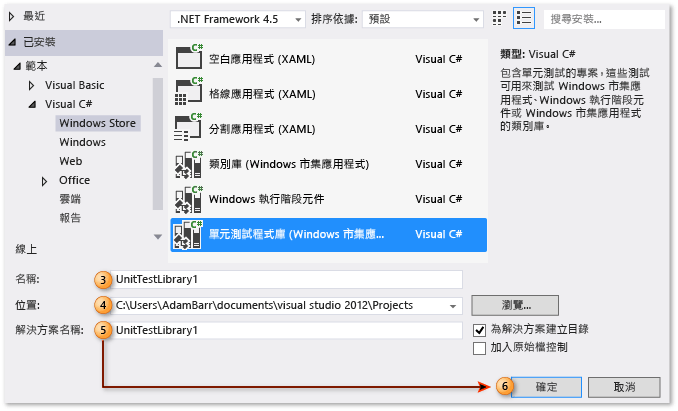
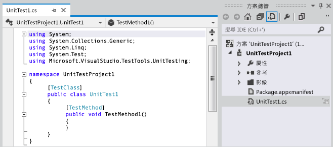
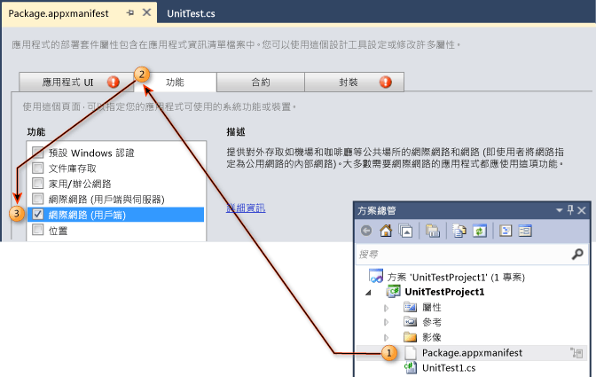
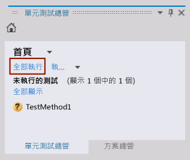
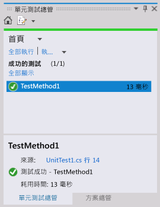

# 逐步解說：針對 Windows 市集應用程式建立和執行單元測試
Visual Studio 包含 Managed [!INCLUDE[win8_appname_long](../debugger/includes/win8_appname_long_md.md)]應用程式的單元測試支援，並包含 Visual C#、Visual Basic 和 Visual C++ 的單元測試程式庫範本。  
  
> [!TIP]
>  如需開發 [!INCLUDE[win8_appname_long](../debugger/includes/win8_appname_long_md.md)] 應用程式的詳細資訊，請參閱 [Windows 市集應用程式入門](http://go.microsoft.com/fwlink/?LinkID=241410)。  
  
 Visual Studio 提供下列單元測試功能：  
  
-   [建立單元測試專案](#CreateAndRunUnitTestWin8Tailored_Create)  
  
-   [編輯單元測試專案的資訊清單](#CreateAndRunUnitTestWin8Tailored_Manifest)  
  
-   [撰寫單元測試的程式碼](#CreateAndRunUnitTestWin8Tailored_Code)  
  
-   [執行單元測試](#CreateAndRunUnitTestWin8Tailored_Run)  
  
 下列程序說明用來建立、執行和偵錯 Managed Windows 8 [!INCLUDE[win8_appname_long](../debugger/includes/win8_appname_long_md.md)]應用程式的單元測試之步驟。  
  
## 必要條件  
 Visual Studio  
  
##   建立單元測試專案  
  
#### 若要建立 Windows 市集應用程式的單元測試專案  
  
1.  從 [ **檔案** ] 功能表選擇 [ **新增專案**]。  
  
     [新增專案] 對話方塊隨即顯示。  
  
2.  在 [範本] 下，選擇您要用來建立單元測試的程式設計語言，然後選擇相關聯的 [!INCLUDE[win8_appname_long](../debugger/includes/win8_appname_long_md.md)]單元測試程式庫。 例如，依序選擇 [ **Visual C#** ]、[ **Windows 市集**] 和 [ **單元測試程式庫 (Windows 市集應用程式)**]。  
  
    > [!NOTE]
    >  Visual Studio 包含 Visual C#、Visual Basic 和 Visual C++ 的單元測試程式庫範本。  
  
3.  (選擇性) 在 [名稱] 文字方塊中，輸入 [!INCLUDE[win8_appname_long](../debugger/includes/win8_appname_long_md.md)]單元測試專案要使用的名稱。  
  
4.  (選擇性) 在 [ **位置** ] 文字方塊中輸入路徑，或是選取 [ **瀏覽** ] 按鈕，以修改要建立專案的路徑。  
  
5.  (選擇性) 在 [ **方案** ] 名稱文字方塊中，輸入您的方案要使用的名稱。  
  
6.  保留選取 [ **為方案建立目錄** ] 選項，並選擇 [ **確定** ] 按鈕。  
  
       
  
     您的新 [!INCLUDE[win8_appname_long](../debugger/includes/win8_appname_long_md.md)]單元測試專案隨即填入 [方案總管] 中，並且程式碼編輯器中會顯示預設的單元測試標題 - UnitTest1。  
  
       
  
##   編輯單元測試專案的資訊清單  
 您可能需要編輯單元測試專案的資訊清單，以便提供執行應用程式所需的功能。  
  
#### 若要編輯單元測試專案的 Windows 市集應用程式資訊清單檔案  
  
1.  在 [方案總管] 中，於新的 [!INCLUDE[win8_appname_long](../debugger/includes/win8_appname_long_md.md)] 單元測試專案中，以滑鼠右鍵按一下 Package.appxmanifest 檔案並選擇 [開啟]。  
  
     資訊清單設計工具隨即顯示，可供編輯。  
  
2.  在資訊清單設計工具中，選擇 [ **功能** ] 索引標籤。  
  
3.  在 [ **功能**] 底下的清單中，選取您要讓單元測試及其所測試之程式碼具有的功能。 例如，如果單元測試需要且測試中的程式碼必須有存取網際網路的能力時，則選擇 [ **網際網路** ] 核取方塊。  
  
    > [!NOTE]
    >  您選取的功能應該只包含讓 [!INCLUDE[win8_appname_long](../debugger/includes/win8_appname_long_md.md)]單元測試正常運作的功能。 這些功能沒有必要包含不屬於要測試之 [!INCLUDE[win8_appname_long](../debugger/includes/win8_appname_long_md.md)]應用程式的功能，並且通常應該是指定給受測 [!INCLUDE[win8_appname_long](../debugger/includes/win8_appname_long_md.md)]應用程式的其中一組功能。  
  
     如需有關資訊清單設計工具的詳細資訊，請參閱[使用資訊清單設計工具設定 Windows 8.1 應用程式套件](http://msdn.microsoft.com/Library/24c58b7f-9c6d-41c3-b385-c1e8497d5b2d)。  
  
       
  
##   撰寫單元測試的程式碼  
  
#### 若要撰寫 Windows 市集應用程式的單元測試程式碼  
  
1.  在 [程式碼編輯器] 中，編輯單元測試，並加入測試所需的判斷提示和邏輯。  
  
     如需詳細資訊，請參閱 MSDN Library 中的 [使用 Assert 類別](http://go.microsoft.com/fwlink/?LinkID=224991) 。  
  
##   執行單元測試  
  
#### 若要使用測試總管建置方案與執行單元測試  
  
1.  在 [ **測試** ] 功能表上，選擇 [ **Windows**]，然後選擇 [ **測試總管**]。  
  
     [測試總管] 隨即顯示，但沒有列出您的測試。  
  
2.  從 [ **建置** ] 功能表中，選擇 [ **建置方案**]。  
  
     現在列出了您的單元測試。  
  
    > [!NOTE]
    >  您必須建置方案以更新 [測試總管] 中的單元測試清單。  
  
    > [!WARNING]
    >  Visual Studio 的已知問題：您必須在建置測試專案之前開啟測試總管。  
  
3.  在 [測試總管] 中，選擇您建立的單元測試。  
  
    > [!TIP]
    >  [測試總管] 會在 [ **來源:**] 旁邊提供原始程式碼的連結。  
  
4.  選擇 [ **全部執行**]。  
  
       
  
    > [!TIP]
    >  您可以選取 [測試總管] 中列出的一個或多個單元測試，然後以滑鼠右鍵按一下並選擇 [ **執行選取的測試**]。  
    >   
    >  此外，您可以選擇 [ **偵錯選取的測試**]、[ **開啟測試**]，並使用 [ **屬性** ] 選項。  
    >   
    >    
  
     單元測試隨即執行。 完成時，[測試總管] 會顯示測試狀態、耗用時間並提供來源連結。  
  
       
  
## 外部資源  
  
### 影片  
 [Channel 9：針對使用 XAML 建置的 Windows 市集應用程式進行單元測試 (英文)](http://go.microsoft.com/fwlink/?LinkId=226285)  
  
### 論壇  
 [Visual Studio 單元測試](http://go.microsoft.com/fwlink/?LinkId=224477)  
  
### MSDN Library  
 [MSDN Library - 建立並執行現有程式碼的單元測試 (Visual Studio 2010)](http://go.microsoft.com/fwlink/?LinkID=223683)  
  
## 另請參閱  
 [使用 Visual Studio 測試市集應用程式](../test/testing-store-apps-with-visual-studio.md)   
 [使用 Team Foundation Build 建置和測試 Windows 市集應用程式](http://msdn.microsoft.com/Library/d0ca17bb-deae-4f3d-a18d-1a99bebceaa9)
