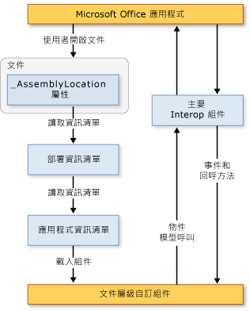

# 文件層級自訂的架構
  [!INCLUDE[vs_dev12](../vsto/includes/vs-dev12-md.md)] 包含的專案可以建立 Microsoft Office Word 和 Microsoft Office Excel 的文件層級自訂。 本主題描述文件層級自訂的下列各方面：  
  
-   [了解自訂](#UnderstandingCustomizations)  
  
-   [自訂的元件](#Components)  
  
-   [自訂如何與 Microsoft Office 應用程式搭配運作](#HowCustomizationsWork)  
  
 [!INCLUDE[appliesto_alldoc](../vsto/includes/appliesto-alldoc-md.md)]  
  
 如需建立文件層級自訂的一般資訊，請參閱[Office 方案開發概觀 &#40;VSTO&#41;](../vsto/office-solutions-development-overview-vsto.md)、[Word 文件層級自訂的程式設計入門](../vsto/getting-started-programming-document-level-customizations-for-word.md)和[Excel 文件層級自訂的程式設計入門](../vsto/getting-started-programming-document-level-customizations-for-excel.md)。  
  
##   了解自訂  
 當您使用 Visual Studio 中的 Office Developer Tools 建置文件層級自訂時，會建立與特定文件相關聯的 Managed 程式碼組件。 文件或活頁簿中若是有連結的組件就稱為具有 Managed 程式碼擴充。 如需詳細資訊，請參閱[設計和建立 Office 方案](../vsto/designing-and-creating-office-solutions.md)。  
  
 當使用者開啟文件時，Microsoft Office 應用程式會載入組件。 載入組件之後，自訂就能回應開啟文件時的事件。 自訂還可以呼叫物件模型，以在開啟文件時自動化及擴充應用程式，而且它可以使用 [!INCLUDE[dnprdnshort](../sharepoint/includes/dnprdnshort-md.md)] 中的任何類別。  
  
 組件會透過應用程式的主要 Interop 組件與應用程式的 COM 元件進行通訊。 如需詳細資訊，請參閱[Office 主要 Interop 組件](../vsto/office-primary-interop-assemblies.md)與[Office 方案開發概觀 &#40;VSTO&#41;](../vsto/office-solutions-development-overview-vsto.md)。  
  
 如果使用者同時開啟多個文件層級自訂，每個組件會在不同的應用程式定義域中載入。 這表示如果某個方案運作失常，並不會導致其他方案失敗。 文件層級自訂設計成搭配單一應用程式定義域中的單一文件使用， 而不是設計成跨文件進行通訊。 如需應用程式定義域的詳細資訊，請參閱[應用程式定義域](http://msdn.microsoft.com/library/113a8bbf-6875-4a72-a49d-ca2d92e19cc8)。  
  
> [!NOTE]  
>  使用 Visual Studio 中的 Office Developer Tools 所建立的文件層級自訂，設計成只能在使用者啟動應用程式時使用。 如果是以程式設計的方式啟動應用程式 \(例如，使用 Automation\)，則該自訂可能無法如預期般運作。  
  
### 設計階段和執行階段體驗  
 了解設計方案和執行方案的體驗，有助於了解文件層級自訂的架構。  
  
#### 設計階段  
 設計階段體驗包含下列步驟：  
  
1.  開發人員在 [!INCLUDE[vsprvs](../sharepoint/includes/vsprvs-md.md)] 中建立文件層級專案。 該專案會包含文件，以及在文件背後執行的組件。 文件可以是已經存在的文件 \(或許是由設計人員所建立\)，也可以是連同專案一起建立的新文件。  
  
2.  設計人員 \(建立專案的開發人員或其他人\) 建立呈現給使用者的文件最終外觀與風格。  
  
#### 執行時間  
 執行階段體驗包含下列步驟：  
  
1.  使用者開啟具有 Managed 程式碼擴充的文件或活頁簿。  
  
2.  文件或活頁簿載入已編譯的組件。  
  
3.  組件回應使用者處理文件或活頁簿時的事件。  
  
#### 開發人員觀點與使用者觀點的比較  
 由於開發人員主要是在 [!INCLUDE[vsprvs](../sharepoint/includes/vsprvs-md.md)] 中工作，而使用者是在 Word 或 Excel 中工作，因此可分為兩方面來了解文件層級自訂。  
  
|開發人員觀點|使用者觀點|  
|------------|-----------|  
|開發人員可以使用 [!INCLUDE[vsprvs](../sharepoint/includes/vsprvs-md.md)] 撰寫 Word 和 Excel 能夠存取的程式碼。   雖然看起來好像是開發人員要建立執行 Word 或 Excel 的可執行檔，但實際上是完全相反的程序。 文件會與一個組件相關聯，並且含有指向該組件的指標。 當文件開啟時，Word 或 Excel 會尋找這個組件並執行程式碼，以回應所有已處理的事件。|使用方案的任何人只要開啟文件或活頁簿 \(或者從範本建立新文件\)，就像開啟其他任何 Microsoft Office 檔案一樣。   該組件會提供文件或活頁簿中的自訂，例如以目前的資料自動填入，或顯示要求資訊的對話方塊。|  
  
### 文件層級自訂所支援的文件格式  
 當您建立自訂專案時，您可以選擇要在專案中使用的文件格式。 如需詳細資訊，請參閱[如何：在 Visual Studio 中建立 Office 專案](../vsto/how-to-create-office-projects-in-visual-studio.md)。  
  
 下表列出您可以在 Excel 和 Word 的文件層級自訂中使用的文件格式。  
  
|Excel|字組|  
|-----------|--------|  
|Excel 活頁簿 \(.xlsx\)   Excel 啟用巨集的活頁簿 \(.xlsm\)   Excel 二進位活頁簿 \(.xlsb\)   Excel 97\-2003 活頁簿 \(.xls\)   Excel 範本 \(.xltx\)   Excel 啟用巨集的範本 \(.xltm\)   Excel 97\-2003 範本 \(.xlt\)|Word 文件 \(.docx\)   Word 啟用巨集的文件 \(.docm\)   Word 97\-2003 文件 \(.doc\)   Word 範本 \(.dotx\)   Word 啟用巨集的範本 \(.dotm\)   Word 97\-2003 範本 \(.dot\)|  
  
 您只能以支援的格式為文件設計 Managed 程式碼擴充。 否則，當文件在應用程式中開啟時，可能無法引發特定事件。 例如，當您搭配使用以 Excel XML 試算表格式或網頁 \(.htm; .html\) 格式儲存的活頁簿與 Managed 程式碼擴充時，不會引發 <xref:Microsoft.Office.Tools.Excel.Workbook.Open> 事件。  
  
### 支援具有 .xml 副檔名的 Word 文件  
 文件層級專案範本不允許您建立以下列檔案格式為基礎的專案：  
  
-   Word XML 文件 \(\*xml\)。  
  
-   Word 2003 XML 文件 \(\*xml\)。  
  
 如果您希望使用者使用這些檔案格式的自訂，請將自訂建置和部署為使用上表指定的其中一個支援的檔案格式。 安裝自訂之後，使用者可以將文件儲存為 Word XML 文件 \(\*xml\) 格式或 Word 2003 XML 文件 \(\*xml\) 格式，自訂會如預期般繼續運作。  
  
##   自訂的元件  
 自訂的主要元件是文件和組件。 除了這些元件之外，還有其他數個組件在 Microsoft Office 應用程式探索和載入自訂的方式中扮演重要角色。  
  
### 部署資訊清單和應用程式資訊清單  
 自訂使用部署資訊清單和應用程式資訊清單，來識別及載入最新版的自訂組件。 部署資訊清單會指向目前的應用程式資訊清單。 而應用程式資訊清單會指向自訂組件，並指定要在組件中執行的一或多個進入點類別。 如需詳細資訊，請參閱[Office 方案中的應用程式和部署資訊清單](../vsto/application-and-deployment-manifests-in-office-solutions.md)。  
  
### Visual Studio Tools for Office Runtime  
 若要執行使用 Visual Studio 中的 Office Developer Tools 所建立的文件層級自訂，使用者電腦上必須安裝 [!INCLUDE[vsto_runtime](../vsto/includes/vsto-runtime-md.md)]。[!INCLUDE[vsto_runtime](../vsto/includes/vsto-runtime-md.md)] 包含可載入自訂組件的 Unmanaged 元件，以及一組 Managed 組件。 這些 Managed 組件提供自訂程式碼用來自動化及擴充主應用程式的物件模型。  
  
 如需詳細資訊，請參閱[Visual Studio Tools for Office Runtime 概觀](../vsto/visual-studio-tools-for-office-runtime-overview.md)。  
  
##   自訂如何與 Microsoft Office 應用程式搭配運作  
 當使用者開啟屬於 Microsoft Office 自訂一部分的文件時，應用程式會使用連結至該文件的部署資訊清單，來尋找及載入最新版的自訂組件。 部署資訊清單的位置儲存在名為 \_AssemblyLocation 的自訂文件屬性中。 建置方案時，識別這個位置的字串會插入至這個屬性。  
  
 部署資訊清單會指向應用程式資訊清單，而應用程式資訊清單則會指向最新的組件。 如需詳細資訊，請參閱[Office 方案中的應用程式和部署資訊清單](../vsto/application-and-deployment-manifests-in-office-solutions.md)。  
  
 下圖顯示文件層級自訂的基本架構。  
  
   
  
> [!NOTE]  
>  在以 [!INCLUDE[net_v40_short](../sharepoint/includes/net-v40-short-md.md)] 為目標的 Office 方案中，方案會使用內嵌於方案組件中的主要 Interop 組件 \(PIA\) 類型資訊來呼叫主應用程式的物件模型，而不是直接呼叫 PIA。 如需詳細資訊，請參閱[設計和建立 Office 方案](../vsto/designing-and-creating-office-solutions.md)。  
  
### 載入處理序  
 當使用者開啟屬於 Microsoft Office 方案一部分的文件時，會執行下列步驟。  
  
1.  Microsoft Office 應用程式會檢查自訂文件屬性，以查看文件是否有相關聯的 Managed 程式碼擴充。 如需詳細資訊，請參閱[自訂文件屬性概觀](../vsto/custom-document-properties-overview.md)。  
  
2.  如果有 Managed 程式碼擴充，應用程式會載入 VSTOEE.dll，而 VSTOEE.dll 會載入 VSTOLoader.dll。 這些都是 Visual Studio 2010 Tools for Office Runtime 載入器元件的 Unmanaged DLL。 如需詳細資訊，請參閱[Visual Studio Tools for Office Runtime 概觀](../vsto/visual-studio-tools-for-office-runtime-overview.md)。  
  
3.  VSTOLoader.dll 會載入 [!INCLUDE[dnprdnshort](../sharepoint/includes/dnprdnshort-md.md)] 並啟動 [!INCLUDE[vsto_runtime](../vsto/includes/vsto-runtime-md.md)] 的 Managed 部分。  
  
4.  如果從本機電腦以外的位置開啟文件，[!INCLUDE[vsto_runtime](../vsto/includes/vsto-runtime-md.md)] 會確認文件的位置是否在該特定 Office 應用程式之 \[信任中心設定\] 的 \[信任位置\] 清單中。 如果文件位置不是在信任的位置中，則不會信任自訂，且載入程序會在這裡停止。  
  
5.  [!INCLUDE[vsto_runtime](../vsto/includes/vsto-runtime-md.md)] 會安裝尚未安裝的方案、下載最新的應用程式和部署資訊清單，並執行一系列的安全性檢查。 如需詳細資訊，請參閱[保護 Office 方案](../vsto/securing-office-solutions.md)。  
  
6.  如果自訂受信任而得以執行，則 [!INCLUDE[vsto_runtime](../vsto/includes/vsto-runtime-md.md)] 會使用部署資訊清單和應用程式資訊清單來檢查組件更新。 如果有新版的組件可用，執行階段就會將新版的組件下載至用戶端電腦上的 [!INCLUDE[ndptecclick](../vsto/includes/ndptecclick-md.md)] 快取。 如需詳細資訊，請參閱[部署 Office 方案](../vsto/deploying-an-office-solution.md)。  
  
7.  [!INCLUDE[vsto_runtime](../vsto/includes/vsto-runtime-md.md)] 會建立新的應用程式定義域，以便載入自訂組件。  
  
8.  [!INCLUDE[vsto_runtime](../vsto/includes/vsto-runtime-md.md)] 會將自訂組件載入至此應用程式定義域中。  
  
9. [!INCLUDE[vsto_runtime](../vsto/includes/vsto-runtime-md.md)] 呼叫自訂組件中的 **Startup** 事件處理常式。 如需詳細資訊，請參閱[Office 專案中的事件](../vsto/events-in-office-projects.md)。  
  
## 請參閱  
 [Office 方案在 Visual Studio 中的架構](../vsto/architecture-of-office-solutions-in-visual-studio.md)   
 [VSTO 增益集的架構](../vsto/architecture-of-vsto-add-ins.md)   
 [Visual Studio Tools for Office Runtime 概觀](../vsto/visual-studio-tools-for-office-runtime-overview.md)   
 [保護 Office 方案](../vsto/securing-office-solutions.md)   
 [設計和建立 Office 方案](../vsto/designing-and-creating-office-solutions.md)   
 [自訂文件屬性概觀](../vsto/custom-document-properties-overview.md)   
 [文件層級自訂中的快取資料](../vsto/cached-data-in-document-level-customizations.md)  
  
  