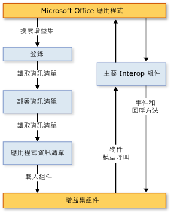

# VSTO 增益集的架構
  使用 Visual Studio 中 Office Developer Tools 建立的 VSTO 增益集具有同時強調穩定性和安全性的架構功能，這些功能可讓其與 Microsoft Office 密切合作。 本主題描述 VSTO 增益集的下列層面：  
  
-   [了解 VSTO 增益集](#UnderstandingAddIns)  
  
-   [VSTO 增益集的元件](#AddinComponents)  
  
-   [VSTO 增益集搭配 Microsoft Office 應用程式的運作方式](#HowAddinsWork)  
  
 [!INCLUDE[appliesto_allapp](../vsto/includes/appliesto-allapp-md.md)]  
  
 如需建立 VSTO 增益集的一般資訊，請參閱 [Office 方案開發概觀 &#40;VSTO&#41;](../vsto/office-solutions-development-overview-vsto.md) 和 [VSTO 增益集程式設計入門](../vsto/getting-started-programming-vsto-add-ins.md)。  
  
##   了解 VSTO 增益集  
 當您使用 Visual Studio 中的 Office Developer Tools 建置 VSTO 增益集時，會建立由 Microsoft Office 應用程式載入的 Managed 程式碼組件。 載入此組件之後，VSTO 該增益集就能回應應用程式所引發的事件 \(例如，當使用者按一下功能表項目時\)。 VSTO 增益集還可呼叫物件模型以自動化並擴充應用程式，而且它可以使用 [!INCLUDE[dnprdnshort](../sharepoint/includes/dnprdnshort-md.md)] 中的任何類別。  
  
 組件會透過應用程式的主要 Interop 組件與應用程式的 COM 元件進行通訊。 如需詳細資訊，請參閱[Office 主要 Interop 組件](../vsto/office-primary-interop-assemblies.md)與[Office 方案開發概觀 &#40;VSTO&#41;](../vsto/office-solutions-development-overview-vsto.md)。  
  
 如果針對應用程式安裝多個 VSTO 增益集，則每一個 VSTO 增益集會在不同的應用程式定義域中載入。 這表示如果某個 VSTO 增益集運作失常，並不會導致其他 VSTO 增益集失敗。 此外，這樣有助於確保應用程式關閉後，所有 VSTO 增益集組件都會從記憶體中卸載。 如需應用程式定義域的詳細資訊，請參閱[應用程式定義域](http://msdn.microsoft.com/library/113a8bbf-6875-4a72-a49d-ca2d92e19cc8)。  
  
> [!NOTE]  
>  您使用 Visual Studio 中的 Office Developer Tools 建立的 VSTO 增益集，是設計為只在使用者啟動 Microsoft Office 主應用程式時使用。 如果是以程式設計的方式啟動應用程式 \(例如，使用 Automation\)，則該 VSTO 增益集可能無法如預期般運作。  
  
##   VSTO 增益集的元件  
 雖然 VSTO 增益集組件為主要元件，但還有其他數個元件在 Microsoft Office 應用程式探索和載入 VSTO 增益集的方式中扮演重要角色。  
  
### 登錄項目  
 Microsoft Office 應用程式會藉由尋找一組登錄項目來探索 VSTO 增益集。 如需 VSTO 增益集所使用登錄項目的完整清單，請參閱 [VSTO 增益集的登錄項目](../vsto/registry-entries-for-vsto-add-ins.md)。  
  
 當您建置方案時，Visual Studio 會在開發電腦上建立所有必要的登錄項目，以便您偵錯和執行 VSTO 增益集。 如需詳細資訊，請參閱[建置 Office 方案](../vsto/building-office-solutions.md)。  
  
 如果您使用 ClickOnce 部署方案，發行流程所產生的安裝程式會在使用者電腦上自動建立登錄機碼。 如需詳細資訊，請參閱[使用 ClickOnce 部署 Office 方案](../vsto/deploying-an-office-solution-by-using-clickonce.md)。  
  
### 部署資訊清單和應用程式資訊清單  
 VSTO 增益集會使用部署資訊清單和應用程式資訊清單來識別及載入最新版的 VSTO 增益集組件。 部署資訊清單會指向目前的應用程式資訊清單。 而應用程式資訊清單會指向 VSTO 增益集組件，並指定要在組件中執行的進入點類別。 如需詳細資訊，請參閱[Office 方案中的應用程式和部署資訊清單](../vsto/application-and-deployment-manifests-in-office-solutions.md)。  
  
### Visual Studio Tools for Office Runtime  
 若要執行 Visual Studio 中 Office Developer Tools 所建立的增益集，使用者電腦上必須安裝 [!INCLUDE[vsto_runtime](../vsto/includes/vsto-runtime-md.md)]。 此執行階段包含 Unmanaged 元件和一組 Managed 組件。 Unmanaged 元件會載入 VSTO 增益集組件。 Managed 組件則會提供 VSTO 增益集程式碼用來自動化及擴充主應用程式的物件模型。  
  
 如需詳細資訊，請參閱[Visual Studio Tools for Office Runtime 概觀](../vsto/visual-studio-tools-for-office-runtime-overview.md)。  
  
##   VSTO 增益集搭配 Microsoft Office 應用程式的運作方式  
 當使用者啟動 Microsoft Office 應用程式時，該應用程式會使用部署資訊清單和應用程式資訊清單來尋找並載入最新版的 VSTO 增益集組件。 下圖顯示這些 VSTO 增益集的基本架構。  
  
   
  
> [!NOTE]  
>  在以 [!INCLUDE[net_v40_short](../sharepoint/includes/net-v40-short-md.md)] 或 [!INCLUDE[net_v45](../vsto/includes/net-v45-md.md)] 為目標的 Office 方案中，方案會使用內嵌於方案組件中的 PIA 類型資訊來呼叫主應用程式的物件模型，而不是直接呼叫 PIA。 如需詳細資訊，請參閱[設計和建立 Office 方案](../vsto/designing-and-creating-office-solutions.md)。  
  
### 載入處理序  
 當使用者啟動應用程式，就會執行下列步驟：  
  
1.  應用程式會檢查可識別使用 Visual Studio 中的 Office Developer Tools 所建立之 VSTO 增益集的登錄項目。  
  
2.  如果應用程式找到這些登錄項目，則會載入 VSTOEE.dll，而 VSTOEE.dll 會載入 VSTOLoader.dll。 這些都是 Visual Studio 2010 Tools for Office Runtime 載入器元件的 Unmanaged DLL。 如需詳細資訊，請參閱[Visual Studio Tools for Office Runtime 概觀](../vsto/visual-studio-tools-for-office-runtime-overview.md)。  
  
3.  VSTOLoader.dll 會載入 [!INCLUDE[dnprdnshort](../sharepoint/includes/dnprdnshort-md.md)] 並啟動 [!INCLUDE[vsto_runtime](../vsto/includes/vsto-runtime-md.md)] 的 Managed 部分。  
  
4.  [!INCLUDE[vsto_runtime](../vsto/includes/vsto-runtime-md.md)] 會檢查資訊清單更新，然後下載最新的應用程式和部署資訊清單。  
  
5.  [!INCLUDE[vsto_runtime](../vsto/includes/vsto-runtime-md.md)] 會執行一系列的安全性檢查。 如需詳細資訊，請參閱[保護 Office 方案](../vsto/securing-office-solutions.md)。  
  
6.  如果 VSTO 增益集受信任而得以執行，則 [!INCLUDE[vsto_runtime](../vsto/includes/vsto-runtime-md.md)] 會使用部署資訊清單和應用程式資訊清單來檢查組件更新。 如果有新版的組件可用，執行階段就會將新版的組件下載至用戶端電腦上的 [!INCLUDE[ndptecclick](../vsto/includes/ndptecclick-md.md)] 快取。 如需詳細資訊，請參閱[部署 Office 方案](../vsto/deploying-an-office-solution.md)。  
  
7.  [!INCLUDE[vsto_runtime](../vsto/includes/vsto-runtime-md.md)] 會建立新的應用程式定義域，以便載入 VSTO 增益集組件。  
  
8.  [!INCLUDE[vsto_runtime](../vsto/includes/vsto-runtime-md.md)] 會將 VSTO 增益集組件載入至此應用程式定義域中。  
  
9. 如果您已覆寫 <xref:Microsoft.Office.Tools.AddInBase.RequestComAddInAutomationService%2A> 方法，則 [!INCLUDE[vsto_runtime](../vsto/includes/vsto-runtime-md.md)] 會在您的 VSTO 增益集中呼叫此方法。  
  
     您可以選擇覆寫這個方法，以便將 VSTO 增益集中的物件公開至其他 Microsoft Office 方案。 如需詳細資訊，請參閱[從其他 Office 方案呼叫 VSTO 增益集的程式碼](../vsto/calling-code-in-vsto-add-ins-from-other-office-solutions.md)。  
  
10. 如果您已覆寫 <xref:Microsoft.Office.Tools.AddInBase.RequestService%2A> 方法，則 [!INCLUDE[vsto_runtime](../vsto/includes/vsto-runtime-md.md)] 會在您的 VSTO 增益集中呼叫此方法。  
  
     您可以選擇覆寫這個方法，傳回實作擴充性介面的物件以擴充 Microsoft Office 功能。 如需詳細資訊，請參閱[使用擴充性介面自訂 UI 功能](../vsto/customizing-ui-features-by-using-extensibility-interfaces.md)。  
  
    > [!NOTE]  
    >  [!INCLUDE[vsto_runtime](../vsto/includes/vsto-runtime-md.md)] 會針對主應用程式支援的每個擴充性介面，個別呼叫 <xref:Microsoft.Office.Tools.AddInBase.RequestService%2A> 方法。 雖然第一次呼叫 <xref:Microsoft.Office.Tools.AddInBase.RequestService%2A> 方法通常發生於呼叫 `ThisAddIn_Startup` 方法之前，但 VSTO 增益集不得假設何時將會呼叫 <xref:Microsoft.Office.Tools.AddInBase.RequestService%2A> 方法，或將會呼叫的次數。  
  
11. [!INCLUDE[vsto_runtime](../vsto/includes/vsto-runtime-md.md)] 會在 VSTO 增益集中呼叫 `ThisAddIn_Startup` 方法。 這個方法是 <xref:Microsoft.Office.Tools.AddInBase.Startup> 事件的預設事件處理常式。 如需詳細資訊，請參閱[Office 專案中的事件](../vsto/events-in-office-projects.md)。  
  
## 請參閱  
 [Office 方案在 Visual Studio 中的架構](../vsto/architecture-of-office-solutions-in-visual-studio.md)   
 [文件層級自訂的架構](../vsto/architecture-of-document-level-customizations.md)   
 [Visual Studio Tools for Office Runtime 概觀](../vsto/visual-studio-tools-for-office-runtime-overview.md)   
 [VSTO 增益集程式設計](../vsto/programming-vsto-add-ins.md)   
 [開發 Office 方案](../vsto/developing-office-solutions.md)   
 [保護 Office 方案](../vsto/securing-office-solutions.md)   
 [部署 Office 方案](../vsto/deploying-an-office-solution.md)  
  
  