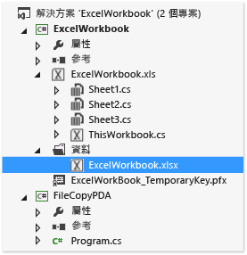
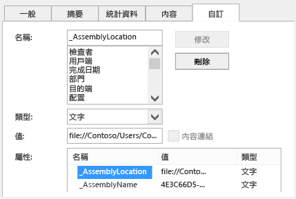

# 使用 ClickOnce 部署 Office 方案
  使用 ClickOnce 只需要幾個步驟就能部署 Office 方案。  如果您發行更新，方案會自動偵測並安裝更新。  不過，ClickOnce 要求您針對電腦上的每個使用者分別安裝方案。  因此，如果同一部電腦上有多位使用者將執行您的方案，您應該考慮使用 Windows Installer \(.msi\)。  
  
## 本主題內容  
  
-   [發行方案](#Publish)  
  
-   [決定您想要將信任授與方案的方式](#Trust)  
  
-   [協助使用者安裝方案](#Helping)  
  
-   [將方案的文件放置到使用者的電腦上 (僅適用於文件層級自訂)](#Put)  
  
-   [將方案的文件放置到執行 SharePoint 的伺服器上 (僅適用於文件層級自訂)](#SharePoint)  
  
-   [建立自訂安裝程式](#Custom)  
  
-   [發行更新](#Update)  
  
-   [變更方案的安裝位置](#Location)  
  
-   [將方案復原為舊版](#Roll)  
  
 如需如何透過建立 Windows Installer 檔來部署 Office 方案的詳細資訊，請參閱[使用 Windows Installer 部署 Office 方案](../vsto/deploying-an-office-solution-by-using-windows-installer.md)。  
  
##  <a name="Publish"></a> 發行方案  
 您可以使用 \[**發行精靈**\] 或 \[**專案設計工具**\] 發行您的方案。  在這個程序中，您將使用 \[**專案設計工具**\]，因為它提供了一組完整的發行選項。  請參閱[發行精靈 &#40;Visual Studio 中的 Office 程式開發&#41;](../vsto/publish-wizard-office-development-in-visual-studio.md)。  
  
#### 若要發行方案  
  
1.  在 \[**方案總管**\] 中選擇針對您的專案命名的節點。  
  
2.  在功能表列上，選擇 \[專案\]、\[*ProjectName* 屬性\]。  
  
3.  在 \[**專案設計工具**\] 中選擇 \[**發行**\] 索引標籤，如下圖所示。  
  
     ![[專案設計工具] 中的 [發行] 索引標籤](../vsto/media/vsto-publishtab.png "[專案設計工具] 中的 [發行] 索引標籤")  
  
4.  在 \[發行資料夾位置 \(FTP 伺服器或檔案路徑\)\]\] 方塊中，輸入您希望 \[專案設計工具\] 將方案檔複製到其中的資料夾路徑。  
  
     您可以輸入下列任何類型的路徑。  
  
    -   本機路徑 \(例如 *C:\\FolderName\\FolderName*\)。  
  
    -   網路上資料夾的統一命名慣例 \(UNC\) 路徑 \(例如 *\\\\ServerName\\FolderName*\)。  
  
    -   相對路徑 \(例如專案預設發行到其中的資料夾 *PublishFolder\\*\)。  
  
5.  在 \[**安裝資料夾 URL**\] 方塊中，輸入完整的位置路徑以便使用者找到您的方案。  
  
     如果您還不知道位置，則不要在這個欄位中輸入任何內容。  根據預設，ClickOnce 會在您的使用者安裝方案的資料夾中尋找更新。  
  
6.  選擇 \[**必要條件**\] 按鈕。  
  
7.  在 \[**必要條件**\] 對話方塊中，確定已選取 \[**建立安裝程式以安裝必要條件元件**\] 核取方塊。  
  
8.  在 \[**選擇要安裝的必要條件**\] 清單中，選取 \[**Windows Installer 4.5**\] 和適當 .NET Framework 套件的核取方塊。  
  
     例如，如果您的方案以 [!INCLUDE[net_v45](../vsto/includes/net-v45-md.md)] 為目標，請選取 \[**Windows Installer 4.5**\] 和 \[**Microsoft .NET Framework 4.5 Full**\] 的核取方塊。  
  
9. 如果您的方案以 .NET Framework 4.5 為目標，請選取 \[**Visual Studio 2010 Tools for Office Runtime**\] 核取方塊。  
  
    > [!NOTE]  
    >  根據預設，這個核取方塊不會出現。  若要顯示這個核取方塊，您必須建立啟動載入器套件。  請參閱[使用 Visual Studio 2012 建立適用於 Office 2013 VSTO 增益集的啟動載入器套件](http://blogs.msdn.com/b/vsto/archive/2012/12/21/creating-a-bootstrapper-package-for-an-office-2013-vsto-add-in-with-visual-studio-2012.aspx)。  
  
10. 在 \[**指定必要條件的安裝位置**\] 底下，選擇出現的其中一個選項，然後選擇 \[**確定**\] 按鈕。  
  
     下表會說明每個選項。  
  
    |選項|描述|  
    |--------|--------|  
    |**從元件廠商的網站下載必要條件**|系統會提示使用者下載並安裝廠商提供的這些必要條件。|  
    |**從應用程式的相同位置下載必要條件**|必要軟體會隨方案安裝。  如果您選擇這個選項，Visual Studio 會自動將所有必要條件套件複製到發行位置。  必要條件套件必須放在開發電腦上，這個選項才能正常運作。|  
    |**從下列位置下載必要條件**|Visual Studio 會將所有必要條件套件複製到您指定的位置，並且隨方案安裝這些套件。|  
  
     請參閱 [必要條件對話方塊](../ide/reference/prerequisites-dialog-box.md)。  
  
11. 選擇 \[更新\] 按鈕指定每位使用者之 VSTO 增益集或自訂檢查更新的頻率，然後選擇 \[確定\] 按鈕。  
  
    > [!NOTE]  
    >  如果您要使用 CD 或卸除式磁碟機進行部署，請選擇 \[**永遠不檢查更新**\] 選項按鈕。  
  
     如需如何發行更新的詳細資訊，請參閱[發行更新](#Update)。  
  
12. 選擇 \[**選項**\] 按鈕，檢閱 \[**選項**\] 對話方塊中的選項，然後選擇 \[**確定**\] 按鈕。  
  
13. 選擇 \[**立即發行**\] 按鈕。  
  
     Visual Studio 會將下列資料夾和檔案加入至您在本程序前段指定的發行資料夾。  
  
    -   \[**Application Files**\] 資料夾。  
  
    -   安裝程式。  
  
    -   部署資訊清單，會指向最新版本的部署資訊清單。  
  
     \[**Application Files**\] 資料夾包含您發行之每個版本的子資料夾。  每個版本專屬子資料夾都包含下列檔案。  
  
    -   應用程式資訊清單。  
  
    -   部署資訊清單。  
  
    -   自訂組件。  
  
     下圖顯示 Outlook VSTO 增益集的發行資料夾結構。  
  
       
  
    > [!NOTE]  
    >  ClickOnce 會將 .deploy 副檔名附加至組件，如此受保護的網際網路資訊服務 \(IIS\) 安裝就不會因為不安全的副檔名而封鎖檔案。  當使用者安裝方案時，ClickOnce 會移除 .deploy 副檔名。  
  
14. 將方案檔複製到您在本程序前段指定的安裝位置。  
  
##  <a name="Trust"></a> 決定您想要將信任授與方案的方式  
 在使用者電腦上執行方案之前，您必須先授與信任，或是使用者必須在安裝方案時回應信任提示。  若要對方案授與信任，請使用確認為知名且受信任之發行者的憑證來簽署資訊清單。  請參閱[信任方案透過簽署應用程式和部署資訊清單](../vsto/granting-trust-to-office-solutions.md#Signing)。  
  
 如果您要部署文件層級自訂，而且想要將文件放置到使用者的電腦上，或是在 SharePoint 網站上提供文件，請確定 Office 信任文件的位置。  請參閱[授與信任給文件](../vsto/granting-trust-to-documents.md)。  
  
##  <a name="Helping"></a> 協助使用者安裝方案  
 使用者能夠安裝方案的方式包括：執行安裝程式、開啟部署資訊清單，或是在文件層級自訂的情況下直接開啟文件。  最理想的做法是使用者應使用安裝程式安裝您的方案。  另外兩種方法都無法保證能夠安裝必要軟體。  如果使用者想要從安裝位置開啟文件，則必須將文件加入至 Office 應用程式的 \[信任中心\] 中信任的位置清單。  
  
### 開啟文件層級自訂的文件  
 使用者可以直接從安裝位置開啟文件層級自訂的文件，或是將文件複製到其本機電腦，然後開啟複本。  
  
 最理想的做法是使用者應該在其電腦上開啟文件的複本，如此就不會有多位使用者嘗試同時開啟相同的複本。  若要強制執行這種做法，您可以設定安裝程式將文件複製到使用者電腦。  請參閱[將方案的文件放置到使用者的電腦上 (僅適用於文件層級自訂)](#Put)。  
  
### 藉由從 IIS 網站開啟部署資訊清單的方式安裝方案  
 使用者可以從 Web 開啟部署資訊清單，藉此安裝 Office 方案。  不過，受保護的網際網路資訊服務 \(IIS\) 安裝將會封鎖副檔名為 .vsto 的檔案。  您必須先在 IIS 中定義 MIME 類型，才能使用 IIS 部署 Office 方案。  
  
##### 若要將 .vsto MIME 類型加入至 IIS 6.0  
  
1.  在執行 IIS 6.0 的伺服器上，選擇 \[**開始**\]、\[**所有程式**\]、\[**系統管理工具**\]、\[**網際網路資訊服務 \(IIS\) 管理員**\]。  
  
2.  選擇電腦名稱、\[**網站**\] 資料夾或要設定的網站。  
  
3.  在功能表列上，選擇 \[**動作**\]、\[**屬性**\]。  
  
4.  在 \[**HTTP 標頭**\] 索引標籤上，選擇 \[**MIME 類型**\] 按鈕。  
  
5.  在 \[**MIME 類型**\] 視窗中，選擇 \[**新增**\] 按鈕。  
  
6.  在 \[**MIME 類型**\] 視窗中，輸入 **.vsto** 做為副檔名，並輸入 **application\/x\-ms\-vsto** 做為 MIME 類型，然後套用新的設定。  
  
    > [!NOTE]  
    >  您必須重新啟動 World Wide Web Publishing 服務，或等待背景工作處理序回收，變更才會生效。  然後您必須清除瀏覽器的磁碟快取，並嘗試再次開啟 .vsto 檔案。  
  
##### 若要將 .vsto MIME 類型加入至 IIS 7.0  
  
1.  在執行 IIS 7.0 的伺服器上，選擇 \[**開始**\]、\[**所有程式**\]、\[**附屬應用程式**\]。  
  
2.  開啟 \[**命令提示字元**\] 的捷徑功能表，然後選擇 \[**以系統管理員身分執行**\]。  
  
3.  在 \[**開啟**\] 方塊中，輸入下列路徑，然後選擇 \[**確定**\] 按鈕。  
  
    ```  
    %windir%\system32\inetsrv   
    ```  
  
4.  輸入下列命令，然後套用新的設定。  
  
    ```  
    set config /section:staticContent /+[fileExtension='.vsto',mimeType='application/x-ms-vsto']  
    ```  
  
    > [!NOTE]  
    >  您必須重新啟動 World Wide Web Publishing 服務，或是等待背景工作處理序回收，變更才會生效。  然後您必須清除瀏覽器的磁碟快取，並嘗試再次開啟 .vsto 檔案。  
  
##  <a name="Put"></a> 將方案的文件放置到使用者的電腦上 \(僅適用於文件層級自訂\)  
 您可以藉由建立部署後動作，將方案文件複製到使用者的電腦上。  如此一來，使用者安裝方案之後，就不必手動將文件從安裝位置複製到電腦上。  您必須建立定義部署後動作的類別、建置及發行方案、修改應用程式資訊清單，並重新簽署應用程式和部署資訊清單。  
  
 下列程序會假設您的專案名稱為 **ExcelWorkbook**，而且您會將方案發行至電腦的 **C:\\publish** 目錄。  
  
### 建立定義部署後動作的類別  
  
1.  在功能表列上選擇 \[**檔案**\]、\[**加入**\]、\[**新增專案**\]。  
  
2.  在 \[**加入新的專案**\] 對話方塊的 \[**已安裝的範本**\] 窗格中，選擇 \[**Windows**\] 資料夾。  
  
3.  在 \[**範本**\] 窗格中，選擇 \[**類別庫**\] 範本。  
  
4.  在 \[**名稱**\] 欄位中輸入 **FileCopyPDA**，然後選擇 \[**確定**\] 按鈕。  
  
5.  在 \[**方案總管**\] 中，選擇 \[**FileCopyPDA**\] 專案。  
  
6.  在功能表列上，選擇 \[**專案**\]、\[**加入參考**\]。  
  
7.  在 \[**.NET**\] 索引標籤上，加入 Microsoft.VisualStudio.Tools.Applications.Runtime 和 Microsoft.VisualStudio.Tools.Applications.ServerDocument 的參考。  
  
8.  將類別重新命名為 `FileCopyPDA`，然後將檔案的內容取代為程式碼。  這個程式碼會執行下列工作：  
  
    -   將文件複製到使用者的桌面。  
  
    -   針對部署資訊清單，將 \_AssemblyLocation 屬性從相對路徑變更為完整路徑。  
  
    -   如果使用者解除安裝方案，則將檔案刪除。  
  
     [!code-csharp[Trin_ExcelWorkbookPDA#7](../snippets/csharp/VS_Snippets_OfficeSP/trin_excelworkbookpda/cs/filecopypda/class1.cs#7)]
     [!code-vb[Trin_ExcelWorkbookPDA#7](../snippets/visualbasic/VS_Snippets_OfficeSP/trin_excelworkbookpda/vb/filecopypda/class1.vb#7)]  
  
### 建置及發行方案  
  
1.  在 \[**方案總管**\] 中，開啟 \[**FileCopyPDA**\] 專案的捷徑功能表，然後選擇 \[**建置**\]。  
  
2.  開啟 \[**ExcelWorkbook**\] 專案的捷徑功能表，然後選擇 \[**建置**\]。  
  
3.  開啟 \[**ExcelWorkbook**\] 專案的捷徑功能表，然後選擇 \[**加入參考**\]。  
  
4.  在 \[**加入參考**\] 對話方塊中，依序選擇 \[**專案**\] 索引標籤、\[**FileCopyPDA**\] 和 \[**確定**\] 按鈕。  
  
5.  在 \[**方案總管**\] 中，選擇 \[**ExcelWorkbook**\] 專案。  
  
6.  在功能表列上，選擇 \[**專案**\]、\[**新增資料夾**\]。  
  
7.  輸入 Data，然後選擇 Enter 鍵。  
  
8.  在 \[**方案總管**\] 中，選擇 \[**Data**\] 資料夾。  
  
9. 在功能表列中，選擇 \[**專案**\]、\[**加入現有項目**\]。  
  
10. 在 \[**加入現有項目**\] 對話方塊中，瀏覽至 \[**ExcelWorkbook**\] 專案的輸出目錄，選擇 \[**ExcelWorkbook.xlsx**\] 檔案，然後選擇 \[**加入**\] 按鈕。  
  
11. 在 \[**方案總管**\] 中，選擇 \[**ExcelWorkbook.xlsx**\] 檔案。  
  
12. 在 \[**屬性**\] 視窗中，將 \[**建置動作**\] 屬性變更為 \[**內容**\]，並且將 \[**複製到輸出目錄**\] 屬性設定為 \[**有更新時才複製**\]。  
  
     完成這些步驟時，您的專案看起來會像下圖一樣。  
  
       
  
13. 發行 \[**ExcelWorkbook**\] 專案。  
  
### 修改應用程式資訊清單  
  
1.  使用 \[**檔案總管**\] 開啟 **c:\\publish** 目錄。  
  
2.  開啟 \[Application Files\] 資料夾，然後開啟對應最新發行之方案版本的資料夾。  
  
3.  在像是 \[記事本\] 這類文字編輯器中開啟 **ExcelWorkbook.dll.manifest** 檔。  
  
4.  在 `</vstav3:update>` 項目後面加上下列程式碼。  針對 `<vstav3:entryPoint>` 項目的類別屬性，使用下列語法：*NamespaceName.ClassName*。  在下列範例中，命名空間和類別名稱相同，因此產生的進入點名稱是 `FileCopyPDA.FileCopyPDA`。  
  
    ```  
    <vstav3:postActions>  
      <vstav3:postAction>  
        <vstav3:entryPoint  
          class="FileCopyPDA.FileCopyPDA">  
          <assemblyIdentity  
            name="FileCopyPDA"  
            version="1.0.0.0"  
            language="neutral"  
            processorArchitecture="msil" />  
        </vstav3:entryPoint>  
        <vstav3:postActionData>  
        </vstav3:postActionData>  
      </vstav3:postAction>  
    </vstav3:postActions>  
    ```  
  
### 重新簽署應用程式和部署資訊清單  
  
1.  在 **%USERPROFILE%\\Documents\\Visual Studio 2013\\Projects\\ExcelWorkbook\\ExcelWorkbook** 資料夾中複製 **ExcelWorkbook\_TemporaryKey.pfx** 憑證檔案，然後將它貼入 *PublishFolder* **\\Application Files\\ExcelWorkbook***MostRecentPublishedVersion* 資料夾。  
  
2.  開啟 Visual Studio 命令提示字元，然後將目錄變更為 **c:\\publish\\Application Files\\ExcelWorkbook***MostRecentPublishedVersion* 資料夾 \(例如 **c:\\publish\\Application Files\\ExcelWorkbook\_1\_0\_0\_4**\)。  
  
3.  執行下列命令簽署修改後的應用程式資訊清單：  
  
    ```  
    mage -sign ExcelWorkbook.dll.manifest -certfile ExcelWorkbook_TemporaryKey.pfx  
    ```  
  
     「ExcelWorkbook.dll.manifest 簽署成功」訊息隨即顯示。  
  
4.  切換到 **c:\\publish** 資料夾，然後執行下列命令更新及簽署部署資訊清單：  
  
    ```  
    mage -update ExcelWorkbook.vsto -appmanifest "Application Files\Ex  
    celWorkbookMostRecentVersionNumber>\ExcelWorkbook.dll.manifest" -certfile "Application Files\ExcelWorkbookMostRecentVersionNumber>\ExcelWorkbook_TemporaryKey.pfx"  
    ```  
  
    > [!NOTE]  
    >  在上面的範例中，將 MostRecentVersionNumber 取代為最新發行之方案版本的版本號碼 \(例如 **1\_0\_0\_4**\)。  
  
     「ExcelWorkbook.vsto 簽署成功」訊息隨即顯示。  
  
5.  將 ExcelWorkbook.vsto 檔案複製到 **c:\\publish\\Application Files\\ExcelWorkbook***MostRecentVersionNumber* 目錄。  
  
##  <a name="SharePoint"></a> 將方案的文件放置到執行 SharePoint 的伺服器上 \(僅適用於文件層級自訂\)  
 您可以使用 SharePoint 將文件層級自訂發行至使用者。  當使用者前往 SharePoint 網站並開啟文件時，執行階段會自動將共用網路資料夾中的方案安裝到使用者的本機電腦。  方案安裝到本機上之後，即使文件是複製到其他地方 \(例如桌面\)，自訂仍舊會執行。  
  
#### 若要將文件放置到執行 SharePoint 的伺服器上  
  
1.  將方案文件加入至 SharePoint 網站上的文件庫。  
  
2.  執行下列其中一種方法的步驟：  
  
    -   使用 Office 組態工具將執行 SharePoint 的伺服器加入至所有使用者電腦上 Word 或 Excel 中的 \[信任中心\]。  
  
         請參閱 [Office 2010 中的安全性原則和設定](http://go.microsoft.com/fwlink/?LinkId=99227)。  
  
    -   確定每位使用者都執行下列步驟。  
  
        1.  在本機電腦上開啟 Word 或 Excel，選擇 \[**檔案**\] 索引標籤，然後選擇 \[**選項**\] 按鈕。  
  
        2.  在 \[**信任中心**\] 對話方塊中，選擇 \[**信任位置**\] 按鈕。  
  
        3.  選取 \[**允許我的網路上之信任位置 \(不建議使用\)**\] 核取方塊，然後選擇 \[**新增位置**\] 按鈕。  
  
        4.  在 \[路徑\] 方塊中，輸入包含您上傳之文件的 SharePoint 文件庫 URL \(例如 *http:\/\/SharePointServerName\/TeamName\/ProjectName\/DocumentLibraryName*\)。  
  
             請勿加入預設網頁的名稱，例如 default.aspx 或 AllItems.aspx。  
  
        5.  選取 \[**同時信任此位置的子資料夾**\] 核取方塊，然後選擇 \[**確定**\] 按鈕。  
  
             當使用者從 SharePoint 網站開啟文件時，文件隨即開啟，而且會安裝自訂。  使用者可以將文件複製到桌面。  自訂仍舊會執行，因為文件中的屬性是指向文件的網路位置。  
  
##  <a name="Custom"></a> 建立自訂安裝程式  
 您可以為 Office 方案建立自訂安裝程式，而不使用發行方案時自動建立的安裝程式。  例如，您可以使用登入指令檔開始進行安裝，或使用批次檔安裝方案而無須與使用者互動。  使用者電腦上已安裝必要條件時，下列情境可獲得最佳效果。  
  
 在自訂安裝過程中，呼叫 Office 方案安裝程式工具 \(VSTOInstaller.exe\)，這個工具的預設安裝位置如下：  
  
 %commonprogramfiles%\\microsoft shared\\VSTO\\10.0\\VSTOInstaller.exe  
  
 如果工具不在該位置，您可以使用 HKEY\_LOCAL\_MACHINE\\SOFTWARE\\Microsoft\\VSTO Runtime Setup\\v4\\InstallerPath 或 HKEY\_LOCAL\_MACHINE\\SOFTWARE\\Wow6432Node\\Microsoft\\VSTO Runtime Setup\\v4\\InstallerPath 登錄機碼來尋找該工具的路徑。  
  
 VSTOinstaller.exe 可搭配下列參數使用。  
  
|參數|定義|  
|--------|--------|  
|\/Install 或 \/I|安裝方案。  這個選項後面必須接著部署資訊清單的路徑。  您可以指定本機電腦上的路徑，也就是通用命名慣例 \(UNC\) 檔案共用。  您可以指定本機路徑 \(*C:\\FolderName\\PublishFolder*\)、相對路徑 \(*Publish\\*\) 或完整位置 \(*\\\\ServerName\\FolderName* 或 http:\/\/*ServerName\/FolderName*\)。|  
|\/Uninstall 或 \/U|解除安裝方案。  這個選項後面必須接著部署資訊清單的路徑。  您可以指定位於本機電腦或 UNC 檔案共用上的路徑。  您可以指定本機路徑 \(*c:\\FolderName\\PublishFolder*\)、相對路徑 \(*Publish\\*\) 或完整位置 \(*\\\\ServerName\\FolderName* 或 http:\/\/*ServerName\/FolderName*\)。|  
|\/Silent 或 \/S|在不提示使用者輸入或顯示任何訊息的情況下，進行安裝或解除安裝。  如果需要信任提示，則不會安裝或更新自訂。|  
|\/Help 或 \/?|顯示 \[說明\] 資訊。|  
  
 當您執行 VSTOinstaller.exe 時，可能會出現下列錯誤碼。  
  
|錯誤碼|定義|  
|---------|--------|  
|0|方案已成功安裝或解除安裝，或是出現 VSTOInstaller \[說明\]。|  
|\-100|一個或多個命令列選項無效，或是設定超過一次。  如需詳細資訊，請輸入"vstoinstaller \/?"，或參閱[逐步解說：為 ClickOnce Office 方案建立自訂安裝程式](http://msdn.microsoft.com/zh-tw/3e5887ed-155f-485d-b8f6-3c02c074085e)。|  
|\-101|一個或多個命令列選項無效。  如需詳細資訊，請輸入 "vstoinstaller \/?"。|  
|\-200|部署資訊清單 URI 無效。  如需詳細資訊，請輸入 "vstoinstaller \/?"。|  
|\-201|部署資訊清單無效，無法安裝方案。  請參閱 [Office 方案的部署資訊清單](../vsto/deployment-manifests-for-office-solutions.md)。|  
|\-202|應用程式資訊清單的 Visual Studio Tools for Office 區段無效，無法安裝方案。  請參閱 [Office 方案的應用程式資訊清單](../vsto/application-manifests-for-office-solutions.md)。|  
|\-203|發生下載錯誤，無法安裝方案。  請檢查部署資訊清單的 URI 或網路檔案的位置，然後再試一次。|  
|\-300|發生安全性例外狀況，無法安裝方案。  請參閱 [保護 Office 方案](../vsto/securing-office-solutions.md)。|  
|\-400|無法安裝方案。|  
|\-401|無法解除安裝方案。|  
|\-500|作業已取消，因為無法安裝或解除安裝方案，或是無法下載部署資訊清單。|  
  
##  <a name="Update"></a> 發行更新  
 若要更新方案，請使用 \[**專案設計工具**\] 或 \[**發行精靈**\] 再次發行方案，然後將更新的方案複製到安裝位置。  將檔案複製到安裝位置時，務必覆寫先前的檔案。  
  
 下一次方案檢查更新時，就會自動尋找和載入新版本。  
  
##  <a name="Location"></a> 變更方案的安裝位置  
 您可以在發行方案之後，加入或變更安裝路徑。  基於下列其中一個或多個原因，您可能會想要變更安裝路徑：  
  
-   在知道安裝路徑之前就已編譯安裝程式。  
  
-   方案檔案已複製至不同位置。  
  
-   裝載安裝檔案的伺服器換了名稱或位置。  
  
 若要變更方案的安裝路徑，您必須更新安裝程式，然後使用者必須執行安裝程式。  若是文件層級自訂，使用者也必須更新其文件中的屬性，以指向新位置。  
  
> [!NOTE]  
>  如果您不想要求使用者更新其文件屬性，可以要求使用者從安裝位置取得更新的文件。  
  
#### 若要變更安裝程式中的安裝路徑  
  
1.  開啟 \[**命令提示字元**\] 視窗，然後將目錄變更為安裝資料夾。  
  
2.  執行安裝程式並且包含 `/url` 參數，這個參數會將新安裝路徑當成字串。  
  
     下列範例將示範如何將安裝路徑變更為 Fabrikam 網站上的位置，不過您可以將 URL 取代為您要的路徑：  
  
    ```  
    setup.exe /url="http://www.fabrikam.com/newlocation"  
    ```  
  
    > [!NOTE]  
    >  如果出現訊息並指出可執行檔的簽章將失效，則用來簽署方案的憑證將不再有效且發行者為未知。  如此一來，使用者就必須確認可以信任方案的來源，才能進行安裝。  
  
    > [!NOTE]  
    >  若要顯示目前的 URL 值，請執行 `setup.exe /url`。  
  
 若是文件層級自訂，使用者必須開啟文件並更新其 \_AssemblyLocation 屬性。  下列步驟將描述使用者如何執行這項工作。  
  
#### 若要更新文件中的 \_AssemblyLocation 屬性  
  
1.  在 \[**檔案**\] 索引標籤上，選擇 \[**資訊**\]，如下圖所示。  
  
     ![Excel 中的 [資訊] 索引標籤](../vsto/media/vsto-infotab.png "Excel 中的 [資訊] 索引標籤")  
  
2.  在 \[**屬性**\] 清單中，選擇 \[**進階屬性**\]，如下圖所示。  
  
     ![Excel 中的 [進階屬性]。](../vsto/media/vsto-advanceddocumentproperties.png "Excel 中的 [進階屬性]。")  
  
3.  在 \[**屬性**\] 清單中的 \[**自訂**\] 索引標籤上，選擇 \[\_AssemblyLocation\]，如下圖所示。  
  
       
  
     \[**值**\] 方塊中會包含部署資訊清單識別項。  
  
4.  在識別項前面輸入文件的完整路徑，後面加上一條分隔線，格式為 *Path* |*識別項* \(例如 *File:\/\/ServerName\/FolderName\/FileName |74744e4b\-e4d6\-41eb\-84f7\-ad20346fe2d9*。  
  
     如需格式化此識別項的詳細資訊，請參閱[自訂文件屬性概觀](../vsto/custom-document-properties-overview.md)。  
  
5.  選擇 \[**確定**\] 按鈕，然後儲存並關閉文件。  
  
6.  執行不含 \/url 參數的安裝程式，在指定的位置安裝方案。  
  
##  <a name="Roll"></a> 將方案復原為舊版  
 當您復原方案時，可以將使用者還原為該方案的舊版。  
  
#### 若要復原方案  
  
1.  開啟方案的安裝位置。  
  
2.  在最上層發行資料夾中，刪除部署資訊清單 \(.vsto 檔案\)。  
  
3.  尋找要復原之版本的子資料夾。  
  
4.  將部署資訊清單從該資料夾複製至最上層發行資料夾。  
  
     例如，若要將名為 **OutlookAddIn1** 的方案從 1.0.0.1 版本復原為 1.0.0.0 版本，請從 **OutlookAddIn1\_1\_0\_0\_0** 資料夾複製 **OutlookAddIn1.vsto** 檔案。  將檔案貼入最上層發行資料夾中，覆寫已經在該資料夾中的 **OutlookAddIn1\_1\_0\_0\_1** 版本專屬部署資訊清單。  
  
     下圖顯示這個範例中的發行資料夾結構。  
  
       
  
     下次使用者開啟應用程式或自訂文件時，就會偵測到部署資訊清單的變更。  舊版 Office 方案便會從 ClickOnce 快取中執行。  
  
> [!NOTE]  
>  任何方案都只有前一個版本會儲存為本機資料。  如果復原兩種版本，則不會保留本機資料。  如需本機資料的詳細資訊，請參閱[在 ClickOnce 應用程式中存取本機和遠端資料](../deployment/accessing-local-and-remote-data-in-clickonce-applications.md)。  
  
## 請參閱  
 [部署 Office 方案](../vsto/deploying-an-office-solution.md)   
 [發行 Office 方案](../vsto/deploying-an-office-solution-by-using-clickonce.md)   
 [HOW TO：使用 ClickOnce 發行 Office 方案](http://msdn.microsoft.com/zh-tw/2b6c247e-bc04-4ce4-bb64-c4e79bb3d5b8)   
 [HOW TO：安裝 ClickOnce Office 方案](http://msdn.microsoft.com/zh-tw/14702f48-9161-4190-994c-78211fe18065)   
 [HOW TO：使用 ClickOnce 將文件層級的 Office 方案發行至 SharePoint Server](http://msdn.microsoft.com/zh-tw/2408e809-fb78-42a1-9152-00afa1522e58)   
 [逐步解說：為 ClickOnce Office 方案建立自訂安裝程式](http://msdn.microsoft.com/zh-tw/3e5887ed-155f-485d-b8f6-3c02c074085e)  
  
  