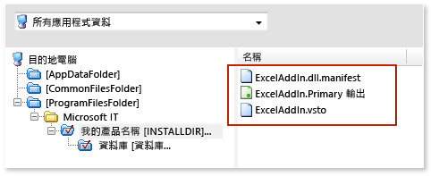

# 使用 Windows Installer 部署 Office 方案
使用 [!INCLUDE[vs_dev12](../vsto/includes/vs-dev12-md.md)] 以了解如何為 Office 方案建立 Windows Installer。  
  
使用 Visual Studio 建立 Windows Installer，您可以部署需要使用者電腦系統管理權限的 Office 方案。 例如，您可以使用這類檔案，為電腦上的所有使用者只安裝方案一次。 您也可以使用 ClickOnce 部署 Office 方案，但是必須為電腦上的每個使用者分別安裝該方案。  
  
  
## 本主題內容  
  
- [Download VSTO Add-in samples](#Download)  
  
- [Get InstallShield Limited Edition](#Obtain)  
  
- [Decide how to grant trust to the solution](#ApplySecurity)  
  
- [Create a setup project](#Create)  
  
- [Add the project output](#Add)  
  
- [Add the deployment and application manifests](#AddD)  
  
- [Configure the dependent components as prerequisites](#Configure)  
  
- [Specify where you want to deploy the solution on the user's computer](#Location)  
  
- [Configure an VSTO Add-in](#ConfigureRegisitry)  
  
- [Configure a document-level customization](#ConfigureDocument)  
  
- [Build the setup project](#Build)  
  
如需如何使用 ClickOnce 部署 Office 方案的詳細資訊，請參閱 [使用 ClickOnce 部署 Office 方案](../vsto/deploying-an-office-solution-by-using-clickonce.md)。  
  
如需如何使用 [!INCLUDE[vs_dev10_long](../sharepoint/includes/vs-dev10-long-md.md)] 建立 Windows Installer 檔案的詳細資訊，請參閱[使用 Windows Installer 部署 Visual Studio 2010 Tools for Office 解決方案](http://go.microsoft.com/fwlink/?LinkId=201807)。  
  
  
## <a name="Download"></a>下載範例  
本主題會引用下列可下載的範例。  
  
  
  
|範例<br /><br />|描述<br /><br />|  
|------|------|  
|[ExcelAddIn](http://go.microsoft.com/fwlink/?LinkID=275492)<br /><br />|Excel VSTO 增益集，可以在執行 Office 32 位元或 64 位元版本的電腦上安裝。<br /><br />|  
|[ExcelWorkbook](http://go.microsoft.com/fwlink/?LinkID=275493)<br /><br />|Excel 文件層級自訂，可以在執行 Office 32 位元或 64 位元版本的電腦上安裝。<br /><br />|  
  
## <a name="ApplySecurity"></a>決定如何將信任授與方案  
在使用者電腦上執行方案之前，您必須透過下列任一個方式授與信任，否則使用者在安裝方案時必須回應信任提示。  
  
  
- 使用確認為知名且受信任之發行者的憑證來簽署資訊清單。 如需詳細資訊，請參閱[Trusting the Solution by Signing the Application and Deployment Manifests](../vsto/granting-trust-to-office-solutions.md#Signing)。  
  
- 將方案安裝到使用者電腦上的 Program Files 目錄。  
  
> [!NOTE]  
> 對於文件層級自訂，文件的位置也必須是受信任的。 如需詳細資訊，請參閱[授與信任給文件](../vsto/granting-trust-to-documents.md)。  
  
  
## <a name="Obtain"></a>取得 InstallShield 限量版  
您可以使用 InstallShield 限量版 (ISLE) 建立 Windows Installer 檔案，如果您安裝 Visual Studio，這個版本是免費的。 ISLE 會取代舊版 Visual Studio 提供的安裝及部署專案範本的功能。  
  
  
#### 若要取得 InstallShield 限量版  
  
1. 在功能表列上，選擇 [**檔案**]、[**新增**]、[**專案**]。  
    [**新增專案**] 對話方塊隨即開啟。  
  
2. 在範本窗格中，展開 [**其他專案類型**]，然後選擇 [**安裝和部署**] 範本。  
  
3. 在 [**安裝和部署**] 的專案類型清單中，選擇 [**啟用 InstallShield 限量版**]，然後選擇 [**確定**] 按鈕。  
    會顯示頁面，提供有關如何取得 InstallShield 限量版的資訊。  
  
4. 在該頁面上，選擇 [**進入下載網站**] 連結。  
  
5. 在 InstallShield 限量版的下載頁面上，將必要的資訊輸入適當的欄位中，然後選擇 [**立即下載**] 連結。  
    當您下載、安裝及啟用專案之後，**InstallShield Limited Edition Project** 範本會出現在 Visual Studio 中。  
  
  
## <a name="Create"></a>建立安裝專案  
  
####   
1. 在 [!INCLUDE[vsprvs](../sharepoint/includes/vsprvs-md.md)] 中，開啟要部署的 Office 專案。  
    與這個主題相關聯的 VSTO 增益集範例包含名為 **ExcelAddIn** 的專案。 文件層級自訂範例包含名為 **ExcelWorkbook** 的專案。 本主題會使用這兩個名稱之一，談及您方案中的 Office 專案。  
  
2. 在功能表列上選擇 [**檔案**]、[**加入**]、[**新增專案**]。  
    [**加入新的專案**] 對話方塊隨即開啟。  
  
3. 在範本窗格中，展開 [**其他專案類型**]，然後選擇 [**安裝和部署**] 範本。  
  
4. 在 [**安裝和部署**] 的專案類型清單中，選擇 [**InstallShield 限量版專案**]，為專案命名，然後選擇 [**確定**] 按鈕。  
    您剛才建立的 InstallShield 安裝專案會出現在您的方案中。  
    本主題的範例包含名為 **OfficeAddInSetup** 的安裝專案。 本主題會使用同一個名稱，談及您方案中的安裝專案。  
  
  
## <a name="Add"></a>加入專案輸出  
您可以設定 **OfficeAddInSetup** 專案，以包含 Office 專案的輸出。 對於 VSTO 增益集專案，專案輸出只會有解決方案組件。 對於文件層級自訂專案，專案輸出不只包含方案組件，也包含文件本身。  
  
  
#### 若要加入專案輸出  
  
1. 在 [**方案總管**] 中，展開 [**OfficeAddInSetup**] 專案節點，然後選取 **Project Assistant** 檔案，如下圖所示。  
    ![[方案總管] 中的專案助理檔案](../vsto/media/installshield-projectassistant.png "[方案總管] 中的專案助理檔案")  
  
2. 在功能表列上選擇 [**檢視**]、[**開啟**]。  
  
3. 在 [**專案助理**] 頁面底部，選擇 [**應用程式檔案**] 按鈕，如下圖所示。  
    ![[應用程式檔案] 按鈕。](../vsto/media/installshield-applicationfiles.png "[應用程式檔案] 按鈕。")  
  
4. 在 [**應用程式檔案**] 頁面上，選擇 [**加入專案輸出**] 按鈕。  
  
5. 在 [**Visual Studio 輸出選取器**] 對話方塊中，選取 [**主要輸出**] 核取方塊，然後選擇 [**確定**] 按鈕。  
  
  
## <a name="AddD"></a>加入部署和應用程式資訊清單  
  
####   
1. 在 [**應用程式檔案**] 頁面上，選擇 [**加入檔案**] 按鈕。  
  
2. 在 [**開啟**] 對話方塊中，瀏覽至 **ExcelAddIn** 專案的輸出資料夾。  
    輸出目錄通常是專案根目錄的 **bin\release** 子資料夾，視您選擇的組建組態而定。  
  
3. 在輸出目錄中，選擇 **ExcelAddIn.vsto** 和 **ExcelAddIn.dll.manifest** 檔案，然後選擇 [**開啟**] 按鈕。  
    [**應用程式檔案**] 頁面現在包含專案輸出檔、部署資訊清單和應用程式資訊清單，如下圖所示。  
      
  
  
## <a name="Configure"></a>設定相依元件為必要條件  
在安裝應用程式中，您不僅必須包含下列元件，而且還要有方案執行所需的任何其他元件。  
  
  
- 做為 Office 方案目標的 .NET Framework 版本。  
  
- Microsoft Visual Studio 2010 Tools for Office Runtime。  
  
  
### 加入 .NET Framework 4 或 .NET Framework 4.5 做為必要條件  
  
#####   
1. 在 [**方案總管**] 中，依序展開 [**OfficeAddInSetup**] 專案節點、[**Specify Application Data**] 節點，然後選擇 **Redistributables** 檔案，如下圖所示。  
    ![[方案總管] 中的可轉散發檔案](../vsto/media/installshield-redistributablesfile.png "[方案總管] 中的可轉散發檔案")  
  
2. 在功能表列上選擇 [**檢視**]、[**開啟**]。  
    [**Redistributables**] 頁面隨即開啟。  
  
3. 在可轉散發元件清單中，針對做為方案的目標的 .NET Framework 版本，選取適當的核取方塊。  
    例如，如果您的方案以 [!INCLUDE[net_v45](../vsto/includes/net-v45-md.md)] 為目標，請選取 [**Microsoft .NET Framework 4.5 Full**] 核取方塊。 可能會出現對話方塊詢問您是否要安裝可轉散發元件，InstallShield 需要它，才能加入元件做為必要條件。 如果這個對話方塊未出現，表示元件已經存在於電腦上。  
  
4. 如果這個對話方塊出現，請選擇 [**否**] 按鈕。  
  
  
### <a name="AddToolsForOffice"></a>加入 Visual Studio 2010 Tools for Office Runtime  
[**Redistributables**] 頁面包含名為 **Microsoft VSTO 2010 Runtime** 的項目，不過這指的是較舊版的執行階段。 因此，您或許可以手動建立參考最新版本的組態檔。 然後您必須針對出現在 [**Redistributables**] 頁面上的所有的其他項目，將該檔案置入其組態檔所在的目錄中。  
  
  
##### 若要將 Visual Studio 2010 Tools for Office Runtime 加入做為必要條件  
  
1. 開啟 [記事本]，然後將下列 XML 貼到文字檔。  
  
    ```xml  
    <?xml version="1.0" encoding="UTF-8"?> <SetupPrereq> <conditions> <condition Type="32" Comparison="2" Path="HKEY_LOCAL_MACHINE\SOFTWARE\Microsoft\VSTO Runtime Setup\v4R" FileName="Version" ReturnValue="10.0.50903" Bits="2"></condition> <condition Type="32" Comparison="2" Path="HKEY_LOCAL_MACHINE\SOFTWARE\Wow6432Node\Microsoft\VSTO Runtime Setup\v4R" FileName="Version" ReturnValue="10.0.50903" Bits="2"></condition> </conditions> <files> <file LocalFile="<ISProductFolder>\SetupPrerequisites\VSTOR\vstor_redist.exe" URL="http://download.microsoft.com/download/C/0/0/C001737F-822B-48C2-8F6A-CDE13B4B9E9C/vstor_redist.exe" CheckSum="88b8aa9e8c90818f98c80ac4dd998b88" FileSize=" 0,40117912"></file> </files> <execute file="vstor_redist.exe" returncodetoreboot="1641,3010" requiresmsiengine="1"> </execute> <properties Id="{15965040-56BB-49B8-A88F-3525C48D9BA8}" Description="This prerequisite installs the most recent version of the Microsoft Visual Studio 2010 Tools for Office Runtime." > </properties> </SetupPrereq>  
    ```  
  
2. 在 Visual Studio 中產生 GUID。 在 [**工具**] 功能表上選擇 [**建立 GUID**]。  
  
3. 在 [**GUID 產生器**] 程式中，選擇 [**登錄格式**] 選項按鈕，選擇 [**複製**] 按鈕，然後選擇 [**結束**] 按鈕。  
  
4. 在 [記事本] 中，貼上 GUID 以取代文字 **Your GUID goes here**。  
    檔案的 **&lt;properties&gt;** 項目與下列範例類似。  
  
    ```xml  
    <properties Id="{87989B73-21DC-4403-8FD1-0C68A41A6D8C}" Description="This prerequisite installs the most recent version of the Microsoft Visual Studio 2010 Tools for Office Runtime." > </properties>  
    ```  
  
5. 在 [記事本] 的功能表列上選擇 [**檔案**]、[**儲存**]。  
  
6. 在 [**另存新檔**] 對話方塊中，瀏覽至 [**桌面**] 資料夾。  
  
7. 在 [**存檔類型**] 清單中，選擇 [**所有檔案 (&#42;.&#42;)**]。  
  
8. 在 [**檔案名稱**] 方塊中，輸入 **Visual Studio 2010 Tools for Office Runtime.prq**，然後選擇 [**儲存**] 按鈕。  
    > [!NOTE]  
    >     務必將 **.prq** 加在檔案名稱的結尾，將此檔案識別為必要條件檔案。  
  
9. 關閉記事本。  
  
10. 從 [**桌面**] 資料夾，將 Visual Studio 2010 Tools for Office Runtime.prq 檔案複製到電腦上的下列其中一個目錄。  
    32 位元作業系統上：%ProgramFiles%\InstallShield\2013LE\SetupPrerequisites\  
    64 位元作業系統上：%ProgramFiles(x86)%\2013LE\SetupPrerequisites\  
  
11. 在 InstallShield 專案的 [**可轉散發套件**] 頁面上，選擇 [**重新整理**] 按鈕以重新整理可轉散發元件清單，如下圖所示。  
      
  
12. 在可轉散發元件的清單中，選取 [**Visual Studio 2010 Tools for Office Runtime**] 核取方塊。  
    可能會出現對話方塊詢問您是否要安裝可轉散發元件。 如果這個對話方塊未出現，您可以跳至本主題的[Specify where you want to deploy the solution on the user's computer](#Location)一節。  
  
13. 如果這個對話方塊出現，請選擇 [**否**] 按鈕。  
  
  
## <a name="Location"></a>指定在使用者電腦上安裝方案的位置  
  
####   
1. 在 [**方案總管**] 中，依序展開 [**OfficeAddInSetup**] 節點、[**Organize your Setup**] 節點，然後選擇 **General Information** 檔案。  
  
2. 在功能表列上選擇 [**檢視**]、[**開啟**]。  
  
3. 在屬性清單中，選擇 [**INSTALLDIR**] 屬性旁邊的 [**瀏覽**] 按鈕。  
  
4. 在 [**設定 INSTALLDIR**] 對話方塊中，選擇您要安裝方案所在使用者電腦上的資料夾。  
    > [!NOTE]  
    >     您也可以開啟清單中任何資料夾的捷徑功能表，在 [**設定 INSTALLDIR**] 對話方塊中建立子資料夾。  
  
  
## <a name="ConfigureRegisitry"></a>設定 VSTO 增益集  
您可以指定是要為電腦上所有使用者 (每部電腦)，或是只為執行安裝的使用者 (個別使用者) 安裝 VSTO 增益集。  
  
如果您要支援每部電腦安裝，建立兩個不同的安裝程式。 您可以根據使用者執行的 Office 版本 (32 位元和 64 位元) 或 Windows 版本 (32 位元和 64 位元)，分割安裝程式。  
  
不論 Office 或 Windows 版本，個別使用者安裝只需要一個安裝程式。  
  
> [!NOTE]  
> 本節僅適用於部署 VSTO 增益集。 如果您要部署文件層級自訂，您可以立即移至[Configure a Document-Level Customization](#ConfigureDocument)一節。  
  
  
#### 若要指定要支援個別使用者或每部電腦安裝  
  
1. 在 [**方案總管**] 中，依序展開 [**OfficeAddInSetup**] 專案節點、[**Organize your Setup**] 節點，然後選擇 **General Information** 檔案。  
  
2. 在功能表列上選擇 [**檢視**]、[**開啟**]。  
    安裝專案的屬性隨即出現。  
  
3. 在 [**AllUSERS**] 屬性的清單中，指定您要為電腦的所有使用者安裝此方案，還是只為安裝方案的使用者安裝。  
    若要為目前使用者安裝 VSTO 增益集，請選擇 [ALLUSERS=”” (每一使用者安裝)]。 若要為電腦上所有使用者安裝 VSTO 增益集，請選擇 [ALLUSERS=1 (每一使用者安裝)]。  
    在下個程序中，您將建立登錄機碼，讓 Office 應用程式可以探索並載入 VSTO 增益集。 請參閱 [VSTO 增益集的登錄項目](../vsto/registry-entries-for-vsto-add-ins.md)。  
  
  
#### 若要建立登錄機碼  
  
1. 在 [**方案總管**] 中，選擇 [**Project Assistant**] 節點。  
    在功能表列上選擇 [**檢視**]、[**開啟**]。  
  
2. 在 [**專案助理**] 頁面底部，選擇 [**Application Registry**] 按鈕，如下圖所示。  
    ![[應用程式登錄] 按鈕。](../vsto/media/installshield-applicationregistry.png "[應用程式登錄] 按鈕。")  
  
    [**Application Registry**] 頁面隨即出現。  
  
3. 在 [**Do you want to configure the registry data that your application will install?**] 底下，選擇 [**是**] 選項按鈕。  
  
4. 在 [**Destination computer’s Registry view**] 清單中，請加入機碼階層架構，以啟用要建立的安裝程式類型。  
    您在這個區段中設定的路徑取決於您要建立個別使用者安裝程式或每部電腦安裝程式。  
    **個別使用者安裝程式**  
    **HKEY_CURRENT_USER\Software\Microsoft\Office\Excel\Addins\SampleCompany.ExcelAddIn**  
    **根據 Office 版本的每部電腦安裝程式**  
  
  
|Office 版本<br />|InstallShield 組態路徑<br />|  
|-----------|--------------------|  
|32 位元<br />|**HKEY_LOCAL_MACHINE\SOFTWARE(32-Bit)\Microsoft\Office\Excel\Addins\SampleCompany.ExcelAddIn**<br />|  
|64 位元<br />|**HKEY_LOCAL_MACHINE\SOFTWARE(64-Bit)\Microsoft\Office\Excel\Addins\SampleCompany.ExcelAddIn**<br />|  
    **根據 Windows 版本的每部電腦安裝程式**  
  
  
|Windows 版本<br />|InstallShield 組態路徑<br />|  
|------------|--------------------|  
|32 位元<br />|**HKEY_LOCAL_MACHINE\SOFTWARE(32-Bit)\Microsoft\Office\Excel\Addins\SampleCompany.ExcelAddIn**<br />|  
|64 位元<br />|**HKEY_LOCAL_MACHINE\SOFTWARE(32-Bit)\Microsoft\Office\Excel\Addins\SampleCompany.ExcelAddIn**<br />**HKEY_LOCAL_MACHINE\SOFTWARE(64-Bit)\Microsoft\Office\Excel\Addins\SampleCompany.ExcelAddIn**<br />|  
    > [!NOTE]  
    >     64 位元 Windows 的安裝程式需要兩個登錄路徑，因為使用者可能在執行 64 位元 Windows 的電腦上執行 Office 32 位元和 64 位元版本。  
  
    > [!NOTE]  
    >     最佳做法是，使用您的公司名稱做為 VSTO 增益集名稱的開頭。 這個慣例會提高機碼為唯一的機率，並降低與其他廠商 VSTO 增益集衝突的機率。 例如，具有相同名稱的增益集可以覆寫彼此的登錄機碼。 這個方法不保證機碼是唯一的，但是可以減少潛在的名稱衝突。  
  
5. 在您建立機碼階層架構之後，請開啟 **SampleCompany.ExcelAddIn** 機碼的捷徑功能表，選擇 [**新增**]，然後選取 [**字串值**]。  
    新的字串值會出現在 [**Destination computer’s Registry data**] 清單中。 字串值的名稱會反白顯示，讓您可以重新命名。  
  
6. 將值重新命名為 **Description**。  
  
7. 重複這個程序，建立下列值。  
  
  
|實值類型<br />|名稱<br />|  
|------|----|  
|字串值<br />|**FriendlyName**<br />|  
|DWORD 值<br />|**LoadBehavior**<br />|  
|字串值<br />|**Manifest**<br />|  
  
8. 開啟 **Description** 值的捷徑功能表，然後選擇 [**修改**]。  
    [**編輯資料**] 對話方塊隨即出現。  
  
9. 在 [數值資料] 文字方塊中，輸入 **Excel 示範增益集**，然後選擇 [確定] 按鈕。  
    當使用者開啟 Office 應用程式，開啟 [選項] 對話方塊，然後在 [增益集] 窗格中選擇 VSTO 增益集時，就會顯示這段描述。  
  
10. 開啟 **FriendlyName** 值的捷徑功能表，然後選擇 [**修改**]。  
    [**編輯資料**] 對話方塊隨即出現。  
  
11. 在 [數值資料] 文字方塊中，輸入 **Excel 示範增益集**，然後選擇 [確定] 按鈕。  
    這個字串會出現在 Office 應用程式的 [**COM 增益集**] 對話方塊中。 根據預設，字串的值是 VSTO 增益集 ID。  
  
12. 開啟 **LoadBehavior** 值的捷徑功能表，然後選擇 [**修改**]。  
    [**編輯資料**] 對話方塊隨即出現。  
  
13. 在 [數值資料] 文字方塊中輸入 **3**，然後選擇 [確定] 按鈕。  
    值為 3，會在應用程式啟動時載入 VSTO 增益集。 如需 LoadBehavior 值的詳細資訊，請參閱 [VSTO 增益集的登錄項目](../vsto/registry-entries-for-vsto-add-ins.md)。  
  
14. 開啟 **Manifest** 值的捷徑功能表，然後選擇 [**修改**]。  
    [**編輯資料**] 對話方塊隨即出現。  
  
15. 在 [數值資料] 文字方塊中，輸入 **file:///[INSTALLDIR]ExcelAddIn.vsto|vstolocal**，然後選擇 [確定] 按鈕。  
    Visual Studio 2010 Tools for Office Runtime 使用這個路徑尋找部署資訊清單。 這個路徑的 **[INSTALLDIR]** 部分是巨集，對應到 InstallShield 安裝專案 [一般資訊] 屬性頁中的 **INSTALLDIR** 屬性。 這個屬性會指定目標電腦上要安裝 VSTO 增益集的位置。**|vstolocal** 後置字元可以確保方案是從安裝資料夾載入，而不是從 ClickOnce 快取載入。  
  
> [!IMPORTANT]  
> 如果您在 Outlook 的 VSTO 增益集中建立自訂表單區域，則必須建立更多登錄項目向 Outlook 註冊這個區域。 如需詳細資訊，請參閱[Registry Entries for Outlook Form Regions](../vsto/registry-entries-for-vsto-add-ins.md#OutlookEntries)。  
  
  
## <a name="ConfigureDocument"></a>設定文件層級自訂  
本節只有在您要部署文件層級自訂時才適用。 如果您要部署 VSTO 增益集，可以立即移至 [Build the Setup Project](#Build) 一節。  
  
文件層級自訂並不使用登錄機碼。 相反地，自訂文件屬性包含部署資訊清單的位置。  
  
若要修改自訂屬性，請建立會從文件移除文件層級自訂、修改適當屬性，然後將自訂重新附加至文件的程式。 您會接著建立執行程式的自訂動作，並將該動作加入至安裝專案。  
  
  
#### 若要建立修改文件屬性的程式  
  
1. 在功能表列上選擇 [**檔案**]、[**加入**]、[**新增專案**]。  
    [**加入新的專案**] 對話方塊隨即出現。  
  
2. 在範本窗格中，從您想要使用的語言節點下方選擇 [**Windows**] 資料夾。  
  
3. 在 [**Windows**] 的專案類型清單中，選擇 [**主控台應用程式**] 範本。  
  
4. 將專案命名為 **SetExcelDocumentProperties**，然後選擇 [確定] 按鈕。  
  
5. 在 [**方案總管**] 中，選擇 [**顯示所有檔案**] 按鈕，開啟 [**SetExcelDocumentProperties**] 專案節點的捷徑功能表，然後選擇 [**加入參考**]。  
  
6. 在 [**參考管理員**] 對話方塊中，選擇 [**擴充功能**] 索引標籤，再選取下列組件旁邊的核取方塊，然後選擇 [**確定**] 按鈕。  
  
    - Microsoft.VisualStudio.Tools.Applications.Runtime  
  
    - Microsoft.VisualStudio.Tools.Applications.ServerDocument  
  
7. 在 [**方案總管**] 中，選擇 **Program.cs** 檔案 (用於 C# 應用程式) 或 **Module1.vb** 檔案 (用於 Visual Basic 應用程式)。  
  
8. 在功能表列上選擇 [**檢視**]、[**開啟**]。  
  
9. 以下列程式碼取代這整個檔案的內容。  
[!code-csharp[Trin_CustomAction#1](../snippets/csharp/VS_Snippets_OfficeSP/trin_customaction/cs/setexceldocumentproperties/program.cs#1)]
[!code-vb[Trin_CustomAction#1](../snippets/visualbasic/VS_Snippets_OfficeSP/trin_customaction/vb/setexceldocumentproperties/module1.vb#1)]  
  
10. 編譯專案。  
  
  
#### 若要加入執行程式的自訂動作  
  
1. 在 [**方案總管**] 中，展開 [**OfficeAddInSetup**] 專案節點，然後選取 **Project Assistant** 檔案，如下圖所示。  
    ![[方案總管] 中的專案助理檔案](../vsto/media/installshield-projectassistant.png "[方案總管] 中的專案助理檔案")  
  
2. 在功能表列上選擇 [**檢視**]、[**開啟**]。  
  
3. 在 [**專案助理**] 頁面底部，選擇 [**應用程式檔案**] 按鈕，如下圖所示。  
    ![[應用程式檔案] 按鈕。](../vsto/media/installshield-applicationfiles.png "[應用程式檔案] 按鈕。")  
  
4. 在 [**應用程式檔案**] 頁面上，選擇 [**加入專案輸出**] 按鈕。  
    [**Visual Studio 輸出選取器**] 對話方塊隨即出現。  
  
5. 在 [**SetExcelDocumentProperties**] 節點底下，選取 [**主要輸出**] 核取方塊，然後選擇 [**確定**] 按鈕。  
  
6. 在 [**方案總管**] 的 [**OfficeAddInSetup**] 節點下方，展開 [**Define Setup Requirements and Actions**] 節點，然後選擇 [**自訂動作**] 資料夾。  
  
7. 在功能表列上選擇 [**檢視**]、[**開啟**]。  
    事件清單隨即出現在螢幕側邊的窗格中。  
    > [!NOTE]  
    >     只有少數幾個出現在此清單中的事件可在 InstallShield 限量版中使用。 在此程序中，您將會使用 **After Setup Complete Success dialog** 事件來執行程式。  
  
8. 在事件清單的 **Custom Actions During Installation** 底下，開啟 **After Setup Complete Success dialog** 事件的捷徑功能表，然後選擇 [**新增 EXE**]。  
    名為 **NewCustomAction1** 的自訂動作出現在 **After Setup Complete Success dialog** 事件底下。 自訂動作的一組屬性出現在窗格中事件旁邊。  
    > [!IMPORTANT]  
    >     兩個 **After Setup Complete Success dialog** 事件會在事件清單中出現。 確定您選擇的是 **Custom Actions During Installation** 節點下出現的 **After Setup Complete Success dialog** 事件執行個體。  
  
9. 在 [**來源位置**] 屬性的清單中，選擇 [**與產品一起安裝**]。  
  
10. 選擇 [**檔案名稱**] 屬性旁邊的 [**瀏覽**] 按鈕。  
  
11. 在 [**瀏覽目的檔案**] 對話方塊中，瀏覽至 **SetExcelDocumentProperties.Primary.output** 檔案，然後選擇 [**開啟**] 按鈕。  
    這個檔案的位置取決於您為安裝專案的 **INSTALLDIR** 屬性指定的資料夾。 例如，如果您將該屬性設定為名稱是 **[PersonalFolder]DemoWorkbookApp** 的資料夾，您可以瀏覽至 **[ProgramFilesFolder]\DemoWorkbookApp** 找到 **SetExcelDocumentProperties.Primary.output** 檔案。  
    在接下來幾個步驟中，您會取得文件的方案 ID，然後將該 ID 當做參數傳遞給主控台應用程式。 您也會傳遞文件、部署資訊清單和文件組件的位置。  
  
12. 開啟 **ExcelWorkbook** 專案的捷徑功能表，然後根據您的作業系統選擇 [**在 Windows 檔案總管中開啟資料夾**] 或 [**在檔案總管中開啟資料夾**]。  
    包含您的方案的資料夾會開啟。  
  
13. 在 [記事本] 中開啟方案的專案檔。 對 Visual Basic 專案來說，檔案名稱是 ExcelWorkbook.vbproj。 對 C# 專案來說，檔案名稱是 ExcelWorkbook.csproj。  
  
14. 在專案檔中，搜尋 **&lt;SolutionID&gt;** 項目，將其值複製到剪貼簿，然後關閉 [記事本]。  
    您會將這個值傳入主控台應用程式做為參數。  
  
15. 在 **NewCustomAction1** 的屬性頁中，將 [**命令列**] 屬性設定為下列一行文字。  
  
    ```  
    /assemblyLocation="[INSTALLDIR]ExcelWorkbook.dll" /deploymentManifestLocation="[INSTALLDIR]ExcelWorkbook.vsto" /documentLocation="[INSTALLDIR]ExcelWorkbook.xlsx" /solutionID="Your Solution ID"  
    ```  
  
16. 將 **Your Solution ID** 取代為您已複製到剪貼簿的方案 ID。  
    > [!IMPORTANT]  
    >     測試您的安裝程式，確認這個自訂動作執行的主控台應用程式可以存取 [INSTALLDIR] 目錄中的文件。 使用者電腦上的某些目錄 (例如，Program Files 目錄) 可能需要系統管理存取權。 如果您要將方案部署至需要系統管理權限的目錄，則應該開啟 setup.exe 檔案的 [**內容**] 對話方塊，選擇 [**相容性**] 索引標籤，然後在散發安裝程式之前選取 [**以系統管理員的身分執行此程式**] 核取方塊。 如果您不希望使用者是以系統管理權限執行安裝程式，則將 [INSTALLDIR] 屬性設定為使用者可能已經有存取權的目錄，例如 **Documents** 目錄。 如需詳細資訊，請參閱本主題的 [Specify Where You Want to Install the Solution on the user’s computer](#Location) 一節。  
  
  
## <a name="Build"></a>建置安裝專案  
  
####   
1. 在 [**方案總管**] 中，展開 [**Prepare for Release**] 節點，然後選擇 **Releases** 檔案。  
  
2. 在功能表列上選擇 [**檢視**]、[**開啟**]。  
    [**組建**] 總管會在側邊窗格中開啟，讓您可以選擇要建立的版本類型。  
  
3. 在 [**組建**] 總管中，選擇 **SingleImage** 資料夾。  
  
4. 在 [**組建**] 總管旁邊的窗格中，選擇 **Setup.exe** 索引標籤。  
  
5. 在 **Setup.exe** 屬性頁上，從 [**InstallShield 必要條件位置**] 清單中選擇 [**從 Web 下載**]。  
  
6. 在功能表列上，選擇 [**建置**]、[**組態管理員**]。  
  
7. 在 [**使用中的方案組態**] 清單中，選擇 [**SingleImage**]。  
  
8. 在 [**專案內容**] 表格中，於 [**OfficeAddInSetup**] 專案的 [**組態**] 欄中選擇 [**SingleImage**]，然後選擇 [**關閉**] 按鈕。  
  
9. 在功能表列上，選擇 [**建置**]、[**建置 OfficeAddInSetup**]。  
    在建置完成之後，您可以在下列位置找到 **OfficeAddInSetup** 專案的 setup.exe 檔案：*OfficeAddInSetupProjectRoot***\OfficeAddInSetup\Express\SingleImage\DiskImages\DISK1\**  
  
  
## 請參閱  
[Office 解決方案的部署必要條件](http://msdn.microsoft.com/en-us/library/9f672809-43a3-40a1-9057-397ce3b5126e)  
[部署 Office 方案](../vsto/deploying-an-office-solution.md)  
[VSTO 增益集的登錄項目](../vsto/registry-entries-for-vsto-add-ins.md)  
[自訂文件屬性概觀](../vsto/custom-document-properties-overview.md)  
[授與信任給 Office 方案](../vsto/granting-trust-to-office-solutions.md)  
[授與信任給文件](../vsto/granting-trust-to-documents.md)  
[使用 Windows Installer 部署 Visual Studio 2010 Tools for Office 解決方案](http://go.microsoft.com/fwlink/?LinkId=201807)  
  
