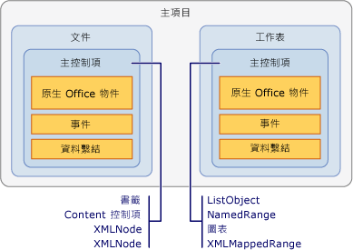

# 主項目和主控制項概觀
  主項目和主控制項類型可為使用 Visual Studio 中的 Office 開發工具建立的 Office 方案，提供程式撰寫模型。 主項目和主控制項會以較接近與 Managed 物件 \(例如 Windows Form 控制項\) 互動的方式，與以 COM 為基礎的 Microsoft Office Word 和 Microsoft Office Excel 物件模型進行互動。  
  
 [!INCLUDE[appliesto_controls](../vsto/includes/appliesto-controls-md.md)]  
  
## 主項目  
 在 Office 專案中，主項目是位於物件模型階層架構最上層的類型。[!INCLUDE[vsto_runtime](../vsto/includes/vsto-runtime-md.md)] 會為 Word 和 Excel 方案定義下列主項目：  
  
-   <xref:Microsoft.Office.Tools.Word.Document>  
  
-   <xref:Microsoft.Office.Tools.Excel.Workbook>  
  
-   <xref:Microsoft.Office.Tools.Excel.Worksheet>  
  
-   <xref:Microsoft.Office.Tools.Excel.ChartSheet>  
  
 上述每種類型會擴充原本就存在於 Word 或 Excel 物件模型的物件，又稱為「原生 Office 物件」\(Native Office Object\)。 例如，<xref:Microsoft.Office.Tools.Word.Document> 主項目會擴充 <xref:Microsoft.Office.Interop.Word.Document> 物件，此物件是在 Word 的主要 Interop 組件中定義。  
  
 主項目通常與對應的 Office 物件具有相同的基本功能，但是增強了下列功能：  
  
-   能夠裝載 Managed 控制項，包括主控制項和 Windows Form 控制項。  
  
-   更豐富的事件模型。 原生 Word 和 Excel 物件模型中的某些文件、活頁簿和工作表事件只會在應用程式層級上引發。 主項目會在文件層級提供這些事件，如此就比較容易處理特定文件的事件。  
  
### 了解文件層級專案中的主項目  
 在文件層級專案中，主項目會為程式碼提供進入點，並具有可協助您開發方案的設計工具。  
  
 <xref:Microsoft.Office.Tools.Word.Document> 和 <xref:Microsoft.Office.Tools.Excel.Worksheet> 主項目具有相關聯的設計工具，能夠以視覺化方式來表示文件或工作表，就像是 Windows Form 設計工具一樣。 您可以使用這個設計工具，直接在 Word 或 Excel 中修改文件或工作表的內容，以及將控制項拖曳至設計介面上。 如需詳細資訊，請參閱[Document 主項目](../vsto/document-host-item.md)與[Worksheet 主項目](../vsto/worksheet-host-item.md)。  
  
 <xref:Microsoft.Office.Tools.Excel.Workbook> 主項目不能做為具有使用者介面之控制項的容器。 相反地，這個主項目之設計工具的作用就像是元件匣，可讓您將 <xref:System.Data.DataSet> 等元件拖曳至其設計介面上。 如需詳細資訊，請參閱[Workbook 主項目](../vsto/workbook-host-item.md)。  
  
 您無法在文件層級專案中以程式設計方式建立主項目。 請改用 Visual Studio 在設計階段於專案中自動產生的 `ThisDocument`、`ThisWorkbook` 或 `Sheet`*n* 類別。 這些產生的類別衍生自主項目，並且會提供程式碼的進入點。 如需詳細資訊，請參閱[主項目和主控制項的程式設計限制](../vsto/programmatic-limitations-of-host-items-and-host-controls.md)。  
  
### 了解 VSTO 增益集專案中的主項目  
 當您建立 VSTO 增益集時，預設無法存取任何主項目。 不過，您可以在執行階段於 Word 和 Excel VSTO 增益集中產生 <xref:Microsoft.Office.Tools.Word.Document>、<xref:Microsoft.Office.Tools.Excel.Workbook> 和 <xref:Microsoft.Office.Tools.Excel.Worksheet> 主項目。  
  
 產生主項目之後，您可以執行像是將控制項加入文件等工作。 如需詳細資訊，請參閱[在 VSTO 增益集的執行階段中擴充 Word 文件和 Excel 活頁簿](../vsto/extending-word-documents-and-excel-workbooks-in-vsto-add-ins-at-run-time.md)。  
  
## 主控制項  
 主控制項會擴充 Word 和 Excel 物件模型中的各種使用者介面 \(UI\) 物件，例如 Microsoft.Office.Interop.Word.ContentControl 和 <xref:Microsoft.Office.Interop.Excel.Range> 物件。  
  
 下列主控制項適用於 Excel 專案：  
  
-   [圖表控制項](../vsto/chart-control.md)  
  
-   [ListObject 控制項](../vsto/listobject-control.md)  
  
-   [NamedRange 控制項](../vsto/namedrange-control.md)  
  
-   [XmlMappedRange 控制項](../vsto/xmlmappedrange-control.md)  
  
 下列主控制項適用於 Word 專案：  
  
-   [書籤控制項](../vsto/bookmark-control.md)  
  
-   [內容控制項](../vsto/content-controls.md)  
  
-   [XMLNode 控制項](../vsto/xmlnode-control.md)  
  
-   [XMLNodes 控制項](../vsto/xmlnodes-control.md)  
  
 加入 Office 文件的主控制項與原生 Office 物件有類似的運作方式，但是主控制項還具備額外的功能，包括事件和資料繫結功能。 例如，當您要在 Excel 中擷取原生 <xref:Microsoft.Office.Interop.Excel.Range> 物件的事件時，必須先處理工作表的變更事件。 然後，您必須判斷該變更是否在 <xref:Microsoft.Office.Interop.Excel.Range> 中發生。 相反地，<xref:Microsoft.Office.Tools.Excel.NamedRange> 主控制項具有您可以直接處理的 <xref:Microsoft.Office.Tools.Excel.NamedRange.Change> 事件。  
  
 主項目與主控制項之間的關聯性，非常類似 Windows Form 與 Windows Form 控制項之間的關聯性。 將 <xref:Microsoft.Office.Tools.Excel.NamedRange> 控制項放在 <xref:Microsoft.Office.Tools.Excel.Worksheet> 主項目上，就像是將文字方塊控制項放在 Windows Form 上。 下圖說明主項目與主控制項之間的關聯性。  
  
   
  
 您也可以在 Office 方案中使用 Windows Form 控制項，方法是直接將控制項加入 Word 和 Excel 文件介面。 如需詳細資訊，請參閱[Office 文件上的 Windows Forms 控制項概觀](../vsto/windows-forms-controls-on-office-documents-overview.md)。  
  
> [!NOTE]  
>  不支援將主控制項或 Windows Form 控制項加入 Word 子文件。  
  
### 將主控制項加入文件  
 在文件層級的專案中，您可以使用下列方式，在設計階段將主控制項加入 Word 文件或 Excel 工作表：  
  
-   依照加入原生物件的相同方式，在設計階段將主控制項加入文件。  
  
-   將主控制項從 \[工具箱\] 拖曳至文件和工作表上。 您可以在 Excel 專案的 \[Excel 控制項\] 索引標籤中使用 Excel 主控制項，並在 Word 專案的 \[Word 控制項\] 索引標籤中使用 Word 主控制項。  
  
-   將主控制項從 \[資料來源\] 視窗拖曳至文件和工作表上。 這可讓您加入已經繫結至資料的控制項。 如需詳細資訊，請參閱[將資料繫結至 Office 方案中的控制項](../vsto/binding-data-to-controls-in-office-solutions.md)。  
  
 在文件層級和 VSTO 增益集專案中，您也可以在執行階段將某些主控制項加入文件。 如需詳細資訊，請參閱[在執行階段將控制項加入至 Office 文件](../vsto/adding-controls-to-office-documents-at-run-time.md)。  
  
 如需如何將主控制項加入文件的詳細資訊，請參閱下列主題：  
  
-   [如何：將圖表控制項加入至工作表](../vsto/how-to-add-chart-controls-to-worksheets.md)  
  
-   [如何：將 ListObject 控制項加入至工作表](../vsto/how-to-add-listobject-controls-to-worksheets.md)  
  
-   [如何：將 NamedRange 控制項加入至工作表](../vsto/how-to-add-namedrange-controls-to-worksheets.md)  
  
-   [如何：將 XMLMappedRange 控制項加入至工作表](../vsto/how-to-add-xmlmappedrange-controls-to-worksheets.md)  
  
-   [如何：將書籤控制項加入至 Word 文件](../vsto/how-to-add-bookmark-controls-to-word-documents.md)  
  
-   [如何：將內容控制項加入至 Word 文件](../vsto/how-to-add-content-controls-to-word-documents.md)  
  
-   [如何：將 XMLNode 控制項加入至 Word 文件](../vsto/how-to-add-xmlnode-controls-to-word-documents.md)  
  
-   [如何：將 XMLNodes 控制項加入至 Word 文件](../vsto/how-to-add-xmlnodes-controls-to-word-documents.md)  
  
### 命名主控制項  
 當您將主控制項從 \[工具箱\] 拖曳至文件時，會自動使用控制項類型來命名控制項，並在結尾處加上一個累加號碼。 例如，書籤會命名為 **bookmark1**、**bookmark2**，依此類推。 如果使用 Word 或 Excel 的原生功能來加入控制項，可以在建立控制項時為它指定特定名稱。 您也可以變更 \[屬性\] 視窗中的 \[名稱\] 屬性值，來重新命名控制項。  
  
> [!NOTE]  
>  您不可以使用保留字來命名主控制項。 例如，如果將 <xref:Microsoft.Office.Tools.Excel.NamedRange> 控制項加入工作表，並將名稱變更為 **System**，則建置專案時會發生錯誤。  
  
### 刪除主控制項  
 在文件層級專案中，您可以在設計階段選取 Excel 工作表或 Word 文件上的控制項，然後按 Delete 鍵，來刪除主控制項。 不過，您必須使用 Excel 中的 \[定義名稱\] 對話方塊來刪除<xref:Microsoft.Office.Tools.Excel.NamedRange> 控制項。  
  
 如果在設計階段將主控制項加入文件，則不應該在執行階段以程式設計方式將其移除，因為這麼做會使您下次嘗試使用程式碼中的控制項時，擲回例外狀況。 主控制項的 `Delete` 方法只會移除在執行階段加入文件的主控制項。 如果您呼叫在設計階段建立之主控制項的 `Delete` 方法，則會擲回例外狀況。  
  
 例如，只有 <xref:Microsoft.Office.Tools.Excel.NamedRange> 是以程式設計方式加入工作表時 \(也稱為動態建立主控制項\)，<xref:Microsoft.Office.Tools.Excel.NamedRange> 的 <xref:Microsoft.Office.Tools.Excel.NamedRange.Delete%2A> 方法才能成功刪除這個主控制項。 將控制項名稱傳遞至 <xref:Microsoft.Office.Tools.Excel.Worksheet.Controls%2A> 或 <xref:Microsoft.Office.Tools.Word.Document.Controls%2A> 屬性的 `Remove` 方法，也可以移除動態建立的主控制項。 如需詳細資訊，請參閱[在執行階段將控制項加入至 Office 文件](../vsto/adding-controls-to-office-documents-at-run-time.md)。  
  
 如果使用者在執行階段從文件刪除主控制項，方案可能會以無法預期的方式失敗。 您可以使用 Word 和 Excel 中的文件保護功能，防止主控制項遭到刪除。 如需詳細資訊，請參閱[Office 程式開發範例和逐步解說](../vsto/office-development-samples-and-walkthroughs.md)。  
  
> [!NOTE]  
>  請勿在文件或工作表的 `Shutdown` 事件處理常式期間，以程式設計方式移除控制項。 當 `Shutdown` 事件發生時，UI 項目便無法再使用。 如果您想要在應用程式關閉之前移除控制項，請將程式碼加入其他事件處理常式，例如 `BeforeClose` 或 `BeforeSave`。  
  
### 對主控制項事件進行程式設計  
 主控制項擴充 Office 物件的其中一種方法是透過加入事件。 例如，Excel 中的 <xref:Microsoft.Office.Interop.Excel.Range> 物件和 Word 中 <xref:Microsoft.Office.Interop.Word.Bookmark> 物件沒有事件，但是 [!INCLUDE[vsto_runtime](../vsto/includes/vsto-runtime-md.md)] 會藉由加入可程式化的事件來擴充這些物件。 您可以透過下列用以存取 Windows Form 控制項事件的相同方式，來存取這些事件並對其撰寫程式碼：透過 Visual Basic 中的事件下拉式清單，以及 C\# 中的事件屬性頁。 如需詳細資訊，請參閱[逐步解說：針對 NamedRange 控制項的事件進行程式設計](../vsto/walkthrough-programming-against-events-of-a-namedrange-control.md)。  
  
> [!NOTE]  
>  請勿在 Excel 中，將 <xref:Microsoft.Office.Interop.Excel.Application> 物件的 <xref:Microsoft.Office.Interop.Excel._Application.EnableEvents%2A> 屬性設定為 **false**。 將這個屬性設定為 **false**，會導致 Excel 無法引發任何事件，包括主控制項的事件在內。  
  
## 請參閱  
 [主項目和主控制項的程式設計限制](../vsto/programmatic-limitations-of-host-items-and-host-controls.md)   
 [VSTO 增益集程式設計](../vsto/programming-vsto-add-ins.md)   
 [文件層級自訂程式設計](../vsto/programming-document-level-customizations.md)   
 [使用擴充物件自動化 Word](../vsto/automating-word-by-using-extended-objects.md)   
 [使用擴充物件自動化 Excel](../vsto/automating-excel-by-using-extended-objects.md)   
 [Office 文件上的控制項](../vsto/controls-on-office-documents.md)   
 [將資料繫結至 Office 方案中的控制項](../vsto/binding-data-to-controls-in-office-solutions.md)  
  
  