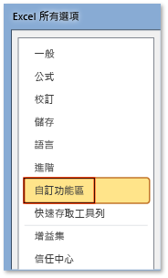

# 如何：在功能區顯示開發人員索引標籤
  若要存取 Office 應用程式功能區上的 \[**開發人員** \] 索引標籤，您必須將它設定為顯示該索引標籤，因為該索引標籤預設不會出現。  例如，如果您要將 <xref:Microsoft.Office.Tools.Word.GroupContentControl> 加入至 Word 文件層級自訂中，您必須顯示此索引標籤。  
  
> [!NOTE]  
>  本指導僅適用於 Office 2010 或更新版應用程式。  如果您要在 2007 Microsoft Office System 中顯示此索引標籤，請參閱本主題的下列版本：[作法：在功能區上顯示開發人員索引標籤](http://msdn.microsoft.com/library/bb608625(v=vs.90).aspx)。  
  
 [!INCLUDE[appliesto_ribbon](../vsto/includes/appliesto-ribbon-md.md)]  
  
> [!NOTE]  
>  Access 沒有 \[**開發人員**\] 索引標籤。  
  
### 顯示開發人員索引標籤  
  
1.  啟動本主題支援的任何 Office 應用程式。  請參閱本主題先前所提的「**適用於：**」。  
  
2.  在 \[**檔案**\] 索引標籤上，選擇 \[**選項**\] 按鈕。  
  
     下圖顯示 Office 2010 中的 \[**檔案** \] 索引標籤和 \[**選項**\] 按鈕。  
  
     ![在 Outlook 2010 中依序選擇 [檔案] 和 [選項]](../vsto/media/vsto-office-file-tab.png "在 Outlook 2010 中依序選擇 [檔案] 和 [選項]")  
  
     下圖顯示 Office 2013 中的 \[**檔案**\] 索引標籤。  
  
     ![Outlook 2013 中的 [檔案] 索引標籤](../vsto/media/vsto-office2013-filetab.png "Outlook 2013 中的 [檔案] 索引標籤")  
  
     下圖顯示 Office 2013 中的 \[**選項**\] 按鈕。  
  
     ![Outlook 2013 Preview 中的 [選項] 按鈕](../vsto/media/vsto-office2013-optionsbutton.png "Outlook 2013 Preview 中的 [選項] 按鈕")  
  
3.  在 \[*ApplicationName* **選項**\] 對話方塊中，選擇 \[**自訂功能區**\] 按鈕。  
  
     下圖顯示 Excel 2010 中的 \[**選項**\] 對話方塊和 \[**自訂功能區**\] 按鈕。  在本主題頂端附近的「適用於」一節中所列的所有其他應用程式中，此按鈕的位置類似。  
  
       
  
4.  在主要索引標籤的清單中，選取 \[**開發人員**\] 核取方塊。  
  
     下圖顯示 Word 2010 和 [!INCLUDE[Word_15_short](../vsto/includes/word-15-short-md.md)] 中的 \[**開發人員**\] 核取方塊。  在本主題頂端附近的「適用於」一節中所列的所有其他應用程式中，此核取方塊的位置類似。  
  
     ![[Word 選項] 對話方塊中的 [開發人員] 核取方塊](../vsto/media/vsto-office2010-developercheckbox.png "[Word 選項] 對話方塊中的 [開發人員] 核取方塊")  
  
5.  選擇 \[**確定**\] 按鈕以關閉 \[**選項**\] 對話方塊。  
  
## 請參閱  
 [Office UI 自訂](../vsto/office-ui-customization.md)  
  
  