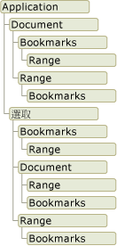

# Word 物件模型概觀
  當您在 Visual Studio 中開發 Word 解決方案時，會與 Word 物件模型互動。 組成這個物件模型的類別和介面，是由 Word 的主要 Interop 組件所提供，並在 <xref:Microsoft.Office.Interop.Word> 命名空間中定義。  
  
 [!INCLUDE[appliesto_wdalldocapp](../vsto/includes/appliesto-wdalldocapp-md.md)]  
  
 本主題提供 Word 物件模型的簡短概觀。 如需可以了解整個 Word 物件模型的資源，請參閱[使用 Word 物件模型文件](#WordOMDocumentation)。  
  
 如需使用 Word 物件模型執行特定工作的詳細資訊，請參閱下列主題：  
  
-   [使用文件](../vsto/working-with-documents.md)  
  
-   [處理文件中的文字](../vsto/working-with-text-in-documents.md)  
  
-   [處理資料表](../vsto/working-with-tables.md)  
  
##   了解 Word 物件模型  
 Word 提供數百個您可與之互動的物件。 這些物件是在密切遵循使用者介面的階層內組合管理。 階層的頂端是 <xref:Microsoft.Office.Interop.Word.Application> 物件。 這個物件代表 Word 目前的執行個體。<xref:Microsoft.Office.Interop.Word.Application> 物件包含 <xref:Microsoft.Office.Interop.Word.Document>、<xref:Microsoft.Office.Interop.Word.Selection>、<xref:Microsoft.Office.Interop.Word.Bookmark> 和 <xref:Microsoft.Office.Interop.Word.Range> 物件。 這些物件每個都有許多方法和屬性，您可存取它們以操作物件並與之互動。  
  
 下圖中的檢視顯示這些物件在 Word 物件模型中的階層。  
  
   
  
 乍看之下，物件會出現重疊。 例如，<xref:Microsoft.Office.Interop.Word.Document> 和 <xref:Microsoft.Office.Interop.Word.Selection> 兩個物件是 <xref:Microsoft.Office.Interop.Word.Application> 物件的成員，但 <xref:Microsoft.Office.Interop.Word.Document> 物件也是 <xref:Microsoft.Office.Interop.Word.Selection> 物件的成員。<xref:Microsoft.Office.Interop.Word.Document> 和 <xref:Microsoft.Office.Interop.Word.Selection> 兩個物件包含 <xref:Microsoft.Office.Interop.Word.Bookmark> 和 <xref:Microsoft.Office.Interop.Word.Range> 物件。 因為存取同型別物件的方法很多，所以會有重疊。 例如，您將格式套用至 <xref:Microsoft.Office.Interop.Word.Range> 物件，但是您可能想要存取目前選取範圍、特定段落、某個區段或整份文件的範圍。  
  
 下列各節簡述最上層物件，以及它們彼此之間的互動方式。 這些物件有五種：  
  
-   Application 物件  
  
-   Document 物件  
  
-   Selection 物件  
  
-   Range 物件  
  
-   Bookmark 物件  
  
 除了 Word 物件模型之外，Visual Studio 中的 Office 專案還提供*「主項目」*\(Host Item\) 和*「主控制項」*\(Host Control\)，以擴充 Word 物件模型中的部分物件。 主項目和主控制項的行為與它們所擴充的 Word 物件相同，但還具有其他功能，例如資料繫結功能和額外事件。 如需詳細資訊，請參閱[使用擴充物件自動化 Word](../vsto/automating-word-by-using-extended-objects.md)與[主項目和主控制項概觀](../vsto/host-items-and-host-controls-overview.md)。  
  
### Application 物件  
 <xref:Microsoft.Office.Interop.Word.Application> 物件代表 Word 應用程式，而且是所有其他物件的父系。 其成員通常會整體套用至 Word。 您可以使用其屬性和方法控制 Word 環境。  
  
 在 VSTO 增益集專案中，您可以使用 `ThisAddIn` 類別的 `Application` 欄位存取 <xref:Microsoft.Office.Interop.Word.Application> 物件。 如需詳細資訊，請參閱[VSTO 增益集程式設計](../vsto/programming-vsto-add-ins.md)。  
  
 在文件層級專案中，您可以使用 `ThisDocument` 類別的 <xref:Microsoft.Office.Tools.Word.Document.Application%2A> 屬性存取 <xref:Microsoft.Office.Interop.Word.Application> 物件。  
  
### Document 物件  
 <xref:Microsoft.Office.Interop.Word.Document> 物件是 Word 程式設計的核心。 它代表文件及其所有內容。 當您開啟文件或建立新文件時，即建立新的 <xref:Microsoft.Office.Interop.Word.Document> 物件，它會加入 <xref:Microsoft.Office.Interop.Word.Application> 物件的 <xref:Microsoft.Office.Interop.Word.Documents> 集合。 具有焦點的文件稱為使用中文件。 它是由 <xref:Microsoft.Office.Interop.Word.Application> 物件的 <xref:Microsoft.Office.Interop.Word._Application.ActiveDocument%2A> 屬性所代表。  
  
 Visual Studio 中的 Office 程式開發工具會藉由提供 <xref:Microsoft.Office.Tools.Word.Document> 類型，來擴充 <xref:Microsoft.Office.Interop.Word.Document> 物件。 這個型別是*「主項目」*\(host item\)，可讓您存取 <xref:Microsoft.Office.Interop.Word.Document> 物件的所有功能、加入其他事件，以及能夠加入 Managed 控制項。  
  
 當您建立文件層級專案時，您可以使用在專案中產生的 `ThisDocument` 類別，存取 <xref:Microsoft.Office.Tools.Word.Document> 成員。 您可以使用 `ThisDocument` 類別之程式碼的 **Me** 或 **this** 關鍵字，或使用 `ThisDocument` 類別外程式碼的 `Globals.ThisDocument`，存取 <xref:Microsoft.Office.Tools.Word.Document> 主項目的成員。 如需詳細資訊，請參閱[文件層級自訂程式設計](../vsto/programming-document-level-customizations.md)。 例如，若要選取文件中的第一個段落，請使用下列程式碼。  
  
 [!code-csharp[Trin_VstcoreWordAutomation#120](../snippets/csharp/VS_Snippets_OfficeSP/Trin_VstcoreWordAutomation/CS/ThisDocument.cs#120)]
 [!code-vb[Trin_VstcoreWordAutomation#120](../snippets/visualbasic/VS_Snippets_OfficeSP/Trin_VstcoreWordAutomation/VB/ThisDocument.vb#120)]  
  
 在 VSTO 增益集專案中，您可以在執行階段產生 <xref:Microsoft.Office.Tools.Word.Document>主項目。 您可以使用產生的主項目，在相關聯的文件中加入控制項。 如需詳細資訊，請參閱[在 VSTO 增益集的執行階段中擴充 Word 文件和 Excel 活頁簿](../vsto/extending-word-documents-and-excel-workbooks-in-vsto-add-ins-at-run-time.md)。  
  
### Selection 物件  
 <xref:Microsoft.Office.Interop.Word.Selection> 物件都代表目前選取的區域。 當您在 Word 使用者介面執行粗體文字等作業時，您要先選取或反白顯示文字，然後再套用格式設定。 文件一律有 <xref:Microsoft.Office.Interop.Word.Selection> 物件。 如不選取任何文字，則表示插入點。 此外，還可選取多個不連續的文字區塊。  
  
### Range 物件  
 <xref:Microsoft.Office.Interop.Word.Range> 物件代表文件中的連續區域，由起始字元位置和結束字元位置所定義。 不限於單一 <xref:Microsoft.Office.Interop.Word.Range> 物件。 在同一份文件中，您可以定義多個 <xref:Microsoft.Office.Interop.Word.Range> 物件。<xref:Microsoft.Office.Interop.Word.Range> 物件具有下列特性：  
  
-   可由單獨的插入點、文字範圍或整份文件組成。  
  
-   包括空格等非列印字元，tab 字元和段落標記。  
  
-   可以是目前選取的區域範圍，也可以是目前選取範圍以外的區域。  
  
-   與一定會顯示的選項不同，它不會顯示在文件中。  
  
-   不隨文件儲存，僅程式碼執行時才會存在。  
  
 當您在範圍結尾插入文字時，Word 會自動擴展範圍以包含插入的文字。  
  
### 內容控制項物件  
 <xref:Microsoft.Office.Interop.Word.ContentControl> 提供的方法，可讓您控制 Word 文件文字和其他類型內容的輸入和簡報。<xref:Microsoft.Office.Interop.Word.ContentControl> 可以顯示數種不同型別的 UI，最佳化 Word 文件的運用，例如 RTF 文字控制項、日期選擇器或下拉式方塊。 您也可以使用 <xref:Microsoft.Office.Interop.Word.ContentControl> 防止使用者編輯文件或範本的區段。  
  
 Visual Studio 會將 <xref:Microsoft.Office.Interop.Word.ContentControl> 物件擴充成數種不同的主控制項。 雖然 <xref:Microsoft.Office.Interop.Word.ContentControl> 物件可以顯示內容控制項可用的任何不同型別的 UI，但 Visual Studio 卻可為每個內容控制項提供不同的型別。 例如，您可以使用 <xref:Microsoft.Office.Tools.Word.RichTextContentControl> 建立 RTF 文字控制項，或使用 <xref:Microsoft.Office.Tools.Word.DatePickerContentControl> 建立日期選擇器。 這些主控制項行如原生 <xref:Microsoft.Office.Interop.Word.ContentControl>，卻又具有事件和資料繫結功能。 如需詳細資訊，請參閱[內容控制項](../vsto/content-controls.md)。  
  
### Bookmark 物件  
 <xref:Microsoft.Office.Interop.Word.Bookmark> 物件代表文件中的連續區域，具備起始位置和結束位置。 您可以使用書籤在文件中標記位置，或用為文件的文字容器。<xref:Microsoft.Office.Interop.Word.Bookmark> 物件可由插入點組成，或和整份文件一樣大。<xref:Microsoft.Office.Interop.Word.Bookmark> 具有下列特性，使其和 <xref:Microsoft.Office.Interop.Word.Range> 物件有所區別：  
  
-   您可以在設計階段命名書籤。  
  
-   <xref:Microsoft.Office.Interop.Word.Bookmark> 物件與文件一起儲存，因此不會在程式碼停止執行或文件關閉刪除。  
  
-   將 <xref:Microsoft.Office.Interop.Word.View> 物件的  <xref:Microsoft.Office.Interop.Word.View.ShowBookmarks%2A> 屬性設為 **false** 或 **true**，可以隱藏或顯示書籤。  
  
 Visual Studio 會提供 <xref:Microsoft.Office.Tools.Word.Bookmark> 主控制項，藉以擴充 <xref:Microsoft.Office.Interop.Word.Bookmark> 物件。<xref:Microsoft.Office.Tools.Word.Bookmark> 主控制項行如原生 <xref:Microsoft.Office.Interop.Word.Bookmark>，卻又具有事件和資料繫結功能。 您可以用將資料繫結至 Windows 表單文字方塊控制項的方式，將資料繫結至文件的書籤控制項。 如需詳細資訊，請參閱[書籤控制項](../vsto/bookmark-control.md)。  
  
##   使用 Word 物件模型文件  
 如需 Word 物件模型的完整資訊，您可以參閱 Word 主要 Interop 組件 \(PIA\) 參考和 Visual Basic for Applications \(VBA\) 物件模型參考。  
  
### 主要 Interop 組件參考  
 Word PIA 參考文件說明 Word 主要 Interop 組件中的類型。 您可以從下列位置取得這份文件：[Word 2010 主要 Interop 組件參考](http://go.microsoft.com/fwlink/?LinkId=189588)。  
  
 如需 Word PIA 設計的詳細資訊，例如 PIA 中類別和介面的差異以及 PIA 中實作事件的方式，請參閱 [Office 主要 Interop 組件中的類別和介面概觀](http://go.microsoft.com/fwlink/?LinkId=189592)。  
  
### VBA 物件模型參考  
 VBA 物件模型參考記載公開給 VBA 程式碼時的 Word 物件模型。 如需詳細資訊，請參閱 [Word 2010 物件模型參考](http://go.microsoft.com/fwlink/?LinkId=199772)。  
  
 VBA 物件模型參考中的所有物件和成員都會對應至 Word PIA 中的類型和成員。 例如，VBA 物件模型參考中的 Document 物件會對應至 Word PIA 中的 <xref:Microsoft.Office.Interop.Word.Document> 物件。 雖然 VBA 物件模型參考提供大部分屬性、方法和事件的程式碼範例，但如果您想要在以 Visual Studio 建立的 Word 專案中使用這些程式碼範例，則必須將這個參考中的 VBA 程式碼轉譯為 Visual Basic 或 Visual C\#。  
  
## 請參閱  
 [Office 主要 Interop 組件](../vsto/office-primary-interop-assemblies.md)   
 [使用擴充物件自動化 Word](../vsto/automating-word-by-using-extended-objects.md)   
 [使用文件](../vsto/working-with-documents.md)   
 [處理文件中的文字](../vsto/working-with-text-in-documents.md)   
 [處理資料表](../vsto/working-with-tables.md)   
 [主項目和主控制項概觀](../vsto/host-items-and-host-controls-overview.md)   
 [主項目和主控制項的程式設計限制](../vsto/programmatic-limitations-of-host-items-and-host-controls.md)   
 [Office 方案中的選擇性參數](../vsto/optional-parameters-in-office-solutions.md)  
  
  