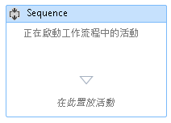
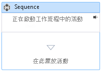

# HOW TO：將註解新增至工作流程設計工具中的工作流程
為了方便建立大型更為複雜的工作流程，[!INCLUDE[net_v45](../ide/includes/net_v45_md.md)] 讓開發人員可以在設計工具中將註釋加入到下列項目類型：  
  
-   <xref:System.Activities.Activity>  
  
-   <xref:System.Activities.Statements.State>  
  
-   <xref:System.Activities.Statements.Transition>  
  
-   衍生自 <xref:System.Activities.Statements.FlowNode> 的類別  
  
-   <xref:System.Activities.Variable>  
  
-   <xref:System.Activities.Argument>  
  
> [!IMPORTANT]
>  註釋的內容會以純文字的格式儲存在與工作流程相關聯 XAML檔中，並有可能被其他人讀取。將敏感資訊輸入至註釋時要謹慎。  
  
### 將註釋加入到設計工具中的活動  
  
1.  在工作流程設計工具中，以滑鼠右鍵按一下工作流程設計工具中的項目，並選取 \[**註釋**\]、\[**加入註釋**\]。  
  
2.  在提供的空間中加入註釋的文字。  
  
3.  該項目將顯示註釋圖示。將滑鼠停留在註釋圖示上會顯示註釋的文字。  
  
       
  
### 在活動的設計工具中顯示註釋  
  
1.  使用活動設計工具時，其中註釋顯示在活動外部，按一下註釋裝飾項中的 \[**Pin**\] 圖示。  
  
2.  註釋將顯示在活動的設計工具中。在下列螢幕擷取畫面中，註釋 "工作流程中的開始活動" 顯示在活動的設計工具中。  
  
       
  
3.  若要在活動的設計工具外部顯示註釋，將滑鼠停留在活動的設計工具中的註釋區域，並按一下 \[**Unpin**\] 圖示  
  
       
  
### 顯示或隱藏所有註釋  
  
1.  以滑鼠右鍵按一下具有註釋的活動。選取 \[**註釋**\]、\[**顯示所有註釋**\]。  
  
2.  所有註釋將顯示在活動的設計工具中。  
  
3.  若要在活動的設計工具外部顯示所有註釋，以滑鼠右鍵按一下活動並選取 \[**註釋**\]、\[**隱藏所有註釋**\]。  
  
### 編輯或刪除活動的註釋  
  
1.  以滑鼠右鍵按一下具有註釋的活動。  
  
2.  選取 \[**註釋**\]、\[**編輯註釋**\] 或 \[**刪除註釋**\]。  
  
3.  將開啟註釋以進行編輯或刪除。  
  
4.  若要同時刪除所有註釋，以滑鼠右鍵按一下工作流程設計工具，並選取 \[**註釋**\]、\[**刪除所有註釋**\]。  
  
### 加入、編輯和刪除變數或引數的註釋  
  
1.  以滑鼠右鍵按一下變數或引數，並選取 \[加入註釋\]。  
  
2.  輸入註釋的文字。變數或引數將顯示註釋圖示。  
  
3.  以滑鼠右鍵按一下具有註釋的變數或引數。選取 \[編輯註釋\]。  
  
4.  將開啟註釋以進行編輯。  
  
5.  以滑鼠右鍵按一下具有註釋的變數或引數。選取 \[刪除註釋\]。  
  
6.  註釋將被刪除。