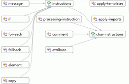

# HOW TO：使用圖表檢視取得結構描述集的概觀
[!INCLUDE[vs2017banner](../code-quality/includes/vs2017banner.md)]

本主題描述如何使用[圖表檢視](../xml-tools/graph-view.md)查看結構描述集中節點的高階檢視，以及節點之間的關聯。  
  
### 建立新的 XSD 檔案，並且在內容模型檢視中顯示根項目  
  
1.  建立新的 XML 結構描述檔案，並將檔案另存為 Relationships.xsd。  
  
2.  按一下開始檢視上的 \[**使用 XML 編輯器檢視與編輯基礎 XML 結構描述檔案**\] 連結。  
  
3.  從[範例 XML 結構描述關聯](../Topic/Sample%20XSD%20File:%20Relationships.md)複製並貼上 XML 結構描述範例，取代依預設加入至新 XSD 檔案中的程式碼。  
  
4.  以滑鼠右鍵按一下 XML 編輯器中的任何位置並選取 \[**檢視表設計工具**\]。  
  
5.  從 XSD 工具列中選取圖表檢視。  
  
6.  選取 XML 結構描述總管中的 \[**結構描述集**\] 節點，並將該節點拖曳至圖表檢視的設計介面。您會看見所有的全域節點，以及連接具有關聯性之節點的箭號。  
  
       
  
7.  按一下設計介面上的任何節點並查看階層連結列，以查看所選節點在結構描述集中的位置。  
  
8.  以滑鼠右鍵按一下設計介面上的任何項目節點，然後選取 \[**產生範例 XML**\]，以查看 XML 執行個體文件。