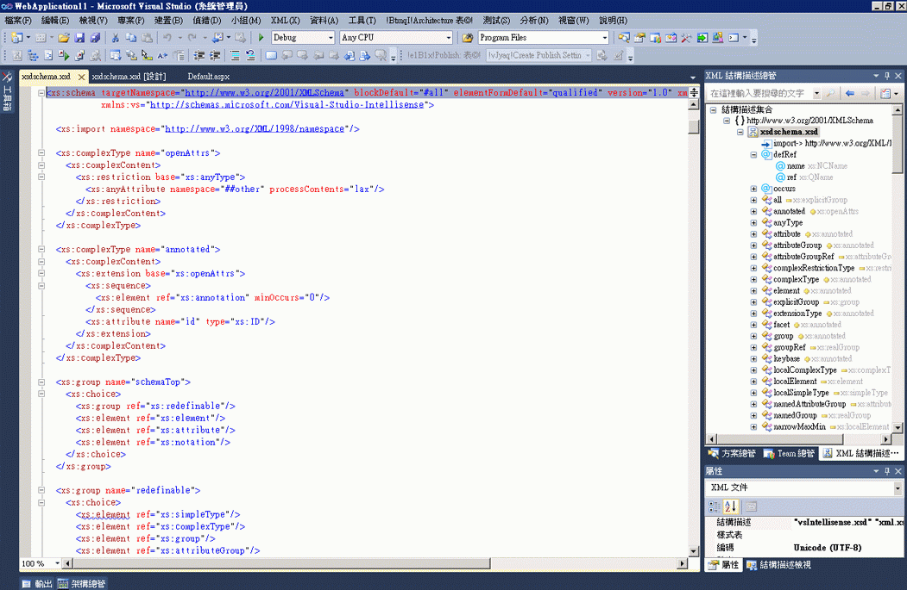

# 整合 XML 常值與 XML 結構描述總管
[!INCLUDE[vs2017banner](../code-quality/includes/vs2017banner.md)]

Visual Basic 支援 XML 常值，這表示您可以將 XML 片段直接合併至 Visual Basic 程式碼中。如需詳細資訊，請參閱 [XML 常值概觀](http://go.microsoft.com/fwlink/?LinkId=140325) \(英文\)。  
  
 如果 Visual Basic 專案中的 XSD 檔包含 XML 常值，您就可以在 XML 結構描述總管中檢視 XML 結構描述集。若要檢視與 XML 常值相關的結構描述集，請以滑鼠右鍵按一下 XML 常值或 XML 命名空間匯入中的 XML 節點，然後選取 \[**在結構描述總管中顯示**\]。  
  
   
  
 這樣會在 Visual Basic 檔案旁以並排方式開啟 XML 結構描述總管。  
  
   
  
 Visual Studio 2008 SP1 已引入此功能。若要觀看詳細說明此功能的訪談，請參閱[Channel 9 訪談：Visual Studio 2008 SP1 中的 XML 結構描述總管](http://go.microsoft.com/fwlink/?LinkId=140183) \(英文\)。  
  
## 請參閱  
 [HOW TO：搭配使用 XML 結構描述設計工具和 XML 常值](../xml-tools/how-to-use-the-xml-schema-designer-with-xml-literals.md)