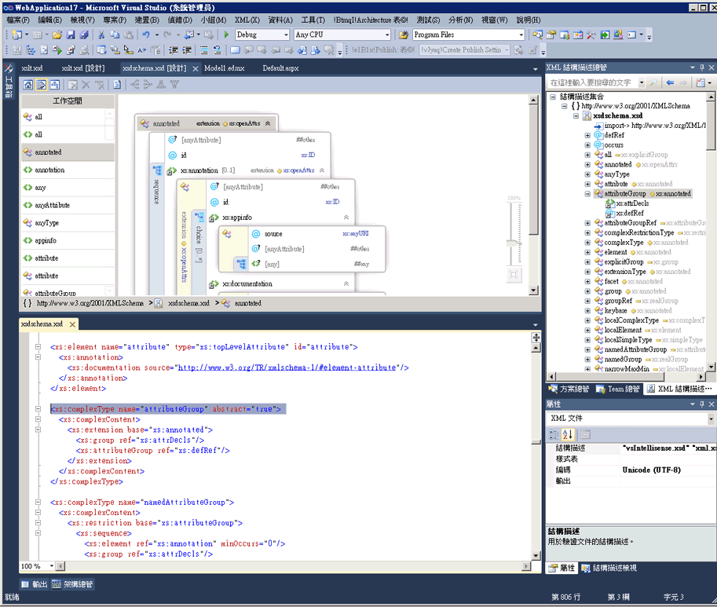

# 與 XML 編輯器整合
[!INCLUDE[vs2017banner](../code-quality/includes/vs2017banner.md)]

XML 結構描述設計工具會與 XML 編輯器整合。如果您在 XML 編輯器中修改 XSD 檔案，變更會反映在 [XML 結構描述總管](../xml-tools/xml-schema-explorer.md)中。如果您開啟[圖表檢視](../xml-tools/graph-view.md)或[內容模型檢視](../xml-tools/content-model-view.md)，變更同樣會反映在開啟的檢視中。您可以利用下列方式，在 XML 結構描述設計工具和 XML 編輯器之間巡覽：  
  
-   在 XML 編輯器中，以滑鼠右鍵按一下節點，然後選取 \[**在 XML 結構描述總管中顯示**\]。  
  
-   按兩下圖表檢視和 XML 結構描述總管中的節點，或以滑鼠右鍵按一下節點，並選取 \[**檢視程式碼**\]。以滑鼠右鍵按一下內容模型檢視中的節點，然後選取 \[**檢視程式碼**\]。  
  
 下列螢幕擷取畫面會顯示在 XML 結構描述總管中開啟的 XML 結構描述。XML 結構描述總管會在樹狀檢視中顯示結構描述設定。XML 編輯器會顯示目前在 XML 結構描述總管中使用之節點的文字檢視。  
  
   
  
 有時候，在並排顯示的 XML 編輯器和圖形設計工具中查看程式碼相當有用。若要同時檢視兩個檔案，請以滑鼠右鍵按一下 XML 編輯器中任何地方並選取 \[**檢視表設計工具**\]。選取 Visual Studio Windows 工具列中的 \[**新增水平 \(或垂直\) 索引標籤群組**\]。  
  
   
  
## 請參閱  
 [XML 結構描述總管](../xml-tools/xml-schema-explorer.md)