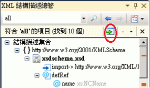

# 搜尋結構描述集
[!INCLUDE[vs2017banner](../code-quality/includes/vs2017banner.md)]

XML 結構描述總管可讓您以下列方式搜尋結構描述集：  
  
-   關鍵字搜尋。  
  
-   結構描述特有的搜尋。  
  
## 關鍵字搜尋  
 您可以在 XML 結構描述總管工具列的 \[**搜尋 SchemaSet**\] 文字方塊中，輸入子字串，執行關鍵字搜尋。  
  
   
  
 XML 結構描述總管會搜尋下列結構描述集：  
  
-   符合指定之關鍵字的任何 `name` 或 `ref` 屬性。這項功能可讓您依名稱尋找項目、屬性和型別等。  
  
-   include 陳述式的 `schemaLocation` 屬性。  
  
-   import 陳述式的 `namespace` 屬性。  
  
## 結構描述的特定搜尋  
 XML 結構描述總管也包含一些內建的搜尋，可讓您使用 XML 結構描述總管的內容功能表進行存取。關於可用內容功能表的詳細資訊，請參閱[內容功能表](../xml-tools/context-menus-xml-schema-explorer.md)。您也可以從「開始檢視」執行特定結構描述的搜尋。如需詳細資訊，請參閱[開始檢視](../xml-tools/start-view.md)主題中的＜結構描述集合詳細資訊＞一節。  
  
## 顯示和導覽搜尋結果  
 搜尋完成後，摘要結果面板會加入含搜尋結果的工具列。搜尋結果也會在 XML 結構描述總管中反白顯示並以刻度標示在垂直捲軸上。您可以在 XML 結構描述總管工具列的摘要結果面板上，使用 \[**移至下一個搜尋結果**\] 和 \[**移至上一個搜尋結果**\] 按鈕、鍵盤的 F3 和 Shift\+F3 鍵或按一下捲軸上的刻度，藉以瀏覽搜尋結果。  
  
 您可以在摘要結果面板上，按一下 \[**將反白顯示的節點加入工作空間**\]，將搜尋結果加入工作空間。  
  
   
  
## 清除搜尋結果  
 若要清除搜尋結果，請在 XML 結構描述總管搜尋工具列的摘要結果面板上，按一下 **x** 按鈕。  
  
## 請參閱  
 [XML 結構描述總管](../xml-tools/xml-schema-explorer.md)