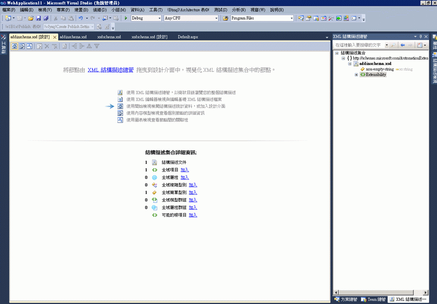

# 開始檢視
[!INCLUDE[vs2017banner](../code-quality/includes/vs2017banner.md)]

開始檢視是 XML 結構描述 \(XSD\) 設計工具的啟動點。當您建立新 XSD 檔案時，您將先看到開始檢視。  
  
 開始檢視包含兩個主要區段：「*浮水印*」\(watermark\) 和 \[**結構描述集合詳細資訊**\] 窗格。其中也包含工具列，所有的 XSD 設計工具檢視皆提供此工具列。  
  
   
  
## 浮水印  
 浮水印窗格包含連結至所有 XSD 設計工具檢視、XML 編輯器和 XML 結構描述總管的清單。如果結構描述集發生錯誤，清單結尾會顯示以下文字：「使用錯誤清單檢視與修正結構描述集中的錯誤」。  
  
## 結構描述集合詳細資訊  
 \[**結構描述集合詳細資訊**\] 窗格列出全域結構描述節點型別，並顯示結構描述中每個型別擁有多少執行個體。您可以使用節點型別旁的 \[**加入**\] 連結，將新節點加入工作空間。  
  
## 工具列  
 您可以在開始檢視、[內容模型檢視](../xml-tools/content-model-view.md)和 XML 結構描述設計工具工具列的[圖表檢視](../xml-tools/graph-view.md)之間巡覽。  
  
   
  
 當開始檢視為作用中時，下列 XSD 設計工具工具列的按鈕將會啟用：  
  
|選項|描述|  
|--------|--------|  
|**顯示開始檢視**|切換至開始檢視。這個檢視可以使用鍵盤快速鍵存取：**CTRL \+ 1**。|  
|**顯示內容模型檢視**|切換至內容模型檢視。這個檢視可以使用鍵盤快速鍵存取：**CTRL \+ 2**。|  
|**顯示圖表檢視**|切換至圖表檢視。這個檢視可以使用鍵盤快速鍵存取：**CTRL \+ 3**。|  
  
## 請參閱  
 [XML 結構描述總管](../xml-tools/xml-schema-explorer.md)   
 [圖形檢視](../xml-tools/graph-view.md)   
 [內容模型檢視](../xml-tools/content-model-view.md)   
 [XML 編輯器](../xml-tools/xml-editor.md)