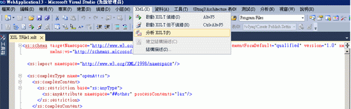

# XSLT 分析工具
[!INCLUDE[vs2017banner](../code-quality/includes/vs2017banner.md)]

XSLT 分析工具是一種效能分析工具，可協助您開發並偵錯 XSLT 文件。XSLT 分析工具可讓開發人員建立詳細的 XSLT 效能報告，藉以測量並評估 XSLT 程式碼中與效能相關的問題。XSLT 分析工具包括 XSL 和 XSLT 樣式表最佳化的實用提示，這些對要求最大效能的 XSLT 架構之應用程式而言是很重要的。  
  
 XSLT 分析工具屬於 Visual Studio 2010 的一部分，可從 Visual Studio 的 \[**XML**\] 功能表取得。  
  
   
  
 XSLT 分析工具第一次引入是做為 Visual Studio 2008 的增益集。如需詳細資訊，請參閱 [Visual Studio 的 XSLT 分析工具 \(2 月 8 日的 Community Technology Preview\)](http://go.microsoft.com/fwlink/?LinkId=142987) \(英文\) 網頁上的＜相關資源＞一節。  
  
> [!NOTE]
>  有些出現的畫面可能與 Visual Studio 2010 中的畫面不一樣，但在這些文件中卻一樣，這是因為有些視覺項目是在 Visual Studio 2008 之後變更的。  
  
## 請參閱  
 [逐步解說：XSLT 分析工具](../xml-tools/walkthrough-xslt-profiler.md)