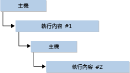

# 以 Edge 和舊版引擎為 JsRT API 的目標
從 Windows 10 開始，我們對 Chakra \(JavaScript 引擎\) 所做的一項變更，就是支援兩個不同的 Chakra 引擎，以配合 Windows 10 支援新的 Edge 轉譯引擎的瀏覽器策略：  
  
-   舊版 Chakra 引擎 \(又稱為*「舊版引擎」*\(Legacy Engine\) 或底下的 jscript9.dll\)，隨附於並支援 Internet Explorer 11。 這個引擎一直保持不變，並且從 Win8.1\/IE11 版起基本上不會再改變。  
  
-   新版 Chakra 引擎 \(又稱為 *Edge 引擎*或底下的 chakra.dll\)，隨附於並支援 Windows 10 的新瀏覽器 Microsoft Edge。 此引擎會持續更新，且將會支援「即時」[Edge](http://blogs.msdn.com/b/ie/archive/2014/11/11/living-on-the-edge-our-next-step-in-interoperability.aspx) 引擎。 生動的 Edge 引擎表示不同於舊版引擎，Edge 引擎不會提供任何形式的版本控制指令碼功能以選擇加入。  
  
 使用 JavaScript 執行階段裝載 \(JsRT\) API 建立應用程式時，您可以選擇以舊版或 Edge 引擎為目標。  
  
-   如果您必須強調現有應用程式的回溯相容性，請以舊版引擎為目標。  
  
-   如果您希望應用程式預期新的 JavaScript 功能，並在功能發行時提供支援 \(例如 ECMAScript 6\)，請以 Edge 引擎為目標。  
  
 本主題詳細說明如何設定不同的引擎目標。  
  
## 以您慣用的版本為目標  
 建立應用程式時，您可以選取支援 Edge 引擎或舊版引擎的 JsRT 版本。 您可以根據上述方針來選擇 JsRT 版本。 為了適應這些區別，已對 `JsCreateRuntime`、`JsCreateContext` 和 `JsStartDebugging` 進行下列變更。  
  
 針對 `JsCreateRuntime`：  
  
-   以舊版引擎為目標時，`JsRuntimeVersionEdge` 列舉值已被取代，並會出現訊息建議改用 `JsRuntimeVersionInternetExplorer11` 值。  
  
-   以 Edge 引擎為目標時，會省略 `JsCreateRuntime` 函式中的版本參數。  
  
    ```cpp  
    JsErrorCode JsCreateRuntime(JsRuntimeAttributes attributes, JsThreadServiceCallback callback, _Out_ JsRuntimeHandle* runtime);  
    ```  
  
 針對 `JsCreateContext` 和 `JsStartDebugging`：  
  
-   以舊版引擎為目標時，`IDebugApplication` 介面可用來提供您自己的非遠端偵錯方法。 為了進行偵錯，`JsCreateContext` 和 `JsStartDebugging` 函式會接受 `IDebugApplication` 做為參數。  
  
-   以 Edge 引擎為目標時，`IDebugApplication` 介面已被取代。 Chakra 引擎可透過 Visual Studio 偵錯工具執行原生和指令碼偵錯功能，而不需要使用者實作 `IDebugApplication`。 因此，介面不再是 `JsCreateContext` 和 `JsStartDebugging` 的參數。  
  
 上述舊版引擎之 API 的簽章如下所示：  
  
```cpp  
JsErrorCode JsCreateRuntime(JsRuntimeAttributes attributes, JsRuntimeVersion version, JsThreadServiceCallback callback, _Out_ JsRuntimeHandle* runtime);  
  
JsErrorCode JsCreateContext(JsRuntimeHandle runtime, IDebugApplication *debugApplication, JsContextRef *newContext);  
  
JsErrorCode JsStartDebugging(IDebugApplication *debugApplication);  
```  
  
 上述 Edge 引擎之 API 的簽章如下所示：  
  
```cpp  
JsErrorCode JsCreateRuntime(JsRuntimeAttributes attributes, JsThreadServiceCallback callback, _Out_ JsRuntimeHandle* runtime);  
  
JsErrorCode JsCreateContext(JsRuntimeHandle runtime, JsContextRef *newContext);  
  
JsErrorCode JsStartDebugging();  
```  
  
## 使用 Visual C\+\+ 為您慣用的版本進行編譯  
 使用 Visual C\+\+ 時，請在匯入 JsRT API 時包含 jsrt.h 標頭，並確保 jsrt.lib 包含在連結器輸入檔清單中：  
  
```cpp  
#include <jsrt.h>  
```  
  
   
  
 如果您要以 Edge 引擎二進位檔為目標，您需要定義巨集 `USE_EDGEMODE_JSRT` 再包含 jsrt.h，而且您應該連結 chakrart.lib，而不是連結 jsrt.lib：  
  
```cpp  
#define USE_EDGEMODE_JSRT  
#include <jsrt.h>  
```  
  
   
  
 如果您從新的應用程式開始，您現在已準備好開始撰寫 JsRT API 的程式碼。  
  
## 使用 .NET 為您慣用的版本進行編譯  
 如果您使用 .NET 和 P\/Invoke，您必須變更 JsRT API \[DllImport\] 宣告以匯入 chakra.dll，而不是 jscript9.dll。 此外，變更 `JsCreateRuntime` 的定義以移除 `JsRuntimeVersion` 參數，並變更 `JsCreateContext` 和 `JsStartDebugging` 的定義以移除 `IDebugApplication` 參數。  
  
 針對舊版引擎，使用下列程式碼。  
  
```csharp  
[DllImport("jscript9.dll")]  
public static extern JsErrorCode JsCreateRuntime(  
    JsRuntimeAttributes attributes,  
    JsRuntimeVersion version,  
    JsThreadServiceCallback callback,  
    out JsRuntimeSafeHandle runtime  
);  
  
[DllImport("jscript9.dll")]  
public static extern JsErrorCode JsCreateContext(  
    JsRuntimeSafeHandle runtime,  
    IDebugApplication debugApplication,  
    out JsContextRef newContext  
);   
  
[DllImport("jscript9.dll")]  
public static extern JsErrorCode JsStartDebugging(  
    IDebugApplication debugApplication,  
);  
```  
  
 針對 Edge 引擎，使用下列程式碼。  
  
```csharp  
[DllImport("chakra.dll")]  
public static extern JsErrorCode JsCreateRuntime(  
    JsRuntimeAttributes attributes,  
    JsThreadServiceCallback callback,  
    out JsRuntimeSafeHandle runtime  
);  
  
[DllImport("chakra.dll")]  
public static extern JsErrorCode JsCreateContext(  
    JsRuntimeSafeHandle runtime,  
    out JsContextRef newContext  
);   
  
[DllImport("chakra.dll")]  
public static extern JsErrorCode JsStartDebugging();  
```  
  
> [!CAUTION]
>  如果您以手動方式封送處理函式指標 \(例如透過 LoadLibrary\/GetProcAddress\)，請勿混用方法的宣告，否則您將使堆疊失衡，而導致無法預期的行為，例如造成您的應用程式損毀。 如果您在匯入程式碼中執行 jscript9.dll 執行個體的全域搜尋並取代，由於遺漏正在卸除的 `version`，因此會發生相同問題。  
  
## 摘要  
 在 Windows 10 中，JavaScript 執行階段裝載 API 會分割成兩部分。 這些 API 現在支援「生動的」Edge 引擎，其語言功能會與 Microsoft Edge 中「生動的」Edge 引擎一致。 您可以從桌面或市集應用程式利用這些功能，以新奇的方式來擴充您的應用程式，並運用現有程式碼基底中的現代 Web 技能。 不過，由於舊版之間的些微差異，因此當您以 Edge 或舊版引擎為目標時，必須注意下列幾點。  
  
-   您的應用程式在一個處理序中只能支援一個 JsRT 版本。  
  
     例如，您無法在建立 Edge 引擎執行階段後又建立舊版引擎執行階段，並預期這兩個引擎在同一個處理序中會正常執行。 這種做法不受支援，並且可能會導致未記載的行為，例如無法載入第二個 DLL。  
  
-   以 Edge 引擎為目標時，您的應用程式可能會在基礎平台自動更新時，意外取得新功能。  
  
     例如，舊版執行階段的 Internet Explorer 11 模式支援區塊範圍變數宣告，例如 `let` 和 `const`。 如果 Edge 引擎自動版本控制行為之前便是標準行為，在 Internet Explorer 10 模式中有效的程式碼 \(沒有區塊範圍規則\) 可能會在平台自動升級之後失敗。 當您選擇要使用的執行階段模型時，必須考慮到這點。 雖然我們認為您應該盡可能以 Edge 引擎為目標，但是您必須小心使用 JavaScript 程式碼結構，未來這些結構可能會失效。  
  
-   Windows 市集的 JsRT 只支援 Edge 引擎 \(chakra.dll\)。 應用程式嘗試連結到 jscript9.dll 中的任何 JsRT API 會導致認證失敗。  
  
-   請勿混淆 jscript9.dll 和 chakra.dll 之間的 `JsCreateRuntime`、`JsCreateContext` 和 `JsStartDebugging` 宣告，因為這會導致堆疊失衡。  
  
     只要未依序呼叫 `LoadLibrary` 和 `GetProcAddress`，當您使用 C 和 C\+\+ 時，如果嘗試使用不正確的宣告，都會收到連結器錯誤。 .NET 開發人員可能無法這麼輕鬆地找到這個問題，因此使用這項功能時請再檢查一次程式碼。  
  
## 請參閱  
 [JavaScript 執行階段裝載](../chakra-hosting/javascript-runtime-hosting.md)